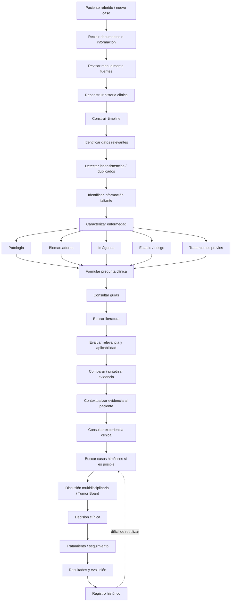
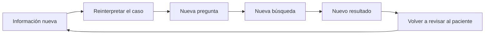

# OncoLens: proceso AS-IS del oncólogo

| Campo | Valor |
|---|---|
| Fecha | 2026-10-04 (v1.2) |
| Origen | Entrevistas de Discovery con 4 oncólogos (cáncer de mama y de próstata), realizadas por AI Producto. Este documento consolida sus hallazgos y es la única referencia del proyecto para ellos. |
| Relacionados | [`TO-BE.md`](TO-BE.md) (solución objetivo) · [`PRD.md`](PRD.md) v1.2 · [`readme.md`](../readme.md) · [`OncoLens-C4.drawio`](OncoLens-C4.drawio) |

> Este documento describe **cómo trabaja hoy el oncólogo**, sin OncoLens, según las cuatro entrevistas (mama y próstata). Es la línea base contra la que se mide el valor del producto (métricas VM-1 y VM-2 del PRD §2.2). La última columna de la §3 indica qué capacidad del [To-Be](TO-BE.md) atiende cada etapa.

---

## 1. Hallazgo central

Los cuatro oncólogos describen la misma cadena de trabajo:

> **Recibir información → reconstruir el caso → detectar qué falta → caracterizar la enfermedad → buscar guías → buscar literatura → evaluar evidencia → contextualizar al paciente → contrastar con experiencia e histórico → discutir → tomar decisión clínica → hacer seguimiento.**

El mayor desperdicio de tiempo ocurre **antes y alrededor del razonamiento clínico**, no necesariamente dentro de él. Lo que piden es: "Ayúdame a entender mejor el caso y a tomar una mejor decisión; no me digas qué hacer".

---

## 2. Flujo general observado

### El proceso no es lineal

En la práctica hay varios loops, así que es más preciso verlo como un **proceso iterativo de investigación clínica**:

El loop más costoso es el de **información faltante**: caso incompleto → análisis → descubrir el faltante → volver atrás → pedir el examen → esperar → reanálisis.

---

## 3. AS-IS por etapa

| # | Etapa | Qué hace hoy el médico | Principal dificultad | Impacto | Pain point | Capacidad To-Be |
|---|---|---|---|---|---|---|
| 1 | Intake | Recibe PDFs, laboratorios, imágenes y notas | Información fragmentada | Tiempo | — | CAP-01 Ingesta (MVP) |
| 2 | Case Reconstruction | Reconstruye mentalmente al paciente | Mucha información dispersa | Tiempo + carga cognitiva | P1 | CAP-02 Reconstrucción del caso (MVP) |
| 3 | Timeline | Ordena eventos | Fechas y eventos distribuidos | Esfuerzo | P1 | CAP-02 (MVP) |
| 4 | Reconciliation | Compara resultados | Duplicados, nomenclatura, versiones | Riesgo + esfuerzo | P3 | CAP-03 Reconciliación y normalización CIE-10/LOINC/CUPS/ATC (MVP) |
| 5 | Gap identification | Determina qué falta | No siempre existe un checklist | Retrasos | P4 | CAP-04 Información faltante (MVP) |
| 6 | Characterization | Integra patología, biomarcadores e imágenes | Variables interdependientes | Complejidad | P1 | CAP-02 + CAP-04 (MVP) |
| 7 | Clinical question | Define qué necesita saber | La pregunta cambia según el caso | Carga cognitiva | — | CAP-05 Plantillas (MVP) · CAP-15 sugeridas por IA (Post-MVP) |
| 8 | Guideline retrieval | Busca recomendaciones | Muchas guías, versiones, excepciones | Tiempo | P5, P8 | CAP-06 Recuperación + CAP-09 Vigencia (MVP) |
| 9 | Literature retrieval | Busca papers y ensayos | Exceso de literatura | Tiempo | P5 | CAP-06 (MVP) |
| 10 | Evidence evaluation | Filtra la evidencia | Poblaciones no comparables | Esfuerzo | P6 | CAP-08 Aplicabilidad (MVP) |
| 11 | Evidence synthesis | Integra estudios | Resultados diferentes o contradictorios | Esfuerzo | P7 | CAP-07 Síntesis (MVP) |
| 12 | Patient matching | Compara la evidencia con el paciente | "¿Esto aplica realmente?" | Alto impacto | P6 | CAP-08 (MVP) |
| 13 | Historical search | Busca pacientes similares | Sistemas poco flexibles | Tiempo | — | CAP-12 Cohortes (Post-MVP) |
| 14 | Outcome analysis | Investiga qué ocurrió | Datos longitudinales fragmentados | Investigación | P10 | CAP-02 paciente actual (MVP) · CAP-13 cohorte (Post-MVP) |
| 15 | Multidisciplinary review | Discute con especialistas | Preparación manual | Tiempo | — | CAP-14 Comité de tumores (Post-MVP) |
| 16 | Decision | Integra toda la información | Alta carga cognitiva | Alto impacto clínico | P12 | CAP-11 Espacio de análisis y decisión + T-3 Control humano (MVP) |
| 17 | Follow-up | Registra la evolución | Información distribuida | Calidad histórica | P10 | FR-29 Registro de evolución en la historia del paciente (MVP) |
| 18 | Learning from history | Intenta reutilizar conocimiento | Histórico difícil de consultar | Oportunidad perdida | — | FR-29 memoria de análisis (MVP, por paciente) · CAP-12/13 (Post-MVP, por cohorte) |

**Transversal (P12, Trust, Traceability y Uncertainty):** en todas las etapas el médico necesita saber de dónde salió cada dato, qué versión usó, qué faltaba, qué se asumió y qué incertidumbre existe. En el To-Be lo cubren T-1 Trazabilidad, T-2 Base del análisis y T-3 Control humano.

---

## 4. Pain points priorizados para el MVP

| ID | Pain point | Formulación del Discovery |
|---|---|---|
| P1 | Case Reconstruction | El dolor transversal más fuerte: *document-centric* vs. *patient-centric* |
| P3 | Data Reconciliation | "¿Son resultados diferentes o la misma información varias veces?" |
| P4 | Información faltante | "¿Qué me falta para poder analizar bien este caso?" Aparece repetidamente. |
| P5 | Information Retrieval | Encontrar la información adecuada para la pregunta clínica correcta |
| P6 | Evidence Applicability | Relevancia documental ≠ aplicabilidad clínica ≠ interpretación clínica |
| P7 | Evidence Synthesis | Entender qué dicen las fuentes en conjunto, con sus diferencias |
| P8 | Versioning y temporalidad | "¿Qué tan actual es esta información?" |
| P10 | Outcome Reconstruction | El histórico real es longitudinal: tratamiento → respuesta → toxicidad → progresión → cambio |
| P12 | Trust, Traceability, Uncertainty | Trust = Traceability + Context + Uncertainty + Human Control |

---

## 5. Diferencias entre mama y próstata

| Cáncer de mama | Cáncer de próstata |
|---|---|
| Combinación de biomarcadores | Evolución temporal |
| Interpretación del perfil tumoral | PSA y su trayectoria |
| Múltiples escenarios terapéuticos | Progresión y estado de la enfermedad |
| Guías y evidencia | Secuencia de tratamientos |
| Comparación con pacientes similares | Timeline longitudinal |
| Relevancia de las características moleculares | Evolución de outcomes |

Esto sugiere un **flujo clínico común** con **capas de razonamiento por enfermedad**. En OncoLens, el flujo común es el núcleo, y las capas por enfermedad son los catálogos versionados por tipo de cáncer (datos críticos, criterios de aplicabilidad, terminología y plantillas).

---

## 6. Jobs-to-be-Done (JTBD)

Los IDs `JTBD n` que usan el PRD, el README y el TO-BE se refieren a esta lista.

| ID | Job | Capacidad To-Be | Fase |
|---|---|---|---|
| JTBD 1 | Cuando recibo un caso complejo, quiero reconstruir rápidamente una representación confiable del paciente para entender qué está pasando. | CAP-02 | MVP |
| JTBD 2 | Cuando estoy analizando el caso, quiero saber qué información me falta para poder continuar con confianza. | CAP-04 | MVP |
| JTBD 3 | Cuando tengo una pregunta clínica, quiero encontrar rápidamente la evidencia relevante sin tener que navegar múltiples fuentes manualmente. | CAP-05, CAP-06 | MVP |
| JTBD 4 | Cuando encuentro evidencia, quiero entender qué tan aplicable es a mi paciente. | CAP-08 | MVP |
| JTBD 5 | Cuando existe evidencia contradictoria, quiero entender las diferencias de contexto antes de sacar una conclusión. | CAP-07 | MVP |
| JTBD 6 | Cuando enfrento un caso complejo, quiero consultar mi experiencia histórica y la de la institución. | CAP-12 | Post-MVP |
| JTBD 7 | Cuando encuentro pacientes similares, quiero entender su evolución y contexto, no solamente obtener una lista de pacientes. | CAP-02 (paciente actual) · CAP-13 (cohorte) | MVP · Post-MVP |
| JTBD 8 | Cuando utilizo información para una decisión clínica, quiero poder verificar el origen y los supuestos. | T-1, T-2 | MVP |

---

## 7. Hipótesis de oportunidad

| ID | Hipótesis: existe valor en… | Capacidad To-Be |
|---|---|---|
| Opp. A | Transformar múltiples fuentes clínicas en una representación coherente, cronológica y verificable del paciente | CAP-02 |
| Opp. B | Identificar información relevante que falta antes de una evaluación clínica completa | CAP-04 |
| Opp. C | Buscar evidencia a partir del contexto clínico completo y no solo con palabras clave | CAP-06 |
| Opp. D | Sintetizar varias fuentes preservando diferencias de población, endpoint, fecha y nivel de evidencia | CAP-07 |
| Opp. E | Ayudar a evaluar qué tan comparable es una evidencia con el paciente actual | CAP-08 |
| Opp. F | Explorar pacientes históricos según una pregunta clínica y no solo con filtros rígidos | CAP-12 |
| Opp. G | Reconstruir la secuencia tratamiento → respuesta → progresión → cambio → outcome | CAP-02 · CAP-13 |
| Opp. H | La trazabilidad de cada afirmación como condición para que los médicos confíen en la IA | T-1 |
