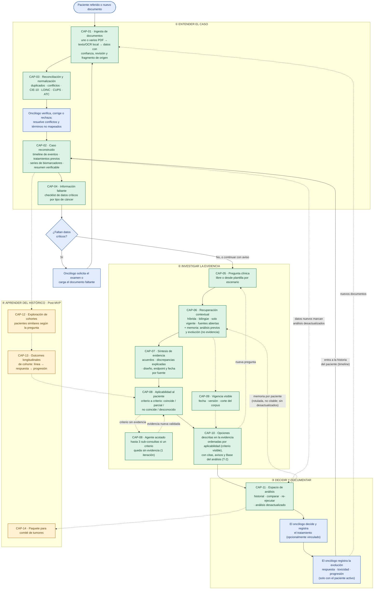
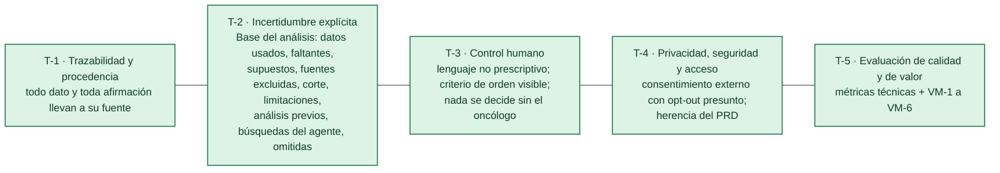
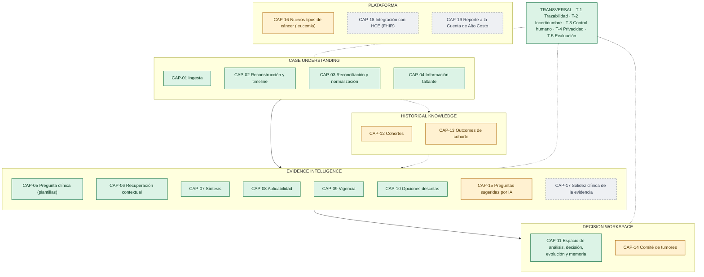
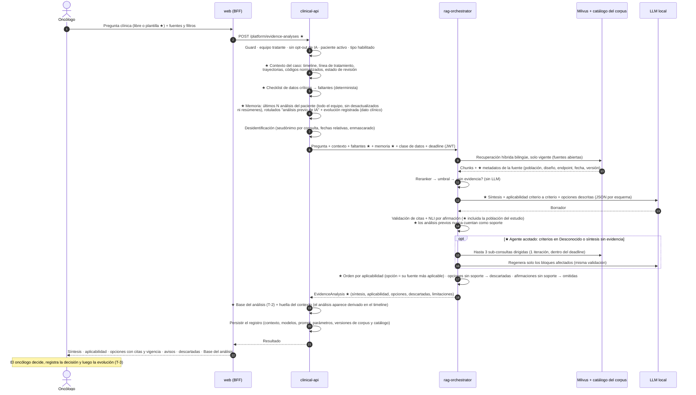

# OncoLens: solución To-Be

| Campo | Valor |
|---|---|
| Fecha | 2026-10-04 (v1.2: decisiones D-01 a D-16 y revisión de coherencia R-01 a R-31, ambas listadas en la §0 del PRD) |
| Base | [`AS-IS.md`](AS-IS.md) · [`PRD.md`](PRD.md) v1.2 · [`OncoLens-C4.drawio`](OncoLens-C4.drawio) |
| Congruente con | PRD §18 (criterios de aceptación): cada capacidad **MVP** de este documento tiene criterios con el mismo ID, y cada capacidad **Post-MVP** o **Futuro** aparece en la PRD §18.1.2 "Fuera del alcance" |

## Convenciones

| Color | Fase | Significado |
|---|---|---|
| 🟩 Verde | **MVP** | Se entrega dentro de los 6 sprints y se acepta con los criterios de la PRD §18 |
| 🟨 Ámbar | **Post-MVP** | Visión inmediata. El MVP deja preparado el diseño, pero no se acepta en el MVP |
| ⬜ Gris punteado | **Futuro** | Hipótesis de largo plazo, sin compromiso |
| 🟦 Azul | **Humano** | Acción o decisión del oncólogo. La IA nunca la ejecuta |

**Principio rector** (síntesis de las dos perspectivas): *OncoLens ayuda al oncólogo a **entender el caso**, **saber qué falta**, **encontrar y entender la evidencia aplicable** y **decidir con control total**. Cada afirmación es trazable, la incertidumbre es explícita y la decisión es siempre humana.*

**Decisiones que dan forma a este To-Be:** análisis de evidencia en lugar de recomendación (D-01) · caso reconstruido (D-02) · aplicabilidad antes que relevancia (D-03) · métricas de valor (D-04) · faltantes (D-05) · vigencia (D-06) · Base del análisis (D-07, D-08) · solo fuentes públicas abiertas, con NCCN y ESMO no bloqueantes (D-09) · normalización CIE-10, LOINC, CUPS y ATC, sin reporte CAC (D-10) · historia del paciente con evolución y memoria de análisis no citable (D-11) · cohortes en Post-MVP (D-12) · plantillas de preguntas (D-13) · captura de menores se mantiene (D-14) · job de retención en Post-MVP (D-15) · comité de tumores en Post-MVP (D-16). **v1.2:** consentimientos externos con opt-out presunto (R-11) · agente acotado de búsqueda complementaria (R-13) · B2 propone y B1 decide la normalización (R-04) · timeline con eventos derivados (R-03).

---

## Vista 1 · Flujo To-Be del oncólogo con OncoLens

Reemplaza el AS-IS de 18 etapas manuales ([`AS-IS.md`](AS-IS.md)) por **cuatro momentos**, con los loops de investigación que identificó el Discovery.

**Capa transversal**: aplica a **todas** las capacidades de la Vista 1 y se acepta con los criterios T-1 a T-5:

---

## Vista 2 · Mapa de capacidades por fase

Toma el *Opportunity Map* del Discovery y le asigna una fase y un ID a cada capacidad.

> CAP-18 (integración con la HCE) no viene de los documentos fuente: es una hipótesis de largo plazo. CAP-19 (reporte CAC) queda como futuro por D-10. El MVP ya normaliza con CIE-10, LOINC, CUPS y ATC, lo que facilita ese reporte más adelante.

---

## Vista 3 · Secuencia To-Be del análisis de evidencia (MVP)

Extiende el Flujo 2 del README sin romper sus reglas: la identidad nunca sale de `clinical-api`, el contexto viaja desidentificado, nunca se muestran tokens sin validar y nada se muestra antes de persistirse. Lo **nuevo** está marcado con ★.

---

## Vista 4 · Arquitectura To-Be: qué cambia sobre la arquitectura del PRD

La arquitectura **se conserva**: BFF, `clinical-api`, `rag-orchestrator`, PostgreSQL, Milvus y LLM local. El To-Be **agrega módulos** dentro de los contenedores que ya existen, respetando el ownership: **lo determinista y lo que toca datos del paciente** va en `clinical-api`, y **lo que usa modelos** va en `rag-orchestrator`. El detalle está en el diagrama C4 ([`OncoLens-C4.drawio`](OncoLens-C4.drawio), Nivel 3).

```mermaid
flowchart LR
    Doctor(["Oncólogo · VPN/HTTPS"]):::human

    subgraph WEB["web · Next.js (BFF)"]
        W1["Ficha del paciente (existente)"]:::base
        W2["★ Vista de caso: timeline, series,<br/>tratamientos previos, faltantes, evolución"]:::mvp
        W3["★ Panel de análisis de evidencia:<br/>síntesis, aplicabilidad, opciones,<br/>Base del análisis"]:::mvp
        W4["Explorador de cohortes"]:::post
    end

    subgraph B1["clinical-api · Node"]
        S0["Auth · equipo tratante · ★ marcas de opt-out<br/>· identidad cifrada · auditoría"]:::base
        S1["Revisión de datos extraídos (existente,<br/>★ conflictos y mapeos)"]:::base
        S2["★ CaseTimelineService<br/>eventos derivados + ClinicalEvent,<br/>atributos, líneas, series, evolución"]:::mvp
        S3["★ ReconciliationService<br/>duplicados, conflictos, normalización final<br/>CIE-10 · LOINC · CUPS · ATC (también manual)"]:::mvp
        S4["★ CompletenessService<br/>checklist determinista"]:::mvp
        S5["Módulo evidence-analysis: gateway + historial<br/>+ ★ AnalysisBasis + ★ StaleDetector (2 marcas) + ★ Memory"]:::mvp
        S6["CohortService sobre el schema research<br/>(snapshots longitudinales)"]:::post
    end

    CAT[("★ packages/clinical-catalogs<br/>artefacto JSON montado en ambos (409 si difiere)<br/>matriz ítem → campo · datos críticos · aplicabilidad ·<br/>terminología · plantillas")]:::mvp

    subgraph B2["rag-orchestrator · Python"]
        R1["Extracción OCR + ★ eventos, atributos,<br/>tratamientos previos y códigos propuestos"]:::mvp
        R2["Recuperación híbrida + reranker (existente)"]:::base
        R3["★ SynthesisService"]:::mvp
        R4["★ ApplicabilityService<br/>+ agente acotado"]:::mvp
        R7["★ CaseSummaryService"]:::mvp
        R5["Validación de citas + NLI (existente,<br/>★ ampliada a población y a memoria no citable)"]:::base
        R6["Ingesta del corpus (fuentes abiertas)<br/>+ ★ metadatos estructurados"]:::mvp
    end

    PG[("PostgreSQL<br/>clinical ★ ClinicalEvent, ClinicalAttribute, PriorTreatment,<br/>ClinicalDataSource, PatientOptOut<br/>research ★ snapshot longitudinal<br/>corpus ★ metadatos, CorpusRelease (N:M)")]:::store
    MV[("Milvus · chunks del corpus")]:::store
    LLM["LLM local (Metal)"]:::store

    Doctor --> WEB
    WEB --> B1
    B1 --> PG
    B1 -- "contexto desidentificado + faltantes ★<br/>+ memoria ★ (JWT)" --> B2
    B1 -.-> CAT
    B2 -.-> CAT
    B2 --> MV
    B2 -- "rol rag_corpus (solo corpus)" --> PG
    B2 --> LLM

    classDef base fill:#f5f6f8,stroke:#9aa1ab,color:#1f2933
    classDef mvp fill:#dcf3e6,stroke:#1f7a4d,color:#0f3d26,stroke-width:1.5px
    classDef post fill:#fff1d1,stroke:#b7791f,color:#5a3b06,stroke-width:1.5px
    classDef human fill:#e3ecfd,stroke:#2f5fb3,color:#13306b
    classDef store fill:#ffffff,stroke:#4b5563,color:#111827
```

*Gris = existente en el PRD v1.0 · ★ verde = nuevo o modificado en el MVP v1.1 o v1.2 · ámbar = Post-MVP.*

---

## Vista 5 · Fases dentro de la capacidad actual

```mermaid
gantt
    title Resecuenciación v1.1 (misma capacidad, cualitativa)
    dateFormat X
    axisFormat S%s
    section Decisiones
    Contrato, esquema, protocolo de valor, ADR de fuentes   :crit, d0, 0, 1
    section MVP
    S1 Esqueleto + contrato EvidenceAnalysis + baseline técnico y de valor :s1, 1, 2
    S2 OCR + CAP-02 caso + CAP-03 normalización y duplicados              :s2, 2, 3
    S3 Híbrida + CAP-03 conflictos + CAP-04 + CAP-09 + T-2 + plantillas   :s3, 3, 4
    S4 CAP-07 + CAP-08 (con agente acotado) + CAP-11 (iteración, evolución, memoria) :s4, 4, 5
    S5 Autorización + bloqueo por opt-out + mayoría de edad + gate del piloto :crit, s5, 5, 6
    S6 Observabilidad + medición de valor en el piloto                    :s6, 6, 7
    section Post-MVP
    CAP-12/13 · CAP-14 · CAP-15 · CAP-16 · job de retención                :p1, 7, 9
```

| Sprint | Alcance v1.1 | Cambio vs. PRD v1.0 |
|---|---|---|
| Pre-S1 | Contrato `EvidenceAnalysis`; esquema con caso longitudinal y metadatos del corpus; protocolo de valor (TBD-11); ADR de fuentes (no bloqueante) | Nuevo (decisiones) |
| S1 | Esqueleto + esquema ampliado + contrato + baseline técnico y manual (VM-1, VM-2) | Esquema y contrato ampliados |
| S2 | OCR (carga múltiple) + eventos, tratamientos previos y códigos + vista de caso y resumen + duplicados | + CAP-02, CAP-03 |
| S3 | Híbrida + revisión + conflictos y mapeos + faltantes + vigencia + Base del análisis + plantillas | + CAP-03, CAP-04, CAP-09, T-2, CAP-05 |
| S4 | Síntesis + aplicabilidad + **agente acotado** + hasta 3 opciones + iteración (dos marcas de desactualizado, re-ejecutar, comparar) + evolución y memoria + snapshot longitudinal + UI de opt-out para el admin + feedback | + CAP-07, CAP-08, CAP-11 |
| S5 | Equipo tratante, bloqueo por opt-out en todos los endpoints de IA, job de mayoría de edad, VPN, backups, gate G-piloto | − job de retención (D-15); − captura de consentimientos (R-11) |
| S6 | Observabilidad, hardening y medición de valor | + medición |

> La configuración de menores se mantiene completa (D-14). La capacidad liberada es el job de retención y la captura de consentimientos (R-11); el agente acotado (R-13) suma trabajo al S4. Ingeniería estima antes del S1 (PRD TBD-19). Si no alcanza, el orden de recorte acordado en el PRD §14 es: CAP-07, luego los conflictos de CAP-03.

---

## Congruencia To-Be ↔ PRD (requisitos y §18 criterios de aceptación)

| Capacidad | Fase | Vista(s) | Criterios (PRD §18) | Requisitos (PRD) | Origen (D-xx, R-xx o v1.0) | Sprint |
|---|---|---|---|---|---|---|
| CAP-01 Ingesta | MVP | 1, 4 | AC-01.x | FR-05, FR-06 | v1.0 | S2 |
| CAP-02 Reconstrucción del caso | MVP | 1, 3, 4 | AC-02.x | FR-21, FR-04 | D-02 | S1 (esquema) · S2 |
| CAP-03 Reconciliación y normalización | MVP | 1, 4 | AC-03.x | FR-22, FR-08 | D-10 | S2–S3 |
| CAP-04 Información faltante | MVP | 1, 3, 4 | AC-04.x | FR-23 | D-05 | S3 |
| CAP-05 Pregunta clínica | MVP | 1, 3 | AC-05.x | FR-28, FR-09 | D-13, D-01 | S1 · S3 |
| CAP-06 Recuperación contextual | MVP | 1, 3 | AC-06.x | FR-09, FR-19 | v1.0, D-09 | S1 · S3 |
| CAP-07 Síntesis | MVP | 1, 3, 4 | AC-07.x | FR-24 | D-08 | S4 |
| CAP-08 Aplicabilidad (incluye el agente acotado) | MVP | 1, 3, 4 | AC-08.x | FR-25, FR-30 | D-03, R-01, R-13 | S1 (contrato) · S4 |
| CAP-09 Vigencia visible | MVP | 1, 3 | AC-09.x | FR-26 | D-06 | S3 |
| CAP-10 Opciones descritas | MVP | 1, 3 | AC-10.x | FR-09, FR-10, FR-11 | D-01 | S1 · S4 |
| CAP-11 Análisis, decisión, evolución y memoria | MVP | 1, 3, 4 | AC-11.x | FR-12, FR-13, FR-29 | D-11 | S4 |
| T-1 Trazabilidad | MVP | 1 | AC-T1.x | RN-01, RN-04, FR-18 | v1.0 | S1+ |
| T-2 Incertidumbre explícita | MVP | 1, 3 | AC-T2.x | FR-27 | D-07, D-08, D-09 | S3 |
| T-3 Control humano | MVP | 1, 3 | AC-T3.x | RN-23, RN-26, RN-19 | v1.0, D-01 | S1+ |
| T-4 Privacidad y seguridad | MVP | 1, 4 | AC-T4.x | §11, FR-15, FR-16, RN-15 | R-11 | S1–S5 |
| T-5 Evaluación técnica y de valor | MVP | 1 | AC-T5.x | FR-20, §2.2 | D-04 | S1+ |
| CAP-12 a CAP-16 | Post-MVP | 1, 2, 4 | §18.1.2 + AC-P.1 | §3 | D-12, D-13, D-16 | — |
| CAP-17, CAP-18, CAP-19 | Futuro | 2 | §18.1.2 | §3 | TBD-09, D-10 | — |

**Regla de congruencia:** si una capacidad cambia de fase en este documento, hay que moverla entre la §18.1.1 y la §18.1.2 del PRD, y entre su §5 y su §3.
