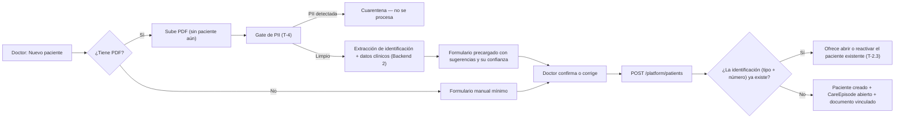
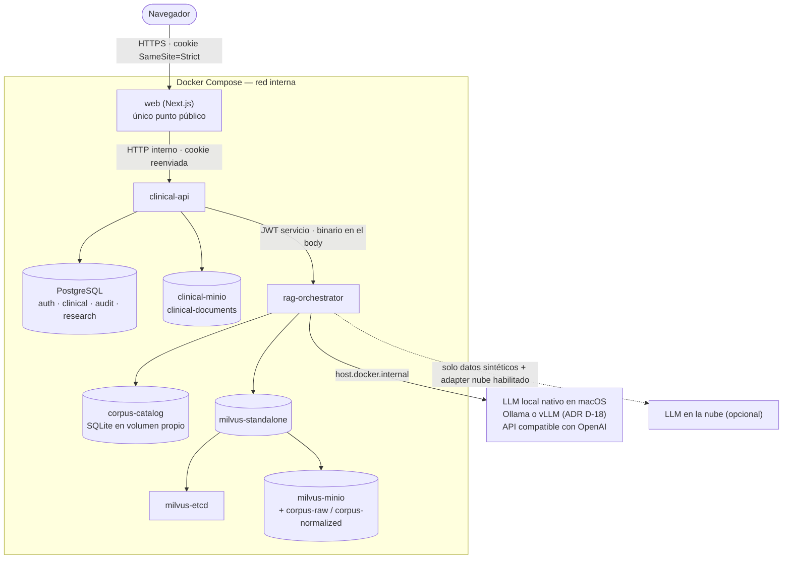
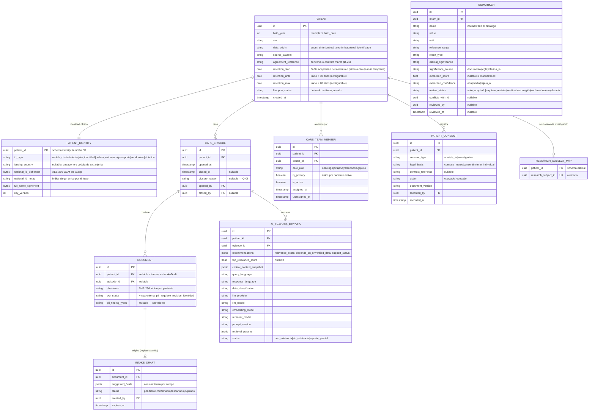

# OncoLens — Propuesta de solución a los hallazgos de la revisión

> **Documento base:** `docs/review/revision-cruzada-y-prd.md` (hallazgos P1-01…P4-06 y decisiones D-01…D-16).
> **Fecha:** 2026-09-25.
> **Cómo leerlo:** la §1 fija las decisiones que confirmó el autor del proyecto. La §2 lista los riesgos nuevos que esas decisiones introducen. La §3 describe seis diseños transversales que resuelven varios hallazgos a la vez. La §4 recorre cada hallazgo con su análisis, la solución propuesta, las alternativas descartadas con su motivo, los cambios en el README y el sprint. Las §5–§7 consolidan los cambios en datos, API y roadmap. La §8 reúne las preguntas que siguen abiertas.
> **Estados de cada solución:** ✅ **Resuelta**: se deriva directamente de una decisión confirmada. 🟡 **Propuesta**: recomendación técnica que requiere tu visto bueno. ❓ **Pendiente**: depende de una pregunta abierta de la §8, y no se asume nada.

---

## 1. Decisiones confirmadas y sus implicaciones

| ID | Decisión (respuesta del autor) | Implicaciones de diseño | Hallazgos afectados |
|---|---|---|---|
| D-01 | **Posicionamiento:** MVP de una herramienta **académica**, con potencial de convertirse en apoyo real a decisiones clínicas. | El producto no promete resultados clínicos, pero se diseña *preparado para CDS*: trazabilidad completa, evaluación reproducible y separación clara entre dato verificado y dato inferido. No se implementan todavía controles regulatorios formales. | P1-01, P1-03, P2-02, P2-10 |
| D-02 | **Datos:** se combinan datos **sintéticos** y **reales anonimizados**. Los datos no anonimizados quedan para una fase futura en la que se cierren las brechas de seguridad. **⚠️ Precisada por D-02c** (el piloto usa cédula y nombres reales). | Cada paciente lleva su origen. Los controles contra PII residual son obligatorios desde que entran datos reales. | P1-04, P1-05, P1-06, P2-03 |
| D-02c | **Clases de datos (Q-01):** **mixto por dataset.** Los datos **sintéticos** usan una identificación numérica aleatoria y van etiquetados como sintéticos. Los datos **reales anonimizados** se usan para calibración y pruebas. Los pacientes **reales** que atienden los oncólogos del piloto se registran con **cédula de ciudadanía y nombres**, los únicos datos personales que se usan, amparados en el contrato marco que el paciente acepta en su primera consulta (uso para su tratamiento con IA y para investigación). | Tres clases de datos con reglas distintas (diseño T-7). La identidad real se guarda cifrada y separada de los datos clínicos, y nunca llega al LLM ni al histórico. Se reabre la decisión de cifrado a nivel de columna de §3.3 #6 (N-07). | T-7, P1-06, T-4, N-07 |
| D-21 | **Origen de los datos reales (Q-02):** vienen de una institución, un dataset público y un colaborador, bajo un **convenio marco** con los términos de uso para investigación e IA en tratamientos. | Se registra `source_dataset` y la referencia del convenio por paciente desde el Sprint 1. El acuerdo se documenta antes de cargar datos reales. | N-05 |
| D-22 | **Usuarios (Q-09):** un grupo inicial de **10 oncólogos** para pruebas y refinamiento. La autorización del Sprint 5 debe estar lista **antes de cargar datos reales** y antes de una demo a una audiencia mayor. | Ningún dato real (anonimizado ni identificado) entra a la aplicación antes de completar el Sprint 5. Aparece el gate G-piloto (T-7.4) y la pregunta de hospedaje (N-08). | P1-06, T-7.4 |
| D-23 | **Umbrales de OCR (Q-06):** se aceptan y pueden ajustarse. Los laboratorios presentan los resultados de formas distintas, y el doctor puede solicitar y ver el documento de origen para confirmar un valor. | Extracción sin plantillas por laboratorio, normalización de unidades y visor del documento de origen resaltando el valor (T-1.7). | T-1, P2-07 |
| D-24 | **Egreso (Q-08):** lo ejecutan el tratante principal o un administrador; la lista de motivos se valida con el oncólogo. | Regla de autorización del endpoint de egreso. | T-2.3 |
| D-25 | **Diagnóstico en conflicto (Q-11):** se valida la **fecha del diagnóstico** para saber si es vigente. El dato entra etiquetado y el oncólogo puede confirmarlo o descartarlo. | Regla de fechas en T-1.4. | T-1.4 |
| D-26 | **Citas (Q-07):** el original siempre visible, la traducción como opción marcada como tal; la verificación de soporte usa siempre el original. | UI de citas y T-5.1. | T-3, N-03 |
| D-27 | **Chequeo de soporte (Q-10):** estricto (se descarta toda la recomendación), pero las descartadas se muestran en una sección o etiqueta aparte para que el oncólogo las revise. | Se persisten y se muestran separadas (T-5.1). | T-5, P1-03 |
| D-28 | **Fuentes (Q-13):** guías y tratamiento: NCI PDQ, ESMO, NCCN, PubMed/PMC, ClinicalTrials.gov. Investigación y bioinformática: TCGA/GDC, cBioPortal, TCIA. El MVP usa **solo fuentes textuales**: de las fuentes bioinformáticas se incorporan sus publicaciones y resúmenes asociados. Licencias de NCCN y ESMO: **pendientes**. | NCCN y ESMO quedan excluidas por defecto hasta tener la licencia (solo su contenido de acceso abierto con licencia compatible). ADR de fuentes (P2-09, N-10). | P2-09 |
| D-29 | **Sesión (Q-12):** 8 h de TTL, 30 min de inactividad y 15 min de bloqueo tras 5 intentos, como valores configurables. | — | P2-05 |
| D-30 | **Opt-out de la entidad (Q-14):** se acepta la marca de exclusión al importar o registrar, más la opción manual del doctor. | Campo `research_opt_out` en los datos de origen. | T-2.5 |
| D-31 | **"Entrenamiento":** significa **calibrar y evaluar** (umbrales, prompts, reglas, datasets de evaluación). **No** se reentrena ningún modelo. | Sin *pipeline* de *fine-tuning*. Los datos reales anonimizados alimentan T-5 (N-09). | T-5 |
| D-32 | **Acceso al piloto (Q-15):** red privada o VPN, con HTTPS. | Resuelve N-08: ningún puerto abierto a internet; certificado de una CA interna instalado en los equipos de los 10 oncólogos; FileVault y *backups* cifrados como mínimos. | N-08, T-7.4 |
| D-33 | **Tipos de documento (Q-16):** cédula de ciudadanía, tarjeta de identidad, cédula de extranjería y pasaporte. `id_type` es una lista configurable y solo se habilitan los confirmados. | Catálogo `id_type` con validación de formato por tipo. La tarjeta de identidad implica pacientes menores de edad (D-37). | T-7.2 |
| D-34 | **Calibración temprana (Q-17):** la calibración y evaluación con datos reales anonimizados puede empezar antes del Sprint 5, porque no equivale a cargar datos reales en la aplicación. | Se hace fuera de la base de la aplicación y fuera del repo (N-09), desde el Sprint 1–2. | P1-06, T-5, N-09 |
| D-35 | **Retención (Q-18):** hasta **10 años** para investigación e IA, renovable hasta **20 años** si el paciente no solicita darse de baja. | Retención por paciente con vencimiento, renovación y acción al vencer (T-7.5). Los detalles quedan en D-36. | T-7.5, T-2.4, T-2.5 |
| D-36 | **Detalles de la retención (Q-19):** (a) el plazo cuenta desde la **aceptación del contrato o la primera cita médica**; (b) la renovación hasta 20 años es **automática**, con registro en la auditoría; (c) al vencer o con la baja se **borran la cédula, el nombre y el histórico de investigación**, y el resto de los datos clínicos queda sin forma de volver a la identidad; **no hay una norma** que obligue a conservar la historia clínica por otro plazo; (d) **no aplica** a los datos reales anonimizados. | T-7.5 queda resuelta. Se distinguen dos niveles de baja (D-41). | T-7.5 |
| D-37 | **Menores (Q-20):** el piloto **incluye pacientes pediátricos**; los padres aceptan y firman. | Consentimiento otorgado por un representante legal, con su identidad cifrada (T-2.5). Se habilita `tarjeta_identidad`. Al cumplir la mayoría de edad se aplica D-40. | T-2.5, T-7 |
| D-38 | **Alcance clínico del piloto:** probablemente se empiece con **2 tipos de cáncer** y se agreguen otros de forma gradual. Los candidatos son **próstata, mama y leucemia**. | Alcance por tipo de cáncer configurable, con un criterio de "listo" para habilitar cada tipo (T-8). El modelo de diagnóstico debe cubrir las neoplasias hematológicas (N-11). | T-8, N-11 |
| D-39 | **Tipos iniciales (Q-21):** el piloto empieza con **mama y próstata**; **leucemia** entra como tercer tipo, con el modelo genérico de T-8.1 implementado desde el Sprint 1. | Catálogos, corpus y dataset de evaluación del Sprint 1–4 para mama y próstata. Leucemia se habilita después con el criterio de T-8.3. | T-8 |
| D-40 | **Mayoría de edad (Q-22):** al cumplirla, el paciente queda marcado "requiere ratificación" y el consentimiento de los padres sigue vigente hasta que el paciente lo ratifique o lo revoque. | Job diario que detecta la mayoría de edad (edad configurable) y un aviso en la ficha. | T-2.5 |
| D-41 | **Niveles de baja (Q-23):** hay **dos**: *baja de investigación* (se borra el histórico y el paciente sigue en atención) y *baja total* (se ejecuta la acción de vencimiento y el paciente sale de OncoLens). | Dos acciones distintas en la UI y en la API. | T-7.5, T-2.5 |
| D-05b | **País (Q-05):** los documentos son de uso público y para investigación; **no se asume ningún país**. | Los formatos de identificación del detector de PII y del registro son configurables (T-4, T-7). | T-4, T-7 |
| D-02b | **Punto de anonimización:** en **ambos** lugares. Los datos llegan anonimizados desde fuera **y** OncoLens verifica que no quede PII residual. | Hace falta un **gate de PII residual** dentro de OncoLens (diseño T-4). Un documento con PII detectada se pone en cuarentena y no se procesa. | P1-04, P1-05, P2-13 |
| D-04 | **Embeddings:** el spike del Sprint 1 contempla el **idioma**, porque hay documentación y evidencia en español e inglés. | Modelo de *embeddings* multilingüe, estrategia de consulta bilingüe e idioma registrado por chunk (diseño T-3). | P1-08, P2-10 |
| D-04b | **LLM y embeddings:** **configurable**. Local por defecto; la nube solo para pruebas con datos sintéticos. | `LLMAdapter` con dos implementaciones y una **regla dura**: un análisis de un paciente `real_anonimizado` nunca va a un proveedor en la nube. Los *embeddings* siempre son locales (diseño T-6). | P1-04, P2-03, P2-12 |
| D-03 | **OCR:** los documentos **no salen a la nube**. Se procesan en local, en Docker, sobre una MacBook Pro M5 con 32 GB de RAM. | Motor de OCR local. Hay restricciones de hardware que aparecen como hallazgos nuevos N-01 y N-02. | P1-04, P3-08 |
| D-05 | **Idioma de la respuesta:** el **idioma de la pregunta**. | Hay que detectar el idioma de la pregunta; el prompt fija el idioma de salida. El idioma en que se muestran las citas queda definido en D-26. | P1-08 |
| D-06 | **Datos de OCR en el RAG:** **sí entran**, con una etiqueta de nivel de confianza de la extracción y otra que indique qué requiere revisión del doctor y qué se generó automáticamente con alta confianza. | Modelo de dos ejes, confianza de la extracción × estado de revisión (diseño T-1). El contexto del RAG y la respuesta muestran de qué datos dependen. | P1-02, P2-01, P2-07 |
| D-07 | **Registro de pacientes:** formulario manual mínimo **y** formulario precargado con datos sugeridos por el OCR. El doctor siempre confirma. Cada paciente tiene una identificación. | Dos caminos hacia un mismo endpoint de creación. El OCR nunca crea pacientes por sí solo (diseño T-2). | P1-09, P2-13 |
| D-07b | **Alta (egreso):** "dar de alta" significa **egreso**. Los datos del paciente se almacenan en un **histórico** (otra tabla) que podrá usarse en investigación futura, por ejemplo para análisis de grafos entre pacientes. | Ciclo de vida del paciente con estados y un esquema `research` separado (diseño T-2). | P1-09, P2-06 (nuevo alcance) |
| D-07c | **Reingreso:** el paciente **se reactiva**, conserva su identificación e historia, y el histórico guarda cada episodio. | Modelo de **episodios de atención** (`CareEpisode`). | — |
| D-09 | **Validador clínico:** un oncólogo disponible **parcialmente**, para revisiones puntuales. El dataset lo arma el autor con fuentes públicas. | El dataset de evaluación se construye con fuentes públicas y el oncólogo revisa una muestra y las reglas clínicas críticas. Las métricas se reportan como "validado clínicamente" o "no validado" (diseño T-5). | P1-03, P2-01 |
| D-12a | **Asignación:** **varios** doctores activos por paciente (equipo tratante), con uno marcado como tratante principal. | Cambia la regla "solo una asignación activa" de §3.1. | P2-06 |
| D-17 | **Runtime del LLM local:** **Ollama o vLLM**, ejecutado de forma nativa en macOS (fuera de Docker). | El LLM corre fuera de Compose; la elección entre Ollama y vLLM se toma en el ADR de D-18. El `LLMAdapter` local se implementa contra la API compatible con OpenAI que exponen ambos, así que cambiar de runtime no toca código (N-01). | N-01, T-6 |
| D-18 | **Modelos locales:** se creará un **ADR de evaluación de modelos locales**. | La elección de LLM, *embeddings*, *reranker*, NLI y motor de OCR, y su cuantización, sale de una medición con criterios explícitos y no de una estimación. Ver el borrador `docs/architecture/adr/0001-evaluacion-modelos-locales.md`. | N-02, P1-08, P3-08 |
| D-20 | **Consentimiento de investigación (Q-03):** el snapshot al egresar se guarda **solo** si la casilla de investigación está marcada. Es **opt-out**: viene marcada por defecto, porque existe un **contrato marco con la entidad médica**. | Al registrar un paciente se crea automáticamente un evento `investigacion = otorgado` con base `contrato_marco`. El paciente puede excluirse (opt-out) en cualquier momento. La exclusión impide snapshots futuros y borra los existentes. | T-2.4, T-2.5, N-04 |
| D-19 | **Histórico de investigación:** es **alcance futuro**. El MVP tendrá **lo mínimo necesario**. | Se reduce T-2.4 a un snapshot mínimo y seudonimizado al egresar. El modelo normalizado, los desenlaces, el grafo y la exportación pasan a una fase posterior (N-04). | N-04, T-2.4, HU-13, HU-15 |

---

## 2. Hallazgos nuevos que introducen las decisiones

Estos puntos no existían en la revisión original. Aparecen al combinar las decisiones de la §1 con la restricción de hardware.

### [N-01] Alto — Docker en macOS no expone la GPU (Metal) a los contenedores

**Análisis.** [I] Docker Desktop en macOS ejecuta los contenedores dentro de una máquina virtual Linux, que no tiene acceso a la GPU de Apple (Metal). Un LLM local o un OCR con modelos neuronales corriendo **dentro** de Docker usa solo CPU ARM64. Con un modelo de 7–8B parámetros eso implica decenas de segundos por respuesta, lo que pone en riesgo el KR2 del Sprint 1 (p95 ≤ 15 s).

**Solución ✅ (D-17).** El LLM corre **de forma nativa en macOS, fuera de Docker**, con **Ollama o vLLM**. La elección entre ambos se toma en el ADR de modelos locales (D-18). Los contenedores lo alcanzan en `host.docker.internal`. El resto (PostgreSQL, Milvus, MinIO, las apps y el OCR clásico) sigue en Docker Compose.

**Detalles que el ADR debe verificar (sin asumirlos):**
1. **Soporte de GPU de cada runtime en Apple Silicon.** [I] Ollama usa Metal de forma nativa en macOS. El soporte de vLLM para Apple Silicon ha sido históricamente experimental y centrado en CPU, con iniciativas de aceleración por Metal en desarrollo. El ADR debe confirmar, en la versión vigente, que vLLM usa la GPU de la M5. Si no la usa, pierde la ventaja que motivó sacarlo de Docker.
2. **Una sola interfaz para ambos.** Ollama y vLLM exponen una API compatible con OpenAI (`/v1/chat/completions`). El `LLMAdapter` local se implementa contra esa API y el runtime se elige con variables de entorno (`LLM_BASE_URL`, `LLM_MODEL`). Cambiar de runtime no requiere cambios de código.
3. **Salida JSON restringida.** La extracción clínica (T-1) y la generación necesitan una salida que respete un esquema JSON. Hay que verificar cómo lo soporta cada runtime (formato JSON o decodificación guiada) con el modelo elegido.
4. **Dónde corren *embeddings*, *reranker* y NLI.** [I] El modelo de *embeddings* propuesto (BGE-M3) genera vectores *dense* y *sparse*. Un runtime de LLM normalmente expone solo el *dense*, y los pesos *sparse* requieren la librería del modelo (p. ej., FlagEmbedding) en Python. 🟡 Propuesta: *embeddings*, *reranker* y NLI corren **dentro de `rag-orchestrator` en CPU** (son modelos de ~0,3–0,6B, con latencias por consulta del orden de cientos de milisegundos, a medir en el ADR). Solo el LLM de generación y estructuración sale de Docker. Alternativa, si la CPU no alcanza: un segundo servicio nativo de Python para estos modelos.
5. **Operación.** Contrato del componente fuera de Compose: puerto, modelos descargados y versión fijada, *healthcheck* usado por `rag-orchestrator` (el `503 LOCAL_LLM_UNAVAILABLE` de T-6.4) y un script de arranque documentado en §1.4.

**Alternativas descartadas:**
- *LLM dentro de Docker solo con CPU*: la latencia es incompatible con el KR2 y con la experiencia de consulta.
- *LLM en la nube para todo*: contradice la decisión D-04b para datos reales anonimizados.
- *Máquina virtual Linux con GPU*: no existe en Apple Silicon para este caso.
- *Docker Model Runner*: también corre el modelo en el host con GPU, pero ata la operación a una funcionalidad específica de Docker Desktop. Ollama o vLLM (D-17) son independientes de Docker y exponen la misma API compatible con OpenAI.

**Consecuencia sobre la regla "todo en Docker" (§1.4, §2.4).** El README debe declarar un único componente fuera de Compose (el servidor de inferencia) con su contrato: puerto, modelos y *healthcheck*.

### [N-02] Alto — Presupuesto de memoria de 32 GB compartido

**Análisis.** [I] Estimación orientativa, a medir en el spike:

| Componente | Memoria aproximada |
|---|---|
| LLM 7–8B cuantizado a 4 bits (nativo, Metal) | 5–6 GB, más el contexto |
| Modelo de *embeddings* multilingüe (~0,6B) + *reranker* (~0,6B) | 2–3 GB |
| Milvus standalone + etcd + MinIO | 2–4 GB |
| PostgreSQL | 0,5–1 GB |
| `web` (Next.js) + `clinical-api` + `rag-orchestrator` | 1,5–2,5 GB |
| OCR clásico (Tesseract o PaddleOCR en CPU) | 0,5–2 GB |
| macOS, navegador, IDE | 6–8 GB |
| **Total** | **~19–28 GB** |

Un LLM de 14B (~9–10 GB) deja el sistema al límite, y los modelos de visión (vision-LLM de 7B o más) compiten con el LLM de generación.

**Solución ✅ (D-18).** Se crea un **ADR de evaluación de modelos locales**. Ya hay un borrador listo para completar: `docs/architecture/adr/0001-evaluacion-modelos-locales.md`. El ADR:
- mide el **pico de memoria** de cada candidato con el stack completo levantado, y no de forma aislada;
- fija el **presupuesto de memoria por componente** y los límites en Compose (`mem_limit`);
- aplica **restricciones duras**: memoria total ≤ presupuesto, p95 ≤ 15 s, licencia compatible con uso académico y calidad mínima en español;
- elige, entre los candidatos que cumplen, con los datasets de evaluación de T-5, de modo que un modelo de 14B solo gana si mejora las métricas de forma medible.

La recomendación de usar el mismo LLM para estructurar documentos (T-1) y para generar respuestas se mantiene 🟡: evita tener dos modelos grandes cargados a la vez.

**Descartado:** *definir los modelos sin medir* (riesgo de *swapping*, con latencias impredecibles), y *evaluar cada modelo por separado sin el stack levantado* (subestima la presión de memoria real).

### [N-03] Medio — Respuesta en el idioma de la pregunta y evidencia en otro idioma

**Análisis.** Con D-05, un doctor que pregunta en español recibe una justificación en español construida a partir de chunks posiblemente en inglés. El LLM tiene que **traducir y resumir a la vez**, y aumenta el riesgo de que la justificación no sea fiel. Además, el chequeo de soporte (T-5) debe comparar textos en idiomas distintos.

**Solución 🟡.** El chequeo de soporte usa un modelo NLI **multilingüe** (T-5). La tarjeta de recomendación muestra el idioma original de cada cita. Si la cita se muestra traducida, lleva la etiqueta "traducción automática" (D-26).

### [N-04] Alto — El histórico de investigación reabre problemas de privacidad y consentimiento

**Análisis.** D-07b crea un almacén pensado para **investigación** y para **análisis entre pacientes**. Eso requiere:
1. Una base legal o de consentimiento **distinta** de `consent_ai_analysis`: usar datos para investigación no es lo mismo que usarlos para un análisis puntual.
2. Controlar el riesgo de reidentificación, que en análisis de grafos es mayor, porque los patrones de relaciones identifican.
3. Datos de **desenlace** (respuesta al tratamiento, progresión) para que el análisis tenga valor. Hoy el modelo no los tiene: `Treatment.status` solo indica activo, completado o suspendido.

**Solución ✅ (D-19).** El histórico completo es **alcance futuro**. El MVP implementa solo el **mínimo necesario** (T-2.4): un snapshot seudonimizado por episodio al egresar, sin normalizar, sin desenlaces, sin grafo y sin exportación. Los puntos 1–3 de este hallazgo quedan registrados como **prerrequisitos** de la fase futura, no del MVP. La condición de consentimiento quedó resuelta (D-20: opt-out bajo contrato marco).

### [N-05] Alto — Origen y base legal de los datos reales anonimizados

**Análisis.** D-02 introduce datos reales. El documento no dice de dónde provienen (un hospital, un dataset público, un colaborador), bajo qué acuerdo ni con qué aval (por ejemplo, un comité de ética). Tampoco define qué estándar de anonimización aplica el proceso externo.

**Solución ✅ (D-21).** Institución, dataset público y colaborador, bajo un convenio marco. La propuesta registra en cada paciente `data_origin` y `source_dataset`, de modo que el origen sea trazable desde el primer día sin depender de la respuesta.

### [N-06] Medio — Riesgo de enviar datos reales a la nube por mala configuración

**Análisis.** Con un adapter configurable (D-04b), basta un `.env` equivocado para que el contexto de un paciente real anonimizado termine en un proveedor en la nube.

**Solución ✅.** La restricción se aplica **en código y en los dos backends** (T-6): Backend 1 envía la clasificación del dato y Backend 2 la hace cumplir. Si la configuración no es compatible, la consulta falla con un error explícito y no se envía nada. Hay tests para esta regla.

### [N-07] Alto — El piloto guarda identidad real (cédula y nombres)

**Análisis.** D-02c introduce datos identificables en el MVP. La decisión §3.3 #6 del README ("cifrado a nivel de columna descartado") y la regla de la versión anterior de esta propuesta ("nunca datos identificables") dejan de ser válidas. Hay tres riesgos concretos: una fuga de la base de datos expone la identidad junto con el diagnóstico; los identificadores pueden filtrarse hacia el LLM, los *logs*, la auditoría o el histórico; y la búsqueda por cédula y por nombre choca con el cifrado.

**Solución ✅/🟡.** Diseño T-7: identidad en una tabla separada, cifrada en la aplicación, con un índice ciego para buscar por cédula; nunca sale de `clinical-api`, salvo para mostrarla al doctor autorizado.

### [N-08] Alto — Hospedaje del piloto con 10 oncólogos

**Análisis.** La decisión D-03 sitúa todo en una MacBook Pro local, y D-22 pide que 10 oncólogos usen el sistema. No está definido cómo se conectan: ¿red local, túnel, un servidor de la entidad? Servir datos de salud identificables desde una laptop implica riesgos de disponibilidad (la laptop se apaga o se mueve), de exposición (cómo se publica el puerto) y de pérdida de los datos (robo del equipo).

**Solución ✅ (D-32).** Acceso **solo por red privada o VPN, con HTTPS**. Mínimos del piloto:
- Ningún puerto publicado a internet. `web` escucha solo en la interfaz de la red privada o VPN.
- HTTPS con un certificado de una **CA interna**, instalada en los equipos de los 10 oncólogos. **Descartado:** certificado autofirmado sin CA, porque entrena a los usuarios a aceptar advertencias del navegador.
- FileVault activo, *backups* cifrados fuera del equipo y un procedimiento documentado de apagado y arranque.
- La elección de la tecnología de VPN queda para el equipo que opere el piloto; el diseño no depende de ella.

Si el piloto se extiende o crece, se reevalúa migrar a un servidor de la entidad.

### [N-09] Alto — Repositorio público y datos reales de evaluación

**Análisis.** El repositorio es **público** (§0.5), y §2.3 prevé `data/evaluation/` dentro del repo. Con D-31, los datos reales anonimizados se usan para calibrar y evaluar. Si se versionan en el repo, se publican.

**Solución ✅.** `data/evaluation/` en el repo contiene **solo datos sintéticos** y las definiciones de los datasets (esquemas, preguntas). Los datos reales anonimizados viven en un volumen local cifrado, fuera del repo (ruta configurable, excluida con `.gitignore`), y sus resultados se versionan solo como métricas agregadas. Se agrega a CI un chequeo de secretos y PII sobre el repo.

**Descartado:** *repositorio privado*, porque contradice §0.5 (entrega académica pública). *Git LFS cifrado*: suma complejidad y deja el riesgo de publicar la clave.

### [N-10] Medio — Fuentes bioinformáticas y licencias de los resúmenes

**Análisis.** TCGA/GDC, cBioPortal y TCIA son datos estructurados e imágenes; por D-28, del MVP solo entran sus **publicaciones y resúmenes asociados**. [I] Los resúmenes de PubMed pueden tener copyright del editor aunque NLM los distribuya. Los artículos de PMC tienen licencias por artículo. Las descripciones de las colecciones de TCIA suelen publicarse con licencias abiertas, pero hay que verificarlo en cada una.

**Solución 🟡.** Un **ADR de fuentes y licencias** con un registro por fuente (licencia, URL de los términos, fecha de verificación, uso permitido). `CorpusDocument.license` y `license_url` son obligatorios y la ingesta rechaza documentos sin licencia registrada. NCCN y ESMO entran solo con licencia (D-28).

### [N-11] Alto — El modelo de diagnóstico no representa leucemias ni pacientes pediátricos

**Análisis.** El modelo actual (`Diagnosis.stage`, `ecog_score`; §3.1 y el ejemplo de §4.1) está pensado para **tumores sólidos adultos**:
- **Estadificación:** [I] la próstata y la mama usan TNM y estadio agrupado (en próstata también el grupo de grado ISUP/Gleason y el PSA). Las **leucemias no usan TNM**: se clasifican por subtipo (p. ej., LLA, LMA, LMC, LLC) y por grupo de riesgo según alteraciones citogenéticas y moleculares.
- **Estado funcional:** ECOG es la escala habitual en adultos. En pediatría se usan otras escalas (p. ej., Lansky en niños pequeños y Karnofsky en adolescentes).
- **Documentos y biomarcadores:** leucemia implica hemograma, citometría de flujo, cariotipo y estudios moleculares, que son otros formatos de documento para el OCR y otro catálogo de biomarcadores.
- **Evidencia:** las guías pediátricas son distintas de las de adultos (p. ej., PDQ tiene resúmenes separados para el tratamiento infantil).

Si se incluye leucemia sin estos cambios, el contexto que recibe el RAG sería incorrecto (un "estadio" vacío o forzado) y las reglas de campos críticos de T-1 no aplicarían.

**Solución 🟡.** Diseño T-8: estadificación y estado funcional **genéricos**, más catálogos por tipo de cáncer.

---

## 3. Diseños transversales

Cada diseño resuelve varios hallazgos. La §4 los referencia en lugar de repetirlos.

### T-1. Modelo de confianza y revisión de datos extraídos (resuelve P1-02, P2-01; parte de P2-07 y P2-13)

**Principio (D-06):** todo dato extraído por OCR entra al RAG, pero **nunca sin etiquetas**. El sistema diferencia *qué tan seguro está de haber leído bien* (confianza) de *si una persona lo revisó* (estado de revisión). Son dos ejes independientes: un dato puede tener confianza alta y aun así estar sin revisar.

#### T-1.1 Eje 1: confianza de la extracción (`extraction_confidence`)

La confianza es un valor numérico en [0,1] (`extraction_score`) más un nivel derivado: `alta`, `media` o `baja`. Se calcula **por campo**, no por documento, combinando señales deterministas:

| Señal | Cómo se obtiene | Peso orientativo |
|---|---|---|
| Calidad de lectura | Si el PDF tiene capa de texto digital, la lectura es exacta (valor 1). Si es escaneado, se usa la confianza por palabra del OCR (Tesseract y PaddleOCR la reportan), promediada sobre los tokens del campo. | Alto |
| Anclaje en el texto (*grounding*) | El valor que devuelve el LLM de estructuración debe aparecer **literalmente** (o normalizado) en el texto extraído. Si no aparece, el LLM lo infirió o lo inventó y la confianza baja drásticamente. | Muy alto |
| Validación de dominio | El nombre del biomarcador está en el diccionario interno (p. ej., EGFR, ALK, ROS1, BRAF, KRAS, PD-L1, HER2, MSI…); la unidad es coherente; el valor está dentro de un rango físicamente posible; el estadio respeta el formato TNM o el agrupado. | Medio |
| Consistencia interna | El valor concuerda con `reference_range` y con la bandera del laboratorio, si existe. | Medio |

Umbrales iniciales 🟡 (✅ D-23, ajustables; a calibrar con el set de evaluación de OCR): `alta` ≥ 0,90; `media` entre 0,70 y 0,90; `baja` < 0,70.

**Por qué no usar la confianza que reporta el LLM:** la misma razón por la que §3.3 #7 descartó el puntaje autorreportado. No está calibrada, no es reproducible y tiende a la sobreconfianza. La confianza se calcula en `domain/` de Backend 2 con reglas testeables.

#### T-1.2 Origen de la significancia clínica (`significance_source`)

El semáforo normal / alterado / relevante / crítico es la señal más visible para el doctor, así que su origen se hace explícito:

| Valor | Significado | Confianza máxima posible |
|---|---|---|
| `documento` | El laboratorio lo marcó en el documento (bandera H/L o "positivo"), leído literalmente. | La del campo |
| `regla` | Calculado de forma determinista por OncoLens: valor frente a `reference_range`, o regla cualitativa del diccionario (p. ej., "mutación EGFR detectada" → `relevante`). | La del campo |
| `inferido_ia` | El LLM lo propuso sin bandera ni regla aplicable. | Tope `media`, y siempre `requiere_revision` |

Las reglas del diccionario (qué biomarcador en qué estado es "relevante" o "crítico") son **reglas clínicas**. El oncólogo las revisa en su validación parcial (D-09).

#### T-1.3 Eje 2: estado de revisión (`review_status`)

| Estado | Cuándo | ¿Entra al RAG? | Etiqueta en el prompt y en la UI |
|---|---|---|---|
| `auto_aceptado` | Confianza `alta` **y** no es un campo crítico en conflicto **y** `significance_source` ≠ `inferido_ia`. | Sí | "Extraído automáticamente (confianza alta)" |
| `requiere_revision` | Confianza `media` o `baja`, **o** `inferido_ia`, **o** conflicto con un dato existente (T-1.4), **o** campo crítico con confianza < `alta`. | Sí, **marcado** | "Pendiente de revisión — confianza {nivel}" |
| `verificado` | El doctor lo confirmó sin cambios. | Sí | "Verificado por el doctor" |
| `corregido` | El doctor lo editó. Se crea una fila nueva con `entry_method = manual_correction` y la original pasa a `reemplazado`. | Sí (la corrección) | "Corregido por el doctor" |
| `rechazado` / `reemplazado` | El doctor lo descartó o lo sustituyó. | **No** | No se muestra en la ficha; se conserva para auditoría |

Los datos `seed` y los que se capturan en el formulario manual nacen como `verificado`: los ingresó una persona.

**Campos críticos ✅** (D-23): valor y estado de biomarcadores accionables, tipo de cáncer, estadio y ECOG. Un error en ellos cambia la recomendación, así que exigen confianza `alta` para quedar como `auto_aceptado`.

#### T-1.4 Conflictos con datos existentes

La regla de §3.2 para `Diagnosis` se conserva y se generaliza: un dato extraído **nunca reemplaza** en silencio a uno existente de mayor jerarquía (`verificado` o `corregido`). La diferencia con el README es que el dato en conflicto ya **no** se guarda como `is_active = false`, que se confundía con "histórico" (P2-01), sino como `requiere_revision` con `conflicts_with_id` apuntando al dato vigente.

En el contexto del RAG, el dato vigente va como tal y el dato en conflicto va con la etiqueta "Conflicto pendiente de revisión: el documento X reporta {valor}". 🟡 Esto es coherente con D-06 (todo entra, etiquetado) y deja al LLM y al doctor ver la discrepancia en lugar de ocultarla. **Regla de vigencia por fecha para `Diagnosis` (D-25) ✅:**

| Situación del diagnóstico extraído | Tratamiento | Etiqueta en el contexto del RAG |
|---|---|---|
| Igual al vigente (`cancer_type` + `stage`) | No se inserta (regla del README) | — |
| `diagnosed_at` **anterior** al del vigente | Se guarda como **histórico** (`is_active = false`); su `review_status` sigue la confianza | "Antecedente diagnóstico ({fecha})" |
| `diagnosed_at` **posterior** al del vigente, o sin diagnóstico vigente | `requiere_revision` con `conflicts_with_id`: posible diagnóstico más reciente (recurrencia o progresión) | "Posible diagnóstico más reciente — pendiente de revisión" |
| Sin fecha, o fecha con confianza < `alta` | `requiere_revision`; nunca se infiere la vigencia | "Diagnóstico sin fecha confiable — pendiente de revisión" |

El oncólogo **confirma** (el extraído pasa a vigente y el anterior a histórico, en una transacción) o **descarta** (`rechazado`). Las reglas se validan con el oncólogo (D-09).

#### T-1.5 Cómo viajan las etiquetas y cómo se usan en la respuesta

1. `ClinicalContext` (§4.2): cada diagnóstico, biomarcador y nota lleva `provenance: { entryMethod, extractionConfidence, reviewStatus, significanceSource }`.
2. El prompt presenta los datos agrupados por estado y le indica al LLM dos cosas: señalar en `rationale` cuándo una recomendación **depende** de un dato no verificado, y **no** tratar un dato `requiere_revision` como un hecho confirmado.
3. Backend 2 no confía en que el LLM lo cumpla. En `domain/` calcula de forma determinista `dependsOnUnverifiedData = true` cuando alguno de los datos del contexto que coinciden con la consulta (p. ej., el biomarcador mencionado en la recomendación) no está `verificado` ni `auto_aceptado`. La UI muestra entonces un aviso en la tarjeta: "Esta recomendación se basa en datos pendientes de revisión".
4. `AIAnalysisRecord.clinical_context_snapshot` guarda las etiquetas tal como estaban en el momento del análisis (P2-02).

#### T-1.6 Alternativas descartadas

| Alternativa | Por qué se descarta |
|---|---|
| Excluir del RAG los datos no revisados | Contradice la decisión D-06. Además, deja el contexto vacío mientras nadie revise, y en un MVP académico con un solo usuario eso inutiliza el Sprint 2. |
| Incluir los datos sin etiquetas (como hoy) | Es exactamente el riesgo P1-02: errores de OCR que cambian en silencio la recomendación. |
| Un solo booleano `verified` | No distingue "no revisado pero muy confiable" de "no revisado y dudoso", que es justo la granularidad que pidió D-06. |
| Confianza solo a nivel de documento | Un documento puede leerse bien en general y mal en el único valor que importa (p. ej., el porcentaje de PD-L1). |
| Confianza autorreportada por el LLM | No está calibrada, no es reproducible y tiende a la sobreconfianza (mismo criterio de §3.3 #7). |
| Un estado de revisión solo para `Diagnosis` (propuesta original del README para el Sprint 6) | Deja sin cubrir los biomarcadores, que son los datos que más influyen en la recomendación. |

---

#### T-1.7 Variación entre laboratorios y documento de origen (D-23)

- **Sin plantillas por laboratorio:** los laboratorios presentan los resultados de formas distintas, así que la extracción no depende de *layouts* fijos. Es el LLM de estructuración con anclaje textual (T-1.1) el que se adapta al formato.
- **Normalización:** tabla de unidades y sinónimos (p. ej., "PD-L1 TPS", "TPS PD-L1", "PDL1 (22C3)") en el catálogo de biomarcadores (P3-04). El rango de referencia siempre se toma **del propio documento**, porque varía entre laboratorios. Se registra `source_lab` (nombre del laboratorio, si figura) para calibrar umbrales por laboratorio más adelante.
- **Umbrales ajustables:** los valores de T-1.1 viven en configuración (D-23), no en el código.
- **Ver el documento de origen:** desde cualquier dato extraído, el doctor abre el PDF original en la página del valor, con el fragmento resaltado. Para eso, la extracción devuelve `sourceSpan = { page, bbox?, textOffset }`.
  - Endpoint: `GET /platform/patients/{id}/documents/{docId}/file`. `clinical-api` lo sirve en *streaming* desde `clinical-minio` a través de `web`, con cabeceras `Content-Disposition: inline` y `Cache-Control: no-store`.
  - Cada apertura queda registrada en `AuditLog`.
  - **Descartado:** enlaces prefirmados directos a MinIO (exponen el almacén clínico al navegador y no dejan auditoría) y guardar una copia en el navegador.

### T-2. Ciclo de vida del paciente: registro, episodios, egreso, reactivación e histórico (resuelve P1-09; nuevo alcance de D-07, D-07b y D-07c; base de P2-13)

#### T-2.1 Identificación del paciente

> ⚠️ **Reemplazada por T-7 (D-02c).** Esta subsección se conserva como registro de la propuesta anterior, cuando se suponía que no había datos identificables. La identificación vigente es la de T-7.

Propuesta anterior:

- `patient_code`: identificador **seudónimo** con el que el proceso externo de anonimización etiqueta al paciente (p. ej., `ANON-HOSP1-000123`) o que genera OncoLens para los pacientes sintéticos (`SYN-000001`). Es único e inmutable, y reemplaza a `mrn` como identificador visible.
- `display_alias`: un alias opcional, no identificable, para la UI (p. ej., "Paciente 123"). **No** se guarda `full_name` real.
- `data_origin`: `sintetico` | `real_anonimizado` (D-02).
- `source_dataset`: de qué conjunto de datos proviene (N-05).
- Datos demográficos mínimos: `birth_year` en lugar de `birth_date` (la fecha exacta es un cuasi-identificador), y `sex`.

✅ **Q-01 respondida (D-02c):** sí hay datos identificables en el piloto (cédula y nombres). Ver T-7.

**Por qué se descarta mantener `mrn` y `full_name` como en §3.1:** con datos anonimizados no existen valores reales para esos campos, y rellenarlos con valores ficticios en pacientes reales crea confusión sobre qué es real.

#### T-2.2 Registro: dos caminos, un solo endpoint (D-07)

- **Formulario mínimo:** tipo y número de identificación y nombres (T-7), `birth_year`, `sex`, `data_origin`, `source_dataset`, `agreement_reference` y los consentimientos (T-2.5). Opcionalmente, un diagnóstico inicial.
- **Formulario asistido por OCR:** el PDF se sube como **borrador de ingreso** (`IntakeDraft`), que todavía no pertenece a ningún paciente. Backend 2 extrae la identificación (cédula y nombre en `real_identificado`, seudónimo en `real_anonimizado`) y los datos clínicos con la confianza de T-1. La UI precarga el formulario y resalta en color los campos de confianza `media` o `baja`. Al confirmar, se crea el paciente y el documento se vincula a él. Los datos clínicos del borrador se persisten con sus etiquetas de T-1; los campos que el doctor tocó en el formulario quedan `verificado` o `corregido`.
- **Reglas:**
  - El OCR **nunca** crea pacientes: siempre hay una confirmación humana.
  - La identificación es única por `(id_type, national_id_hmac)` (T-7.2). Si coincide con una existente, no se crea un duplicado; se ofrece abrirlo o reactivarlo.
  - Un borrador sin confirmar se elimina pasado un plazo configurable, junto con su binario.

**Alternativas descartadas:**
- *Creación automática por OCR*: un error de lectura en el código crea duplicados o mezcla pacientes, y D-07 exige confirmación.
- *Solo importación por lotes*: no permite demostrar el flujo en la UI (aunque se puede ofrecer un script de carga **adicional** para los datasets, D-21).
- *Integración con una historia clínica electrónica*: fuera del alcance académico.

#### T-2.3 Episodios de atención, egreso y reactivación (D-07b, D-07c)

- Nueva entidad `CareEpisode`: `patient_id`, `opened_at`, `closed_at`, `closure_reason` (D-24: lista de motivos a validar con el oncólogo), `opened_by`, `closed_by`.
- `Patient.lifecycle_status`: `activo` | `egresado`. Es un valor derivado: el paciente está activo si tiene un episodio abierto.
- **Egreso:** el tratante principal o un administrador (D-24) cierra el episodio. Ocurre lo siguiente:
  1. El episodio se cierra.
  2. Se genera el **snapshot mínimo** del episodio (T-2.4), solo si el paciente no ejerció el opt-out de investigación (D-20).
  3. El paciente sale de los listados de pacientes activos, aunque sigue siendo consultable en modo lectura.
  4. No se permiten nuevas consultas RAG ni cargas mientras esté egresado.
- **Reactivación:** abre un episodio nuevo. El paciente conserva su identificación, su historia clínica y sus análisis previos. El histórico de investigación acumula un snapshot por episodio.
- Los datos clínicos (`Diagnosis`, `Exam`, `ClinicalNote`, `AIAnalysisRecord`, `Treatment`) guardan el `episode_id` en el que se registraron, lo que permite reconstruir cada episodio.

**Alternativas descartadas:**
- *Mover las filas del paciente a otra tabla al egresar*: rompe las FK y la inmutabilidad de `AIAnalysisRecord`, y complica la reactivación, porque habría que devolver las filas.
- *Solo un booleano `is_discharged`*: no conserva los episodios que exige D-07c ni separa los datos operativos de los de investigación.
- *Crear un paciente nuevo en cada reingreso*: se pierde la continuidad clínica; es la opción que descartaste en D-07c.

#### T-2.4 Histórico: mínimo en el MVP, completo en el futuro (D-07b, D-19, N-04)

**Decisión D-19:** el histórico de investigación es **alcance futuro**, y el MVP tiene **lo mínimo necesario**. "Mínimo necesario" se interpreta aquí 🟡 como: *cumplir D-07b (al egresar, los datos quedan en un histórico en otra tabla) sin cerrar ninguna puerta al diseño futuro y sin crear riesgos que después haya que remediar.*

**Alcance MVP 🟡:**
- **Una sola tabla** `research.episode_snapshot` en un schema `research` de la misma instancia de PostgreSQL:
  - `id`
  - `research_subject_id`: seudónimo aleatorio y estable por paciente, distinto del identificador interno y de la cédula. La correspondencia vive en `clinical.research_subject_map`, accesible solo para `clinical-api`.
  - `episode_seq`, `snapshot_schema_version`, `snapshot` (JSONB), `created_at`.
- **Qué contiene `snapshot`:** año de nacimiento agrupado en quinquenios, sexo, `data_origin`, diagnósticos, biomarcadores y tratamientos del episodio, y un resumen de los análisis IA: `top_relevance_score`, opciones propuestas y `document_id` del corpus citados. Cada dato lleva su `review_status` (T-1). Las fechas van como días relativos al inicio del episodio.
- **Exclusiones:** texto libre (notas clínicas, `rationale`, pregunta del doctor) y fechas absolutas. Así se evita el riesgo de PII residual.
- **Escritura:** en la misma transacción del egreso (T-2.3), con un rol de base de datos que solo inserta. Ninguna app del MVP lee el schema `research`.
- **Sin** tablas normalizadas, desenlaces, motor de grafos, UI, API de consulta ni exportación.

**Alcance futuro** (registrado, no implementado):
- Modelo normalizado (`research.subject`, `episode`, `diagnosis`, `biomarker`, `treatment`, `analysis_summary`).
- Desenlaces del tratamiento, que requieren definirlos con el oncólogo.
- Análisis de grafos (Apache AGE o una base de grafos dedicada).
- Exportación para investigación y control de reidentificación.
- Gobierno del consentimiento de investigación.

La migración desde el MVP es directa: `snapshot_schema_version` permite transformar cada JSON al modelo normalizado sin perder información.

**Por qué ahora JSONB, si la versión anterior de esta propuesta lo descartaba:** el modelo normalizado solo tiene sentido cuando se sabe qué se va a consultar (Q-04, ahora futuro). Normalizar hoy obligaría a fijar un esquema de investigación que nadie usa todavía y a mantener seis tablas en el MVP. Un JSON versionado cumple D-07b con una tabla, y conserva los datos en un formato que se puede migrar. La razón del descarte anterior (difícil de consultar y de convertir en grafo) sigue siendo válida para la fase futura, y por eso ahí se normaliza.

**Alternativas descartadas para el MVP:**
- *No guardar nada al egresar*: incumple D-07b, y los episodios cerrados durante el MVP se perderían para la investigación futura.
- *Diseño completo (versión anterior de T-2.4)*: contradice D-19 ("lo mínimo necesario").
- *Copiar las tablas clínicas completas*: arrastra la identificación y texto libre con riesgo de PII residual.
- *Usar el mismo identificador del paciente (o la cédula) en `research`*: facilita vincular el conjunto de datos con el sistema operativo y aumenta el riesgo de reidentificación.
- *Un simple estado "egresado" sin snapshot* (el histórico sería la base clínica misma): no separa los datos operativos de los de investigación, y cualquier corrección posterior cambiaría en silencio lo que "quedó" en el histórico.

#### T-2.5 Consentimientos

Nueva entidad `PatientConsent` (eventos), que reemplaza el booleano `consent_ai_analysis`:
- `consent_type`: `analisis_ia` | `investigacion`.
- `legal_basis`: `contrato_marco` | `consentimiento_individual` (nuevo), y `contract_reference` (identificador del contrato marco con la entidad médica, nullable).

**Consentimiento de pacientes menores de edad (D-37) 🟡:**
- `PatientConsent` agrega `granted_by_role`: `paciente` | `representante_legal`.
- Nueva entidad `LegalRepresentative` (schema `identity`, cifrada igual que `PatientIdentity`): `patient_id`, `relationship` (madre, padre, tutor legal), tipo y número de documento (cifrados, con índice ciego), nombre (cifrado), `signed_at`, `valid_from` y `valid_until`.
- El registro de un paciente con documento `tarjeta_identidad` (u otra regla configurable de minoría de edad) **exige** al menos un representante legal con la firma registrada. Sin él, el registro falla con `422`.
- Los opt-outs (D-20, D-30) de un menor los ejecuta su representante legal.
- **Mayoría de edad ✅ (D-40):** la edad es configurable, sin asumir un país. Un job diario detecta a los pacientes que la cumplen y los marca "requiere ratificación del paciente". El consentimiento del representante sigue vigente hasta que el paciente lo **ratifique**, con un nuevo evento `granted_by_role = paciente`, o lo **revoque**. La marca se ve en la ficha y en un reporte de administración.
- **Cuándo se usa 🟡:** con mama y próstata como tipos iniciales (D-39) casi no habrá pacientes pediátricos, que son sobre todo de leucemia. Propuesta: `LegalRepresentative` y las reglas de consentimiento se crean en el esquema desde el Sprint 1, porque es barato. El flujo de UI para menores se completa y prueba como parte del criterio de "listo" de leucemia (T-8.3).
- **Descartado:** *guardar el nombre del representante en texto libre dentro del consentimiento*, porque es PII sin cifrar. *Exigir a los dos padres*: la decisión D-37 dice "los padres", pero la cantidad mínima es configurable (por defecto, 1).

**Consentimiento de investigación en el MVP (D-20, opt-out):**
- **Por defecto:** al registrar un paciente (manual o asistido por OCR), la casilla "Incluir en el histórico de investigación" viene **marcada**. Al guardar se crea el evento `investigacion = otorgado` con `legal_basis = contrato_marco` y la referencia del contrato configurada en el entorno (`RESEARCH_CONTRACT_REF`).
- **Exclusión en el registro:** si el doctor desmarca la casilla, se registra `investigacion = revocado` en el mismo momento.
- **Exclusión posterior:** un doctor del equipo tratante (o `admin`) puede registrar el opt-out en cualquier momento. Queda auditado (`recorded_by`, fecha y motivo opcional).
- **Pacientes sintéticos:** también llevan el evento, para que el flujo sea idéntico en la demo.
- **Sin contrato configurado:** si `RESEARCH_CONTRACT_REF` está vacío, la casilla viene **desmarcada**. No existe base para el opt-out y el sistema no presume consentimiento.
- El gobierno completo del consentimiento de investigación (versiones del contrato, vencimiento, auditoría de la entidad) es futuro (D-19).
- `action`: `otorgado` | `revocado`; `recorded_by`, `recorded_at`, `document_version`.
- El consentimiento vigente es el último evento de cada tipo.

**Efectos:**
- Sin `analisis_ia` vigente → `403` en `/rag/query` (igual que el README).
- Revocar `analisis_ia` no borra los análisis previos (registro clínico inmutable) 🟡.
- Sin `investigacion` vigente → no se genera el snapshot de egreso.
- Opt-out (`investigacion = revocado`) → no se escriben snapshots futuros y se **borran** en la misma transacción los snapshots existentes del sujeto (una sola tabla, operación simple). El evento de opt-out queda en `PatientConsent` y en `AuditLog`, sin copiar datos clínicos.
- Si el paciente vuelve a otorgar el consentimiento, solo se generan snapshots de episodios que se cierren **después**. Los borrados no se reconstruyen 🟡.

**Alternativas descartadas para D-20:**
- *Opt-in* (casilla desmarcada por defecto): contradice D-20. Con un contrato marco que ya cubre el uso, obligaría a marcarla en cada paciente sin agregar protección.
- *Marcar como excluido en lugar de borrar al hacer opt-out*: conserva datos de alguien que pidió salir. Borrar es simple porque el snapshot mínimo vive en una sola tabla.
- *Presumir consentimiento aunque no haya contrato configurado*: el opt-out solo es válido bajo el contrato marco; sin él, la base legal desaparece.

**Descartado:** *mantener el booleano*. No registra quién ni cuándo, no permite revocar con historial y no distingue el análisis individual del uso para investigación (N-04).

#### T-2.6 Equipo tratante (D-12a)

`PatientAssignment` pasa a `CareTeamMember`: varios activos por paciente, con `care_role` (`oncologo`, `cirujano`, `radiooncologo`, `otro`, 🟡) y `is_primary`. Restricciones:
- Índice único parcial `(patient_id, doctor_id) WHERE is_active`: un doctor no puede tener dos asignaciones activas al mismo paciente.
- Índice único parcial `(patient_id) WHERE is_active AND is_primary`: solo un tratante principal.

La autorización del Sprint 5 exige ser miembro activo del equipo, salvo el rol `admin`.

---

### T-3. Recuperación multilingüe (español e inglés) (resuelve P1-08; apoya P2-10 y N-03)

**Pipeline propuesto 🟡:**

```mermaid
flowchart LR
    Q["Pregunta (ES o EN)"] --> L["Detección de idioma"]
    L --> T["Expansión bilingüe: LLM local reescribe la pregunta en el otro idioma + términos biomédicos"]
    T --> E["Embedding multilingüe (dense + sparse) de ambas versiones"]
    E --> S["Búsqueda en Milvus: filtros is_current, source_type, idioma opcional"]
    S --> F["Fusión RRF de las listas"]
    F --> R["Reranker multilingüe (cross-encoder)"]
    R --> U["Umbral de relevancia → ¿sin evidencia?"]
    U --> G["Generación en el idioma de la pregunta (D-05)"]
```

**Decisiones técnicas:**

1. **Modelo de *embeddings*.** 🟡 Candidato principal: **BGE-M3**, un modelo multilingüe (incluye español e inglés) de unos 568M de parámetros que genera en una sola pasada vectores *dense* y *sparse* (pesos léxicos), admite hasta 8.192 tokens y tiene integración documentada con Milvus.
   - *Por qué:* resuelve en un solo modelo el *dense* multilingüe (Sprint 1) y el *sparse* (Sprint 3), lo que evita tener que reindexar al pasar a búsqueda híbrida. Además, cabe en el presupuesto de N-02.
   - *Alternativas que el spike debe comparar:* multilingual-e5-large (solo *dense*, obliga a añadir BM25 aparte para el *sparse*) y modelos biomédicos solo en inglés (mejor terminología, pero fallan con preguntas en español).
   - *Criterios del spike:* recall@10 sobre el set bilingüe de T-5, memoria, latencia en la M5 y licencia.
2. **Por qué además hay expansión bilingüe.** Un *embedding* multilingüe acerca "mutación de EGFR" y "EGFR mutation" en el espacio *dense*, pero los pesos *sparse* son léxicos: la pregunta en español no comparte tokens con un chunk en inglés. Reescribir la pregunta al otro idioma y buscar con ambas versiones recupera la ventaja léxica en los dos corpus.
   - *Costo:* una llamada corta extra al LLM local (unos cientos de milisegundos a pocos segundos). 🟡 Se mide en el spike. Si el KR2 se ve comprometido, la expansión se limita a un diccionario de términos biomédicos ES↔EN, que es determinista.
3. **Reranker multilingüe.** 🟡 Por ejemplo, bge-reranker-v2-m3 sobre los ~20 mejores resultados fusionados. Mejora la precisión entre idiomas y **da una escala absoluta** para el puntaje de relevancia (P2-10). La fusión RRF solo produce un orden, no un puntaje comparable.
4. **Idioma como metadato.** Nuevo campo `language` en `CorpusChunk` y `CorpusDocument`. Permite filtrar si el doctor lo pide y medir el sesgo de idioma de lo recuperado.
5. **Generación en el idioma de la pregunta (D-05).** El prompt fija el idioma de salida y deja las citas en su idioma original. `AIAnalysisRecord.query_language` y `response_language` quedan registrados.

**Alternativas descartadas:**

| Alternativa | Motivo |
|---|---|
| Traducir todo el corpus al español en la ingesta | Multiplica el costo de la ingesta, introduce errores de traducción en la *evidencia misma* y rompe la verificabilidad de las citas contra la fuente original. |
| Dos índices por idioma, cada uno con su modelo | Duplica índices y memoria y obliga a fusionar puntajes de modelos distintos, que no son comparables. |
| Traducir solo la pregunta al inglés y buscar en inglés | Pierde la evidencia en español (PDQ en español y guías locales) que D-04 quiere incluir. |
| Modelo de *embeddings* solo en inglés | Falla con las preguntas y documentos en español. |
| *Sparse* con BM25 por idioma sin expansión | La pregunta en español no recupera chunks en inglés por la vía léxica, así que el híbrido no aporta en el caso más común. |

### T-4. Gate de PII residual y desidentificación del texto libre (resuelve P1-04, P1-05; apoya P2-03 y N-05)

**Principio (D-02b):** los datos llegan anonimizados, pero OncoLens **no confía ciegamente** en ese proceso externo. Verifica en cada punto por donde puede entrar PII.

| Punto de entrada | Qué se verifica | Dónde se ejecuta | Qué pasa si se detecta PII |
|---|---|---|---|
| PDF subido (registro o carga) | El texto extraído (capa digital u OCR) completo | Backend 2, justo después de extraer el texto y **antes** de estructurarlo | **Depende de la clase de datos (T-7.3):** en `sintetico` y `real_anonimizado`, cualquier PII lleva a `ocr_status = cuarentena`, con el tipo de hallazgo y sin el valor detectado; no se estructura ni se persiste ningún dato clínico. En `real_identificado`, se esperan la cédula y el nombre **del propio paciente** (se usan para verificar la identidad, P2-13); cualquier otra PII (terceros, otros documentos de identidad) se enmascara en el texto que se usa después para el RAG. |
| Formulario de registro | Campos de texto libre (alias, notas) | Backend 1 | `422` con el campo señalado. |
| Pregunta del doctor (`query`) | Texto libre | Backend 1, antes de llamar a Backend 2 | 🟡 Se enmascaran los hallazgos (`[NOMBRE]`, `[ID]`) y la UI avisa "se enmascararon datos personales en tu pregunta". Se persiste la versión enmascarada. |
| Notas clínicas al construir `ClinicalContext` | `content` | Backend 1 | Se enmascara. Además, las notas ya se revisaron cuando entraron por el documento. |

**Detector 🟡.** Microsoft Presidio (Python, local) con modelos de spaCy para español e inglés, más reconocedores propios por patrones: formatos de documento de identidad, teléfonos, correos, direcciones y números de historia clínica configurables por dataset, sin asumir un país (D-05b). Hay dos implementaciones con el mismo conjunto de reglas: la de Backend 2 cubre los documentos y la de Backend 1 el texto libre. 🟡 Para no duplicar el detector en Node, Backend 1 podría llamar a un endpoint `POST /pii/scan` de Backend 2. **Se descarta**, porque haría pasar el texto de la pregunta por Backend 2 solo para limpiarlo y, si el texto tiene PII, esa PII llega igual a Backend 2. La alternativa elegida para Backend 1 es un detector por patrones en TypeScript (identificaciones, teléfonos, correos) más la lista de nombres del proceso externo, si existe (no confirmado; se verifica con cada dataset, D-21).

**Falsos positivos.** Los seudónimos de `real_anonimizado`, los nombres de fármacos y los nombres de genes pueden parecer PII. Hay una lista permitida (*allowlist*): el patrón de seudónimo de cada dataset, el diccionario de biomarcadores y el vocabulario de fármacos del corpus.

**Fechas.** El contexto que se envía al LLM convierte las fechas absolutas en relativas ("hace 4 meses", "al diagnóstico + 2 meses"). La base de datos clínica conserva las fechas reales, que ya vienen anonimizadas o desplazadas por el proceso externo (no confirmado; se verifica con cada dataset, D-21).

**Métrica y test.** Un conjunto sintético de documentos y preguntas **con PII sembrada** en `data/evaluation/pii/`. Meta 🟡: sensibilidad ≥ 0,95 en identificadores directos (nombre, documento, teléfono). Test automatizado en CI en ambos backends. Esto reemplaza el "muestreo" del KR3 del Sprint 5 (P1-05).

**Nueva redacción del invariante de Backend 2 (P1-04) ✅:**
> *Backend 2 no persiste PHI ni tiene credenciales ni ruta de red hacia los almacenes clínicos. Recibe documentos para su extracción (anonimizados, o del propio paciente identificado en el piloto, D-02c), los procesa en memoria de forma transitoria, sin persistirlos, verifica la PII según la clase de datos (T-7.3) y devuelve la identidad encontrada solo para verificación. En `/rag/query` recibe exclusivamente un contexto desidentificado y seudonimizado por consulta.*

**Alternativas descartadas:**

| Alternativa | Motivo |
|---|---|
| Confiar solo en la anonimización externa | Contradice D-02b ("ambos"). Una sola falla externa llevaría PII al LLM y al histórico de investigación. |
| Anonimizar dentro de OncoLens en lugar de rechazar (reescribir el PDF) | Requiere un anonimizador validado, que es complejo y mucho más exigente que un detector. Para los datasets anonimizados, rechazar y poner en cuarentena es más simple y seguro. En `real_identificado` la identidad se espera y se gestiona con T-7, no con reescritura del PDF. |
| Un LLM como detector de PII | No es determinista, es lento en la M5 y más difícil de medir que Presidio con reglas. |
| Revisión manual de cada documento | No escala y no protege el texto libre de la pregunta. |

---

### T-5. Evaluación de calidad del RAG y chequeo de soporte (*grounding*) (resuelve P1-03; apoya P3-03, P2-10 y N-03)

#### T-5.1 Chequeo de soporte en línea (en cada consulta)

Después de la validación de citas que ya existe (OL-02 #5), Backend 2 verifica que cada `rationale` esté **respaldado** por sus chunks citados:
1. Divide `rationale` en afirmaciones (oraciones).
2. Para cada afirmación, un modelo **NLI multilingüe** (🟡 un cross-encoder de inferencia textual multilingüe, del orden de 280M parámetros, que corre en CPU) calcula si alguno de los chunks citados la **implica**.
3. **Regla (`domain/`, D-27) ✅:** si alguna afirmación con contenido clínico (menciona un fármaco, una dosis, un resultado o un biomarcador) no tiene soporte, se **descarta toda la recomendación** (estricto).
4. **Recomendaciones descartadas visibles para revisión (D-27):**
   - Se persisten en `AIAnalysisRecord.discarded_recommendations[]` con `discard_reason` (`cita_invalida` | `afirmacion_sin_soporte` | `sin_citas`) y las afirmaciones sin soporte marcadas.
   - La UI las muestra en una sección aparte, **colapsada por defecto**, con la etiqueta "Descartada por falta de soporte en la evidencia — solo para revisión, no es una recomendación". No se muestra el puntaje de relevancia como principal y el texto sin soporte aparece resaltado.
   - No cuentan como recomendaciones para el KR3 del Sprint 1 ("0 recomendaciones sin evidencia") ni pueden usarse como `based_on_analysis_id` de un `Treatment`.
   - Si todas quedan descartadas, la respuesta principal es "sin evidencia suficiente" y la sección de descartadas queda disponible.
   - **Descartado:** *ocultarlas por completo*, porque el oncólogo quiere revisarlas (D-27) y sirven para calibrar el chequeo. *Mostrarlas junto con las válidas*: se confundirían con recomendaciones respaldadas.

**Por qué NLI y no un LLM juez en línea:** el NLI es determinista, más rápido en CPU y funciona entre idiomas (la justificación en español se contrasta con chunks en inglés, N-03). Un LLM juez local suma varios segundos de latencia por consulta (KR2) y usaría el mismo modelo que generó la respuesta, con sesgos correlacionados. El LLM juez se reserva para la evaluación **fuera de línea** (T-5.2), donde la latencia no importa.

**Descartado:** *confiar solo en la validación de citas* (P1-03: una cita existente no prueba que respalde la afirmación).

#### T-5.2 Evaluación fuera de línea (dataset y métricas)

**Dataset (D-09: lo arma el autor, con revisión puntual del oncólogo):**

| Componente | Contenido | Tamaño inicial 🟡 | Validación |
|---|---|---|---|
| `rag_questions` | Preguntas clínicas en español y en inglés sobre los pacientes sintéticos, cada una con los `document_id` y fragmentos que **deberían** recuperarse y los puntos clave de una respuesta correcta, tomados de guías públicas | 40–60 (≥ 40% en español) | El oncólogo revisa una muestra de 15–20 (D-09 parcial) |
| `no_evidence_questions` | Preguntas cuya respuesta no está en el corpus | 10–15 | Autor |
| `ocr_gold` | Documentos sintéticos y reales anonimizados con los campos esperados (valor exacto) | 20–30 | Autor; el oncólogo revisa el diccionario de significancia (T-1.2) |
| `pii_seeded` | Documentos y preguntas con PII sembrada | 20–30 | Autor |

**Métricas y metas iniciales 🟡** (se fijan con el baseline del Sprint 1; las metas no se confirmaron explícitamente y se ajustan con ese baseline):

| Etapa | Métrica | Meta inicial |
|---|---|---|
| Recuperación | Recall@10 de los documentos esperados | ≥ 0,80 |
| Recuperación | MRR | ≥ 0,60 |
| Recuperación | Recall@10 de las preguntas en español sobre evidencia en inglés | ≥ 0,70 (mide T-3) |
| Generación | Fidelidad: afirmaciones con soporte / total (NLI + LLM juez fuera de línea) | ≥ 0,90 |
| Generación | Precisión de citas: citas que respaldan su afirmación | ≥ 0,90 |
| Generación | Exactitud de "sin evidencia": respuesta vacía correcta en `no_evidence_questions` | ≥ 0,90 |
| Generación | Puntos clave cubiertos (comparado con la respuesta de referencia) | Informativa, sin meta en el MVP |
| OCR | Exactitud por campo crítico (valor exacto normalizado) | ≥ 0,95 |
| OCR | Exactitud por campo no crítico | ≥ 0,90 (KR1 del Sprint 2) |
| OCR | Calibración: exactitud real de los campos `auto_aceptado` | ≥ 0,98 (si no se cumple, se sube el umbral de `alta`) |
| PII | Sensibilidad sobre identificadores directos | ≥ 0,95 |
| Operación | p95 de `/rag/query` | ≤ 15 s (KR2) |

**Proceso:** la suite corre bajo demanda y es **obligatoria en cualquier PR que cambie un modelo, un prompt, un umbral o el corpus**. Guarda los resultados versionados en `data/evaluation/results/` junto con la configuración, y el reporte marca qué métricas se basan en datos validados clínicamente. 🟡 El framework `ragas` (mencionado en §2.6) puede usar el LLM local como juez. La elección final va en el ADR de evaluación.

**Limitación declarada (D-09):** con validación clínica parcial, las métricas miden *coherencia con guías públicas*, no *corrección clínica certificada*. El PRD y la UI lo reflejan.

**Alternativas descartadas:**
- *Evaluar solo al final (Sprint 6)*: no protege los cambios de modelo que el spike del Sprint 1 va a provocar.
- *Solo métricas automáticas sin revisión clínica*: el oncólogo parcial sí está disponible (D-09), y su revisión de la muestra es lo que da validez al dataset.
- *Dataset generado por el LLM*: circularidad (el sistema se evaluaría con su propio sesgo).

---

### T-6. Topología de datos, red y proveedores (resuelve P1-07, P2-08, P2-04, P2-12; N-01 y N-06)

#### T-6.1 Almacén de documentos clínicos separado y envío del binario (P1-07)

- Nuevo contenedor `clinical-minio`, cuya **única** cliente es `clinical-api`, con credenciales solo en `clinical-api`. `milvus-minio` queda exclusivamente para Milvus y el corpus.
- Backend 1 **envía el binario** del PDF a Backend 2 en el cuerpo de `POST /documents/extract` (`multipart/form-data`, máximo 20 MB) en lugar de una URL prefirmada. Backend 2 no tiene ninguna ruta de red hacia `clinical-minio`: no se publica en su red, y se usan redes de Compose separadas (`clinical-net` para web, BE1, PG y clinical-minio; `ai-net` para BE1, BE2, Milvus y el catálogo).

**Alternativas descartadas:**

| Alternativa | Motivo |
|---|---|
| Mismo MinIO de Milvus con políticas por bucket (README actual) | Milvus usa credenciales administrativas sobre su MinIO, así que un compromiso de Milvus alcanza la PHI. Además, reinstalar Milvus arriesga los documentos. |
| URL prefirmada hacia `clinical-minio` | Obliga a dar a Backend 2 una ruta de red al almacén clínico. Además, la firma depende del hostname (problema que ya señalaba OL-05 #5). |
| Volumen de disco compartido entre BE1 y BE2 | Acopla los sistemas de archivos y le da a Backend 2 acceso a todos los documentos, no solo al que procesa. |
| Guardar el PDF en PostgreSQL (bytea) | Infla la base y los *backups*; el README ya lo descarta con buen criterio. |

**Costo aceptado:** un salto de hasta 20 MB por la red interna en cada extracción, que es despreciable en local.

#### T-6.2 Catálogo del corpus fuera de Milvus (P2-08)

- `CorpusDocument` y el estado del pipeline de ingesta pasan a **SQLite** (modo WAL) en un volumen propio de `rag-orchestrator`. Milvus guarda solo `corpus_chunks`.
- **Versionado reanudable:** (1) insertar los chunks de la versión nueva con `is_current = false`; (2) verificar el conteo; (3) en una transacción de SQLite, marcar la versión nueva como vigente y la anterior como reemplazada; (4) *upsert* de `is_current` en los chunks de ambas versiones. Si el proceso se corta, un comando de reconciliación compara SQLite (fuente de verdad) con Milvus y corrige.

**Alternativas descartadas:**

| Alternativa | Motivo |
|---|---|
| Colección de Milvus "sin vectores" (README) | [I] Milvus exige un campo vectorial por colección (verificar con la versión elegida). Obliga a un vector ficticio y no ofrece transacciones para estados de ingesta. |
| Otra base de datos dentro del PostgreSQL clínico | Rompe el invariante "Backend 2 sin ruta de red hacia PostgreSQL". |
| Contenedor PostgreSQL adicional para el corpus | Suma memoria (N-02) y operación para un catálogo pequeño (~50–500 documentos) con un único escritor (la ingesta por lotes). Se reevalúa si hay varios escritores. |

#### T-6.3 Patrón navegador → backend y CSRF (P2-04)

- **Todo** el tráfico del navegador pasa por `web`. Los Route Handlers actúan de BFF para `/api/rag`, `/api/patients/**`, `/api/documents/**` y `/api/auth/**`. `clinical-api` **no publica puerto** al host (se corrige §2.4).
- **Cookie:** `oncolens_session` con `HttpOnly`, `Secure`, `SameSite=Strict` y `Path=/`. La emite `clinical-api` y el Route Handler de login la **reescribe** para el dominio de `web`.
- **CSRF:** `SameSite=Strict` más verificación de la cabecera `Origin` en todos los Route Handlers que mutan (`POST`, `PUT`, `DELETE`). Como defensa en profundidad, `clinical-api` solo acepta requests que traen el `X-Internal-Caller` que agrega `web`, dentro de la red interna.
- **Carga de archivos:** el Route Handler hace *streaming* del `multipart` hacia `clinical-api`, sin almacenarlo en memoria completo, con el límite de 20 MB.

**Alternativas descartadas:**
- *Llamadas directas del navegador a `clinical-api` con CORS*: expone un segundo origen y complica la cookie.
- *Tokens CSRF sincronizados*: son innecesarios con `SameSite=Strict` y la verificación de `Origin` en una aplicación de un solo origen, y agregan estado.
- *Reverse proxy (Caddy o Nginx) exponiendo `clinical-api` bajo el mismo origen*: suma un contenedor. 🟡 Se puede reconsiderar si se quiere HTTPS local con un certificado de confianza (P3-01).

#### T-6.4 Enrutamiento de proveedores y regla de datos reales (D-04b, N-06)

- `ClinicalContext` y `DocumentExtractRequest` llevan `dataClassification: sintetico | real_anonimizado`, que Backend 1 toma de `Patient.data_origin`.
- `LLMAdapterRouter` en Backend 2 (`domain/` + `infrastructure/llm/`):
  - `real_anonimizado` → **solo** el adapter local. Si el local no está disponible, `503` con el código `LOCAL_LLM_UNAVAILABLE`. **Nunca** hay *fallback* a la nube.
  - `sintetico` → usa el adapter configurado (local por defecto; nube si `LLM_CLOUD_ENABLED=true`).
- *Embeddings*, *reranker*, NLI y OCR: **siempre locales** (D-03, y cambiar el modelo de *embeddings* obliga a reindexar). 🟡 Corren dentro de `rag-orchestrator` en CPU (N-01, punto 4).
- Test de contrato: una consulta `real_anonimizado` con la nube configurada no produce ninguna llamada de red al adapter de la nube.
- `AIAnalysisRecord.llm_provider` y `llm_model` quedan registrados (P2-02), lo que permite auditar la regla.

**Descartado:** *confiar en la configuración del entorno* (N-06): un `.env` equivocado basta para violar la regla.

#### T-6.5 Concurrencia y costo en hardware local (P2-12)

- Un LLM local en una laptop sirve pocas inferencias simultáneas. Backend 2 usa un **semáforo** configurable (🟡 1–2 inferencias concurrentes) con una cola corta y timeout. Si la cola está llena, responde `429` con `Retry-After`, y Backend 1 lo propaga como `429`.
- **Límite por usuario** en Backend 1 🟡: 6 consultas por minuto y 1 consulta en curso por usuario y paciente, que evita el doble envío en el servidor además de en el cliente.
- ***Deadline* propagado:** Backend 1 envía `X-Request-Deadline`, y Backend 2 aborta la generación al vencer, en lugar de seguir consumiendo cómputo.
- Métricas desde el Sprint 1: tokens de entrada y salida, tiempo de *retrieval*, *rerank*, generación y chequeo de soporte, y longitud de la cola.
- `Idempotency-Key` opcional en `/rag/query`: el mismo valor dentro de los 60 s devuelve el mismo `AIAnalysisRecord`.

### T-7. Identidad del paciente y clases de datos (resuelve Q-01/D-02c; N-07; reemplaza T-2.1)

#### T-7.1 Tres clases de datos

| Clase (`data_origin`) | Identificación visible | Dónde se usa | Cuándo | Reglas |
|---|---|---|---|---|
| `sintetico` | Número aleatorio con tipo `sintetico` (nunca `cedula_ciudadania`, para que no colisione con una cédula real) + nombre ficticio; distintivo "SINTÉTICO" siempre visible | App (todos los entornos), demos, E2E | Desde el Sprint 1 | Se genera con un script que nunca produce el tipo `cedula_ciudadania` |
| `real_anonimizado` | Código seudónimo del dataset de origen, con tipo `seudonimo` | Calibración y evaluación (D-31); pruebas en la app tras el gate | Fuera de la app y del repo en cualquier momento (D-34: desde el Sprint 1–2); en la app tras G-piloto | Gate de PII: si aparece PII, cuarentena |
| `real_identificado` | **Cédula de ciudadanía + nombres** (D-02c) | Pacientes atendidos por los oncólogos del piloto | Solo tras G-piloto (D-22) | Identidad cifrada, nunca sale de `clinical-api` salvo para mostrarla al doctor autorizado |

#### T-7.2 Modelo de identidad (tabla separada y cifrada)

- **`Patient`** (clínico) queda sin datos personales: `id` (UUID interno, que es lo que usan todas las FK y la API), `data_origin`, `source_dataset`, `agreement_reference` (convenio o contrato marco, D-21), `birth_year`, `sex`, `lifecycle_status`.
- **`PatientIdentity`** (schema `identity`, nuevo; solo `clinical-api` lo accede):
  - `patient_id` (PK/FK).
  - `id_type` (catálogo configurable, D-33): `cedula_ciudadania`, `tarjeta_identidad`, `cedula_extranjeria`, `pasaporte`, más los internos `seudonimo` y `sintetico`. Cada tipo tiene su validación de formato, también configurable (sin asumir un país, D-05b). Los pasaportes son alfanuméricos y se normalizan a mayúsculas sin espacios antes de calcular el HMAC. Solo los tipos habilitados en la configuración aparecen en el formulario.
  - `issuing_country` (nullable): solo para `pasaporte` y `cedula_extranjeria`, para que dos documentos con el mismo número de países distintos no colisionen en el índice ciego (HMAC sobre tipo + país + número).
  - `national_id_ciphertext`: AES-256-GCM, cifrado **en la aplicación**.
  - `national_id_hmac`: HMAC-SHA256 con clave propia, que funciona como **índice ciego**. Único por `(id_type, national_id_hmac)`.
  - `full_name_ciphertext`, `key_version`.
- **Búsqueda:**
  - Por cédula: búsqueda **exacta** mediante el HMAC; la cédula en claro nunca aparece en una consulta SQL.
  - Por nombre: 🟡 se descifra y filtra en la aplicación solo dentro del conjunto de pacientes del equipo tratante del doctor (decenas o cientos en el piloto). No hay índice en claro de nombres.
- **Claves:** dos claves (cifrado y HMAC), solo en `clinical-api` (variables de entorno o archivos montados), con `key_version` para rotarlas en el futuro. Nunca se versionan en el repo.
- **Validación del formato de la cédula:** configurable (longitud y dígitos), sin asumir un país (D-05b).
- **Por qué se reabre §3.3 #6:** el README descartó el cifrado de columna "para este alcance" porque perdía la indexación de campos como `mrn`. Con cédula y nombres reales en una base consultada por 10 usuarios, el balance cambia. El índice ciego resuelve la búsqueda exacta, que es la necesidad declarada ("encontrar al paciente por su identificación").

**Alternativas descartadas:**

| Alternativa | Motivo |
|---|---|
| Cédula y nombre en claro en `Patient` (como `mrn` y `full_name` en §3.1) | Una fuga de la base expone la identidad junto con el diagnóstico, y cualquier consulta o *log* puede arrastrarla. |
| `pgcrypto` en la base de datos | La clave viaja en las consultas y puede quedar en *logs* del servidor. El cifrado en la aplicación mantiene la clave fuera de PostgreSQL. |
| Solo cifrado de disco | No protege contra consultas, *dumps* ni *logs*. Se mantiene como capa adicional, no como sustituto. |
| Tokenización con un servicio externo (bóveda) | Suma un componente y memoria (N-02) desproporcionados para un piloto de 10 usuarios. Es reevaluable en producción. |
| Índice de trigramas sobre nombres en claro para búsqueda aproximada | Reintroduce el nombre en claro en la base. |

#### T-7.3 Qué nunca sale de `clinical-api`

- **Al LLM** (`ClinicalContext`): ni cédula ni nombre; seudónimo por consulta (sin cambios). El gate de T-4 enmascara la pregunta si el doctor escribe el nombre o la cédula.
- **Al histórico de investigación** (T-2.4): nunca; solo `research_subject_id`.
- **A `AuditLog` y los *logs* técnicos**: se registra `patient_id` (UUID), nunca la cédula ni el nombre.
- **A Backend 2 en la extracción:** el PDF de un paciente identificado contiene su identidad y se procesa localmente de forma transitoria (T-4, invariante reescrito). Backend 2 devuelve la cédula encontrada para verificar que el documento pertenece al paciente (P2-13): con cédula real, la verificación es mucho más fuerte que con un seudónimo.
- **A la UI:** solo al doctor con acceso al paciente (equipo tratante, Sprint 5). Cada consulta de identidad se audita.

#### T-7.4 Gate G-piloto (prerrequisitos para datos reales)

| Prerrequisito | `REAL_ANONYMIZED_ENABLED` | `REAL_IDENTIFIED_ENABLED` |
|---|---|---|
| Sprint 5 completo: equipo tratante, consentimientos, autorización en todos los endpoints (D-22) | ✔ | ✔ |
| Auditoría de accesos activa | ✔ | ✔ |
| Gate de PII (T-4) y regla de proveedores solo locales (T-6.4) | ✔ | ✔ |
| Almacén clínico separado (T-6.1) | ✔ | ✔ |
| Identidad cifrada con índice ciego (T-7.2) y claves fuera del repo | — | ✔ |
| Acceso por red privada o VPN con HTTPS de CA interna, FileVault (N-08, D-32) | ✔ | ✔ |
| *Backups* cifrados y prueba de restauración | ✔ | ✔ |
| Convenio o contrato marco registrado (`agreement_reference`, D-21) | ✔ | ✔ |
| Retención configurada y job de vencimiento activo (T-7.5, D-35, D-36) | ✔ | ✔ |
| Pacientes menores: `LegalRepresentative` y consentimiento firmado por el representante (D-37) | — | ✔ |
| Tipos de cáncer habilitados cumplen su criterio de "listo" (T-8.3) | ✔ | ✔ |

Un comando `oncolens preflight real-data` verifica los prerrequisitos que se pueden automatizar, y `clinical-api` se niega a arrancar con una bandera en `true` si alguno falla.

#### T-7.5 Retención de datos (D-35)

**Regla confirmada:** los datos se conservan hasta **10 años** para investigación e IA, y el plazo se renueva hasta **20 años** si el paciente no solicita darse de baja.

**Implementación (D-35, D-36):**
- **Inicio del plazo ✅:** `retention_start` = fecha de aceptación del contrato marco o de la primera cita médica (D-36). 🟡 Si están registradas las dos, se usa la **más temprana**, que es la opción conservadora. Cuando el paciente acepta el contrato en su primera consulta, las dos coinciden.
- Campos: `retention_start`, `retention_until` (= inicio + 10 años) y `retention_max` (= inicio + 20 años). Los plazos son configurables (`RETENTION_YEARS=10`, `RETENTION_MAX_YEARS=20`).
- **Renovación ✅:** automática por 10 años más, tope de 20, si no hay una baja registrada. Queda un evento de renovación en `AuditLog`.
- **Aviso previo 🟡:** un reporte de administración lista los pacientes que vencen o llegan al tope en los próximos 90 días.
- **Acción al vencer o con la baja ✅:**
  1. Se borran `PatientIdentity` (cédula y nombre), `LegalRepresentative` y los snapshots de investigación.
  2. Se borra `research_subject_map`, así que tampoco queda forma de relacionar el histórico con el paciente.
  3. Los datos clínicos restantes (diagnósticos, biomarcadores, análisis) quedan **seudonimizados**: sin identidad ni forma de volver a ella. El paciente pasa a `data_origin = real_anonimizado`.
  4. Los PDFs originales de `clinical-minio` contienen la identidad, así que 🟡 **se borran**. Los datos extraídos ya están en la base.
  5. No hay una norma que obligue a conservar la historia clínica por otro plazo (D-36).
- **Dos niveles de baja ✅ (D-41):**
  - *Baja de investigación* (opt-out de D-20): borra solo los snapshots de investigación. El paciente sigue en tratamiento y OncoLens sigue apoyando su atención.
  - *Baja total* (retirar el uso de sus datos para investigación **e** IA): ejecuta la acción de vencimiento completa. El paciente deja de poder ser buscado en OncoLens.

  Sin esta distinción, un paciente en tratamiento activo que solo pidiera salir de la investigación perdería su ficha.
  - **API:** `POST /platform/patients/{id}/withdrawals` con `{ level: investigacion | total, requestedBy: paciente | representante_legal, reason? }`. La baja total pide una confirmación explícita en la UI, porque es irreversible, y queda en `AuditLog` sin datos de identidad.
- **Job diario:** en `clinical-api` (el mismo patrón de *worker* que la cola de extracción), idempotente y con registro en `AuditLog`. El evento guarda el `patient_id` (UUID), nunca la identidad borrada.
- **Alcance ✅:** no aplica a los datos sintéticos ni a los reales anonimizados (D-36 d).
- **Backups 🟡:** los *backups* se rotan en un plazo corto (p. ej., 30 días), para que un borrado no "reviva" desde una copia. El borrado se considera completo cuando vence la última copia que contenía los datos.

**Alternativas descartadas:**
- *Sin retención en el MVP* (el "fuera de alcance" de §3.3 #4 del README): con datos identificados reales, el plazo existe (D-35) y tiene que poder cumplirse.
- *Borrado manual por un administrador*: no es verificable y es fácil de olvidar a 10 o 20 años.
- *Plazos fijos en el código*: el contrato puede cambiar, y es mejor que vivan en configuración.

### T-8. Alcance por tipo de cáncer (D-38; resuelve N-11)

#### T-8.1 Modelo de diagnóstico genérico

Cambios en `Diagnosis`, que reemplazan `stage` y `ecog_score`:

| Campo | Contenido | Ejemplos |
|---|---|---|
| `cancer_type` | Del catálogo de tipos (P3-04), incluido el subtipo | `mama`, `prostata`, `leucemia_linfoblastica_aguda` |
| `staging_system` | Catálogo por tipo de cáncer | `TNM_8`, `ISUP_grade_group`, `riesgo_LLA`, `riesgo_LMA` |
| `stage_value` | Valor dentro de ese sistema | `IIIB`, `Grupo 3`, `Alto riesgo` |
| `performance_scale` | `ECOG` \| `Karnofsky` \| `Lansky` | `Lansky` en un niño de 8 años |
| `performance_value` | Entero | `80` |

Los catálogos por tipo (sistemas de estadificación, biomarcadores relevantes y sus reglas de significancia de T-1.2, y campos críticos de T-1.3) viven en `domain/` como **datos versionados**, no como código. Agregar un tipo de cáncer consiste en agregar su catálogo, sin migrar el esquema. La deduplicación de diagnósticos de OL-05 #7 compara `cancer_type` + `staging_system` + `stage_value`.

**Alternativas descartadas:**
- *Mantener `stage` y `ecog_score` y dejarlos vacíos en leucemia*: el contexto del RAG pierde la información de riesgo, que es la que define el tratamiento en las leucemias.
- *Una tabla de diagnóstico por tipo de cáncer*: multiplica el esquema con cada tipo nuevo, lo que contradice la idea de ir agregando tipos de forma gradual.
- *Solo un campo JSON libre*: impide validar los campos críticos y comparar diagnósticos.

#### T-8.2 Tipos de cáncer habilitados

- Configuración `ENABLED_CANCER_TYPES` (p. ej., los 2 del piloto inicial).
- **Registro:** se puede registrar cualquier diagnóstico, porque el paciente es real y su historia también, pero la ficha muestra "fuera del alcance del piloto" si su tipo no está habilitado.
- **Consulta RAG:** para un tipo no habilitado, la consulta devuelve un aviso explícito ("el corpus no cubre este tipo de cáncer en el piloto") sin invocar al LLM, igual que el caso "sin evidencia". Así se evita una respuesta genérica con evidencia de otro cáncer.
- **Corpus:** la ingesta se prioriza por los tipos habilitados. `cancer_type_tags` pasa a ser obligatorio y el *retrieval* filtra por el tipo del paciente, más la evidencia marcada como transversal.
- **Pediatría:** si se habilita una leucemia con pacientes pediátricos, el corpus debe incluir la evidencia pediátrica (p. ej., los resúmenes de PDQ sobre tratamiento infantil) y el filtro considera `population: adulto | pediatrico`.

#### T-8.3 Criterio de "listo" para habilitar un tipo de cáncer

Un tipo se habilita en el piloto solo cuando cumple:
1. Catálogo del tipo (estadificación, biomarcadores, reglas de significancia y campos críticos) **revisado por el oncólogo** (D-09).
2. Corpus ingerido con fuentes con licencia (D-28) y un mínimo de documentos por tipo (🟡 p. ej., ≥ 20).
3. Subconjunto del dataset de evaluación del tipo (preguntas en español e inglés, y documentos `ocr_gold` de sus laboratorios) con métricas ≥ las metas de T-5.2.
4. Documentos de laboratorio típicos del tipo cubiertos por la extracción: hemograma y citometría en leucemia; PSA y patología en próstata; receptores hormonales y HER2 en mama.

**Descartado:** *habilitar los tres tipos desde el inicio*, porque triplica el trabajo de catálogo, corpus y evaluación antes de validar el flujo. La habilitación gradual es la que definiste (D-38).

#### T-8.4 Elección de los 2 primeros tipos (D-39)

| Opción | A favor | En contra |
|---|---|---|
| **Mama + próstata** | Ambos son tumores sólidos con TNM (el modelo actual casi sirve tal cual); abundante evidencia abierta; biomarcadores bien definidos | Pacientes adultos: el caso pediátrico (D-37) no se ejercita en la primera etapa |
| **Mama o próstata + leucemia** | Ejercita desde el inicio el modelo genérico de T-8.1 y el caso pediátrico | Más trabajo inicial: otro modelo de estadificación, otros documentos de laboratorio y otra evidencia, que además depende del subtipo de leucemia |

✅ **Decisión (D-39):** **mama + próstata** para validar el flujo, y **leucemia como tercer tipo**, con T-8.1 implementado desde el Sprint 1. Al preparar leucemia habrá que definir los subtipos (LLA, LMA, LMC, LLC) y la población (pediátrica o adulta); esa decisión se toma con el oncólogo cuando se aborde su criterio de "listo".

---

## 4. Solución por hallazgo

> Formato por hallazgo: **Análisis** (causa raíz) · **Solución** · **Alternativas descartadas y por qué** · **Cambios en el README** · **Sprint** · **Estado**.

### P1 — Críticos

#### [P1-01] Propuesta de valor frente a lo que mide el sistema
- **Análisis:** el objetivo se escribió como una visión ("alta probabilidad de éxito"), pero la arquitectura construye un recuperador de evidencia con citas. La decisión D-01 confirma que el MVP es académico, así que la brecha se resuelve ajustando la promesa, no el sistema.
- **Solución ✅:**
  1. Reescribir §0.3 y §1.1: *"OncoLens presenta, en minutos, la evidencia publicada más relevante para el perfil clínico y molecular del paciente, junto con las opciones de tratamiento descritas en esa evidencia, cada una con citas verificables. Es un MVP académico diseñado para evolucionar hacia una herramienta de apoyo a decisiones clínicas; no estima la probabilidad de éxito de un tratamiento ni reemplaza el juicio del oncólogo."*
  2. Etiqueta permanente en la UI: "Uso académico/investigación — no apto para decisiones clínicas". Se suma al aviso de validación clínica que ya define OL-04.
  3. **Diseño preparado para CDS** (sin implementar controles regulatorios): trazabilidad completa (P2-02), evaluación versionada (T-5), separación de dato verificado e inferido (T-1). Así, si el proyecto evoluciona, la base de evidencia ya existe.
- **Descartado:**
  - *Mantener la promesa*: no tiene respaldo en ningún componente.
  - *Construir un modelo de probabilidad de éxito*: no hay datos de desenlace; el histórico de investigación (T-2.4) podría habilitarlo a futuro, pero no en el MVP.
  - *Quitar la palabra "recomendación"*: se conserva el término, porque es el lenguaje del mockup y de las historias, y se aclara que se trata de opciones descritas en la evidencia.
- **README:** §0.3, §1.1, §1.3 (rótulo) y una nueva sección "No-objetivos".
- **Sprint:** antes de implementar. **Estado:** ✅ Resuelta (D-01).

#### [P1-02] Datos de OCR que cambian en silencio el contexto del RAG
- **Análisis:** la salvaguarda se diseñó solo para `Diagnosis`, y el semáforo lo asigna la IA sin decir de dónde viene.
- **Solución ✅:** diseño T-1 completo: confianza por campo, `significance_source`, `review_status`, etiquetas en el contexto y aviso `dependsOnUnverifiedData` en cada recomendación.
- **Descartado:** ver la tabla de T-1.6.
- **README:** §3.1 (nuevas columnas), §3.2, §3.3 #12 (reformulada), §4.1 y §4.2 (`provenance`), HU-05 y OL-05 #6–7.
- **Sprint:** 2, junto con OL-05. Las columnas se crean en OL-01 (Sprint 1). **Estado:** ✅ Resuelta (D-06). Umbrales y campos críticos: ✅ D-23 (ajustables).

#### [P1-03] Evaluación del RAG sin sprint; validar citas no garantiza *grounding*
- **Análisis:** el README trata la evaluación como un ADR futuro, cuando en realidad es el mecanismo de aceptación del producto.
- **Solución 🟡:** diseño T-5: chequeo de soporte NLI en línea, dataset bilingüe con revisión parcial del oncólogo, métricas con metas iniciales y suite obligatoria en cada cambio de modelo, prompt o corpus. Nuevo ticket **OL-06 "Baseline de evaluación"** en el Sprint 1.
- **Descartado:** ver T-5.1 y T-5.2.
- **README:** §2.6 (el ADR pasa a ser un entregable), §5.0 (KR de evaluación por sprint), §6 (OL-06).
- **Sprint:** 1 (baseline) y todos los siguientes (regresión). **Estado:** 🟡 Propuesta. Rigor del chequeo: ✅ D-27; metas: se ajustan con el baseline.

#### [P1-04] `/documents/extract` envía PHI a Backend 2
- **Análisis:** el invariante "nunca recibe PII" se escribió pensando en `/rag/query` y no consideró la extracción.
- **Solución ✅:** con D-02b y D-03 el riesgo baja mucho: los documentos llegan anonimizados, se verifican (T-4) y nunca salen a la nube (D-03). Se reescribe el invariante (texto en T-4), se envía el binario en lugar de una URL prefirmada (T-6.1) y la extracción de un paciente `real_anonimizado` nunca usa un adapter en la nube (T-6.4).
- **Descartado:**
  - *Mover el OCR a Backend 1*: rompe el *bounded context* de IA y duplica dependencias de ML en Node.
  - *Mantener el invariante como está*: es falso y podría llevar a omitir controles.
- **README:** §2.1, §2.5, §4.2 (`info.description` y el esquema de la request) y OL-05 #5 y #11.
- **Sprint:** 2. **Estado:** ✅ Resuelta.

#### [P1-05] La anonimización no cubre el texto libre ni los cuasi-identificadores
- **Análisis:** la *allowlist* de OL-03 cubre los campos estructurados, pero no el texto libre.
- **Solución ✅/🟡:** T-4 aplicado a `query` y a `clinicalNotes.content` (enmascaramiento), fechas relativas en el contexto, `birth_year` en lugar de `birth_date` (T-2.1) y una métrica de sensibilidad con test en CI. "Cuando es necesario" pasa a ser "siempre".
- **Descartado:** ver la tabla de T-4.
- **README:** §2.5, OL-03 #2.3 y #5, KR3 del Sprint 5.
- **Sprint:** gate de documentos en el Sprint 2 (cuando entran datos reales); enmascaramiento de la pregunta en el Sprint 2; notas en el Sprint 3 (antes de enviarlas). **Estado:** ✅ en el principio; 🟡 en la herramienta (Presidio); formatos configurables, sin país (D-05b).

#### [P1-06] Controles de seguridad llegan después que los datos reales
- **Análisis:** con D-02c y D-22 el caso queda definido: habrá datos **identificables** (cédula y nombres) usados por **10 oncólogos**. Los controles del Sprint 5 dejan de ser opcionales.
- **Solución ✅ (D-22):**
  1. **Ningún dato real entra a la aplicación antes de completar el Sprint 5.** Los Sprints 1–4 operan con datos **sintéticos** (identificación numérica aleatoria, etiquetados). La calibración con datos reales anonimizados puede hacerse **fuera de la aplicación y del repo** (N-09), y puede empezar antes del Sprint 5 (D-34).
  2. **Gate G-piloto** (T-7.4), con dos banderas: `REAL_ANONYMIZED_ENABLED` y `REAL_IDENTIFIED_ENABLED`. Se habilitan solo cuando se cumplen sus prerrequisitos (Sprint 5, auditoría, gate de PII, cifrado de identidad, regla de proveedores, almacén clínico separado y hospedaje resuelto), verificados por un comando de *checklist* y por tests.
  3. La demo a una audiencia mayor exige el mismo gate (D-22).
- **Descartado:**
  - *Cargar datos reales anonimizados desde el Sprint 2* (propuesta anterior): contradice D-22.
  - *Una sola bandera para todo dato real*: las dos clases tienen prerrequisitos distintos (la identificada exige además cifrado y hospedaje).
  - *No tener gate*: nada impediría cargar datos reales antes de que existan los controles.
- **README:** §2.5, §3.3 #6 (reabierta), §5.0 (Sprint 2 sin datos reales; Sprint 5 con el gate), nota final de §5.0.
- **Sprint:** 5. **Estado:** ✅ Resuelta (D-02c, D-22, D-32, D-34).

#### [P1-07] PHI en el MinIO de Milvus
- **Solución 🟡:** T-6.1: `clinical-minio` separado, binario enviado en el body y redes de Compose separadas.
- **Descartado:** ver la tabla de T-6.1.
- **README:** §2.4 (diagrama), §3.1 ("Aislamiento de MinIO", reemplazado), Flujo 1 de §2.1, §4.2 (`DocumentExtractRequest`) y OL-05 #2 y #5.
- **Sprint:** 2. **Estado:** 🟡 Propuesta.

#### [P1-08] Idioma de preguntas frente al corpus
- **Solución ✅/🟡:** T-3: modelo multilingüe (dense + sparse), expansión bilingüe de la pregunta, *reranker* multilingüe, `language` por chunk, respuesta en el idioma de la pregunta (D-05) y el set bilingüe de T-5.
- **Descartado:** ver la tabla de T-3.
- **README:** §1.4 (criterios del spike), §3.1 (`language`), §4.1 (`queryLanguage`), §5.0 (Sprint 1 y Sprint 3) y OL-02.
- **Sprint:** 1 (spike y *dense* multilingüe); 3 (*sparse* y expansión). **Estado:** ✅ en el principio (D-04, D-05); 🟡 en los modelos concretos (se confirman en el spike).

#### [P1-09] No hay alta (registro) ni listado de pacientes
- **Solución ✅:** T-2.2 (registro manual o asistido por OCR), `GET /platform/patients` con filtros de estado (activo o egresado) y por `data_origin`, más T-2.3 y T-2.4 para el egreso.
- **Descartado:** ver T-2.2 y T-2.3.
- **README:** §1.2 #1 (sin "datos personales"), §3.1 y §3.2 (`Patient`, `CareEpisode`, `IntakeDraft`), §4.1 y nuevas historias HU-06 a HU-08 (§7).
- **Sprint:** listado y formulario manual en el Sprint 1; registro asistido por OCR en el Sprint 2; egreso, reactivación y snapshot mínimo en el Sprint 4 (🟡; el histórico completo es futuro, D-19). **Estado:** ✅ Resuelta (D-07); identificación en T-7 (D-02c); egreso según D-24.

### P2 — Altos

#### [P2-01] Corrección asignada a un sprint que no la contiene; `is_active` ambiguo
- **Solución ✅:** T-1.3 y T-1.4 (`review_status`, `conflicts_with_id`; `is_active` vuelve a significar solo vigente o histórico). La UI de revisión (aceptar, corregir, rechazar) pasa al **Sprint 3**, porque ya no depende del Sprint 6 "prescindible". En el Sprint 2 solo se muestran las etiquetas.
- **Descartado:**
  - *Dejarla en el Sprint 6*: puede no ejecutarse nunca.
  - *Meterla en el Sprint 2*: sobrecarga el sprint de OCR, y las etiquetas ya mitigan el riesgo mientras tanto.
- **README:** §3.2 (`Diagnosis`), §3.3 #12, §5.0 (Sprint 3 amplía su alcance), HU-05 y OL-05 #7.
- **Estado:** ✅ en el principio; 🟡 el sprint.

#### [P2-02] `AIAnalysisRecord` insuficiente para reproducir un análisis
- **Solución 🟡:** nuevos campos: `clinical_context_snapshot` (con sus etiquetas de T-1), `query_language`, `response_language`, `data_classification`, `llm_provider`, `llm_model`, `embedding_model`, `reranker_model`, `prompt_version`, `retrieval_params` (k, umbral, modo, expansión sí/no), `corpus_snapshot_at`, `status` (`con_evidencia` | `sin_evidencia` | `soporte_parcial`) y `episode_id`. `RagQueryInternalResponse` devuelve un bloque `meta` con estos valores.
- **Descartado:**
  - *Guardar solo un hash del contexto*: no permite ver qué datos se usaron.
  - *Guardar el prompt completo*: duplica el corpus en cada registro y puede incluir texto extenso; basta con la versión del prompt más el contexto y los `chunk_id` citados.
- **README:** §3.1, §3.2, §4.1, §4.2 y OL-01 #5 y OL-03 #2.5.
- **Sprint:** 1 (en la migración inicial). **Estado:** 🟡 Propuesta.

#### [P2-03] Vectorizar el contexto contradice "nunca se vectorizan"
- **Solución ✅:** con D-04b los *embeddings* son **siempre locales** (T-6.4), así que no hay fuga hacia un proveedor externo. Se reformula §1.2 #2: "los datos del paciente nunca se **persisten** en la base vectorial". La consulta de recuperación se construye en `domain/` a partir de la pregunta más los términos clínicos del contexto (diagnóstico y biomarcadores **verificados o de alta confianza**), nunca de notas libres.
- **Descartado:**
  - *No usar el contexto en la búsqueda*: empeora el *recall* para preguntas cortas ("¿qué tratamiento?").
  - *Embeber el contexto completo*: arrastra datos poco confiables y notas libres.
- **README:** §1.2 #2 y OL-02 #4. **Sprint:** 1. **Estado:** ✅ Resuelta.

#### [P2-04] Camino navegador → backend y CSRF sin definir
- **Solución 🟡:** T-6.3.
- **README:** §2.1, §2.2, §2.4 y §4.1 (`servers`), y OL-04 #1 generalizado a todos los endpoints.
- **Sprint:** 1. **Estado:** 🟡 Propuesta.

#### [P2-05] Ciclo de vida de la autenticación incompleto
- **Solución 🟡:**
  - `POST /platform/auth/logout`.
  - TTL absoluto de 8 h e inactividad de 30 min (✅ D-29, configurables).
  - Contraseñas con **Argon2id**.
  - Bloqueo de 15 min tras 5 intentos fallidos por cuenta, más un límite por IP.
  - Alta, baja y reinicio de usuarios por **script de administración (CLI)** en el MVP; UI de administración fuera del MVP.
  - Rotación del token de sesión al hacer login (previene la fijación de sesión).
- **Descartado:**
  - *Autenticación externa (OAuth u OIDC)*: excesiva para un MVP local de un solo usuario.
  - *JWT sin estado*: el README ya lo descartó con buen criterio (no se puede revocar).
  - *bcrypt*: válido, pero Argon2id es el estándar recomendado actual y resiste mejor el ataque por GPU.
  - *UI de administración*: agrega superficie de ataque y trabajo sin valor académico.
- **README:** §2.5, HU-01 y el backlog de §6.0. **Sprint:** 1. **Estado:** ✅ Resuelta (D-29).

#### [P2-06] Consentimiento y asignaciones sin API, responsable ni historial
- **Solución ✅/🟡:** T-2.5 (`PatientConsent` por eventos, con tipos `analisis_ia` e `investigacion`) y T-2.6 (`CareTeamMember`, varios activos, uno principal). Endpoints en la §6. Quién registra el consentimiento: el doctor tratante al registrar al paciente (formulario de T-2.2). El de investigación es opt-out bajo contrato marco (D-20).
- **Descartado:** el booleano único (T-2.5) y la asignación única (contradice D-12a).
- **README:** §2.5, §3.1, §3.2 y §3.3 #2 y #4, y §5.0 (Sprint 5).
- **Sprint:** los datos en el Sprint 1 (el consentimiento se captura en el registro); la validación en el Sprint 5. **Estado:** ✅ (D-12a, D-20).

#### [P2-07] `PatientSummary` incompleto
- **Solución 🟡:**
  - `Biomarker` en la ficha: `unit`, `referenceRange`, `performedAt`, `examType`, `entryMethod`, `extractionConfidence`, `reviewStatus`, `significanceSource`, `sourceDocumentId`.
  - "Reciente" = **último valor por biomarcador** (por `name` normalizado), con acceso a la serie completa en `GET …/biomarkers?name=`.
  - `GET /platform/patients/{id}/clinical-notes` (paginado, filtrable por `note_type`).
  - La ficha muestra un contador de "datos pendientes de revisión".
- **Descartado:**
  - *Ventana fija de N meses*: oculta biomarcadores estables pero relevantes (una mutación EGFR no "caduca").
  - *Meter todo en `PatientSummary`*: crece sin límite, el mismo criterio que ya usó §6.1 #11.
- **README:** §4.1, HU-02 y HU-05. **Sprint:** 2. **Estado:** 🟡 Propuesta.

#### [P2-08] Catálogo del corpus en Milvus sin vectores
- **Solución 🟡:** T-6.2 (SQLite en un volumen propio de Backend 2 y versionado reanudable).
- **README:** §3.1 (el título del bloque y `CORPUS_DOCUMENT`), §3.2, §3.3 #5 y OL-02 #2.
- **Sprint:** 1. **Estado:** 🟡 Propuesta (verificar el comportamiento de la versión de Milvus en el spike).

#### [P2-09] Licencias, fuente genómica y actualización del corpus
- **Solución 🟡:**
  - **Fuentes (D-28), solo textuales en el MVP:**

    | Tipo (`source_type`) | Fuente | Idioma | Estado de licencia |
    |---|---|---|---|
    | `guideline` | NCI PDQ para profesionales y PDQ en español | EN y ES | [I] Reutilizable con atribución según NCI; verificar los términos vigentes |
    | `guideline` | ESMO | EN | ⏸️ **Pendiente de licencia** (D-28): excluida por defecto, salvo artículos de acceso abierto con licencia compatible |
    | `guideline` | NCCN | EN | ⏸️ **Pendiente de licencia** (D-28): excluida hasta tener licencia explícita |
    | `clinical_trial` | ClinicalTrials.gov | EN | [I] Datos públicos |
    | Literatura | PubMed (resúmenes) y PMC (texto completo del subconjunto de acceso abierto) | EN y ES | PMC: por artículo (CC-BY/CC0). Resúmenes de PubMed: verificar el copyright del editor (N-10) |
    | `genomic_study` | **Publicaciones y resúmenes asociados** a TCGA/GDC, cBioPortal y TCIA (no los datos crudos) | EN | Por publicación; descripciones de colecciones de TCIA según su licencia |

  - Los datos estructurados (mutaciones, expresión) e imágenes (TCIA) quedan para el **alcance futuro** de investigación (D-19, D-28).
  - **Retirado de la propuesta anterior:** CIViC, ClinVar y OncoKB, porque no están en la lista que definiste. Se pueden reconsiderar en el ADR de fuentes si hacen falta para la interpretación de variantes.
  - **Actualización:** la ingesta pasa a ser un entregable del **Sprint 3**. Se ejecuta bajo demanda con un comando y con frecuencia mensual 🟡. `checksum` y `last_checked_at` ya existen en el modelo.
- **Descartado:**
  - *Ingerir NCCN "porque es la referencia"*: riesgo legal explícito.
  - *Actualización continua automática*: innecesaria para un corpus académico; bajo demanda más mensual es suficiente.
- **README:** §0.3, §1.3, §2.1, §4.1 (ejemplos), §5.0 (KR3 del Sprint 3) y OL-02 #7.
- **Estado:** ✅ Fuentes definidas (D-28); 🟡 ADR de fuentes y licencias (N-10).

#### [P2-10] El nombre `confidence_score` contradice su semántica; escala sin definir
- **Solución 🟡:**
  - Renombrar a `relevance_score` y `top_relevance_score`.
  - **Fórmula:** el puntaje del *reranker* multilingüe (T-3) del mejor chunk que respalda la recomendación, normalizado a [0,1] con una sigmoide. Es comparable entre el modo *dense* y el híbrido porque no depende del motor de búsqueda.
  - `relevance_score_version` en `retrieval_params`.
  - Campo reservado `clinical_evidence_score` (nulo) para el ADR #7.
- **Descartado:**
  - *Coseno bruto*: cambia de escala con cada modelo de *embeddings*.
  - *Puntaje RRF*: solo refleja el orden, no la relevancia absoluta.
  - *Puntaje autorreportado por el LLM*: ya descartado en §3.3 #7.
  - *Promedio de todos los chunks citados*: premia citar menos.
- **README:** §3.1, §3.2, §3.3 #7 y #8, §4.1, OL-02 #5 y OL-04. **Sprint:** 1 (antes de la migración). **Estado:** 🟡 Propuesta.

#### [P2-11] Sprints 3–6 sin historias ni contratos
- **Solución 🟡:** en la §7 se proponen las historias HU-06 a HU-15, con su sprint y sus endpoints. Los criterios de aceptación completos se escriben al iniciar cada sprint (el mismo formato que HU-01 a HU-05).
- **Descartado:** *detallar ahora todos los criterios de aceptación*, porque cambiarán con lo que se aprenda en los Sprints 1–2. Lo que sí debe existir ahora es la lista, las dependencias y los contratos a grandes rasgos.
- **Estado:** 🟡 Propuesta.

#### [P2-12] Costo y abuso del LLM
- **Solución 🟡:** T-6.5 (semáforo, `429`, límite por usuario, *deadline* propagado, idempotencia y métricas). Con el LLM local por defecto, el "costo" se vuelve **capacidad del equipo** más que dinero.
- **Estado:** 🟡 Propuesta.

#### [P2-13] Documento del paciente equivocado y duplicados
- **Solución ✅/🟡:**
  1. En cada carga, Backend 2 extrae además la identificación que figura en el documento: cédula en `real_identificado` (T-7.3), seudónimo en `real_anonimizado`.
  2. Backend 1 lo compara con el paciente de destino. Si coincide, el flujo sigue normal. Si difiere, el documento queda en `ocr_status = requiere_revision_identidad` y no se persisten datos clínicos. Si no se encuentra el código, los datos pasan como `requiere_revision` (T-1).
  3. `Document.checksum` (SHA-256) con un índice único parcial por `(patient_id, checksum)`: subir el mismo archivo dos veces devuelve `409` con un enlace al documento existente.
- **Descartado:**
  - *Sin verificación*: en la ficha equivocada, un documento contaminaría el contexto de otro paciente.
  - *Comparar nombres*: no existen (datos anonimizados).
  - *Deduplicación solo por nombre de archivo*: es trivial de evadir y da falsos positivos.
- **README:** §3.1 (`Document`), §4.1 (`409`), §4.2 y OL-05. **Sprint:** 2. **Estado:** ✅ (se deriva de D-02b y D-07); identificación definida en T-7.

### P3 — Medios

| ID | Análisis | Solución | Descartado y por qué | Sprint | Estado |
|---|---|---|---|---|---|
| P3-01 TLS | §4.2 dice HTTP y el C4 dice HTTPS; no hay terminador TLS; `sslmode=require` sin certificados. | 🟡 Público: HTTPS local para `web` con un certificado de desarrollo de confianza (p. ej., `mkcert`). Interno: HTTP dentro de las redes de Compose, **declarado** como frontera de confianza (se corrige el C4). PostgreSQL: certificados autofirmados generados por un script en `infra/docker/certs/`, con `sslmode=require` como exige §2.5. | *mTLS interno*: sobrecarga en local, el README ya lo descarta. *Bajar a `sslmode=prefer`*: contradice §2.5. | 1 | 🟡 |
| P3-02 Filtros | La semántica de los filtros no está definida y `historiaCompleta` choca con la minimización. | 🟡 Tabla de verdad: `soloBiomarcadoresRelevantes` → `clinical_significance ∈ {relevante, crítico}`; `ultimosSeisMeses` → biomarcadores y notas con fecha ≥ hoy − 6 meses; `antecedentesFamiliares` → `note_type = antecedente_familiar`; `historiaCompleta` → todas las notas activas **con tope de tokens** (el más reciente primero) y un aviso si se trunca. Los filtros se combinan con **AND** sobre el conjunto base. Paciente sin diagnóstico activo → la consulta se permite con el aviso "sin diagnóstico registrado". Los datos `rechazado` nunca se incluyen. | *Quitar `historiaCompleta`*: está en el mockup y es útil; el tope de tokens resuelve la minimización. *Bloquear la consulta sin diagnóstico*: impide preguntas generales válidas. | 3 | 🟡 (validar con el oncólogo) |
| P3-03 KRs | "Precisión" y "evidencia suficiente" no están definidas; el KR de ≥ 2 recomendaciones empuja al LLM a inventar alternativas. | 🟡 Las métricas se definen en T-5.2 (por campo crítico y no crítico, con calibración). KR1 del Sprint 4 reformulado: "hasta 3 recomendaciones, cada una sobre el umbral de relevancia y con soporte NLI". | *Mantener ≥ 2*: fuerza alternativas débiles. | 2 y 4 | 🟡 |
| P3-04 Codificación | Strings libres impiden cruzar paciente ↔ corpus y deduplicar. | 🟡 Catálogos internos mínimos versionados en `domain/`: tipo de cáncer (subconjunto de CIE-O-3), estadio (TNM 8.ª edición, agrupado), biomarcadores (símbolo de gen HGNC + tipo de alteración), fármacos (nombre genérico). La extracción normaliza contra el catálogo, y un valor fuera del catálogo baja la confianza (T-1.1). La ingesta pobla `cancer_type_tags` con el mismo catálogo. | *Terminologías completas (SNOMED CT)*: licencia y tamaño excesivos para el MVP. *Mantener texto libre*: no cumple T-1 ni el histórico (T-2.4). | 2–3 | 🟡 |
| P3-05 Híbrido | Los contratos afirman búsqueda híbrida antes de que exista. | ✅ Anotar en §4.1, §4.2 y el C4 "dense (Sprints 1–2), híbrido multilingüe (Sprint 3+)". | — | Doc | ✅ |
| P3-06 Entornos y NFR | Se habla de "producción" sin que exista. | 🟡 Entornos: `local` (desarrollo, solo sintéticos) y `piloto` (datos reales tras el gate G-piloto, T-7.4; 10 oncólogos, D-22); "producción" queda fuera del MVP. NFR: la ficha y el listado con p95 ≤ 1 s; hasta 10 usuarios registrados con 2–3 concurrentes (piloto, D-22; la cola del LLM de T-6.5 limita la concurrencia de consultas); *backup* manual con `pg_dump` y `mc mirror` antes de cada demo, más una prueba de restauración por sprint. | *Definir SLA de disponibilidad*: no aplica a una instalación local en una laptop. | 1 y 6 | 🟡 |
| P3-07 PRs | §7 vacía, sin trazabilidad. | ✅ Plantilla de PR con: ticket OL-xx, HU, criterios de aceptación cubiertos, métricas de evaluación (si aplica) y la Definition of Done de §6.0. | — | Continuo | ✅ |
| P3-08 Reutilización del OCR | La ingesta del corpus reutiliza un servicio con contrato clínico. | 🟡 Dividir `DocumentExtractionService` en `TextExtractionService` (capa digital u OCR, genérico, se reutiliza en la ingesta) y `ClinicalStructuringService` (LLM + validación de T-1, solo clínico). **Motor de OCR 🟡:** primero, extracción de la capa de texto con PyMuPDF (exacta y sin costo) y OCR solo en las páginas escaneadas. Candidatos: Tesseract (`spa` + `eng`, CPU, liviano) frente a PaddleOCR (mejor con tablas, más pesado en CPU ARM64), a decidir en el spike con el set `ocr_gold`. Estructuración: el mismo LLM local de generación con salida JSON restringida por esquema. | *Vision-LLM directo*: memoria (N-02), latencia sin GPU en Docker (N-01) y **no da confianza por campo ni anclaje textual** (T-1.1). *Solo OCR sin LLM*: no estructura texto libre variable. *OCR en la nube*: contradice D-03. | 2 | 🟡 |

### P4 — Bajos

| ID | Solución | Estado |
|---|---|---|
| P4-01 C4 N4 | Alinear `RagQueryRequest` y `RagQueryResult` con §4.2 (citas por recomendación, sin filtros hacia Backend 2, `sourcesSelected` como objeto, `provenance`, `meta`) y regenerarlo desde el código cuando exista. | ✅ |
| P4-02 Contratos | Ruta pública `/platform/rag/query`; documentar `401`, `409` y `429` en §4.1 y `422`, `429`, `503` y `504` en §4.2; validar que `sourcesSelected` tenga al menos una fuente en `true`. | 🟡 |
| P4-03 Instalación | Unificar §1.4 y §2.4: Compose levanta todo excepto el LLM nativo (Ollama o vLLM, N-01 y D-17). Agregar scripts para las claves ES256, los certificados, los buckets y la descarga de modelos. | ✅ |
| P4-04 Schemas | `auth`: `User`, `Session`, `Role`, `Permission`, `RolePermission`. `clinical`: `Patient`, `CareEpisode`, `CareTeamMember`, `PatientConsent`, `IntakeDraft`, los datos clínicos y `ResearchSubjectMap`. `audit`: `AuditLog`. `research`: T-2.4. | ✅ |
| P4-05 "BFF" | Describir `web` como BFF (Route Handlers) y `clinical-api` como "servicio de plataforma clínica + gateway de IA". | ✅ |
| P4-06 Seed | Seed con consentimientos `analisis_ia` otorgados en los pacientes (a), (b) y (c) y un paciente (d) sin consentimiento para probar el `403`. Todos con `data_origin = sintetico` y `review_status = verificado`. | ✅ |

---

## 5. Cambios consolidados en el modelo de datos

### 5.1 Entidades nuevas y modificadas (PostgreSQL)

**`Diagnosis` (T-8.1):** `stage` y `ecog_score` se reemplazan por `staging_system`, `stage_value`, `performance_scale` y `performance_value`. Se agrega `population` (`adulto` | `pediatrico`). **Nuevas entidades (D-37):** `LegalRepresentative` (schema `identity`, cifrada); `PatientConsent.granted_by_role`.

**Columnas de etiquetado aplicadas también a `Diagnosis`, `Exam` y `ClinicalNote`:** `extraction_score`, `extraction_confidence`, `review_status`, `conflicts_with_id`, `reviewed_by`, `reviewed_at` y `episode_id`. `significance_source` aplica solo a `Biomarker`.

**Eliminadas o reemplazadas:** `Patient.mrn` y `Patient.full_name` → `PatientIdentity` (cédula o seudónimo y nombre, cifrados, con índice ciego; T-7.2); `Patient.birth_date` → `birth_year`; `Patient.consent_ai_analysis` y `consent_recorded_at` → `PatientConsent`; `PatientAssignment` → `CareTeamMember`; `confidence_score` y `top_confidence_score` → `relevance_score` y `top_relevance_score`.

**Schema `research`** (T-2.4, MVP mínimo): solo `research.episode_snapshot` (`research_subject_id`, `episode_seq`, `snapshot_schema_version`, `snapshot` JSONB, `created_at`). Solo inserta el rol `clinical_research_writer`. El modelo normalizado es futuro (D-19).

### 5.2 Corpus (Backend 2)

- `corpus_chunks` (Milvus): se agrega `language`. Los vectores *dense* y *sparse* los produce el mismo modelo multilingüe (T-3).
- `CorpusDocument` (SQLite): mismos atributos de §3.1 más `language`, `license` y `license_url`.

### 5.3 Índices y restricciones nuevos

- `identity.patient_identity (id_type, national_id_hmac)` único (T-7.2).
- `care_team_member (patient_id, doctor_id) WHERE is_active` único; `(patient_id) WHERE is_active AND is_primary` único.
- `care_episode (patient_id) WHERE closed_at IS NULL` único: un solo episodio abierto.
- `document (patient_id, checksum)` único.
- `biomarker (review_status)` y un índice equivalente en las demás tablas clínicas, para el contador de pendientes.
- `patient_consent (patient_id, consent_type, recorded_at DESC)`, para obtener el consentimiento vigente.

---

## 6. Cambios consolidados en la API

**Pública (`clinical-api`, siempre a través de `web`):**

| Método y ruta | Propósito | Sprint | Hallazgo |
|---|---|---|---|
| `POST /platform/auth/logout` | Cierra la sesión (`revoked`) | 1 | P2-05 |
| `GET /platform/patients?status=&dataOrigin=&nationalId=&name=&page=` | Listado paginado. `nationalId` busca de forma exacta mediante el índice ciego; `name` se filtra en la aplicación dentro del equipo tratante (T-7.2) | 1 | P1-09, T-7 |
| `GET /platform/patients/{id}/documents/{docId}/file` | Visor del documento de origen (*streaming*, auditado) | 2 | D-23, T-1.7 |
| `POST /platform/patients` | Registro (manual o confirmado desde un borrador): `idType`, `nationalId`, `fullName` (se cifran al recibirlos), `birthYear`, `sex`, `dataOrigin`, `sourceDataset`, `consents[]`, `intakeDraftId?` → `201`; `409` si la identificación existe | 1 (manual) / 2 (con borrador) | P1-09, T-2.2 |
| `POST /platform/intake-drafts` (multipart) | Sube el PDF para el registro asistido → `202` + borrador | 2 | T-2.2 |
| `GET /platform/intake-drafts/{id}` | Estado y campos sugeridos con su confianza | 2 | T-2.2 |
| `GET /platform/patients/{id}` | Ficha ampliada (P2-07) + `pendingReviewCount` + estado del ciclo de vida | 1–2 | P2-07 |
| `GET /platform/patients/{id}/biomarkers?name=` | Serie histórica | 2 | P2-07 |
| `GET /platform/patients/{id}/clinical-notes` | Notas paginadas | 2 | P2-07 |
| `POST /platform/patients/{id}/documents` | Sin cambios de ruta; agrega `409` (duplicado) y los estados de cuarentena y de revisión de identidad | 2 | P2-13 |
| `PATCH /platform/patients/{id}/clinical-data/{type}/{itemId}/review` | Revisión de un dato de OCR: `{ action: verificar \| corregir \| rechazar, correctedValue? }` | 3 | T-1, P2-01 |
| `POST /platform/rag/query` | Renombrada; `relevanceScore`, `dependsOnUnverifiedData`, `supportStatus` y `meta`; errores `401`, `403`, `404`, `422`, `429`, `502`, `503` y `504` | 1 | P2-10, P2-02, P4-02 |
| `GET /platform/patients/{id}/analyses` · `GET …/analyses/{analysisId}` | Historial | 4 | P2-11 |
| `POST/GET /platform/patients/{id}/treatments` | Decisión de tratamiento (el desenlace es futuro, D-19) | 4 | P2-11 |
| `POST /platform/patients/{id}/episodes/current/close` | Egreso → cierra el episodio y escribe el snapshot mínimo (si hay consentimiento) | 4 🟡 | T-2.3, T-2.4 |
| `POST /platform/patients/{id}/episodes` | Reactivación (abre un episodio nuevo) | 4 🟡 | T-2.3 |
| `POST /platform/patients/{id}/consents` | Otorga o revoca un consentimiento (`{ consentType, action, legalBasis, reason? }`) | 1 (datos) · **4** (UI de opt-out de investigación, antes de que existan snapshots) · 5 (resto de la UI) | T-2.5, D-20 |
| `POST/DELETE /platform/patients/{id}/care-team` | Equipo tratante | 5 | T-2.6 |

**Interna (`rag-orchestrator`):**

| Ruta | Cambio |
|---|---|
| `POST /rag/query` | Request: `dataClassification`, `provenance` por cada ítem de `clinicalContext`, cabecera `X-Request-Deadline`. Response: `relevanceScore`, `supportStatus`, `dependsOnUnverifiedData` por recomendación y el bloque `meta`. Nuevos errores: `429` (cola llena) y `503` (`LOCAL_LLM_UNAVAILABLE`). |
| `POST /documents/extract` | `multipart/form-data` con el binario (en lugar de la URL prefirmada), `dataClassification` y `mode: registro \| carga`. Response: `piiScan { clean, findingTypes[] }`, `identityFound` (tipo y número detectados, solo para verificación), cada campo con `value`, `extractionScore`, `extractionConfidence`, `significanceSource` y `sourceSpan` (la posición en el texto, que sirve para el anclaje de T-1.1). Nuevo estado de respuesta para PII detectada: `200` con `piiScan.clean = false` y sin datos clínicos. |

---

## 7. Roadmap ajustado e historias propuestas

| Sprint | Objetivo (sin cambios) | Alcance ajustado |
|---|---|---|
| **1** | Walking skeleton | HU-01 + logout, HU-02 (ficha), **HU-06 listado**, **HU-07 registro manual** (con consentimientos), HU-03 (consulta *dense* multilingüe + *reranker* + chequeo NLI). **ADR de modelos locales (D-18)** al inicio del sprint: LLM y runtime (Ollama o vLLM nativo, D-17), *embeddings* multilingües (T-3), *reranker*, NLI, presupuesto de RAM (N-02). Además, catálogo SQLite (T-6.2). **OL-06:** baseline de evaluación (T-5), que incluye la calibración con datos reales anonimizados fuera de la app y del repo (D-34). Migración inicial con todos los campos de la §5 (evita migraciones de datos después). Patrón BFF y CSRF (T-6.3). Modelo de diagnóstico genérico y catálogos por tipo de cáncer (T-8.1); configuración `ENABLED_CANCER_TYPES` (T-8.2). |
| **2** | Ingesta OCR | HU-04 y HU-05 con T-1 (etiquetas de confianza y revisión en la ficha), **HU-08 registro asistido por OCR**, gate de PII (T-4), `clinical-minio` + envío del binario (T-6.1), checksum y verificación de identidad (P2-13), auditoría de accesos (adelantada), regla de proveedores (T-6.4), visor del documento de origen (T-1.7). **Sin datos reales en la app todavía** (D-22). |
| **3** | Híbrida y filtros | Híbrida multilingüe con expansión (T-3), filtros con tabla de verdad (P3-02), **HU-09 revisión de datos de OCR** (aceptar, corregir, rechazar) (P2-01), enmascaramiento de las notas enviadas (T-4), ingesta del corpus como entregable con licencias (P2-09). |
| **4** | Rankeadas y trazabilidad | **HU-10** hasta 3 recomendaciones, **HU-11** historial de análisis, **HU-12** registro de tratamiento, **HU-13 egreso y reactivación con snapshot mínimo** (T-2.3, T-2.4) 🟡. |
| **5** | Autorización real | **HU-14** equipo tratante (varios, uno principal), validación de consentimientos en todos los endpoints, auditoría completa, cifrado de identidad e índice ciego (T-7.2), hospedaje del piloto (N-08). **Gate G-piloto (T-7.4):** recién aquí se habilitan los datos reales y el piloto con 10 oncólogos (D-22). |
| **6** | Observabilidad y hardening | `/health` y `/metrics` completos, *dashboards*, *mutation testing*, prueba de restauración de *backup*. |
| **Futuro** (fuera del MVP, D-19) | Histórico de investigación completo | Modelo normalizado, desenlaces del tratamiento, análisis de grafos, **HU-15** exportación para investigación, gobierno del consentimiento de investigación, control de reidentificación. Prerrequisitos: N-04 (puntos 1–3). |

**Tipos de cáncer:** mama y próstata (D-39) se preparan en los Sprints 1–4 hasta cumplir el criterio de T-8.3. Leucemia se agrega después, con el mismo criterio y el flujo de menores completo (D-37, D-40).

**Criterio de "MVP demostrable" (con datos sintéticos):** Sprints 1–4. **Criterio de "piloto con 10 oncólogos y datos reales" o demo a una audiencia mayor:** además, Sprint 5 y el gate G-piloto (D-22).

---

## 8. Preguntas abiertas (no asumidas)

### 8.1 Resueltas

| ID | Respuesta | Decisión |
|---|---|---|
| Q-01 | Mixto por dataset: cédula y nombres reales para los pacientes del piloto; sintéticos con identificación aleatoria; reales anonimizados para calibrar y probar | D-02c, T-7 |
| Q-02 | Institución, dataset público y colaborador, bajo un convenio marco; origen registrado desde el Sprint 1 | D-21 |
| Q-03 | Snapshot solo con la casilla marcada; opt-out bajo contrato marco | D-20 |
| Q-04 | Movida a alcance futuro | D-19 |
| Q-05 | Documentos de uso público e investigación; no se asume ningún país | D-05b |
| Q-06 | Umbrales aceptados y ajustables; variación entre laboratorios; visor del documento de origen | D-23, T-1.7 |
| Q-07 | Original siempre visible; traducción opcional etiquetada; verificación sobre el original | D-26 |
| Q-08 | Tratante principal o administrador; motivos a validar con el oncólogo | D-24 |
| Q-09 | 10 oncólogos; el Sprint 5 antes de cualquier dato real y de una demo amplia | D-22 |
| Q-10 | Estricto, con las descartadas visibles en una sección aparte para revisión | D-27 |
| Q-11 | La fecha del diagnóstico decide la vigencia; entra etiquetado; el oncólogo confirma o descarta | D-25 |
| Q-12 | Parámetros de sesión aceptados como configurables | D-29 |
| Q-13 | Fuentes textuales (PDQ, ESMO, NCCN, PubMed/PMC, ClinicalTrials.gov) + publicaciones de TCGA/GDC, cBioPortal y TCIA; licencias de NCCN y ESMO pendientes | D-28 |
| Q-14 | Se acepta la marca de opt-out de la entidad más la opción manual | D-30 |
| — | "Entrenamiento" = calibrar y evaluar, sin reentrenar modelos | D-31 |
| Q-15 | Red privada o VPN con HTTPS | D-32 |
| Q-16 | Tarjeta de identidad, cédula de extranjería y pasaporte, además de la cédula; lista configurable | D-33 |
| Q-17 | La calibración con datos reales anonimizados puede empezar antes del Sprint 5 | D-34 |
| Q-18 | Retención de hasta 10 años para investigación e IA, renovable hasta 20 si el paciente no se da de baja | D-35 |

| Q-19 | Plazo desde la aceptación del contrato o la primera cita; renovación automática; borrar la identidad y el histórico, y seudonimizar el resto; sin norma adicional; no aplica a los anonimizados | D-36 |
| Q-20 | El piloto incluye pacientes pediátricos; los padres aceptan y firman | D-37 |

| Q-21 | Mama + próstata primero; leucemia como tercer tipo | D-39 |
| Q-22 | Al cumplir la mayoría de edad: "requiere ratificación", con el consentimiento de los padres vigente hasta la ratificación o revocación | D-40 |
| Q-23 | Dos niveles de baja: investigación y total | D-41 |

### 8.2 Pendientes

No quedan preguntas abiertas de producto. Quedan decisiones técnicas marcadas 🟡 en el documento (se validan al implementar o en los ADRs), y las decisiones de leucemia (subtipos y población), que se toman con el oncólogo cuando ese tipo se prepare (D-39).

## 9. Resumen: qué se resuelve y cómo

| Hallazgo | Resolución | Estado |
|---|---|---|
| P1-01 | Propuesta de valor ajustada + etiqueta académica + diseño preparado para CDS | ✅ |
| P1-02 | T-1: confianza × revisión, etiquetas en el RAG y en la UI | ✅ (D-23) |
| P1-03 | T-5: NLI en línea + dataset bilingüe + OL-06 | ✅/🟡 (D-27; metas con el baseline) |
| P1-04 | Datos anonimizados + gate de PII + OCR local + binario en el body + invariante reescrito | ✅ |
| P1-05 | T-4 sobre el texto libre, fechas relativas, `birth_year` | ✅/🟡 (D-05b) |
| P1-06 | Sin datos reales en la app antes del Sprint 5; gate G-piloto con dos banderas (T-7.4); calibración temprana fuera de la app | ✅ (D-22, D-34) |
| P1-07 | `clinical-minio` separado + redes separadas | 🟡 |
| P1-08 | T-3: *embeddings* multilingües, expansión bilingüe, *reranker* | ✅/🟡 |
| P1-09 | T-2: registro manual o asistido, listado, episodios, egreso, histórico | ✅ (D-02c, D-24; T-7) |
| P2-01 | `review_status` + revisión en el Sprint 3 | ✅/🟡 |
| P2-02 | Campos de reproducibilidad en `AIAnalysisRecord` | 🟡 |
| P2-03 | *Embeddings* locales + redacción corregida | ✅ |
| P2-04 | BFF único en `web` + `SameSite=Strict` + verificación de `Origin` | 🟡 |
| P2-05 | Logout, TTL, Argon2id, bloqueo, CLI de administración | ✅ (D-29) |
| P2-06 | `PatientConsent` por eventos (investigación opt-out bajo contrato marco, D-20) + `CareTeamMember` | ✅ (D-20, D-30) |
| P2-07 | Ficha ampliada, último valor por biomarcador, endpoint de notas | 🟡 |
| P2-08 | Catálogo en SQLite + versionado reanudable | 🟡 |
| P2-09 | Fuentes textuales de D-28; NCCN y ESMO pendientes de licencia; ingesta como entregable | ✅/🟡 |
| P2-10 | `relevance_score` basado en el *reranker* | 🟡 |
| P2-11 | HU-06 a HU-14 (HU-15 pasa a futuro, D-19) | 🟡 |
| P2-12 | Semáforo, `429`, límites, *deadline*, idempotencia | 🟡 |
| P2-13 | Verificación de la identificación del documento (cédula o seudónimo) + checksum | ✅ |
| P3-01…P3-08, P4-01…P4-06 | Ver las tablas de la §4 | ✅/🟡 |
| N-01 | LLM nativo con Ollama o vLLM (D-17) + API compatible con OpenAI; *embeddings*, *reranker* y NLI en CPU dentro de `rag-orchestrator` | ✅ (verificaciones en el ADR) |
| N-02 | ADR de evaluación de modelos locales (D-18); borrador creado | ✅ |
| N-03 | NLI multilingüe + idioma original de las citas | ✅ (D-26) |
| N-04 | Histórico completo = futuro; snapshot mínimo en el MVP (D-19), condicionado al opt-out (D-20) | ✅ |
| N-05 | `source_dataset` + `agreement_reference` por paciente | ✅ (D-21) |
| N-06 | Regla de proveedores en código (T-6.4) | ✅ |
| N-07 | Identidad cifrada en la aplicación con índice ciego, en una tabla separada (T-7); catálogo de 4 tipos de documento; retención (T-7.5) | ✅ (D-33, D-35–D-37, D-40, D-41) |
| N-08 | Red privada o VPN con HTTPS de CA interna + FileVault + *backups* cifrados | ✅ (D-32) |
| N-09 | Datos reales de evaluación fuera del repo público; calibración desde el Sprint 1–2 | ✅ (D-34) |
| N-10 | ADR de fuentes y licencias; NCCN y ESMO excluidas hasta tener licencia | 🟡 |
| N-11 | Diagnóstico genérico (estadificación y estado funcional por tipo), catálogos por tipo de cáncer, criterio de "listo" (T-8); mama y próstata primero | ✅ (D-39) |

**Siguiente paso sugerido:** con todas las preguntas de producto respondidas, se aplican los cambios al `readme.md` (secciones indicadas en cada hallazgo) en un PR separado, para que la revisión de la documentación sea legible.
