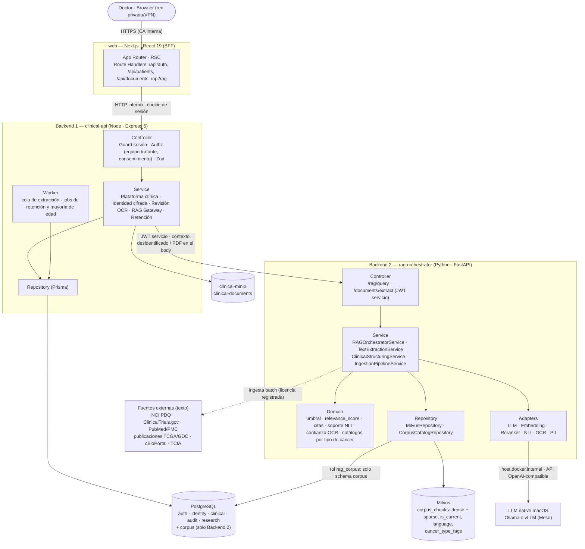
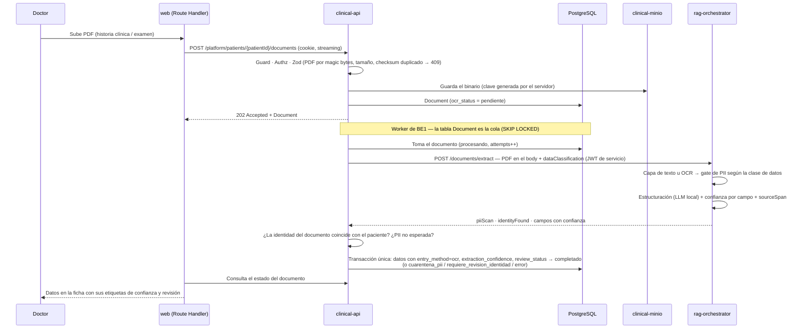
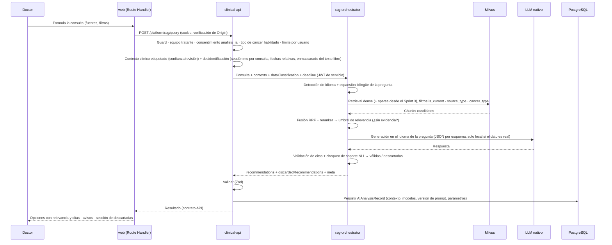
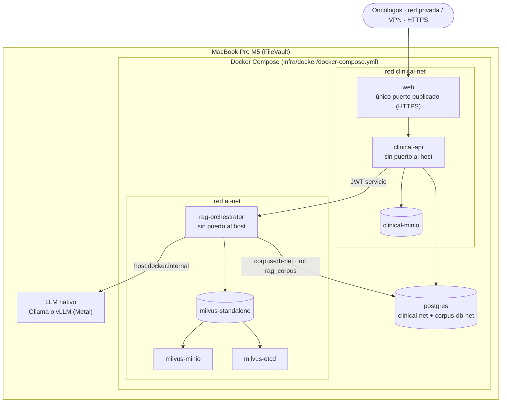
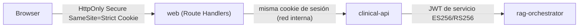
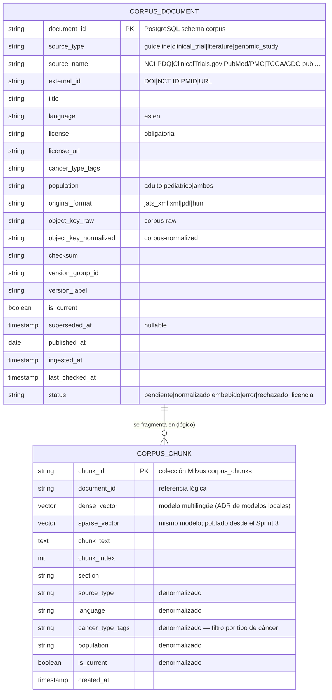

## Índice

0. [Ficha del proyecto](#0-ficha-del-proyecto)
1. [Descripción general del producto](#1-descripción-general-del-producto)
2. [Arquitectura del sistema](#2-arquitectura-del-sistema)
3. [Modelo de datos](#3-modelo-de-datos)
4. [Especificación de la API](#4-especificación-de-la-api)
5. [Historias de usuario](#5-historias-de-usuario)
6. [Tickets de trabajo](#6-tickets-de-trabajo)
7. [Pull requests](#7-pull-requests)

> 📄 Los requisitos de producto (objetivos, requisitos funcionales, reglas de negocio, requisitos no funcionales, riesgos y trazabilidad) están en el **[PRD](docs/PRD.md)**.

---

## 0. Ficha del Proyecto

### **0.1. Mario Julian Bonilla Contreras**

### **0.2. OncoLens**

### **0.3. Descripción breve del proyecto:**

OncoLens es un **MVP académico** de apoyo a la decisión clínica en oncología, diseñado para evolucionar hacia una herramienta de apoyo clínico real. Conecta el perfil clínico y molecular de cada paciente con la evidencia científica publicada (guías, ensayos clínicos y publicaciones de investigación oncológica y genómica) mediante búsqueda semántica híbrida y multilingüe (español e inglés), contextualizada al paciente. En minutos, y no en horas de revisión manual, el oncólogo obtiene las opciones de tratamiento descritas en la evidencia más relevante, cada una con **citas verificables** y un indicador de **relevancia de la evidencia**. OncoLens **no** estima la probabilidad de éxito de un tratamiento ni reemplaza el juicio del oncólogo tratante.

### **0.4. URL del proyecto:**

No hay URL pública. El proyecto se ejecuta en local: Docker Compose más un servidor de LLM nativo, en una MacBook Pro M5 con 32 GB. El piloto con oncólogos se accede **solo por red privada o VPN, con HTTPS**; no se publica en internet.

### 0.5. URL o archivo comprimido del repositorio
Repo público
https://github.com/hatrickmario/OncoLens-Lab/

> ⚠️ Como el repositorio es público, **nunca** contiene datos reales: ni identificados ni anonimizados. En `data/` solo hay datos sintéticos y definiciones de datasets.

---

## 1. Descripción general del producto

> Describe en detalle los siguientes aspectos del producto:

### **1.1. Objetivo:**

> Propósito del producto. Qué valor aporta, qué soluciona, y para quién.

📄 Requisitos de producto completos: **[`docs/PRD.md`](docs/PRD.md)**. Incluye objetivos y métricas, no-objetivos, recorridos, requisitos funcionales FR-01 a FR-20, reglas de negocio, requisitos no funcionales, riesgos, TBD y trazabilidad.

OncoLens ayuda a oncólogos a reducir el tiempo de revisión manual de literatura científica y ensayos clínicos. Cruza automáticamente el perfil clínico y molecular de cada paciente con la evidencia publicada y presenta las opciones de tratamiento que esa evidencia describe, **con trazabilidad hacia la fuente exacta** que las sustenta.

- **Usuarios:** oncólogos (rol `doctor`) y administradores (rol `admin`). El piloto inicial es un grupo de **10 oncólogos**.
- **Alcance clínico del piloto:** **cáncer de mama y de próstata**. **Leucemia** se agrega como tercer tipo cuando cumpla su criterio de "listo" (§3.3 #22).
- **Posicionamiento:** MVP académico con potencial de apoyo clínico real. Toda salida lleva el aviso *"Recomendación generada por IA — requiere validación clínica del oncólogo tratante"* y la etiqueta *"Uso académico/investigación"*.

**No-objetivos de esta versión:**
- Estimar la probabilidad de éxito o el pronóstico de un tratamiento.
- Tomar decisiones clínicas autónomas.
- Reentrenar modelos (*fine-tuning*): "entrenamiento" en este proyecto significa **calibrar y evaluar**.
- Streaming de tokens del LLM al navegador.
- Despliegue en la nube o multi-institución.
- Histórico de investigación completo (modelo normalizado, desenlaces, análisis de grafos, exportación): alcance futuro. El MVP guarda solo un snapshot mínimo al egresar.
- Datos bioinformáticos crudos (TCGA/GDC, cBioPortal, TCIA): solo entran sus publicaciones y resúmenes.

### **1.2. Características y funcionalidades principales:**

> Enumera y describe las características y funcionalidades específicas que tiene el producto para satisfacer las necesidades identificadas.

1. **Registro y ciclo de vida del paciente:** alta con formulario manual o asistido por OCR, con confirmación del doctor; identificación por documento (cédula de ciudadanía, tarjeta de identidad, cédula de extranjería o pasaporte) y nombres, cifrados; episodios de atención con egreso y reactivación; consentimientos por eventos, incluidos los firmados por el representante legal de un menor.
2. **Ingesta de historia clínica y exámenes desde PDF**, con OCR local. Cada dato extraído lleva su **nivel de confianza** (alta, media o baja) y su **estado de revisión** (automático, requiere revisión, verificado, corregido, rechazado). El doctor puede abrir el documento de origen en el lugar exacto del valor.
3. **Pipeline de ingesta del corpus científico** (guías, ensayos, publicaciones) con licencia registrada por documento. Los datos del paciente **nunca se persisten** en la base vectorial ni forman parte del corpus: viajan desidentificados dentro de la consulta.
4. **Búsqueda híbrida multilingüe** (dense + sparse, español e inglés) con expansión bilingüe de la pregunta y reordenamiento (*reranker*).
5. **Orquestador RAG:** construcción de la consulta, inyección del contexto clínico desidentificado y etiquetado, generación en el idioma de la pregunta, validación de citas y **chequeo de soporte** de cada afirmación. Las recomendaciones sin soporte se descartan y se muestran aparte, solo para revisión.
6. **Consulta cruzada** entre la base relacional (historia clínica y biomarcadores) y la vectorial.
7. **Interfaz web** para el doctor: listado y búsqueda de pacientes, ficha, panel de IA, revisión de datos extraídos, historial de análisis y registro de la decisión de tratamiento.

### **1.3. Diseño y experiencia de usuario:**

> Proporciona imágenes y/o videotutorial mostrando la experiencia del usuario desde que aterriza en la aplicación, pasando por todas las funcionalidades principales.

**Mockups iniciales (borrador de baja fidelidad):** [Panel del doctor y Panel de interacción IA](https://claude.ai/artifact/3ohcMYbh9qkPsfqVGYc1eR)

- **Listado de pacientes:** búsqueda exacta por número de documento y por nombre dentro del equipo tratante; filtros por estado (activo o egresado); distintivo **"SINTÉTICO"** en los pacientes de prueba.
- **Panel del doctor:** ficha del paciente (identificación, diagnóstico con su sistema de estadificación, estado funcional con su escala), pestañas de resumen clínico y de exámenes y biomarcadores (semáforo normal / alterado / relevante / crítico, con unidad, rango de referencia y **origen** del dato). Contador de **datos pendientes de revisión** y acceso al documento de origen de cada valor.
- **Panel de interacción IA:** parámetros de consulta (fuentes: guías, ensayos, publicaciones; filtros sobre la información del paciente) y resultado: opciones de tratamiento con su **"Relevancia de la evidencia"** (nunca rotulada como "Evidencia" o "Confianza" a secas), justificación y citas. Las citas se muestran en su idioma original, con traducción automática opcional y etiquetada. Cada recomendación muestra un aviso si depende de datos pendientes de revisión, y hay una sección colapsada de **"Descartadas por falta de soporte — solo para revisión"**.

📌 Nota: son mockups ilustrativos de alcance funcional, no un diseño final. Se refinarán con Figma más adelante; esta sección se actualizará con esas capturas o el prototipo y, eventualmente, con un videotutorial de la UI real.

### **1.4. Instrucciones de instalación:**
> Documenta de manera precisa las instrucciones para instalar y poner en marcha el proyecto en local (librerías, backend, frontend, servidor, base de datos, migraciones y semillas de datos, etc.)

**Estructura (monorepo `apps/` + `packages/`, npm workspaces):** ver el detalle completo en 2.3.

**Prerrequisitos:**
- macOS en Apple Silicon (entorno de referencia: MacBook Pro M5, 32 GB). FileVault activo si se van a cargar datos reales.
- Docker y Docker Compose.
- Node.js LTS + npm (con soporte de workspaces).
- Python 3.x + pip.
- **Runtime de LLM nativo:** Ollama o vLLM, instalado en macOS **fuera de Docker**, porque Docker en macOS no expone la GPU (Metal) a los contenedores. La elección final se toma en el ADR de evaluación de modelos locales (ver "Decisiones de infraestructura de IA" más abajo).

**Pasos:**

1. Clonar el repositorio: `git clone https://github.com/hatrickmario/OncoLens-Lab.git`
2. Generar secretos y certificados locales (scripts en `scripts/`, nunca se versionan):
   - par de claves ES256 del JWT de servicio (la privada solo para `clinical-api`, la pública para `rag-orchestrator`);
   - claves de cifrado de identidad y de índice ciego (HMAC), solo para `clinical-api` (§2.5);
   - roles de PostgreSQL: el de `clinical-api`, el de solo inserción de `research` y `rag_corpus` (solo el schema `corpus`), más el `pg_hba.conf` que restringe `rag_corpus` a `corpus-db-net`;
   - certificados TLS de PostgreSQL y certificado HTTPS de `web` emitido por una CA interna;
   - credenciales de los dos MinIO: `clinical-minio` (solo `clinical-api`) y el MinIO de Milvus (solo corpus).
3. Configurar variables de entorno (`.env`) por app: conexiones, `LLM_BASE_URL` y `LLM_MODEL` (API compatible con OpenAI del runtime nativo), `LLM_CLOUD_ENABLED=false`, `ENABLED_CANCER_TYPES=mama,prostata`, `REAL_ANONYMIZED_ENABLED=false`, `REAL_IDENTIFIED_ENABLED=false`, plazos de retención y parámetros de sesión (§2.5).
4. Arrancar el LLM nativo (p. ej., `ollama serve`) y descargar los modelos fijados en el ADR de modelos locales (ver "Decisiones de infraestructura de IA"). Los modelos de *embeddings*, *reranker* y NLI se descargan para `rag-orchestrator`, que los ejecuta en CPU.
5. Levantar la infraestructura y las apps: `docker compose -f infra/docker/docker-compose.yml up -d` (PostgreSQL, `clinical-minio`, Milvus con etcd y su MinIO, `clinical-api`, `rag-orchestrator`, `web`).
6. **Backend de plataforma** (`apps/clinical-api/`), para desarrollo fuera de Compose:
   ```
   npm install
   npx prisma migrate dev
   npx prisma db seed        # solo datos sintéticos; se niega a correr en el entorno "piloto"
   npm run dev
   ```
7. **Servicio RAG** (`apps/rag-orchestrator/`):
   ```
   pip install -r requirements.txt
   uvicorn app.main:app --reload   # ajustar el módulo de entrada según se defina
   python -m app.scripts.load_seed_corpus   # corpus semilla (mama y próstata)
   ```
8. **Frontend** (`apps/web/`):
   ```
   npm install
   npm run dev
   ```
9. Antes de habilitar datos reales: `oncolens preflight real-data` verifica los prerrequisitos del gate G-piloto (§2.5). `clinical-api` no arranca con una bandera de datos reales en `true` si alguno falla.

**Decisiones de infraestructura de IA:**
- **OCR:** local; los documentos no salen a la nube. Primero se extrae la capa de texto digital del PDF (sin OCR); las páginas escaneadas pasan por OCR (candidatos: Tesseract `spa+eng` o PaddleOCR). La estructuración la hace el mismo LLM local con salida JSON restringida por esquema. Descartado el vision-LLM directo: memoria, latencia sin GPU en Docker y falta de confianza por campo.
- **LLM y *embeddings*:** configurable, **local por defecto**. La nube solo se permite para pruebas con datos **sintéticos**; los datos reales nunca salen a un proveedor externo, regla que aplica el código.
- **Modelos concretos** (LLM, *embeddings* multilingües, *reranker*, NLI, motor de OCR): se eligen en el **ADR de evaluación de modelos locales**, al inicio del Sprint 1, midiendo con el stack completo levantado:
  - **Restricciones duras:** memoria total ≤ 24 GB (dejando ≥ 8 GB para macOS); `/platform/rag/query` con p95 ≤ 15 s; extracción con p95 ≤ 60 s por documento; licencia compatible con uso académico; buen desempeño en español; salida JSON válida ≥ 99%; uso real de la GPU de la M5 (verificar el soporte de vLLM en Apple Silicon).
  - **Candidatos:** runtime Ollama o vLLM; LLM *instruct* de 7–8B multilingüe cuantizado a 4 bits (un modelo de ~14B solo si cumple las restricciones y mejora las métricas de forma medible); *embeddings* BGE-M3 (dense + sparse) o multilingual-e5-large; *reranker* bge-reranker-v2-m3; NLI multilingüe de la familia mDeBERTa-v3 (XNLI); OCR Tesseract o PaddleOCR. Las versiones se fijan en la fecha de ejecución.
  - **Método:** correr la suite de evaluación (OL-06) y el protocolo de latencia y memoria (3 corridas, mediana); descartar los que no cumplen las restricciones; elegir por la métrica principal de cada componente (en empate, el de menor memoria); fijar las versiones en la configuración.

---

## 2. Arquitectura del Sistema

### **2.1. Diagrama de arquitectura:**
> Usa el formato que consideres más adecuado para representar los componentes principales de la aplicación y las tecnologías utilizadas. Explica si sigue algún patrón predefinido, justifica por qué se ha elegido esta arquitectura, y destaca los beneficios principales que aportan al proyecto y justifican su uso, así como sacrificios o déficits que implica.

**Patrón:** BFF (*Backend for Frontend*, los Route Handlers de `web`) + **servicio de plataforma clínica** (Backend 1, que también actúa de gateway de IA) + **servicio especializado de IA** (Backend 2). Los backends se organizan en capas **Controller → Service → Repository**; en Backend 2, las integraciones con modelos (LLM, *embeddings*, *reranker*, NLI, OCR) se implementan como **Adapters**. Hay **bounded contexts** explícitos y una regla de ownership estricta:

- **Backend 1 (`clinical-api`)** posee el registro clínico: identidad (cifrada), autorización, historia clínica, exámenes, biomarcadores, documentos clínicos, historial de análisis, consentimientos, retención y auditoría. Es dueño exclusivo de **PostgreSQL** y de **`clinical-minio`** (almacén de documentos clínicos).
- **Backend 2 (`rag-orchestrator`)** posee el análisis asistido por IA: recuperación, generación, validación y extracción de documentos. Es dueño de **Milvus**, del **catálogo del corpus** (schema `corpus` de PostgreSQL) y de los buckets del corpus. **No tiene acceso a los datos clínicos:** en PostgreSQL usa un rol limitado al schema `corpus` (red dedicada, `pg_hba` restringido, tests de acceso denegado) y no tiene credenciales ni red hacia `clinical-minio`. Procesa documentos clínicos **de forma transitoria, en memoria**, sin persistirlos, y en `/rag/query` recibe solo un contexto desidentificado.
- **LLM nativo** (Ollama o vLLM, fuera de Docker, con GPU Metal): lo consume solo Backend 2, mediante una API compatible con OpenAI.

**Por qué esta arquitectura:**
- El navegador **solo habla con `web`**. Los Route Handlers centralizan el acceso a `clinical-api`, que no publica puerto al host.
- Node/Express es la herramienta correcta para CRUD tipado, autenticación y la API de plataforma; Python/FastAPI, para el ecosistema RAG/ML.
- Aislar el servicio de IA de las bases clínicas reduce el radio de impacto de una vulnerabilidad en la capa más expuesta a entradas no confiables (documentos, corpus, salida del LLM).

**Sacrificios / déficits:**
- Mayor complejidad operativa: 2 runtimes, 2 lenguajes, autenticación servicio a servicio, un salto de red adicional en cada consulta RAG y un componente fuera de Docker (el LLM nativo).
- Riesgo de consistencia eventual: Backend 2 calcula el resultado del análisis, pero lo persiste Backend 1. Se mitiga respondiendo solo después de persistir (OL-03).
- Requiere disciplina de *contract testing* entre Node y Python para evitar *drift* entre sus specs OpenAPI.
- Hardware limitado (32 GB compartidos): concurrencia de inferencia acotada (1–2 simultáneas) y modelos de 7–8B elegidos por medición (ADR de modelos locales, 1.4).

📐 Diagramas C4 completos (contexto, contenedores, componentes y código): **[`docs/OncoLens-C4.drawio`](docs/OncoLens-C4.drawio)** (se abre con [draw.io](https://app.diagrams.net)).



**Flujo 1 — Carga de documento clínico (OCR):**



**Flujo 2 — Consulta RAG:**

> La consulta RAG se implementa con un **Route Handler** de Next.js (`app/api/rag/route.ts`), no con una Server Action: es un proxy HTTP explícito hacia `clinical-api`, controla los status codes y deja abierta la opción de streaming de progreso.
>
> **Decisión sobre streaming:** **nunca se transmiten al navegador tokens del LLM sin validar.** Backend 2 valida citas y soporte sobre la respuesta completa, y Backend 1 persiste el `AIAnalysisRecord` antes de responder. En el Sprint 1 la respuesta es un JSON completo (contrato de 4.1). 🚧 **Pendiente — ADR tras medir el p95 del Sprint 1 (KR2):** si la latencia afecta la experiencia, se agrega streaming de **eventos de progreso** vía SSE (recuperando evidencia → generando → validando), nunca de contenido.



### **2.2. Descripción de componentes principales:**

> Describe los componentes más importantes, incluyendo la tecnología utilizada

| Componente | Tecnología | Responsabilidad |
|---|---|---|
| **web** (Frontend + BFF) | React 19, Next.js (App Router, RSC, Route Handlers, Server Actions), TypeScript, Tailwind CSS v4, shadcn/ui | UI del doctor y **único punto de entrada del navegador**. Route Handlers como proxy de todos los endpoints de `clinical-api` (cookie `SameSite=Strict` + verificación de `Origin`). Sin streaming de tokens sin validar. |
| **Backend 1 — `clinical-api`** | Node.js LTS, Express 5, TypeScript, Zod, Prisma, OpenAPI/Swagger UI | Autenticación y autorización (RBAC + equipo tratante + consentimientos), identidad cifrada con índice ciego, pacientes, episodios, documentos, revisión de datos extraídos, gateway RAG, persistencia de análisis, retención y auditoría. *Worker* de extracción y *jobs* de retención y mayoría de edad. Dueño exclusivo de PostgreSQL y `clinical-minio`. |
| **PostgreSQL** | PostgreSQL | Único motor relacional. Schemas `auth`, `identity`, `clinical`, `audit` y `research` (Backend 1) y `corpus` (catálogo del corpus, Backend 2, con rol propio y sin acceso a los demás schemas) (§3.1). |
| **clinical-minio** | MinIO | Binarios de los documentos clínicos (bucket `clinical-documents`). Instancia separada del MinIO de Milvus; solo `clinical-api` tiene credenciales y ruta de red. |
| **Backend 2 — `rag-orchestrator`** | Python, FastAPI, Pydantic, OpenAPI | Orquestador RAG (expansión bilingüe, recuperación híbrida, *reranker*, generación, validación de citas, chequeo NLI); extracción de documentos (capa de texto u OCR, gate de PII, estructuración con confianza por campo); ingesta del corpus con licencias. *Embeddings*, *reranker* y NLI corren en CPU dentro del contenedor. |
| **Milvus** | Milvus standalone (+ etcd + MinIO propio) | Chunks del corpus con vectores dense y sparse y metadatos de filtrado (`is_current`, `source_type`, `language`, `cancer_type_tags`). |
| **LLM nativo** | Ollama o vLLM en macOS (Metal), API compatible con OpenAI | Generación de respuestas, estructuración de documentos y expansión bilingüe. Modelo fijado por el ADR de modelos locales (1.4). La nube solo se usa con datos sintéticos. |

### **2.3. Descripción de alto nivel del proyecto y estructura de ficheros**

> Representa la estructura del proyecto y explica brevemente el propósito de las carpetas principales, así como si obedece a algún patrón o arquitectura específica.

Monorepo tipo `apps/` + `packages/` (npm workspaces). Dentro de cada app se aplica **Controller → Service → Repository**: agrupado por módulo de dominio en Backend 1, y con nomenclatura Hexagonal/Clean Architecture en Backend 2, que añade una capa **domain** para reglas puras y **Adapters** para las integraciones:

```
OncoLens/
├── apps/
│   ├── web/                              # Frontend + BFF — Next.js, React 19, App Router
│   │   ├── app/
│   │   │   ├── (dashboard)/               # Listado, ficha, panel de IA, revisión de datos extraídos
│   │   │   └── api/                       # Route Handlers: auth · patients · documents · rag (proxy hacia clinical-api)
│   │   └── components/                    # shadcn/ui + componentes propios (Atomic Design)
│   │
│   ├── clinical-api/                      # Backend 1 — Node.js LTS + Express 5
│   │   ├── src/
│   │   │   ├── modules/                   # users · patients · identity · episodes · consents · documents
│   │   │   │   │                          # clinical-data (revisión) · ai-analysis · treatments · retention · audit
│   │   │   │   │                          # cada módulo: *.controller.ts · *.service.ts · *.repository.ts · *.schema.ts (Zod)
│   │   │   ├── workers/                   # cola de extracción · job de retención · job de mayoría de edad
│   │   │   ├── middleware/                # auth · authorize · origin-check · rate-limit · error-handler
│   │   │   ├── infrastructure/            # prisma client, crypto (cifrado + HMAC), minio client, rag-orchestrator.client.ts
│   │   │   └── routes/
│   │   └── prisma/                        # schema.prisma, migraciones, seed (solo sintético)
│   │
│   └── rag-orchestrator/                  # Backend 2 — Python + FastAPI
│       ├── app/
│       │   ├── api/                       # routers: /rag/query, /documents/extract
│       │   ├── application/               # RAGOrchestratorService, TextExtractionService,
│       │   │                              # ClinicalStructuringService, IngestionPipelineService
│       │   ├── domain/                    # reglas puras: umbral, relevance_score, citas, soporte, confianza OCR,
│       │   │                              # catálogos versionados por tipo de cáncer, regla de proveedores
│       │   ├── infrastructure/
│       │   │   ├── milvus/                # MilvusRepository
│       │   │   ├── catalog/               # CorpusCatalogRepository (PostgreSQL, schema corpus) + migraciones Alembic
│       │   │   ├── embeddings/ · reranker/ · nli/ · ocr/ · pii/
│       │   │   └── llm/                   # LLMAdapter (local OpenAI-compatible; nube solo con datos sintéticos)
│       │   │                              # (sin acceso a schemas clínicos ni a clinical-minio)
│       │   └── schemas/                   # Pydantic
│       └── requirements.txt
│
├── packages/
│   └── api-contracts/                     # tipos y clientes generados de los OpenAPI de ambos backends
│
├── data/                                   # ⚠️ repo PÚBLICO: solo datos sintéticos y corpus público
│   ├── raw/ · normalized/                 # corpus externo público (con licencia registrada)
│   └── evaluation/                        # datasets SINTÉTICOS y definiciones; los datos reales anonimizados
│                                          # viven fuera del repo (volumen local cifrado, .gitignore)
│
├── docs/
│   ├── PRD.md                             # Product Requirements Document (requisitos, reglas, NFR, trazabilidad)
│   ├── OncoLens-C4.drawio                 # diagramas C4: contexto, contenedores, componentes y código
│   ├── architecture/adr/                  # ADRs pendientes: modelos locales, fuentes y licencias, evaluación RAG,
│   │                                      # scoring de evidencia clínica, streaming de progreso
│   ├── api/
│   └── rag/
│
├── specs/                                  # Spec-Driven Development (OpenSpec)
├── infra/docker/                           # docker-compose.yml, redes clinical-net / ai-net / corpus-db-net, pg_hba.conf, certs/
├── scripts/                                # claves, certificados, buckets, preflight real-data
├── .github/workflows/                      # CI: build, tests, validación OpenAPI, escaneo de secretos/PII
├── CLAUDE.md                               # reglas: Backend 2 solo el schema corpus (nunca datos clínicos) ni clinical-minio, sesión ≠ credencial de servicio,
│                                           # datos reales nunca a la nube ni al repo, identidad nunca fuera de clinical-api
└── package.json                            # workspaces: ["apps/*", "packages/*"] (npm)
```

### **2.4. Infraestructura y despliegue**

> Detalla la infraestructura del proyecto, incluyendo un diagrama en el formato que creas conveniente, y explica el proceso de despliegue que se sigue

Entorno local: **Docker Compose** en una MacBook Pro M5 (32 GB) y **un componente nativo** fuera de Compose, el LLM, para aprovechar la GPU. Milvus *standalone* requiere sus dependencias propias (`etcd` y `MinIO`). Los documentos clínicos viven en un **MinIO separado** (`clinical-minio`).



- **Puertos:** solo `web` publica un puerto, y solo en la interfaz de la red privada o VPN. `clinical-api` y `rag-orchestrator` no publican puertos al host.
- **Redes:** `clinical-net` (web, `clinical-api`, PostgreSQL, `clinical-minio`), `ai-net` (`clinical-api`, `rag-orchestrator`, Milvus) y `corpus-db-net` (solo `rag-orchestrator` y PostgreSQL). `rag-orchestrator` no tiene ruta hacia `clinical-minio`. En PostgreSQL, `pg_hba.conf` solo acepta al rol `rag_corpus` desde `corpus-db-net` (TLS + SCRAM), y ese rol no tiene permisos fuera del schema `corpus`.
- **Entornos:** `local` (desarrollo, solo datos sintéticos) y `piloto` (10 oncólogos; datos reales solo después del gate G-piloto, §2.5). No hay entorno cloud en esta versión.
- **Operación del piloto:** FileVault activo, *backups* cifrados fuera del equipo (rotación corta, coherente con la retención), prueba de restauración por sprint y apagado y arranque documentados.
- **Despliegue:** arrancar el LLM nativo y luego `docker compose -f infra/docker/docker-compose.yml up -d` (ver 1.4).

### **2.5. Seguridad**

> Enumera y describe las prácticas de seguridad principales que se han implementado en el proyecto, añadiendo ejemplos si procede

**Autenticación — dos mecanismos separados, nunca intercambiables:**



- **Sesión del doctor:** cookie `oncolens_session` `HttpOnly` + `Secure` + `SameSite=Strict` con un **token opaco** (no JWT), guardado solo como `token_hash` en `Session`.
  - Se rota al iniciar sesión.
  - Expira a las **8 h**, con cierre por **30 min** de inactividad.
  - **Bloqueo de 15 min tras 5 intentos fallidos**, por cuenta y por IP.
  - **Logout** con revocación.
  - Contraseñas con **Argon2id**.
  - Todos los valores son configurables.
  - Alta y baja de usuarios por un script de administración (CLI).
- **CSRF:** `SameSite=Strict` más verificación de la cabecera `Origin` en todos los Route Handlers que mutan.
- **Guard** en `clinical-api`: valida la sesión en cada request antes de enrutar.
- **Autorización:** RBAC (`Role`/`Permission`) para las *acciones*. **Equipo tratante** (`CareTeamMember`: varios doctores activos por paciente, uno principal) para decidir *sobre qué pacientes*. El rol `admin` ve todos.
- **Clases de datos:**
  - `sintetico`: identificación aleatoria y distintivo visible.
  - `real_anonimizado`: calibración y pruebas.
  - `real_identificado`: pacientes del piloto con documento y nombres, amparados en el contrato marco.
- **Identidad cifrada:**
  - Documento y nombres viven en el schema `identity`, cifrados en la aplicación con AES-256-GCM.
  - Un **índice ciego HMAC-SHA256** permite buscar el documento de forma exacta.
  - Las claves solo están en `clinical-api`.
  - La identidad **nunca** sale de `clinical-api` hacia el LLM, el histórico, los *logs* ni la auditoría. Solo la ve el doctor autorizado, y cada vista queda auditada.
  - Ver §3.3 #6.
- **Desidentificación hacia la IA:**
  - El contexto que va a Backend 2 lleva un `pseudoPatientId` **aleatorio por consulta** (nunca en el prompt) y fechas relativas.
  - El **texto libre** (pregunta y notas) se enmascara con un detector de PII, cuyos formatos son configurables sin asumir un país.
  - Esto aplica **siempre**, no "cuando sea necesario".
- **Gate de PII en documentos:**
  - En `sintetico` y `real_anonimizado`, cualquier PII lleva a `cuarentena_pii`.
  - En `real_identificado` se esperan la identidad del propio paciente (usada para verificar que el documento corresponde) y cualquier otra PII se enmascara.
- **Regla de proveedores:** Backend 1 envía `dataClassification` y Backend 2 **solo** usa modelos locales para datos reales, sin *fallback* a la nube. Hay un test que lo verifica.
- **Credencial de servicio** (Backend 1 → Backend 2): JWT con **firma asimétrica (ES256 o RS256)**.
  - Solo `clinical-api` tiene la clave privada.
  - Claims `iss = clinical-api`, `aud = rag-orchestrator` y `exp` corto, con el algoritmo fijado.
  - La sesión del doctor **nunca** viaja hasta Backend 2.
- **Aislamiento de Backend 2:** sin credenciales ni red hacia `clinical-minio`. En PostgreSQL solo usa el rol `rag_corpus`:
  - `USAGE` y DML solo sobre el schema `corpus`;
  - `REVOKE ALL` sobre `auth`, `identity`, `clinical`, `audit` y `research`, más `ALTER DEFAULT PRIVILEGES` para las tablas futuras;
  - `pg_hba` restringido a `corpus-db-net` con TLS;
  - `CONNECTION LIMIT` y *timeouts*;
  - tests de CI que verifican *permission denied* sobre todos los schemas clínicos.

  **Riesgo residual aceptado:** Backend 2 comparte servidor con los datos clínicos, así que un escalamiento de privilegios en PostgreSQL podría exponerlos. Se mitiga con los tests, el `preflight` y PostgreSQL actualizado. El PDF viaja en el cuerpo del request y Backend 2 no lo persiste ni lo registra en *logs*.
- **Schemas separados** en PostgreSQL: `auth`, `identity`, `clinical`, `audit`, `research` (rol de solo inserción) y `corpus` (rol `rag_corpus`, sin datos de pacientes).
- **Cifrado:** FileVault y volúmenes cifrados; TLS hacia PostgreSQL (`sslmode=require`); HTTPS con una CA interna hacia el navegador.
- **Validación de entrada** en cada borde: Zod en Backend 1, Pydantic en Backend 2. PDFs validados por *magic bytes* y duplicados por checksum.
- **Consentimientos por eventos** (`PatientConsent`):
  - `analisis_ia` requerido para consultar.
  - `investigacion` es **opt-out** bajo el contrato marco.
  - Pueden venir firmados por un **representante legal** en menores. Al cumplir la mayoría de edad, el paciente queda marcado "requiere ratificación".
- **Retención:**
  - Hasta 10 años desde la aceptación del contrato o la primera cita, renovación automática hasta 20.
  - Al vencer o con la **baja total** se borran la identidad, los representantes, el histórico y los PDFs, y el resto queda seudonimizado.
  - La **baja de investigación** borra solo el histórico.
  - No aplica a los datos anonimizados.
- **Gate G-piloto:** ningún dato real entra a la aplicación antes del Sprint 5. `REAL_ANONYMIZED_ENABLED` y `REAL_IDENTIFIED_ENABLED` exigen:
  - autorización por equipo tratante;
  - auditoría;
  - gate de PII;
  - regla de proveedores;
  - `clinical-minio` separado;
  - acceso por VPN con HTTPS;
  - *backups* cifrados;
  - convenio registrado;
  - retención activa;
  - para datos identificados, además: identidad cifrada y reglas para menores.

  `oncolens preflight real-data` lo verifica.
- **Trazabilidad:** cada análisis se persiste con las citas como **snapshot autocontenido**, el contexto enviado, los modelos, la versión del prompt y los parámetros (§3.2).
- **Rate limiting:** 6 consultas por minuto y 1 consulta en curso por usuario y paciente en Backend 1; semáforo de inferencia en Backend 2 (`429` con `Retry-After`). Todos los valores son configurables.
- **Repositorio público:** nunca contiene datos reales ni secretos; CI escanea secretos y PII.

### **2.6. Tests**

> Describe brevemente algunos de los tests realizados

| Servicio | Herramientas | Enfoque |
|---|---|---|
| Backend 1 (Node) | Vitest, Supertest, StrykerJS | Unitarios (services), integración de API, *mutation testing* sobre auth y autorización. Tests de seguridad: no-fuga de PII (incluida PII sembrada en texto libre), cifrado e índice ciego, CSRF y `Origin`, gate G-piloto, retención y bajas, clases de datos. |
| Backend 2 (Python) | Pytest, FastAPI TestClient | Unitarios de `domain/` (umbral, `relevance_score`, citas, soporte, confianza OCR, regla de proveedores) e integración de `/rag/query` y `/documents/extract`, con adapters falsos. |
| Frontend / E2E | Playwright | Flujos del doctor contra el stack de Compose con datos sintéticos: login → listado → ficha → consulta → tarjeta con cita; sin evidencia; carga → estado → datos etiquetados → documento de origen. |

**Contract testing:** se genera un cliente TypeScript tipado a partir del spec OpenAPI de Backend 2 y lo consume Backend 1; un cambio incompatible rompe el build. En CI se validan ambos specs.

**Evaluación de calidad de la IA (OL-06):** es un entregable desde el Sprint 1 (baseline) y es **obligatoria en cada PR que cambie un modelo, un prompt, un umbral o el corpus**.
- **Datasets:** preguntas en español e inglés por tipo de cáncer, preguntas sin evidencia, documentos de OCR de referencia y PII sembrada. En el repo solo hay datos sintéticos; los reales anonimizados se usan fuera del repo desde el Sprint 1–2.
- **Métricas iniciales:** recall@10 ≥ 0,80 (≥ 0,70 de español a inglés), MRR ≥ 0,60, fidelidad ≥ 0,90, precisión de citas ≥ 0,90, exactitud de "sin evidencia" ≥ 0,90, OCR por campo crítico ≥ 0,95 y sensibilidad de PII ≥ 0,95. Se ajustan con el baseline.
- **Validación clínica:** un oncólogo revisa una muestra; los reportes distinguen lo validado clínicamente de lo que no.

### **2.7. Observabilidad**

> Logs, métricas y monitoreo — cómo se diagnostica el sistema en ejecución, distinto de la trazabilidad *de negocio* ya cubierta en 2.5.

- **Logs estructurados (JSON)** en ambos backends, con un `traceId` propagado (`X-Trace-Id`). **Nunca** registran identidad, PHI, secretos ni URLs o contenidos de documentos; los pacientes se referencian por su UUID.
- **Métricas** (`/metrics`, formato Prometheus), desde el Sprint 1 para las de IA:
  - latencia por endpoint y tasa de error;
  - duración de expansión, recuperación, *rerank*, generación y chequeo NLI;
  - tokens por consulta y longitud de la cola de inferencia;
  - tiempo de OCR;
  - documentos en cuarentena y pendientes de revisión.
- **Health checks:** `/health` en ambos backends, usado por Docker Compose. `rag-orchestrator` además verifica el LLM nativo y responde `503 LOCAL_LLM_UNAVAILABLE` si no está.
- 🚧 **Pendiente — ADR futuro:** Prometheus + Grafana y *tracing* distribuido (OpenTelemetry).

---

## 3. Modelo de Datos

### **3.1. Diagrama del modelo de datos:**

> Recomendamos usar mermaid para el modelo de datos, y utilizar todos los parámetros que permite la sintaxis para dar el máximo detalle, por ejemplo las claves primarias y foráneas.

Hay dos modelos, alineados con la regla de ownership de la sección 2:
- el **relacional** (PostgreSQL + `clinical-minio`, propiedad exclusiva de Backend 1);
- el del **corpus científico** (Milvus + catálogo en el schema `corpus` de PostgreSQL + MinIO de Milvus, propiedad de Backend 2).

El proyecto usa **solo dos motores de base de datos: PostgreSQL y Milvus**.

No hay FKs reales entre ambos, solo referencias lógicas.

#### PostgreSQL — datos clínicos (Backend 1)

**Schemas:**
- `auth` → `User`, `Role`, `Permission`, `RolePermission`, `Session`
- `identity` → `PatientIdentity`, `LegalRepresentative` (cifrados)
- `clinical` → `Patient`, `CareEpisode`, `CareTeamMember`, `PatientConsent`, `IntakeDraft`, `Diagnosis`, `ClinicalNote`, `Exam`, `Biomarker`, `Document`, `Treatment`, `AIAnalysisRecord`, `ResearchSubjectMap`
- `audit` → `AuditLog`
- `research` → `EpisodeSnapshot`
- `corpus` → `CorpusDocument` y estado de ingesta: **propiedad de Backend 2**, que lo migra y accede con el rol `rag_corpus`. Prisma lo excluye. Ver el modelo del corpus más abajo.

```mermaid
erDiagram
    USER {
        uuid id PK
        string email UK
        string password_hash "Argon2id"
        string full_name
        uuid role_id FK
        boolean is_active
        int failed_login_count
        timestamp locked_until "nullable"
        timestamp created_at
        timestamp updated_at
    }
    ROLE {
        uuid id PK
        string name UK "doctor, admin"
        string description
    }
    PERMISSION {
        uuid id PK
        string code UK "patients:read, ai_analysis:create, ..."
        string description
    }
    ROLE_PERMISSION {
        uuid role_id PK "también FK"
        uuid permission_id PK "también FK"
    }
    SESSION {
        uuid id PK
        uuid user_id FK
        string token_hash UK
        timestamp expires_at "absoluto (8 h, configurable)"
        timestamp last_seen_at "inactividad (30 min, configurable)"
        string ip_address
        string user_agent
        boolean revoked
        timestamp created_at
    }
    PATIENT {
        uuid id PK "identificador interno usado por FKs y API"
        string data_origin "sintetico|real_anonimizado|real_identificado"
        string source_dataset
        string agreement_reference "convenio o contrato marco"
        int birth_year
        string sex
        string population "adulto|pediatrico (derivado)"
        string lifecycle_status "activo|egresado (derivado)"
        date retention_start "aceptación del contrato o primera cita"
        date retention_until "inicio + 10 años"
        date retention_max "inicio + 20 años"
        boolean requires_ratification "cumplió la mayoría de edad"
        timestamp created_at
    }
    PATIENT_IDENTITY {
        uuid patient_id PK "también FK — schema identity"
        string id_type "cedula_ciudadania|tarjeta_identidad|cedula_extranjeria|pasaporte|seudonimo|sintetico"
        string issuing_country "nullable"
        bytes national_id_ciphertext "AES-256-GCM"
        string national_id_hmac "índice ciego; UK con id_type+país"
        bytes full_name_ciphertext
        int key_version
    }
    LEGAL_REPRESENTATIVE {
        uuid id PK "schema identity"
        uuid patient_id FK
        string relationship "madre|padre|tutor_legal"
        string id_type
        bytes national_id_ciphertext
        string national_id_hmac
        bytes full_name_ciphertext
        timestamp signed_at
        date valid_from
        date valid_until "nullable"
    }
    CARE_EPISODE {
        uuid id PK
        uuid patient_id FK
        timestamp opened_at
        timestamp closed_at "nullable — un solo episodio abierto"
        string closure_reason "catálogo validado con el oncólogo"
        uuid opened_by FK
        uuid closed_by FK "tratante principal o admin"
    }
    CARE_TEAM_MEMBER {
        uuid id PK
        uuid patient_id FK
        uuid doctor_id FK
        string care_role "oncologo|cirujano|radiooncologo|otro"
        boolean is_primary "uno por paciente"
        boolean is_active
        timestamp assigned_at
        timestamp unassigned_at "nullable"
    }
    PATIENT_CONSENT {
        uuid id PK
        uuid patient_id FK
        string consent_type "analisis_ia|investigacion"
        string action "otorgado|revocado"
        string legal_basis "contrato_marco|consentimiento_individual"
        string contract_reference "nullable"
        string granted_by_role "paciente|representante_legal"
        uuid legal_representative_id FK "nullable"
        string document_version
        uuid recorded_by FK
        timestamp recorded_at
    }
    INTAKE_DRAFT {
        uuid id PK
        uuid document_id FK
        jsonb suggested_fields "con confianza por campo"
        string status "pendiente|confirmado|descartado|expirado"
        uuid created_by FK
        timestamp expires_at
    }
    DIAGNOSIS {
        uuid id PK
        uuid patient_id FK
        uuid episode_id FK
        uuid source_document_id FK "nullable"
        string entry_method "ocr|manual|manual_correction|seed"
        string cancer_type "catálogo, incluye subtipo"
        string staging_system "TNM_8|ISUP_grade_group|riesgo_LLA|..."
        string stage_value
        string performance_scale "ECOG|Karnofsky|Lansky"
        int performance_value
        date diagnosed_at
        boolean is_active "vigente vs. histórico"
        float extraction_score "nullable"
        string extraction_confidence "alta|media|baja|n_a"
        string review_status "auto_aceptado|requiere_revision|verificado|corregido|rechazado|reemplazado"
        uuid conflicts_with_id "nullable"
        uuid reviewed_by "nullable"
        timestamp reviewed_at "nullable"
        timestamp created_at
    }
    CLINICAL_NOTE {
        uuid id PK
        uuid patient_id FK
        uuid episode_id FK
        uuid source_document_id FK "nullable"
        uuid created_by FK
        string note_type "antecedente|comorbilidad|tratamiento_previo|alergia|antecedente_familiar|nota_libre"
        string entry_method
        text content
        date recorded_at
        boolean is_active
        string extraction_confidence
        string review_status
        timestamp created_at
    }
    EXAM {
        uuid id PK
        uuid patient_id FK
        uuid episode_id FK
        uuid source_document_id FK "nullable"
        string exam_type
        string source_lab "nullable"
        string entry_method
        date performed_at
        timestamp created_at
    }
    BIOMARKER {
        uuid id PK
        uuid exam_id FK
        string name "normalizado al catálogo"
        string value
        string unit "nullable"
        string reference_range "del propio documento"
        string result_type "cuantitativo|cualitativo"
        string clinical_significance "normal|alterado|relevante|crítico"
        string significance_source "documento|regla|inferido_ia"
        float extraction_score "nullable"
        string extraction_confidence
        string review_status
        uuid conflicts_with_id "nullable"
        jsonb source_span "página, bbox, offset"
        uuid reviewed_by "nullable"
        timestamp reviewed_at "nullable"
        timestamp created_at
    }
    DOCUMENT {
        uuid id PK
        uuid patient_id FK "nullable mientras es IntakeDraft"
        uuid episode_id FK "nullable"
        string document_type "historia_clinica|examen"
        string object_storage_key "clinical-minio"
        string checksum "SHA-256; único por paciente"
        string original_filename
        string mime_type
        string ocr_status "pendiente|procesando|completado|error|cuarentena_pii|requiere_revision_identidad"
        string pii_finding_types "nullable — sin valores"
        int attempts
        timestamp processing_started_at "nullable"
        uuid uploaded_by FK
        timestamp uploaded_at
        timestamp extracted_at "nullable"
    }
    TREATMENT {
        uuid id PK
        uuid patient_id FK
        uuid episode_id FK
        uuid based_on_analysis_id FK "nullable"
        uuid decided_by FK
        string description
        string status "activo|completado|suspendido"
        date started_at
        date ended_at "nullable"
        timestamp created_at
    }
    AI_ANALYSIS_RECORD {
        uuid id PK
        uuid patient_id FK
        uuid episode_id FK
        uuid requested_by FK
        string trace_id
        text query_text "enmascarado si tenía PII"
        string query_language
        string response_language
        jsonb sources_selected
        jsonb filters_applied
        jsonb recommendations "treatment, relevance_score, rationale, depends_on_unverified_data, cited_sources[snapshot]"
        jsonb discarded_recommendations "discard_reason, afirmaciones sin soporte"
        float top_relevance_score "nullable — null si no hubo evidencia"
        string status "con_evidencia|sin_evidencia|tipo_no_habilitado"
        jsonb clinical_context_snapshot "desidentificado, con etiquetas"
        string data_classification
        string llm_provider
        string llm_model
        string embedding_model
        string reranker_model
        string prompt_version
        jsonb retrieval_params
        timestamp created_at
    }
    RESEARCH_SUBJECT_MAP {
        uuid patient_id PK "también FK"
        uuid research_subject_id UK "aleatorio"
    }
    EPISODE_SNAPSHOT {
        uuid id PK "schema research — solo inserción"
        uuid research_subject_id
        int episode_seq
        int snapshot_schema_version
        jsonb snapshot "sin identidad, sin texto libre, fechas relativas"
        timestamp created_at
    }
    AUDIT_LOG {
        uuid id PK
        uuid user_id FK "nullable — acciones de sistema"
        string action
        string entity_type
        uuid entity_id "UUID, nunca identidad"
        jsonb metadata "sin PHI"
        string ip_address
        timestamp created_at
    }

    ROLE ||--o{ USER : "asignado a"
    ROLE ||--o{ ROLE_PERMISSION : tiene
    PERMISSION ||--o{ ROLE_PERMISSION : otorga
    USER ||--o{ SESSION : tiene
    PATIENT ||--|| PATIENT_IDENTITY : "identidad cifrada"
    PATIENT ||--o{ LEGAL_REPRESENTATIVE : "representado por (menor)"
    PATIENT ||--o{ CARE_EPISODE : tiene
    PATIENT ||--o{ CARE_TEAM_MEMBER : "atendido por"
    USER ||--o{ CARE_TEAM_MEMBER : "integra equipo"
    PATIENT ||--o{ PATIENT_CONSENT : registra
    LEGAL_REPRESENTATIVE |o--o{ PATIENT_CONSENT : firma
    PATIENT ||--o| RESEARCH_SUBJECT_MAP : "seudónimo de investigación"
    DOCUMENT ||--o| INTAKE_DRAFT : "origina (registro asistido)"
    PATIENT ||--o{ DIAGNOSIS : tiene
    PATIENT ||--o{ CLINICAL_NOTE : tiene
    PATIENT ||--o{ EXAM : tiene
    EXAM ||--o{ BIOMARKER : reporta
    PATIENT ||--o{ DOCUMENT : sube
    DOCUMENT |o--o{ DIAGNOSIS : "origina (OCR)"
    DOCUMENT |o--o{ CLINICAL_NOTE : "origina (OCR)"
    DOCUMENT |o--o{ EXAM : "origina (OCR)"
    CARE_EPISODE ||--o{ AI_ANALYSIS_RECORD : contiene
    CARE_EPISODE ||--o{ DOCUMENT : contiene
    PATIENT ||--o{ TREATMENT : recibe
    AI_ANALYSIS_RECORD |o--o{ TREATMENT : "puede originar"
    USER ||--o{ AI_ANALYSIS_RECORD : solicita
    USER |o--o{ AUDIT_LOG : genera
```



**Índices y restricciones clave:**
- `identity.patient_identity (id_type, issuing_country, national_id_hmac)`: único.
- `care_team_member (patient_id, doctor_id) WHERE is_active`: único; `(patient_id) WHERE is_active AND is_primary`: único.
- `care_episode (patient_id) WHERE closed_at IS NULL`: único.
- `document (patient_id, checksum)`: único; `document (ocr_status, uploaded_at)`.
- `diagnosis (patient_id, is_active)`; `clinical_note (patient_id, note_type, recorded_at)`; `exam (patient_id, performed_at)`.
- Índices por `review_status` para el contador de pendientes.
- `patient_consent (patient_id, consent_type, recorded_at DESC)`; `ai_analysis_record (patient_id, created_at)`; `patient (retention_until)`.
- FKs del schema `clinical` con `onDelete: Restrict`. El borrado solo lo ejecuta el proceso de retención o de baja total, que borra la identidad y seudonimiza.

#### Corpus científico — Milvus + schema `corpus` de PostgreSQL + MinIO de Milvus (Backend 2)

> Modelo lógico: Milvus no impone FKs. `CorpusDocument` vive en el schema `corpus` de PostgreSQL (catálogo con transacciones), migrado y accedido solo por Backend 2 con el rol `rag_corpus`; Milvus guarda solo los chunks.



**Aislamiento de almacenamiento:** `clinical-minio` (bucket `clinical-documents`) es una **instancia separada**, propiedad de Backend 1. El MinIO de Milvus guarda solo datos de Milvus y los buckets `corpus-raw` y `corpus-normalized`. Backend 2 no tiene credenciales ni red hacia `clinical-minio`.

### **3.2. Descripción de entidades principales:**

> Recuerda incluir el máximo detalle de cada entidad, como el nombre y tipo de cada atributo, descripción breve si procede, claves primarias y foráneas, relaciones y tipo de relación, restricciones (unique, not null…), etc.

*(Atributos, tipos, PK/FK y restricciones principales ya detallados en 3.1. Aquí se describen el propósito y las decisiones de cada entidad.)*

**PostgreSQL:**
- **User / Role / Permission / RolePermission:** RBAC completo. `User` guarda el hash Argon2id y el estado de bloqueo por intentos fallidos.
- **Session:** sesión persistida con token opaco (solo `token_hash`), revocable, con expiración absoluta y por inactividad.
- **Patient:** entidad clínica **sin datos personales**. Su `id` (UUID) es lo que usan las FKs, la API y los *logs*. Campos principales:
  - `data_origin`: clase de datos.
  - `source_dataset` y `agreement_reference`: origen y convenio.
  - `retention_*`: plazos.
  - `requires_ratification`: marca la mayoría de edad.
- **PatientIdentity (schema `identity`):** tipo y número de documento más nombres, **cifrados en la aplicación**, con un índice ciego HMAC para la búsqueda exacta. Los pacientes sintéticos usan el tipo `sintetico` y los anonimizados el tipo `seudonimo`, para que nunca colisionen con documentos reales.
- **LegalRepresentative (schema `identity`):** representante legal de un paciente menor, con los mismos datos cifrados. Es obligatorio para registrar a un paciente con tarjeta de identidad.
- **CareEpisode:** episodios de atención. El **egreso** cierra el episodio (lo ejecuta el tratante principal o un administrador) y la **reactivación** abre uno nuevo, conservando la historia.
- **CareTeamMember:** equipo tratante con varios doctores activos y uno principal. Es la base de la autorización por paciente.
- **PatientConsent:** eventos de consentimiento (`analisis_ia`, `investigacion`), con base legal, referencia del contrato y firmante (paciente o representante). El vigente es el último evento de cada tipo. Investigación es **opt-out** bajo el contrato marco, y la entidad médica puede marcar exclusiones en los datos de origen.
- **IntakeDraft:** borrador del registro asistido por OCR, con sugerencias y su confianza. El OCR nunca crea pacientes: el doctor confirma.
- **Diagnosis:** modelo **genérico por tipo de cáncer**. `staging_system` y `stage_value` cubren TNM (mama), grupo de grado ISUP (próstata) y grupos de riesgo (leucemia); `performance_scale` y `performance_value` cubren ECOG, Karnofsky y Lansky.
  - **Regla de vigencia por fecha:** un diagnóstico extraído con fecha anterior al vigente se guarda como histórico. Uno con fecha posterior, o sin fecha confiable, queda `requiere_revision` en conflicto con el vigente. El oncólogo lo confirma o lo descarta.
  - Un dato de OCR nunca reemplaza en silencio a uno verificado.
- **ClinicalNote / Exam / Biomarker:** datos clínicos con su procedencia.
  - `entry_method`: `ocr`, `manual`, `manual_correction` o `seed`.
  - **Dos etiquetas independientes:** `extraction_confidence` (alta, media o baja; se calcula con señales deterministas, nunca con la confianza que reporta el LLM) y `review_status`.
  - `Biomarker.significance_source` indica si el semáforo viene del documento, de una regla del catálogo o de una inferencia de IA. Una inferencia de IA tiene un tope de confianza `media` y siempre queda para revisión.
  - `source_span` permite abrir el PDF en el valor exacto.
  - Los datos `rechazado` o `reemplazado` no entran al RAG ni a la ficha.
- **Document:** metadatos del archivo. El binario está en `clinical-minio`. La tabla funciona como **cola de extracción** (`SKIP LOCKED`, `attempts`, `processing_started_at`). `checksum` detecta duplicados, y los estados `cuarentena_pii` y `requiere_revision_identidad` bloquean la persistencia de datos clínicos.
- **Treatment:** decisión clínica real, con un vínculo opcional al análisis que la originó (Sprint 4). No puede vincularse a una recomendación descartada.
- **AIAnalysisRecord:** snapshot inmutable de cada consulta.
  - Cada recomendación lleva su `relevance_score` (**relevancia de la evidencia recuperada**, calculada por el *reranker*; no mide solidez clínica ni probabilidad de éxito), sus citas como snapshot y un aviso si depende de datos no verificados.
  - `discarded_recommendations` conserva las recomendaciones descartadas por falta de soporte, solo para revisión.
  - `top_relevance_score` es `null` cuando no hubo evidencia.
  - `clinical_context_snapshot`, los modelos, la versión del prompt y `retrieval_params` hacen el análisis **reproducible**.
- **ResearchSubjectMap / EpisodeSnapshot:** histórico **mínimo** del MVP. Al egresar, y solo si no hay opt-out de investigación, se inserta un snapshot JSON versionado con un seudónimo propio, sin identidad, sin texto libre y con fechas relativas. El modelo normalizado, los desenlaces y el análisis de grafos son alcance futuro.
- **AuditLog:** accesos y acciones sobre datos clínicos e identidad (lectura de la ficha, consulta RAG, carga, apertura del documento de origen, revisión, consentimientos, bajas, renovaciones y borrados de retención), siempre sin PHI.

**Corpus:**
- **CorpusDocument (PostgreSQL, schema `corpus`):** catálogo con licencia obligatoria, idioma, tipo de cáncer, población y versionado. El versionado es **reanudable**: se inserta la versión nueva, se verifica y se cambia la vigencia en una transacción; un comando de reconciliación corrige Milvus si el proceso se corta.
- **CorpusChunk (Milvus):** unidad de recuperación con vectores dense y sparse del mismo modelo multilingüe y metadatos denormalizados para filtrar por vigencia, fuente, idioma, tipo de cáncer y población. La colección se crea con su **esquema final** desde el Sprint 1.

### **3.3. ADRs derivados del modelo de datos**

> Decisiones identificadas durante el diseño, cada una resuelta explícitamente. Se formalizan como ADRs individuales en `docs/architecture/adr/`.

1. **Granularidad de RBAC:** ✅ tablas `Role`, `Permission` y `RolePermission` completas.
2. **Asignación doctor–paciente:** ✅ **equipo tratante** con varios doctores activos y uno principal (`CareTeamMember`).
3. **Multi-tenancy:** ✅ no aplica (una institución).
4. **Retención y borrado:** ✅ **resuelto.**
   - Hasta 10 años desde la aceptación del contrato o la primera cita, renovación automática hasta 20.
   - Al vencer o con la baja total se borran la identidad, los representantes, el histórico y los PDFs, y el resto se seudonimiza.
   - La baja de investigación borra solo el histórico.
   - No aplica a los datos anonimizados.
   - Plazos configurables y un job diario auditado.
5. **Versionado del corpus:** ✅ se conserva el histórico, y la recuperación usa solo `is_current`. El catálogo vive en el schema `corpus` de PostgreSQL para tener transacciones (ver #17).
6. **Cifrado a nivel de columna:** ✅ como el piloto usa documento y nombres reales, la identidad se cifra **en la aplicación** (AES-256-GCM) en el schema `identity`, con un índice ciego HMAC para la búsqueda exacta. El resto de los datos clínicos se protege con cifrado de volumen y TLS.
   - **Descartados:** columnas en claro; `pgcrypto`, porque la clave viaja en las consultas; y solo cifrado de disco, porque no protege contra *dumps* ni *logs*.
7. **Scoring de evidencia clínica:** 🚧 **pendiente de ADR.** Mientras tanto, `relevance_score` mide la relevancia de la recuperación (ver #8), y un campo `clinical_evidence_score` queda reservado.
8. **Puntaje de relevancia:** ✅ `relevance_score` = puntaje del *reranker* multilingüe normalizado a [0,1] y versionado. Es `null` sin evidencia.
   - **Descartados:** similitud coseno bruta, puntaje RRF y puntaje autorreportado por el LLM.
9. **Origen de los datos semilla:** ✅ `entry_method = seed`, solo fuera del entorno piloto.
10. **Filtro por fuente, tipo de cáncer e idioma en Milvus:** ✅ metadatos denormalizados en `CorpusChunk`.
11. **Mecanismo asíncrono de extracción:** ✅ `Document` como cola.
12. **Diagnóstico extraído frente al vigente:** ✅ nunca se reemplaza automáticamente, con la regla de vigencia por fecha. El conflicto usa `review_status` y `conflicts_with_id`; `is_active` se reserva para distinguir vigente de histórico. Reglas a validar con el oncólogo.
13. **Alcance de `Treatment` y de los datos personales:** ✅ `Treatment` entra en el Sprint 4. No se modelan datos de contacto del paciente: la identidad se limita a documento y nombres.
14. **Clases de datos:** ✅ `sintetico`, `real_anonimizado` y `real_identificado`, con reglas distintas de PII, proveedores y retención.
15. **Confianza y revisión de datos de OCR:** ✅ dos ejes independientes. Todo dato entra al RAG etiquetado; los `rechazado` nunca entran.
16. **Almacén de documentos clínicos:** ✅ `clinical-minio` separado del MinIO de Milvus, con el binario enviado en el cuerpo del request a Backend 2.
    - **Descartados:** buckets compartidos con políticas, porque Milvus tiene credenciales administrativas; y URL prefirmada, porque exige una ruta de red desde Backend 2.
17. **Catálogo del corpus:** ✅ **schema `corpus` del PostgreSQL existente** (solo PostgreSQL y Milvus como motores), con el rol `rag_corpus` limitado a ese schema, red `corpus-db-net`, `pg_hba` restringido y tests de acceso denegado. Backend 2 no tiene acceso a los datos clínicos.
    - **Descartados:** SQLite, porque agrega otro motor; una colección de Milvus sin vectores, porque no tiene transacciones; un contenedor PostgreSQL extra, por su memoria y operación. Una *base de datos* separada en la misma instancia queda como endurecimiento opcional.
18. **Consentimientos:** ✅ por eventos, con opt-out de investigación bajo el contrato marco y firma del representante legal en menores. La mayoría de edad marca "requiere ratificación".
19. **Histórico de investigación:** ✅ mínimo en el MVP (`EpisodeSnapshot`); el completo es futuro.
20. **Episodios y egreso:** ✅ `CareEpisode`. El egreso lo ejecutan el tratante principal o un administrador, y la reactivación conserva la historia.
21. **Modelo de diagnóstico genérico:** ✅ `staging_system`, `stage_value`, `performance_scale` y `performance_value`, con catálogos por tipo de cáncer como datos versionados.
22. **Alcance por tipo de cáncer:** ✅ `ENABLED_CANCER_TYPES`: primero mama y próstata, y leucemia como tercer tipo. Criterio de "listo" para habilitar un tipo:
    - catálogo revisado por el oncólogo;
    - corpus con licencia;
    - dataset de evaluación que cumpla las metas;
    - documentos de laboratorio típicos cubiertos por la extracción.

---

## 4. Especificación de la API

> Si tu backend se comunica a través de API, describe los endpoints principales (máximo 3) en formato OpenAPI. Opcionalmente puedes añadir un ejemplo de petición y de respuesta para mayor claridad

Hay **dos superficies de API**, coherentes con la regla de ownership de la sección 2:
- la **pública** (`clinical-api`, cookie de sesión), que el navegador consume **siempre a través de los Route Handlers de `web`**;
- la **interna** (`rag-orchestrator`, JWT de servicio), consumida solo por `clinical-api`.

### **4.1. `clinical-api` (Backend 1) — API pública**

Se documentan los 3 endpoints más representativos: **carga de documento (OCR)**, **consulta RAG** y **ficha del paciente**.

```yaml
openapi: 3.0.3
info:
  title: OncoLens — Platform API (Backend 1 / clinical-api)
  version: "0.2.0"
  description: >
    API pública, accesible solo a través de los Route Handlers de web (clinical-api
    no publica puerto al host). Autenticación por cookie de sesión HttpOnly + Secure +
    SameSite=Strict (token opaco). Backend 2 nunca se expone al cliente.

servers:
  - url: http://clinical-api:3000   # red interna de Compose; el navegador usa https://<web>/api/*

security:
  - sessionCookie: []

components:
  securitySchemes:
    sessionCookie:
      type: apiKey
      in: cookie
      name: oncolens_session

  schemas:
    Document:
      type: object
      properties:
        id: { type: string, format: uuid }
        patientId: { type: string, format: uuid }
        documentType: { type: string, enum: [historia_clinica, examen] }
        originalFilename: { type: string }
        ocrStatus:
          type: string
          enum: [pendiente, procesando, completado, error, cuarentena_pii, requiere_revision_identidad]
        uploadedAt: { type: string, format: date-time }

    CitedSource:
      type: object
      properties:
        title: { type: string }
        sourceName: { type: string, example: "NCI PDQ" }
        externalId: { type: string, example: "NCT02296125" }
        language: { type: string, enum: [es, en] }
        chunkTextSnapshot: { type: string, description: "texto original de la fuente, sin traducir" }
        chunkId: { type: string, description: "referencia best-effort a CorpusChunk en Milvus" }

    Recommendation:
      type: object
      properties:
        treatment: { type: string }
        relevanceScore:
          type: number
          format: float
          example: 0.87
          description: >
            Relevancia de la evidencia recuperada (puntaje del reranker, normalizado a [0,1]).
            No mide la solidez clínica ni la probabilidad de éxito (§3.3 #7 y #8).
        rationale: { type: string, description: "en el idioma de la pregunta" }
        dependsOnUnverifiedData:
          type: boolean
          description: true si la recomendación se apoya en datos extraídos pendientes de revisión
        citedSources:
          type: array
          items: { $ref: "#/components/schemas/CitedSource" }

    DiscardedRecommendation:
      type: object
      description: Solo para revisión del oncólogo; no es una recomendación.
      properties:
        treatment: { type: string }
        rationale: { type: string }
        discardReason: { type: string, enum: [cita_invalida, afirmacion_sin_soporte, sin_citas] }
        unsupportedClaims: { type: array, items: { type: string } }

    AIAnalysisRecord:
      type: object
      properties:
        id: { type: string, format: uuid }
        traceId: { type: string }
        queryText: { type: string }
        queryLanguage: { type: string, enum: [es, en] }
        status: { type: string, enum: [con_evidencia, sin_evidencia, tipo_no_habilitado] }
        recommendations:
          type: array
          items: { $ref: "#/components/schemas/Recommendation" }
        discardedRecommendations:
          type: array
          items: { $ref: "#/components/schemas/DiscardedRecommendation" }
        topRelevanceScore:
          type: number
          format: float
          nullable: true
          description: "null cuando no se encontró evidencia"
        createdAt: { type: string, format: date-time }

    Provenance:
      type: object
      properties:
        entryMethod: { type: string, enum: [ocr, manual, manual_correction, seed] }
        extractionConfidence: { type: string, enum: [alta, media, baja, n_a] }
        reviewStatus: { type: string, enum: [auto_aceptado, requiere_revision, verificado, corregido] }
        sourceDocumentId: { type: string, format: uuid, nullable: true }

    Biomarker:
      type: object
      properties:
        id: { type: string, format: uuid }
        name: { type: string, example: "HER2" }
        value: { type: string, example: "3+ (IHQ)" }
        unit: { type: string, nullable: true }
        referenceRange: { type: string, nullable: true }
        resultType: { type: string, enum: [cuantitativo, cualitativo] }
        clinicalSignificance: { type: string, enum: [normal, alterado, relevante, crítico] }
        significanceSource: { type: string, enum: [documento, regla, inferido_ia] }
        examType: { type: string }
        performedAt: { type: string, format: date }
        provenance: { $ref: "#/components/schemas/Provenance" }

    PatientSummary:
      type: object
      properties:
        id: { type: string, format: uuid }
        identification:
          type: object
          description: Solo para el doctor autorizado; cada lectura se audita.
          properties:
            idType: { type: string, example: "cedula_ciudadania" }
            nationalId: { type: string }
            fullName: { type: string }
        dataOrigin: { type: string, enum: [sintetico, real_anonimizado, real_identificado] }
        lifecycleStatus: { type: string, enum: [activo, egresado] }
        birthYear: { type: integer }
        requiresRatification: { type: boolean }
        cancerTypeEnabled: { type: boolean, description: "false → fuera del alcance del piloto" }
        diagnosis:
          type: object
          nullable: true
          properties:
            cancerType: { type: string, example: "mama" }
            stagingSystem: { type: string, example: "TNM_8" }
            stageValue: { type: string, example: "IIA" }
            performanceScale: { type: string, example: "ECOG" }
            performanceValue: { type: integer, example: 1 }
            diagnosedAt: { type: string, format: date }
            provenance: { $ref: "#/components/schemas/Provenance" }
        recentBiomarkers:
          type: array
          description: último valor por biomarcador (serie completa en GET …/biomarkers?name=)
          items: { $ref: "#/components/schemas/Biomarker" }
        pendingReviewCount: { type: integer }

    Error:
      type: object
      properties:
        error: { type: string }
        message: { type: string }

paths:
  /platform/patients/{patientId}/documents:
    post:
      summary: Carga un documento clínico (PDF) para extracción
      description: >
        Flujo 1 (2.1). Valida la sesión, la pertenencia al equipo tratante (Sprint 5+), el PDF
        por magic bytes, el tamaño y los duplicados por checksum. Guarda el binario en
        clinical-minio y encola la extracción. Es asíncrono: retorna el Document con
        ocrStatus=pendiente.
      parameters:
        - name: patientId
          in: path
          required: true
          schema: { type: string, format: uuid }
      requestBody:
        required: true
        content:
          multipart/form-data:
            schema:
              type: object
              properties:
                file: { type: string, format: binary }
                documentType: { type: string, enum: [historia_clinica, examen] }
      responses:
        "202":
          description: Documento recibido, extracción en curso
          content:
            application/json:
              schema: { $ref: "#/components/schemas/Document" }
        "401": { description: Sesión ausente o expirada }
        "403":
          description: El doctor no pertenece al equipo tratante del paciente
          content:
            application/json:
              schema: { $ref: "#/components/schemas/Error" }
        "404": { description: Paciente no encontrado }
        "409":
          description: El mismo archivo ya fue cargado para este paciente (checksum)
          content:
            application/json:
              schema: { $ref: "#/components/schemas/Error" }
        "422":
          description: No es PDF (magic bytes), excede el tamaño máximo, documentType inválido, o el paciente está egresado
          content:
            application/json:
              schema: { $ref: "#/components/schemas/Error" }

  /platform/rag/query:
    post:
      summary: Ejecuta una consulta RAG sobre un paciente
      description: >
        Flujo 2 (2.1). Construye el contexto clínico etiquetado y desidentificado y lo
        reenvía a Backend 2. Persiste AIAnalysisRecord antes de responder (JSON completo,
        nunca tokens sin validar). Sin evidencia suficiente responde 200 con status
        sin_evidencia, recommendations vacío y topRelevanceScore null. Para un tipo de
        cáncer no habilitado responde 200 con status tipo_no_habilitado, sin invocar al LLM.
      requestBody:
        required: true
        content:
          application/json:
            schema:
              type: object
              required: [patientId, query, sourcesSelected]
              properties:
                patientId: { type: string, format: uuid }
                query: { type: string, maxLength: 2000 }
                sourcesSelected:
                  type: object
                  description: al menos una en true
                  properties:
                    guias: { type: boolean }
                    ensayos: { type: boolean }
                    publicaciones: { type: boolean }
                filtersApplied:
                  type: object
                  properties:
                    historiaCompleta: { type: boolean }
                    soloBiomarcadoresRelevantes: { type: boolean }
                    ultimosSeisMeses: { type: boolean }
                    antecedentesFamiliares: { type: boolean }
      parameters:
        - name: Idempotency-Key
          in: header
          required: false
          schema: { type: string }
      responses:
        "200":
          description: Resultado del análisis
          content:
            application/json:
              schema: { $ref: "#/components/schemas/AIAnalysisRecord" }
        "401": { description: Sesión ausente o expirada }
        "403":
          description: Sin pertenencia al equipo tratante, sin consentimiento analisis_ia vigente, o paciente egresado
          content:
            application/json:
              schema: { $ref: "#/components/schemas/Error" }
        "404": { description: Paciente no encontrado }
        "422":
          description: Body inválido (Zod)
          content:
            application/json:
              schema: { $ref: "#/components/schemas/Error" }
        "429":
          description: Límite de consultas por usuario, o cola de inferencia llena (Retry-After)
        "502":
          description: Error de comunicación con rag-orchestrator (sin detalles internos)
        "503":
          description: LLM local no disponible (los datos reales nunca se envían a la nube)
        "504":
          description: rag-orchestrator no respondió dentro del deadline

  /platform/patients/{patientId}:
    get:
      summary: Obtiene la ficha resumen del paciente
      description: >
        Alimenta el Panel del doctor (1.3). Requiere pertenecer al equipo tratante
        (Sprint 5+), salvo el rol admin. La identificación se descifra solo para esta
        respuesta y la lectura queda auditada.
      parameters:
        - name: patientId
          in: path
          required: true
          schema: { type: string, format: uuid }
      responses:
        "200":
          description: Ficha del paciente
          content:
            application/json:
              schema: { $ref: "#/components/schemas/PatientSummary" }
        "401": { description: Sesión ausente o expirada }
        "403":
          description: El doctor no pertenece al equipo tratante
          content:
            application/json:
              schema: { $ref: "#/components/schemas/Error" }
        "404": { description: Paciente no encontrado }
```

**Endpoints adicionales** (forman parte del spec completo en `docs/api/`, a generar desde el código):

| Método y ruta | Propósito | Sprint |
|---|---|---|
| `POST /platform/auth/login` · `POST /platform/auth/logout` | Sesión (HU-01) | 1 |
| `GET /platform/patients?status=&dataOrigin=&idType=&nationalId=&name=&page=` | Listado; búsqueda exacta por documento (índice ciego) y por nombre dentro del equipo tratante (HU-06) | 1 |
| `POST /platform/patients` | Registro manual o confirmado desde un borrador; `409` si la identificación existe; exige representante legal en menores (HU-07) | 1 / 2 |
| `POST /platform/intake-drafts` · `GET /platform/intake-drafts/{id}` | Registro asistido por OCR (HU-08) | 2 |
| `GET /platform/patients/{id}/documents` · `…/documents/{docId}` | Listado paginado y estado de los documentos | 2 |
| `GET /platform/patients/{id}/documents/{docId}/file` | Visor del documento de origen (*streaming*, auditado) | 2 |
| `GET /platform/patients/{id}/biomarkers?name=` · `…/clinical-notes` | Serie de un biomarcador y notas clínicas | 2 |
| `PATCH /platform/patients/{id}/clinical-data/{type}/{itemId}/review` | Verificar, corregir o rechazar un dato extraído (HU-09) | 3 |
| `GET /platform/patients/{id}/analyses` · `…/analyses/{analysisId}` | Historial de análisis (HU-11) | 4 |
| `POST/GET /platform/patients/{id}/treatments` | Decisión de tratamiento (HU-12) | 4 |
| `POST /platform/patients/{id}/episodes/current/close` · `POST …/episodes` | Egreso y reactivación (HU-13) | 4 |
| `POST /platform/patients/{id}/consents` · `POST …/withdrawals` | Consentimientos; bajas de investigación o total | 1 / 4 |
| `POST/DELETE /platform/patients/{id}/care-team` | Equipo tratante (HU-14) | 5 |

**Ejemplo — `POST /platform/rag/query`** (paciente sintético)

Petición:
```json
{
  "patientId": "6f1e2b2a-2a0e-4b8b-9a1a-3a2e6f1e2b2a",
  "query": "¿Qué tratamiento adyuvante tiene mayor evidencia para cáncer de mama HER2 positivo en estadio IIA?",
  "sourcesSelected": { "guias": true, "ensayos": true, "publicaciones": true },
  "filtersApplied": { "historiaCompleta": false, "soloBiomarcadoresRelevantes": true, "ultimosSeisMeses": true, "antecedentesFamiliares": false }
}
```

Respuesta (`200`):
```json
{
  "id": "b3d9f2a0-1c3e-4f9a-8b1a-9e2f0c3d9f2a",
  "traceId": "req_9a3f2c1b",
  "queryText": "¿Qué tratamiento adyuvante tiene mayor evidencia para cáncer de mama HER2 positivo en estadio IIA?",
  "queryLanguage": "es",
  "status": "con_evidencia",
  "recommendations": [
    {
      "treatment": "Quimioterapia combinada con terapia dirigida anti-HER2",
      "relevanceScore": 0.87,
      "rationale": "La evidencia recuperada describe el beneficio de agregar terapia anti-HER2 a la quimioterapia adyuvante en tumores HER2 positivos.",
      "dependsOnUnverifiedData": false,
      "citedSources": [
        { "title": "Breast Cancer Treatment (PDQ®)–Health Professional Version", "sourceName": "NCI PDQ", "externalId": "CDR0000062787", "language": "en", "chunkTextSnapshot": "...", "chunkId": "chunk_88231" }
      ]
    }
  ],
  "discardedRecommendations": [],
  "topRelevanceScore": 0.87,
  "createdAt": "2026-09-24T15:04:00Z"
}
```

> El ejemplo es ilustrativo: el texto y los identificadores de la cita muestran el formato, no contenido clínico validado. Los ejemplos no usan NCCN ni ESMO porque su licencia está pendiente.

### **4.2. `rag-orchestrator` (Backend 2) — API interna**

No se expone al navegador ni al host. Autenticación por **JWT de servicio** (`Authorization: Bearer <service-jwt>`). Tiene 2 endpoints; la ingesta del corpus reutiliza `TextExtractionService` en proceso y no aparece como endpoint.

Notas de diseño:
- `clinical-api` envía el contexto ya resuelto, filtrado, **etiquetado** (procedencia, confianza, revisión) y **desidentificado**, porque Backend 2 no accede a PostgreSQL.
- Para extraer, `clinical-api` envía el **PDF en el cuerpo** del request, porque Backend 2 no tiene credenciales ni red hacia `clinical-minio`.
- `dataClassification` le indica a Backend 2 que los datos reales **solo** se procesan con modelos locales.

```yaml
openapi: 3.0.3
info:
  title: OncoLens — RAG & AI Services API (Backend 2 / rag-orchestrator)
  version: "0.2.0"
  description: >
    API interna, alcanzable solo desde la red ai-net y solo por clinical-api (JWT de
    servicio). No persiste PHI. Procesa documentos clínicos de forma transitoria.
    En /rag/query recibe solo contexto desidentificado.

servers:
  - url: http://rag-orchestrator:8000

security:
  - serviceJwt: []

components:
  securitySchemes:
    serviceJwt:
      type: http
      scheme: bearer
      bearerFormat: JWT

  schemas:
    Provenance:
      type: object
      properties:
        entryMethod: { type: string }
        extractionConfidence: { type: string, enum: [alta, media, baja, n_a] }
        reviewStatus: { type: string, enum: [auto_aceptado, requiere_revision, verificado, corregido] }
        conflict: { type: boolean }

    ClinicalContext:
      type: object
      description: Desidentificado por clinical-api — sin identidad; fechas relativas; texto libre enmascarado.
      properties:
        pseudoPatientId: { type: string, description: "aleatorio por consulta; nunca en el prompt" }
        population: { type: string, enum: [adulto, pediatrico] }
        diagnosis:
          type: object
          properties:
            cancerType: { type: string }
            stagingSystem: { type: string }
            stageValue: { type: string }
            performanceScale: { type: string }
            performanceValue: { type: integer }
            monthsSinceDiagnosis: { type: integer }
            provenance: { $ref: "#/components/schemas/Provenance" }
        biomarkers:
          type: array
          items:
            type: object
            properties:
              name: { type: string }
              value: { type: string }
              resultType: { type: string }
              clinicalSignificance: { type: string }
              monthsAgo: { type: integer }
              provenance: { $ref: "#/components/schemas/Provenance" }
        clinicalNotes:
          type: array
          description: filtradas según filtersApplied y enmascaradas
          items:
            type: object
            properties:
              noteType: { type: string }
              content: { type: string }
              monthsAgo: { type: integer }
              provenance: { $ref: "#/components/schemas/Provenance" }

    RagQueryInternalRequest:
      type: object
      required: [traceId, query, sourcesSelected, clinicalContext, dataClassification]
      properties:
        traceId: { type: string }
        query: { type: string, description: "ya enmascarada" }
        sourcesSelected:
          type: object
          properties:
            guias: { type: boolean }
            ensayos: { type: boolean }
            publicaciones: { type: boolean }
        dataClassification: { type: string, enum: [sintetico, real_anonimizado, real_identificado] }
        clinicalContext: { $ref: "#/components/schemas/ClinicalContext" }

    RagQueryInternalResponse:
      type: object
      properties:
        status: { type: string, enum: [con_evidencia, sin_evidencia] }
        recommendations:
          type: array
          items:
            type: object
            properties:
              treatment: { type: string }
              relevanceScore: { type: number, format: float }
              rationale: { type: string }
              dependsOnUnverifiedData: { type: boolean }
              citedSources:
                type: array
                items:
                  type: object
                  properties:
                    title: { type: string }
                    sourceName: { type: string }
                    externalId: { type: string }
                    language: { type: string }
                    chunkTextSnapshot: { type: string }
                    chunkId: { type: string }
        discardedRecommendations:
          type: array
          items:
            type: object
            properties:
              treatment: { type: string }
              rationale: { type: string }
              discardReason: { type: string, enum: [cita_invalida, afirmacion_sin_soporte, sin_citas] }
              unsupportedClaims: { type: array, items: { type: string } }
        meta:
          type: object
          properties:
            queryLanguage: { type: string }
            responseLanguage: { type: string }
            llmProvider: { type: string }
            llmModel: { type: string }
            embeddingModel: { type: string }
            rerankerModel: { type: string }
            promptVersion: { type: string }
            retrievalParams: { type: object }

    ExtractedField:
      type: object
      properties:
        value: { type: string }
        extractionScore: { type: number, format: float }
        extractionConfidence: { type: string, enum: [alta, media, baja] }
        sourceSpan:
          type: object
          properties:
            page: { type: integer }
            bbox: { type: array, items: { type: number }, nullable: true }
            textOffset: { type: integer }

    DocumentExtractResponse:
      type: object
      properties:
        piiScan:
          type: object
          properties:
            clean: { type: boolean }
            findingTypes: { type: array, items: { type: string }, description: "tipos, nunca valores" }
        identityFound:
          type: object
          nullable: true
          description: solo para verificar que el documento pertenece al paciente
          properties:
            idType: { type: string }
            nationalId: { type: string }
        sourceLab: { type: string, nullable: true }
        extractedData:
          type: object
          description: solo las secciones que el documento contenía; cada campo es un ExtractedField
          properties:
            diagnosis: { type: object }
            clinicalNotes: { type: array, items: { type: object } }
            exam: { type: object }
            biomarkers:
              type: array
              items:
                type: object
                properties:
                  name: { $ref: "#/components/schemas/ExtractedField" }
                  value: { $ref: "#/components/schemas/ExtractedField" }
                  unit: { $ref: "#/components/schemas/ExtractedField" }
                  referenceRange: { $ref: "#/components/schemas/ExtractedField" }
                  resultType: { type: string }
                  clinicalSignificance: { type: string }
                  significanceSource: { type: string, enum: [documento, regla, inferido_ia] }

    Error:
      type: object
      properties:
        error: { type: string }
        message: { type: string }

paths:
  /rag/query:
    post:
      summary: Recuperación híbrida multilingüe + generación + validación
      description: >
        Invocado solo por clinical-api (Flujo 2). Expansión bilingüe, recuperación
        (dense; + sparse desde el Sprint 3) con filtros is_current, source_type y
        cancer_type; reranker; umbral de relevancia (sin evidencia → sin invocar al LLM);
        generación en el idioma de la pregunta; validación de citas y chequeo de soporte
        NLI. Las recomendaciones sin soporte se devuelven en discardedRecommendations.
        Si dataClassification es real, solo usa modelos locales.
      parameters:
        - name: X-Request-Deadline
          in: header
          required: false
          schema: { type: string, format: date-time }
      requestBody:
        required: true
        content:
          application/json:
            schema: { $ref: "#/components/schemas/RagQueryInternalRequest" }
      responses:
        "200":
          description: Resultado
          content:
            application/json:
              schema: { $ref: "#/components/schemas/RagQueryInternalResponse" }
        "401": { description: JWT de servicio inválido o ausente }
        "422": { description: Body inválido (Pydantic) }
        "429": { description: Cola de inferencia llena (Retry-After) }
        "503": { description: "LOCAL_LLM_UNAVAILABLE — nunca hay fallback a la nube con datos reales" }
        "504": { description: Deadline vencido; la generación se aborta }

  /documents/extract:
    post:
      summary: Extrae datos estructurados de un documento clínico
      description: >
        Invocado solo por clinical-api (Flujo 1). Primero la capa de texto; OCR solo en las
        páginas escaneadas; gate de PII según dataClassification; estructuración con el LLM
        local y confianza por campo (anclaje textual, dominio, consistencia). El PDF no se
        persiste ni se registra en logs. clinical-api valida y persiste.
      requestBody:
        required: true
        content:
          multipart/form-data:
            schema:
              type: object
              required: [file, traceId, documentType, dataClassification, mode]
              properties:
                file: { type: string, format: binary }
                traceId: { type: string }
                documentType: { type: string, enum: [historia_clinica, examen] }
                dataClassification: { type: string, enum: [sintetico, real_anonimizado, real_identificado] }
                mode: { type: string, enum: [registro, carga] }
      responses:
        "200":
          description: Datos extraídos (o piiScan.clean=false sin datos clínicos)
          content:
            application/json:
              schema: { $ref: "#/components/schemas/DocumentExtractResponse" }
        "401": { description: JWT de servicio inválido o ausente }
        "422": { description: Documento ilegible o formato no soportado }
        "503": { description: LLM local no disponible }
```

**Ejemplo — `POST /rag/query` (interno)**

Petición (sin `patientId` ni identidad; fechas relativas; datos etiquetados):
```json
{
  "traceId": "req_9a3f2c1b",
  "query": "¿Qué tratamiento adyuvante tiene mayor evidencia para cáncer de mama HER2 positivo en estadio IIA?",
  "sourcesSelected": { "guias": true, "ensayos": true, "publicaciones": true },
  "dataClassification": "sintetico",
  "clinicalContext": {
    "pseudoPatientId": "psd_Qx7mR2vK9aLw",
    "population": "adulto",
    "diagnosis": { "cancerType": "mama", "stagingSystem": "TNM_8", "stageValue": "IIA", "performanceScale": "ECOG", "performanceValue": 1, "monthsSinceDiagnosis": 1,
                   "provenance": { "entryMethod": "seed", "extractionConfidence": "n_a", "reviewStatus": "verificado", "conflict": false } },
    "biomarkers": [
      { "name": "HER2", "value": "3+ (IHQ)", "resultType": "cualitativo", "clinicalSignificance": "relevante", "monthsAgo": 1,
        "provenance": { "entryMethod": "ocr", "extractionConfidence": "alta", "reviewStatus": "auto_aceptado", "conflict": false } },
      { "name": "Receptor de estrógeno", "value": "Positivo (80%)", "resultType": "cualitativo", "clinicalSignificance": "relevante", "monthsAgo": 1,
        "provenance": { "entryMethod": "ocr", "extractionConfidence": "media", "reviewStatus": "requiere_revision", "conflict": false } }
    ],
    "clinicalNotes": []
  }
}
```

Respuesta (`200`): el mismo formato de `recommendations` y `discardedRecommendations` que recibe el doctor en 4.1, más el bloque `meta`, antes de que `clinical-api` lo envuelva en `AIAnalysisRecord` y lo persista.

---

## 5. Historias de Usuario

> Documenta 3 de las historias de usuario principales utilizadas durante el desarrollo, teniendo en cuenta las buenas prácticas de producto al respecto.

### 5.0. Slicing del alcance por sprints (roadmap de producto)

El proyecto crece como un *walking skeleton* iterativo e incremental: desde el Sprint 1 existe un recorrido **end-to-end real**, y cada sprint siguiente lo amplía.
- **Sprints 1–4:** operan **solo con datos sintéticos**.
- **Datos reales:** la calibración con datos reales anonimizados empieza desde el Sprint 1–2, siempre **fuera** de la aplicación y del repo. Los datos reales entran a la aplicación **solo después del Sprint 5 y del gate G-piloto**.
- **Alcance clínico:** mama y próstata; leucemia es el tercer tipo.

**Sprint 1 — Walking skeleton: demostrar el objetivo central de punta a punta**

*Objetivo (OKR):* demostrar que el sistema puede cruzar el perfil clínico de un paciente con la evidencia científica y presentar opciones de tratamiento citadas, de extremo a extremo.
- KR1: 100% de las historias del sprint (HU-01, HU-02, HU-03, HU-06, HU-07) pasan sus criterios de aceptación en demo.
- KR2 *(meta propuesta, a calibrar):* `/platform/rag/query` responde en ≤ 15 s (p95) con el corpus semilla. El valor medido decide el ADR de streaming de progreso.
- KR3: 100% de las recomendaciones mostradas incluyen al menos una cita de un chunk recuperado **y** superan el chequeo de soporte. Las descartadas nunca se muestran como recomendación.
- KR4: baseline de evaluación registrado (OL-06), con métricas de recuperación, generación y "sin evidencia" en español e inglés.

*Alcance incluido:*
- ADR de evaluación de modelos locales al inicio (1.4): runtime y LLM nativo, *embeddings* multilingües, *reranker*, NLI y presupuesto de memoria.
- Autenticación completa: login, logout, TTL, bloqueo y Argon2id.
- Listado y registro manual de pacientes sintéticos, con identidad cifrada e índice ciego desde el inicio.
- Ficha mínima y consulta RAG *dense* multilingüe con *reranker*, chequeo NLI y sección de descartadas.
- Corpus semilla de mama y próstata con licencias registradas.
- Modelo de diagnóstico genérico y catálogos por tipo de cáncer.
- BFF con CSRF.
- Migración inicial con el esquema completo de §3.1, para evitar migraciones de datos después.

*Fuera de alcance:* carga de documentos (Sprint 2), búsqueda *sparse* (Sprint 3), recomendaciones rankeadas (Sprint 4), autorización por equipo tratante (Sprint 5).

**Sprint 2 — Ingesta de documentos (OCR) y registro asistido**

*Objetivo (OKR):* eliminar la captura manual: el doctor sube el PDF que ya tiene.
- KR1: exactitud por campo crítico ≥ 95% y por campo no crítico ≥ 90% sobre el set de referencia (*metas propuestas*).
- KR2: tiempo de procesamiento de OCR ≤ 60 s por documento (p95).
- KR3: 100% de los documentos con `ocrStatus` consultable y 100% de los datos extraídos con su confianza y estado de revisión visibles.

*Alcance incluido:*
- Carga (HU-04), ficha con datos etiquetados y visor del documento de origen (HU-05), registro asistido por OCR (HU-08).
- Gate de PII, `clinical-minio` separado con el binario enviado en el cuerpo del request, checksum de duplicados y verificación de identidad del documento.
- Auditoría de accesos (adelantada) y regla de proveedores solo locales.

**Sprint 3 — Búsqueda híbrida, filtros y revisión de datos**

*Objetivo (OKR):* la búsqueda refleja exactamente lo que el doctor pide, y los datos extraídos se pueden corregir.
- KR1: recuperación híbrida multilingüe (dense + sparse + expansión bilingüe) en el 100% de las consultas, sin retroceso en las métricas del baseline.
- KR2: 100% de los filtros del panel conectados a datos reales, según su tabla de verdad.
- KR3: corpus de mama y próstata con ≥ 3 fuentes y ≥ 20 documentos por tipo, todos con licencia registrada.

*Alcance incluido:* revisión de datos extraídos (HU-09); enmascaramiento de las notas enviadas al LLM; ingesta del corpus como entregable.

**Sprint 4 — Recomendaciones rankeadas, trazabilidad y ciclo de vida**

*Objetivo (OKR):* el doctor compara alternativas, registra su decisión y gestiona el ciclo de vida del paciente.
- KR1: hasta 3 recomendaciones por consulta, cada una sobre el umbral y con soporte.
- KR2: historial de análisis consultable, con 0 citas no resolubles.
- KR3: egreso, reactivación y bajas funcionando, con el snapshot mínimo de investigación sujeto al opt-out.

*Alcance incluido:* HU-10 (rankeadas), HU-11 (historial), HU-12 (tratamiento), HU-13 (egreso, reactivación, bajas y opt-out).

**Sprint 5 — Autorización real y gate del piloto**

*Objetivo (OKR):* el sistema está listo para 10 oncólogos y datos reales.
- KR1: 100% de los endpoints de paciente validan la pertenencia al equipo tratante (tests de autorización).
- KR2: 0 análisis sobre pacientes sin consentimiento `analisis_ia` vigente.
- KR3: `oncolens preflight real-data` en verde. Recién entonces se habilitan los datos reales.

*Alcance incluido:*
- HU-14: equipo tratante.
- Consentimientos en todos los endpoints.
- Retención con su job diario y el job de mayoría de edad.
- Acceso por VPN con HTTPS de CA interna, *backups* cifrados y prueba de restauración.

**Sprint 6 — Observabilidad y hardening**

*Objetivo (OKR):* operable y auditable sin revisar el código.
- KR1: `/health` y `/metrics` en todos los servicios.
- KR2: 100% de las requests con `traceId` correlacionable.
- KR3: *mutation score* de StrykerJS ≥ 70% sobre auth, autorización y cifrado.

**Después del piloto inicial:** leucemia se agrega como tercer tipo cuando cumpla su criterio de "listo" (§3.3 #22), con el flujo de menores completo. El histórico de investigación completo es alcance futuro.

*Nota:* si el Sprint 6 no llega a ejecutarse, el piloto sigue siendo posible, porque los controles necesarios para datos reales están en los Sprints 2 y 5. Sin el Sprint 5, en cambio, el producto solo es demostrable con datos sintéticos.

### 5.1–5.5. Historias de Usuario (Sprint 1 y 2 — el corazón del producto)

> Se documentan 5 historias (no 3) por decisión explícita, cubriendo el walking skeleton de Sprint 1 (autenticación, ver paciente, consulta RAG) y el núcleo de Sprint 2 (carga e ingesta OCR). Las historias HU-06 a HU-14 se resumen en 5.6.

---

#### HU-01: Autenticación del doctor

**1. Declaración de la Historia (User Story)**
* **Como** doctor (usuario con rol `doctor` en el sistema, 3.1)
* **Quiero** iniciar y cerrar sesión con mi correo y contraseña
* **Para** acceder de forma segura al panel de pacientes, sin exponer datos clínicos a personas no autenticadas

**2. Contexto y Alcance (Context & Scope)**
* **Descripción:** primer paso de cualquier interacción con OncoLens. Crea la `Session` persistida (token opaco, 2.5) que el `Middleware`/Guard valida en cada request posterior (C4 Nivel 3, `docs/OncoLens-C4.drawio`).
* **Entidades afectadas:** `User`, `Session`, `Role`.
* **Parámetros (configurables):** sesión de 8 h, cierre por 30 min de inactividad, bloqueo de 15 min tras 5 intentos fallidos, contraseñas con Argon2id, rotación del token al iniciar sesión.
* **Restricciones:** el password nunca se guarda en claro (`password_hash`, Argon2id). El **bloqueo por intentos fallidos entra en esta historia**. El login pasa por el Route Handler de `web` (`/api/auth/login`), nunca directo a `clinical-api`.

**3. Criterios de Aceptación (Gherkin Format)**

*Escenario 1: Login exitoso*
* **Dado que** el doctor tiene una cuenta activa (`User.is_active = true`)
* **Cuando** envía su email y contraseña correctos a `POST /platform/auth/login`
* **Entonces** el sistema crea un registro en `Session` y responde con la cookie `oncolens_session` (`HttpOnly`, `Secure`, `SameSite=Strict`)
* **Y** el frontend redirige al listado de pacientes (HU-06)

*Escenario 2: Credenciales inválidas*
* **Dado que** el doctor ingresa un email registrado con una contraseña incorrecta
* **Cuando** envía el formulario de login
* **Entonces** el sistema responde `401` con un mensaje genérico (sin indicar si el email o el password fue el incorrecto, para no facilitar enumeración de usuarios)
* **Y** no se crea ningún registro en `Session`

*Escenario 3: Bloqueo por intentos fallidos*
* **Dado que** una cuenta acumuló 5 intentos fallidos
* **Cuando** se intenta un nuevo login, aun con la contraseña correcta, dentro de los 15 minutos siguientes
* **Entonces** el sistema responde con el mismo mensaje genérico, sin revelar el bloqueo, y no crea la `Session`

*Escenario 4: Cierre de sesión*
* **Dado que** el doctor tiene una sesión activa
* **Cuando** presiona "Cerrar sesión" (`POST /platform/auth/logout`)
* **Entonces** la `Session` queda `revoked = true` y cualquier request posterior con esa cookie responde `401`

**4. Datos de Entrada y Salida (I/O Schema)**
* **Inputs esperados:** `email` (string, formato email, requerido) · `password` (string, requerido)
* **Outputs esperados:** `200` + `Set-Cookie: oncolens_session` (éxito) · `401` + `{ "error": string, "message": string }` (fallo)

---

#### HU-02: Ver ficha resumen del paciente

**1. Declaración de la Historia (User Story)**
* **Como** doctor autenticado
* **Quiero** ver la ficha resumen de un paciente (datos básicos, diagnóstico vigente, biomarcadores recientes)
* **Para** tener el contexto clínico necesario antes de decidir qué preguntarle al asistente de IA

**2. Contexto y Alcance (Context & Scope)**
* **Descripción:** es el "Panel del doctor" del mockup (1.3), en su versión mínima de Sprint 1. Alimenta con contexto la consulta RAG de HU-03.
* **Entidades afectadas:** `Patient`, `PatientIdentity` (descifrada solo para esta respuesta), `Diagnosis`, `Biomarker`, `Exam`, `AuditLog`.
* **Restricciones:** en este sprint, **cualquier doctor autenticado puede ver cualquier paciente**. Es aceptable solo porque en los Sprints 1–4 hay únicamente datos sintéticos. La restricción por equipo tratante (`CareTeamMember`) se incorpora en el Sprint 5, antes de cualquier dato real. Cada lectura de la ficha queda auditada.

**3. Criterios de Aceptación (Gherkin Format)**

*Escenario 1: Ficha con datos disponibles*
* **Dado que** el doctor está autenticado
* **Y** existe un paciente con `patientId` válido y al menos un `Diagnosis` con `is_active = true`
* **Cuando** el doctor navega a la ficha del paciente
* **Entonces** el sistema muestra el tipo y número de documento y el nombre, el diagnóstico vigente (tipo de cáncer, sistema de estadificación y valor, escala funcional y valor) y los biomarcadores recientes (último valor por biomarcador) con su `clinicalSignificance`, unidad, rango y origen
* **Y** si el paciente es sintético, muestra el distintivo "SINTÉTICO"

*Escenario 2: Paciente inexistente*
* **Dado que** el doctor está autenticado
* **Cuando** solicita un `patientId` que no existe
* **Entonces** el sistema responde `404`
* **Y** el frontend muestra un estado vacío ("Paciente no encontrado") sin romper la navegación

**4. Datos de Entrada y Salida (I/O Schema)**
* **Inputs esperados:** `patientId` (uuid, path param, requerido)
* **Outputs esperados:** `200` + `PatientSummary` (schema de 4.1: `identification`, `dataOrigin`, `diagnosis`, `recentBiomarkers`, `pendingReviewCount`) · `404` + `{ "error": string, "message": string }`

---

#### HU-03: Realizar consulta RAG y recibir recomendación con evidencia citada

**1. Declaración de la Historia (User Story)**
* **Como** doctor autenticado, viendo la ficha de un paciente
* **Quiero** formular una pregunta clínica en lenguaje natural y recibir una recomendación de tratamiento respaldada por fuentes citadas
* **Para** apoyar mi decisión clínica con evidencia científica actualizada sin revisar manualmente guías y ensayos

**2. Contexto y Alcance (Context & Scope)**
* **Descripción:** el corazón del producto (Flujo 2, 2.1). En el Sprint 1 el corpus es un seed manual de mama y próstata, y la recuperación es **dense multilingüe con *reranker*** (sparse llega en el Sprint 3). La respuesta trae **una sola recomendación**; el array rankeado llega en el Sprint 4. La respuesta sale en el idioma de la pregunta.
* **Entidades afectadas:** `AIAnalysisRecord`, `CorpusChunk` (Milvus, vía `rag-orchestrator`), `AuditLog`.
* **Restricciones:** el sistema **nunca muestra como recomendación algo sin fuente citada o sin soporte en la evidencia**. Si no hay evidencia suficiente, lo dice explícitamente. Las recomendaciones que no superan el chequeo de soporte se muestran solo en la sección de descartadas.

**3. Criterios de Aceptación (Gherkin Format)**

*Escenario 1: Recomendación con evidencia*
* **Dado que** el doctor está viendo la ficha de un paciente con al menos un diagnóstico registrado
* **Y** el corpus semilla contiene evidencia relevante para la pregunta
* **Cuando** el doctor escribe su pregunta y presiona "Buscar tratamiento"
* **Entonces** el sistema muestra al menos 1 recomendación con su `relevanceScore`, rotulado como "Relevancia de la evidencia" (3.3 #8)
* **Y** al menos 1 fuente citada con nombre e identificador verificables (`sourceName`, `externalId`), en su idioma original

*Escenario 3: Recomendación descartada por falta de soporte*
* **Dado que** el LLM genera una recomendación cuya justificación contiene una afirmación clínica no respaldada por los chunks citados
* **Cuando** el doctor ejecuta la consulta
* **Entonces** esa recomendación no aparece entre las recomendaciones
* **Y** aparece en la sección colapsada "Descartadas por falta de soporte — solo para revisión", con la afirmación sin soporte resaltada

*Escenario 2: Sin evidencia suficiente*
* **Dado que** el corpus semilla no contiene evidencia relevante para la pregunta formulada
* **Cuando** el doctor ejecuta la consulta
* **Entonces** el sistema responde indicando explícitamente que no encontró evidencia suficiente
* **Y** no genera ninguna recomendación sin fuente respaldándola

**4. Datos de Entrada y Salida (I/O Schema)**
* **Inputs esperados:** `patientId` (uuid) · `query` (string, requerido, máx. 2000) · `sourcesSelected` (objeto, schema de 4.1; en el Sprint 1 solo el corpus semilla está disponible)
* **Outputs esperados:** `200` + `AIAnalysisRecord` (schema de 4.1; `recommendations` de longitud ≤ 1 en este sprint; `discardedRecommendations`) · "sin evidencia": `200` con `status: sin_evidencia`, `recommendations: []` y `topRelevanceScore: null` (sin código de error: es un resultado válido, no una falla)

---

#### HU-04: Cargar documento clínico (PDF) para extracción automática

**1. Declaración de la Historia (User Story)**
* **Como** doctor
* **Quiero** subir el PDF de la historia clínica o de un examen de un paciente
* **Para** que sus datos clínicos y biomarcadores se registren en el sistema sin tener que transcribirlos manualmente

**2. Contexto y Alcance (Context & Scope)**
* **Descripción:** dispara el Flujo 1 (2.1). `clinical-api` almacena el binario en `clinical-minio` (bucket `clinical-documents`) y delega la extracción a `rag-orchestrator` vía `POST /documents/extract`, con JWT interno y **el PDF en el cuerpo** del request (4.2). Proceso **asíncrono**: `Document.ocrStatus` transiciona `pendiente → procesando → completado | error | cuarentena_pii | requiere_revision_identidad`.
* **Entidades afectadas:** `Document`.
* **Restricciones:** solo se aceptan archivos PDF, verificados por contenido (*magic bytes*), no solo por extensión; tamaño máximo *(meta propuesta, a calibrar)* 20 MB. Un archivo idéntico (checksum) ya cargado para el paciente → `409`. En este sprint no hay validación de equipo tratante (ver HU-02; solo datos sintéticos).

**3. Criterios de Aceptación (Gherkin Format)**

*Escenario 1: Carga exitosa*
* **Dado que** el doctor está en la ficha del paciente
* **Cuando** sube un PDF válido con `documentType = examen`
* **Entonces** el sistema responde `202` con el `Document` creado en estado `pendiente`
* **Y** en un tiempo acorde al KR2 de Sprint 2, el estado pasa a `completado` con los datos ya reflejados en la ficha (ver HU-05)

*Escenario 2: Archivo con formato no soportado*
* **Dado que** el doctor intenta subir un archivo que no es PDF (ej. `.docx`)
* **Cuando** lo envía
* **Entonces** el sistema rechaza la carga con `422` antes de invocar a `rag-orchestrator`
* **Y** no se crea ningún registro en `Document`

*Escenario 3: PII inesperada en un documento sintético o anonimizado*
* **Dado que** un documento de un paciente `sintetico` o `real_anonimizado` contiene PII (p. ej., un número de documento)
* **Cuando** termina la extracción
* **Entonces** el documento queda en `cuarentena_pii`, con el tipo de hallazgo y sin el valor
* **Y** no se persiste ningún dato clínico derivado de él

**4. Datos de Entrada y Salida (I/O Schema)**
* **Inputs esperados:** `file` (binary, `multipart/form-data`, solo PDF) · `documentType` (enum: `historia_clinica`\|`examen`)
* **Outputs esperados:** `202` + `Document` (`id`, `ocrStatus: pendiente`, ...) · `409` (duplicado) · `422` + `{ "error": string, "message": string }`

---

#### HU-05: Ver biomarcadores extraídos automáticamente en la ficha del paciente

**1. Declaración de la Historia (User Story)**
* **Como** doctor
* **Quiero** ver los biomarcadores y datos clínicos que el sistema extrajo automáticamente de un documento cargado, reflejados en la ficha del paciente con su semáforo de severidad
* **Para** revisar rápidamente el estado del paciente sin abrir el PDF original

**2. Contexto y Alcance (Context & Scope)**
* **Descripción:** consume el resultado de HU-04 una vez `Document.ocrStatus = completado`. Puebla `Biomarker` (con `resultType`, `clinicalSignificance` y `significanceSource`, 3.2) y `ClinicalNote`/`Exam` con `entry_method = ocr`, cada dato con su **confianza de extracción** y su **estado de revisión**.
* **Entidades afectadas:** `Biomarker`, `Exam`, `ClinicalNote`, `Document`.
* **Restricciones:** todo dato con `entry_method = ocr` se muestra como tal, con su confianza (alta, media o baja) y su estado de revisión. Los datos entran al RAG **etiquetados**. La corrección en UI (HU-09) llega en el **Sprint 3**; en este sprint los datos extraídos son de solo lectura.

**3. Criterios de Aceptación (Gherkin Format)**

*Escenario 1: Extracción completada*
* **Dado que** un documento tipo `examen` terminó de procesarse (`ocrStatus = completado`)
* **Cuando** el doctor abre la ficha del paciente
* **Entonces** ve la tabla de biomarcadores actualizada, cada fila con su `clinicalSignificance` como badge de color (normal/alterado/relevante/crítico)
* **Y** cada fila muestra su confianza de extracción y su estado de revisión
* **Y** desde cada biomarcador puede abrir el PDF de origen en la página del valor, con el fragmento resaltado

*Escenario 3: Dato de baja confianza*
* **Dado que** un valor se extrajo con confianza `baja`, o su semáforo lo infirió la IA
* **Cuando** el doctor abre la ficha
* **Entonces** el dato aparece como "Pendiente de revisión" y suma al contador de pendientes
* **Y** si el doctor consulta al RAG, la recomendación que dependa de ese dato muestra el aviso correspondiente

*Escenario 2: Extracción fallida*
* **Dado que** el procesamiento de un documento falló (`ocrStatus = error`)
* **Cuando** el doctor abre la ficha del paciente
* **Entonces** no se muestra ningún biomarcador nuevo derivado de ese documento
* **Y** el sistema indica claramente que la extracción falló, invitando a reintentar la carga

**4. Datos de Entrada y Salida (I/O Schema)**
* **Inputs esperados:** `patientId` (uuid, path param) — la ficha hace **dos llamadas**: `GET /platform/patients/{patientId}` (mismo endpoint que HU-02) y `GET /platform/patients/{patientId}/documents` (listado paginado, 4.1 — endpoints adicionales)
* **Outputs esperados:** `200` + `PatientSummary` con `recentBiomarkers`, cada uno con `provenance` (`entryMethod`, `extractionConfidence`, `reviewStatus`, `sourceDocumentId`) · `200` + listado de documentos con su `ocrStatus` · visor: `GET …/documents/{docId}/file`

### 5.6. Historias HU-06 a HU-14 (resumen)

> Los criterios de aceptación completos, con el mismo formato que HU-01 a HU-05, se escriben al iniciar cada sprint.

| HU | Sprint | Historia | Criterios clave | API |
|---|---|---|---|---|
| HU-06 | 1 | Como doctor, quiero **buscar y listar pacientes** para llegar a su ficha. | Búsqueda exacta por tipo y número de documento (índice ciego); búsqueda por nombre dentro del equipo tratante; filtros activo/egresado; distintivo "SINTÉTICO". | `GET /platform/patients` |
| HU-07 | 1 | Como doctor, quiero **registrar un paciente** con un formulario mínimo. | Documento y nombres cifrados; `409` si la identificación existe; consentimientos (`analisis_ia`; investigación marcada por defecto como opt-out si hay contrato configurado); **representante legal obligatorio** para la tarjeta de identidad. | `POST /platform/patients` |
| HU-08 | 2 | Como doctor, quiero **registrar un paciente a partir de su PDF** con los datos sugeridos por el OCR. | El OCR nunca crea pacientes solo; campos con confianza media o baja resaltados; el doctor confirma. | `POST /platform/intake-drafts`, `POST /platform/patients` |
| HU-09 | 3 | Como doctor, quiero **verificar, corregir o rechazar** los datos extraídos. | La corrección crea una fila `manual_correction` y la original pasa a `reemplazado`; los rechazados no entran al RAG; diagnóstico en conflicto: confirmar o descartar (regla de fechas). | `PATCH …/clinical-data/{type}/{itemId}/review` |
| HU-10 | 4 | Como doctor, quiero **comparar hasta 3 opciones** ordenadas por relevancia. | Cada una sobre el umbral y con soporte; descartadas aparte. | `POST /platform/rag/query` |
| HU-11 | 4 | Como doctor, quiero **ver el historial de análisis** del paciente. | Citas desde el snapshot; contexto y modelos visibles. | `GET …/analyses` |
| HU-12 | 4 | Como doctor, quiero **registrar el tratamiento decidido**. | Vínculo opcional a un análisis (nunca a una recomendación descartada). | `POST/GET …/treatments` |
| HU-13 | 4 | Como tratante principal, quiero **egresar o reactivar** a un paciente y registrar sus **bajas**. | El egreso escribe el snapshot mínimo si no hay opt-out; la reactivación conserva la historia; baja de investigación o total (la total, con confirmación explícita). | `…/episodes/current/close`, `…/episodes`, `…/withdrawals`, `…/consents` |
| HU-14 | 5 | Como administrador, quiero **gestionar el equipo tratante** de cada paciente. | Varios doctores activos y uno principal; la autorización se valida en todos los endpoints de paciente. | `POST/DELETE …/care-team` |

---

## 6. Tickets de Trabajo

> Documenta 3 de los tickets de trabajo principales del desarrollo, uno de backend, uno de frontend, y uno de bases de datos. Da todo el detalle requerido para desarrollar la tarea de inicio a fin teniendo en cuenta las buenas prácticas al respecto. 

> Se documentan 6 tickets (no 3) por decisión explícita: el **top 6 de mayor impacto de los Sprints 1 y 2** (5.0), cubriendo los tres tipos pedidos (base de datos: OL-01; backend: OL-02, OL-03, OL-05 y OL-06; frontend: OL-04).

### 6.0. Selección y criterio de impacto

Un ticket tiene más impacto cuanto más (1) desbloquea el flujo central de 5.0 (login → ver paciente → preguntar → recibir tratamiento con evidencia), (2) materializa una regla arquitectónica no negociable de 2.1/2.5 que sería costoso corregir después, y (3) concentra riesgo técnico que conviene descubrir temprano.

| ID | Ticket | Tipo | Sprint | HU | Por qué está en el top 5 |
|---|---|---|---|---|---|
| OL-01 | Esquema PostgreSQL completo + migración + seed sintético | BD | 1 | HU-01…14 | Todo lo demás lee/escribe aquí; un error de modelado se paga después con migraciones sobre datos clínicos. |
| OL-02 | `rag-orchestrator`: `POST /rag/query` (dense multilingüe + *reranker* + LLM local + guard "sin evidencia" + chequeo NLI) + corpus semilla | Backend | 1 | HU-03 | Núcleo del producto y mayor riesgo técnico (calidad y latencia del RAG — KR2 y KR3 de Sprint 1). |
| OL-03 | `clinical-api`: RAG Gateway `POST /platform/rag/query` (contexto etiquetado y desidentificado, JWT de servicio, persistencia de `AIAnalysisRecord`) | Backend | 1 | HU-03 | Hace cumplir en código las reglas más críticas: ownership de datos, *Doctor session ≠ Service credential*, minimización/anonimización. |
| OL-04 | `web`: Panel de interacción IA + Route Handler `app/api/rag/route.ts` | Frontend | 1 | HU-03 | Es lo que el doctor ve y usa desde el Sprint 1 — sin esto el walking skeleton no es demostrable. |
| OL-05 | Carga de PDF + extracción asíncrona (OCR) end-to-end, con confianza por campo y gate de PII | Backend | 2 | HU-04, HU-05 | Entregable central del Sprint 2: elimina la captura manual de datos clínicos (OKR del Sprint 2). |
| OL-06 | Baseline de evaluación de calidad de la IA + suite de regresión | Backend / datos | 1 | HU-03 | Sin medición no se puede afirmar que el producto cumple su objetivo, ni proteger los cambios de modelo que decide el ADR de modelos locales. |

*Backlog de Sprint 1–2 no detallado aquí* (necesario, pero de solución estándar o de menor impacto diferencial): autenticación completa + Guard (HU-01), prerrequisito de OL-03, OL-04 y OL-05 · listado y registro manual de pacientes con identidad cifrada (HU-06, HU-07) · `GET /platform/patients/{patientId}` + Panel del doctor mínimo (HU-02) · Route Handlers de `web` para todos los endpoints + CSRF · registro asistido por OCR (HU-08) · ADR de modelos locales · `docker-compose.yml` base con healthchecks (2.4, 2.7) · generación de `packages/api-contracts` desde los dos OpenAPI (2.6) · UI de carga de documentos y de biomarcadores extraídos con semáforo (HU-04/HU-05, frontend).

**Definition of Done común** (aplica a los 6 tickets, además de sus criterios propios):
- PR revisado y mergeado a `main` con CI en verde: build, tests y validación de specs OpenAPI (`.github/workflows/`, 2.3).
- Si cambia un contrato: spec OpenAPI del servicio actualizado y `packages/api-contracts` regenerado (2.6).
- Ninguna regla de `CLAUDE.md` violada, en especial: `rag-orchestrator` sin acceso a los schemas clínicos de PostgreSQL (solo `corpus`) ni a `clinical-minio`; sesión del doctor ≠ credencial de servicio; la identidad nunca sale de `clinical-api`; los datos reales nunca van a la nube ni al repo.
- Si el PR cambia un modelo, un prompt, un umbral o el corpus: suite de evaluación (OL-06) ejecutada y resultados en el PR.
- Logs sin PHI, PII, identidad ni secretos (tokens, passwords, claves, contenido de documentos).
- Todo valor marcado *"propuesta, a calibrar"* vive en configuración (variables de entorno o constantes de `domain/`), no incrustado en la lógica.

### 6.1. Decisiones de diseño de los tickets

Decisiones tomadas al detallar los tickets, cada una con sus alternativas descartadas. Las de alta incertidumbre quedan como ADR. Todas están incorporadas en las secciones indicadas.

| # | Tema (ticket) | Decisión | Descartado | Estado | Reflejado en |
|---|---|---|---|---|---|
| 1 | `top_relevance_score` sin evidencia (OL-01) | Nullable (`null` = sin evidencia) | `0.0` (ambiguo); no persistir (pierde trazabilidad) | ✅ | 3.1, 3.3 #8, 4.1 |
| 2 | `entry_method` de los datos semilla (OL-01) | Valor `seed`, solo fuera del entorno piloto | `manual_correction` (contamina la auditoría); nulo; seed vía OCR | ✅ | 3.1, 3.2, 3.3 #9 |
| 3 | Alcance de `Treatment` y datos personales (OL-01) | `Treatment` en el Sprint 4; identidad limitada a documento y nombres, sin datos de contacto | Tratamiento fuera del MVP (sin cierre de trazabilidad); datos de contacto (PII sin valor para el objetivo) | ✅ | 3.2, 3.3 #13, 5.0 |
| 4 | Cálculo de `relevanceScore` (OL-02) | Puntaje del *reranker* normalizado a [0,1], rotulado "Relevancia de la evidencia" | Autorreportado por el LLM (no calibrado); similitud coseno bruta; puntaje RRF | ✅ + 🚧 **ADR** scoring de evidencia clínica | 1.3, 3.2, 3.3 #7 y #8, 4.1 |
| 5 | Filtros de recuperación en Milvus (OL-02) | Metadatos denormalizados en `CorpusChunk` (`source_type`, `cancer_type_tags`, `language`, `population`, `is_current`); colección con esquema final desde el Sprint 1 | Colección por fuente; búsqueda en dos pasos; particiones (prematuro) | ✅ | 3.1, 3.2, 3.3 #10 |
| 6 | Generación de `pseudoPatientId` (OL-03) | Aleatorio por consulta; nunca en el prompt del LLM | HMAC estable (vinculable); prefijo del UUID (filtra el id) | ✅ | 2.5, 4.2 |
| 7 | Algoritmo del JWT de servicio (OL-03) | Asimétrico (ES256/RS256), algoritmo fijado en el validador | HS256 compartido; mTLS (pesado en local); API key estática | ✅ | 2.5 |
| 8 | Streaming frente al contrato de 4.1 (OL-04) | JSON completo; **nunca tokens sin validar** | Streaming de tokens (muestra contenido que luego se descarta); polling | ✅ + 🚧 **ADR** streaming de progreso tras medir KR2 | 2.1, 2.2, 4.1, 5.0 |
| 9 | Mecanismo asíncrono de extracción (OL-05) | `Document` como cola (`SKIP LOCKED`, `attempts`, `processing_started_at`) | Tarea en memoria (se pierde al reiniciar); broker dedicado; síncrono | ✅ | 2.1 Flujo 1, 3.1, 3.2, 3.3 #11 |
| 10 | Diagnóstico extraído frente al vigente (OL-05) | Nunca se reemplaza automáticamente; la fecha decide si es histórico o pendiente de revisión (`review_status`, `conflicts_with_id`); el oncólogo confirma o descarta | Reemplazo automático; varios diagnósticos activos; marcarlo como inactivo (se confunde con histórico) | ✅ ⚠️ validar con el oncólogo | 3.2, 3.3 #12, HU-09 |
| 11 | Visibilidad de los datos extraídos en la ficha (OL-05) | `provenance` y `sourceDocumentId` por biomarcador + `GET …/documents` paginado | `documents[]` dentro de `PatientSummary` (crece sin límite) | ✅ | 4.1, 5.0, HU-05 |
| — | Modelos locales (bloqueo de OL-02) | ADR de modelos locales al inicio del Sprint 1 (runtime, LLM, *embeddings* multilingües, *reranker*, NLI, OCR), priorizando los *embeddings* (cambiarlos obliga a reindexar) | — | 🚧 **ADR** (1.4) | 1.4, 5.0 |

---

#### OL-01 · [BD] Esquema PostgreSQL completo (Prisma, schemas `auth`/`identity`/`clinical`/`audit`/`research`) + migración inicial + seed sintético

- **Tipo:** Base de datos · **Sprint:** 1 · **Servicio:** `clinical-api` (`apps/clinical-api/prisma/`) · **HU:** HU-01 a HU-14 · **Prioridad:** Crítica: bloquea OL-03, OL-05 y todo el backlog.

**Objetivo.** Materializar en PostgreSQL, vía Prisma, **el esquema completo de 3.1** con separación física de schemas (2.5), más datos semilla **sintéticos**, para que el *walking skeleton* sea demostrable sin OCR. Crear todo el esquema desde el inicio, aunque algunas tablas se usen en sprints posteriores, evita migraciones sobre datos clínicos más adelante. Es la misma lógica que el esquema final de la colección de Milvus.

**Alcance — incluye:**

| Schema | Tablas | Usada desde |
|---|---|---|
| `auth` | `User`, `Role`, `Permission`, `RolePermission`, `Session` | Sprint 1 |
| `identity` | `PatientIdentity`, `LegalRepresentative` | Sprint 1 (cifrado desde el inicio) |
| `clinical` | `Patient`, `CareEpisode`, `CareTeamMember`, `PatientConsent`, `IntakeDraft`, `Diagnosis`, `ClinicalNote`, `Exam`, `Biomarker`, `Document`, `Treatment`, `AIAnalysisRecord`, `ResearchSubjectMap` | Sprints 1–5 |
| `audit` | `AuditLog` | Sprint 2 |
| `research` | `EpisodeSnapshot` | Sprint 4 |

**Alcance — no incluye:** datos de contacto del paciente (§3.3 #13), ni las tablas del schema `corpus`, que migra Backend 2 (OL-02); este ticket sí crea el schema vacío, el rol `rag_corpus`, sus `REVOKE` y `ALTER DEFAULT PRIVILEGES`, y la regla de `pg_hba.conf`.

**Tareas técnicas:**
1. `schema.prisma`: datasource PostgreSQL con `schemas = ["auth", "identity", "clinical", "audit", "research"]` y `@@schema(...)` por modelo. Confirmar si la versión de Prisma requiere `previewFeatures` para el multi-schema.
2. Nomenclatura: `snake_case` en la BD (`@@map`/`@map`) y `camelCase` en el cliente.
3. Enums nativos para todos los enums de 3.1. Los valores con tilde se mapean (`critico @map("crítico")`). `entry_method` incluye `seed` y `manual`; `ocr_status` incluye `cuarentena_pii` y `requiere_revision_identidad`; `review_status` y `extraction_confidence` según §3.2.
4. Restricciones e índices de 3.1: índice ciego único en `identity.patient_identity`, índices parciales del equipo tratante y de episodios, `document (patient_id, checksum)` y demás. FKs del schema `clinical` con `onDelete: Restrict`.
5. `AIAnalysisRecord`: `recommendations`, `discarded_recommendations`, `clinical_context_snapshot`, `retrieval_params`, `sources_selected` y `filters_applied` como `jsonb`; `top_relevance_score` **nullable**; tabla inmutable (sin `updated_at`).
6. Roles de base de datos: el rol de `clinical-api` para los schemas operativos y un rol de **solo inserción** para `research`.
7. Migración inicial `npx prisma migrate dev --name init_full_schema`; `DATABASE_URL` con `sslmode=require` y certificados generados por el script de §1.4.
8. `prisma/seed.ts` idempotente, que se niega a correr en el entorno `piloto`:
   - todos los pacientes con `data_origin = sintetico`, `id_type = sintetico` y número aleatorio, con la identidad **cifrada con la misma librería de la aplicación**;
   - datos clínicos con `entry_method = seed` y `review_status = verificado`;
   - rol `doctor` y un usuario doctor, cuyo password se toma de una variable de entorno.
   - **Pacientes sintéticos:**
     - (a) mama HER2+ estadio IIA (`TNM_8`), ECOG 1, HER2 3+ y receptor de estrógeno positivo;
     - (b) próstata, grupo de grado ISUP 3, con PSA;
     - (c) paciente con un diagnóstico inactivo y uno activo (valida `is_active`);
     - (d) paciente sin consentimiento `analisis_ia` (para el `403` del Sprint 5).
   - Todos con consentimientos por eventos y un episodio abierto.

**Criterios de aceptación:**
- Dado un PostgreSQL vacío, al ejecutar `migrate` y `db seed` existen los 5 schemas con todas las tablas de 3.1, y el seed puede ejecutarse dos veces sin duplicar registros.
- Insertar una identidad con el mismo `id_type` + número falla por el índice ciego único. Borrar un `Patient` con `Diagnosis` asociado falla (`Restrict`).
- Ninguna columna de `identity` contiene el documento ni el nombre en claro (test que lee la tabla con SQL crudo).
- Un `AIAnalysisRecord` con `recommendations = []` se guarda con `top_relevance_score = null`.
- Ejecutar el seed en el entorno `piloto` aborta sin escribir datos.
- El rol de `research` no puede leer ni actualizar, solo insertar.
- Las credenciales de `clinical-api` no existen en la definición de servicio de `rag-orchestrator`, que solo tiene las de `rag_corpus` (regla 1 de `CLAUDE.md`). Con `rag_corpus`, `SELECT` sobre `auth`, `identity`, `clinical`, `audit` y `research` → *permission denied*.

**Dependencias:** servicio `postgres` en `infra/docker/docker-compose.yml` y los scripts de claves y certificados (1.4).
**Riesgos:** `sslmode=require` obliga a configurar certificados en el contenedor desde este ticket. La gestión de las claves de cifrado de identidad (generación y respaldo) debe quedar documentada: si se pierde la clave, se pierde la identidad.

**Decisiones aplicadas:** 6.1 #1–#3 y #9; además, identidad cifrada, equipo tratante, histórico mínimo, consentimientos por eventos, diagnóstico genérico, trazabilidad del análisis y `relevance_score` (§3.3).

---

#### OL-02 · [Backend · rag-orchestrator] `POST /rag/query`: retrieval dense multilingüe + *reranker*, LLM local, guard "sin evidencia" y chequeo de soporte + carga del corpus semilla

- **Tipo:** Backend (Python/FastAPI) · **Sprint:** 1 · **Servicio:** `apps/rag-orchestrator` · **HU:** HU-03 · **Prioridad:** Crítica — núcleo del producto y mayor riesgo técnico.

**Objetivo.** Implementar el endpoint interno de 4.2 que, dado un contexto clínico ya anonimizado y una pregunta, recupera evidencia del corpus vigente y devuelve recomendaciones en las que **cada** cita corresponde a un chunk realmente recuperado — o una respuesta vacía explícita si no hay evidencia (HU-03; KR3 de Sprint 1: 0 recomendaciones sin evidencia).

**Alcance — incluye:** router, servicio, adapters y repositorio del flujo `/rag/query`; validación del JWT de servicio; colección Milvus `corpus_chunks` y tablas del schema `corpus` (`CorpusDocument`); script de carga manual del corpus semilla (~10 documentos de mama y próstata, 5.0).
**No incluye:** poblar `sparse_vector`, retrieval híbrido y aplicar el filtro por `sourcesSelected` (Sprint 3 — aunque la colección ya se crea preparada para ambos); varias recomendaciones rankeadas (Sprint 4 — en Sprint 1, máximo 1); `IngestionPipelineService` automatizado (Sprint 3); la suite de evaluación (OL-06); scoring de solidez clínica de la evidencia (ADR, 3.3 #7).

**Bloqueos (decisiones previas, no se asumen aquí):** el ADR de modelos locales al inicio del sprint (6.1, última fila; 1.4), que elige **primero el modelo de *embeddings***, porque cambiarlo después cambia la dimensión de `dense_vector` y obliga a reindexar todo el corpus. El LLM es local y queda detrás de `LLMAdapter`, así que cambiarlo es barato.

**Tareas técnicas (por capa, 2.3):**
1. `api/` — `RagQueryRouter`: `POST /rag/query` con `RagQueryInternalRequest`/`RagQueryInternalResponse` (Pydantic, `schemas/`) exactamente como en 4.2. Dependencia de FastAPI que valida el JWT de servicio con la **clave pública** de `clinical-api` y el algoritmo fijado (ES256/RS256 — 6.1 #7): firma, `exp`, `iss = clinical-api`, `aud = rag-orchestrator` → `401` si falla; ignora cualquier cookie (2.5). El `traceId` del body se agrega a cada log (2.7).
2. `infrastructure/milvus/` — `MilvusRepository` (SDK oficial `pymilvus`): creación de colecciones con el **esquema final** de 3.1 — incluidos `sparse_vector` y `source_type` aunque se usen desde el Sprint 3 (6.1 #5), para no recrear la colección ni reingestar; búsqueda dense top-k con filtro escalar obligatorio `is_current == true` (ADR #5 de 3.3); lectura de `CorpusDocument` (schema `corpus`) por `document_id` para completar la cita, ya que Milvus no hace joins.
3. `infrastructure/embeddings/` — `EmbeddingAdapter` e `infrastructure/llm/` — `LLMAdapter`: interfaz + implementación del proveedor elegido; timeouts y errores del proveedor se traducen a excepciones propias, nunca se propagan crudos al cliente.
4. `application/` — `RAGOrchestratorService`: embed (pregunta + resumen del contexto clínico) → retrieve → descartar chunks bajo el umbral de relevancia → si no queda ninguno, devolver `recommendations: []` **sin invocar al LLM** → ensamblar contexto → inferencia pidiendo salida JSON estructurada → validar.
5. `domain/` — reglas puras y testeables: umbral mínimo de relevancia *(propuesta, a calibrar con el corpus semilla)*; cálculo de `relevanceScore` (puntaje del *reranker* normalizado a [0,1], §3.3 #8) como **relevancia de la evidencia recuperada**, determinista a partir del *reranker* sobre los chunks citados (6.1 #4 — no mide solidez clínica; eso es el ADR 3.3 #7, y el cálculo queda aislado en `domain/` para poder reemplazarlo sin tocar el resto); validación de citas: todo `chunkId` citado por el LLM debe pertenecer al conjunto recuperado **en esta consulta** — si no, la cita se descarta, y una recomendación que se queda sin citas se descarta. `chunkTextSnapshot`, `title`, `sourceName` y `externalId` se copian del chunk/documento recuperado, **nunca** del texto generado por el LLM.
6. Prompt del LLM: instrucciones de sistema separadas del contenido; los chunks y la pregunta del doctor van delimitados y se tratan como datos, no como instrucciones (mitigación de *prompt injection* desde el corpus o desde la consulta).
7. Carga del corpus semilla (`scripts/` o comando del servicio) desde `data/raw`: normalización mínima, chunking, embedding dense e inserción con `is_current = true`, `status = embebido` y `source_type` copiado del documento en cada chunk. Solo documentos públicos cuya licencia permita su uso — nunca PHI en `data/` (2.3).
8. Tests (Pytest + FastAPI TestClient, 2.6), con `LLMAdapter`/`EmbeddingAdapter` falsos: (a) con evidencia; (b) sin evidencia → `recommendations: []` y el LLM no se invoca; (c) el LLM cita un `chunkId` no recuperado → cita descartada; (d) JWT ausente, expirado, con `aud` incorrecto, firmado con un algoritmo distinto al fijado o con `alg: none` → `401`. Unitarios de `domain/` para umbral, cálculo de `relevanceScore` (mismo input → mismo score) y validación de citas.

**Criterios de aceptación:**
- Dado el corpus semilla cargado y una pregunta con evidencia relevante, cuando `clinical-api` invoca `POST /rag/query` con un JWT válido, entonces responde `200` con exactamente 1 recomendación con ≥ 1 elemento en `citedSources`, y todo `chunkId` citado existe en `corpus_chunks` con `is_current = true`.
- Dada una pregunta sin evidencia sobre el umbral, responde `200` con `recommendations: []` y no se registra ninguna llamada al LLM.
- Un request sin JWT, con JWT expirado, o que envía la cookie `oncolens_session` en lugar del JWT, responde `401`.
- `rag-orchestrator` solo tiene las credenciales del rol `rag_corpus`, y con ellas cualquier `SELECT` sobre los schemas clínicos devuelve *permission denied* (regla 1 de `CLAUDE.md`).
- La latencia p95 sobre el corpus semilla queda registrada en el PR frente a la meta KR2 de Sprint 1 (≤ 15 s end-to-end, *propuesta, a calibrar*).

**Alcance complementario:**
- **Modelos:** los fija el ADR de evaluación de modelos locales (1.4). El LLM corre nativo (Ollama o vLLM) y se consume vía `LLMAdapter` contra la API compatible con OpenAI. *Embeddings*, *reranker* y NLI corren en CPU dentro del contenedor.
- **Pipeline:** detección de idioma → *embedding* multilingüe de la pregunta y los términos clínicos verificados → búsqueda dense con filtros `is_current`, `cancer_type_tags` y `population` → *reranker* → umbral → generación en el idioma de la pregunta → validación de citas → **chequeo de soporte NLI**. Las recomendaciones sin soporte van a `discardedRecommendations`.
- **Regla de proveedores:** si `dataClassification` es real, solo se usan modelos locales; si el local no está disponible, `503`. Hay un test que verifica que no hay llamada a la nube.
- **Semáforo de inferencia** (`429`), *deadline* (`X-Request-Deadline`) y bloque `meta` en la respuesta.
- **Catálogo** `CorpusDocument` en el schema `corpus` de PostgreSQL (rol `rag_corpus`, migraciones con Alembic), con licencia obligatoria. Corpus semilla de **mama y próstata**, sin NCCN ni ESMO mientras su licencia esté pendiente.
- **Tests adicionales:** chequeo NLI (afirmación sin soporte → descartada); regla de proveedores; tipo de cáncer no habilitado.

**Riesgos:** confirmar con la versión de Milvus usada que una colección admite declarar `sparse_vector` y dejarlo sin poblar hasta el Sprint 3; si no lo admite, se puebla desde este ticket (la decisión de esquema final no cambia).

**Decisiones aplicadas** (detalle y alternativas descartadas en 6.1): #4 `relevanceScore` = relevancia de la recuperación (🚧 ADR de scoring de evidencia clínica) · #5 `source_type` denormalizado y colección con esquema final · modelos definidos por el ADR de modelos locales, priorizando los *embeddings*.

---

#### OL-03 · [Backend · clinical-api] RAG Gateway `POST /platform/rag/query`: contexto clínico anonimizado, JWT de servicio y persistencia de `AIAnalysisRecord`

- **Tipo:** Backend (Node/Express) · **Sprint:** 1 · **Servicio:** `apps/clinical-api` (módulo `ai-analysis`) · **HU:** HU-03 · **Prioridad:** Crítica.

**Objetivo.** Implementar el endpoint público de 4.1 que convierte la pregunta del doctor en una llamada segura a `rag-orchestrator` y persiste el resultado antes de responder — el punto donde el ownership de datos y la regla *Doctor session ≠ Service credential* se hacen cumplir en código.

**Alcance — incluye:** `ai-analysis.controller.ts` / `.service.ts` / `.repository.ts` / `.schema.ts`; `infrastructure/rag-orchestrator.client.ts`; emisión del JWT de servicio; generación de `traceId`.
**No incluye:** validación de equipo tratante y de consentimiento `analisis_ia` (Sprint 5; el `403` de 4.1 todavía no se emite, lo que es aceptable porque solo hay datos sintéticos); aplicación real de `filtersApplied` (Sprint 3 — se valida y se persiste, pero aún no filtra); rate limiting (ADR pendiente, 2.5); streaming (descartado para tokens; el de progreso queda como ADR — 6.1 #8).

**Dependencias:** OL-01 (tablas), OL-02 (endpoint interno), autenticación + Guard de HU-01 (backlog — sin sesión válida el Guard responde `401` antes de llegar a este controller).

**Tareas técnicas:**
1. `ai-analysis.schema.ts` (Zod): body de 4.1 — `patientId` uuid, `query` no vacío con longitud máxima *(propuesta, a calibrar)*, `sourcesSelected` requerido, `filtersApplied` opcional → `422` si no valida.
2. `ai-analysis.service.ts`:
   1. Genera el `traceId` y lo propaga como header `X-Trace-Id` y en el body interno (2.7).
   2. Resuelve el contexto desde PostgreSQL (vía repositorio): `Diagnosis` activo + biomarcadores recientes; `clinicalNotes: []` por defecto — minimización, 2.5: "nunca la historia clínica completa por defecto". `404` si el paciente no existe.
   3. Construye `ClinicalContext` (4.2) con una **allowlist explícita** de campos. Nunca serializa `Patient` ni `PatientIdentity`: sin documento, nombre, `birth_year` ni `patientId`. Agrega `provenance` (confianza y revisión) a cada dato, convierte las fechas a relativas y excluye los datos `rechazado` o `reemplazado`. `pseudoPatientId` **aleatorio por consulta** generado con un generador criptográfico (6.1 #6) — nunca derivado del `patientId` ni del `mrn`, y no se guarda (la correlación paciente↔análisis ya vive en `AIAnalysisRecord.patient_id`).
   4. Llama a `rag-orchestrator` con el cliente tipado de `packages/api-contracts` (2.6) y un timeout *(propuesta: 30 s, a calibrar contra KR2)*.
   5. Valida la respuesta con Zod (defensa en el borde, 2.5), calcula `topRelevanceScore` (máximo de las recomendaciones, `null` si no hay) y persiste `AIAnalysisRecord` (`patient_id`, `requested_by` = usuario de la sesión, `trace_id`, `query_text`, `sources_selected`, `filters_applied`, `recommendations`).
   6. **Responde solo después de persistir**: si la escritura falla, responde `500` y registra el `traceId` — el doctor nunca ve una recomendación que no quedó trazada (mitiga el riesgo de consistencia declarado en 2.1).
3. `infrastructure/`: firma del JWT de servicio con **clave privada asimétrica (ES256/RS256 — 6.1 #7)**, `iss = clinical-api`, `aud = rag-orchestrator` y `exp` corto *(propuesta: ≤ 60 s)*. La clave privada solo existe en `clinical-api` (variable de entorno o archivo montado, nunca en el repositorio); `rag-orchestrator` recibe únicamente la clave pública. La cookie de sesión **nunca** se reenvía a `rag-orchestrator`.
4. Mapeo de errores de `rag-orchestrator` hacia el cliente, sin exponer detalles internos: `401` interno → `502` (es un error de configuración entre servicios, no del doctor); timeout → `504`; `5xx` → `502`. Documentar `422`, `502` y `504` en el spec OpenAPI de 4.1.
5. Tests (Vitest + Supertest, 2.6) con `rag-orchestrator` simulado: persistencia correcta del `AIAnalysisRecord`; **test de no-fuga de PII** — el payload enviado no contiene el número de documento, el nombre, `birthYear` ni el `patientId` del paciente semilla, y dos consultas seguidas sobre el mismo paciente envían `pseudoPatientId` distintos; `recommendations: []` → `200` con `topRelevanceScore: null`; fallo de persistencia → `500` sin recomendaciones en la respuesta; timeout → `504`.

**Criterios de aceptación:**
- Dado un doctor con sesión válida y el paciente semilla (a) de OL-01, cuando envía el ejemplo de petición de 4.1, entonces recibe `200` con un `AIAnalysisRecord` cuyo `id` existe en `clinical.ai_analysis_record` con el mismo `trace_id`.
- El request capturado hacia `rag-orchestrator` coincide en forma con el ejemplo interno de 4.2: lleva `Authorization: Bearer <jwt>`, no lleva cookie, y no contiene ningún campo PII ni el `patientId`.
- Si `rag-orchestrator` no responde dentro del timeout, el doctor recibe `504` y no se persiste ningún registro.
- `rag-orchestrator` se invoca por el hostname interno de Docker Compose, nunca por un puerto publicado al host (2.4).

**Alcance complementario:**
- Ruta pública `/platform/rag/query`, accedida vía el Route Handler de `web`.
- Enmascaramiento de PII en `query` antes de enviarla.
- `dataClassification` en el request interno.
- Tipo de cáncer no habilitado → `status: tipo_no_habilitado`, sin llamar a Backend 2.
- Límite de 6 consultas por minuto y 1 en curso por usuario y paciente (`429`).
- `Idempotency-Key` opcional.
- Persistencia de `discarded_recommendations`, `clinical_context_snapshot`, modelos, `prompt_version` y `retrieval_params`, y mapeo de `503` y `429` desde Backend 2.
- **Test de no-fuga ampliado:** ni el documento ni el nombre, **ni siquiera si el doctor los escribe en la pregunta**, aparecen en el payload interno.

**Decisiones aplicadas** (detalle y alternativas descartadas en 6.1): #6 `pseudoPatientId` aleatorio por consulta · #7 JWT de servicio asimétrico con algoritmo fijado · #8 respuesta JSON completa, sin streaming de tokens.

---

#### OL-04 · [Frontend · web] Panel de interacción IA (Atomic Design) + Route Handler `app/api/rag/route.ts`

- **Tipo:** Frontend (Next.js · React 19) · **Sprint:** 1 · **Servicio:** `apps/web` · **HU:** HU-03 · **Prioridad:** Alta — es lo que el doctor ve y usa desde el Sprint 1.

**Objetivo.** Entregar la versión mínima del "Panel de interacción IA" de 1.3 (1 pregunta → 1 resultado, 5.0), conectada al backend real mediante un Route Handler y con todos los estados de la consulta resueltos, incluido "sin evidencia".

**Alcance — incluye:** página del panel IA, Route Handler, componentes organizados con Atomic Design, estados de carga / éxito / sin evidencia / error.
**No incluye:** selectores de fuentes y filtros de paciente del mockup (Sprint 3 — mostrarlos antes de que el backend los aplique haría creer al doctor que filtran; mientras tanto se envía `sourcesSelected` con todas las fuentes en `true`); lista de varias recomendaciones rankeadas (Sprint 4, aunque el componente ya itera `recommendations[]`); historial de análisis (Sprint 4); cualquier streaming (de tokens: descartado; de progreso: ADR tras medir KR2 — 6.1 #8).

**Dependencias:** OL-03; login y ficha del paciente (HU-01/HU-02, backlog) para llegar al panel con sesión y `patientId`.

**Tareas técnicas:**
1. **Route Handler** `app/api/rag/route.ts` (2.1 — no Server Action): recibe el body del navegador, reenvía la cookie `oncolens_session` a `clinical-api` `POST /platform/rag/query` usando la URL interna del servicio (variable de entorno solo de servidor, nunca expuesta al cliente) y devuelve status y body sin reinterpretarlos (JSON completo — nunca tokens del LLM sin validar, 6.1 #8). Nunca llama a `rag-orchestrator` (2.4).
2. **Componentes (Atomic Design, 1.3) sobre shadcn/ui (2.2):**

   | Nivel | Componentes |
   |---|---|
   | Átomos | `Button`, `Textarea`, `Badge`, `Skeleton` (shadcn/ui) |
   | Moléculas | `CitationChip` (`sourceName` + `externalId`), `EvidenceBar` (`relevanceScore` como barra + %, rotulada **"Relevancia de la evidencia"** — 6.1 #4) |
   | Organismos | `PatientContextCard` (diagnóstico y biomarcadores de `PatientSummary`), `RagQueryForm`, `RecommendationCard` (tratamiento, `rationale`, evidencia, citas), `AnalysisResult` (gestiona los estados) |
   | Template | `AIPanelTemplate` — layout de dos columnas del mockup (parámetros a la izquierda, resultado a la derecha) |
   | Página | `app/(dashboard)/patients/[patientId]/ai/page.tsx` *(ruta propuesta — 2.3 solo fija `(dashboard)/`)* |

3. Tipos de request/response importados de `packages/api-contracts`, nunca redefinidos a mano en `web`.
4. Estados de `AnalysisResult`:
   - *Cargando:* skeleton + botón deshabilitado (evita doble envío y un `AIAnalysisRecord` duplicado).
   - *Éxito:* una `RecommendationCard` por cada elemento de `recommendations`.
   - *Sin evidencia* (`recommendations: []`): mensaje explícito "No se encontró evidencia suficiente en las fuentes consultadas", sin tarjeta vacía ni texto que parezca una recomendación (HU-03, escenario 2).
   - *Error:* `401` → redirección a login; `422` → mensaje junto al campo; `502`/`504`/fallo de red → mensaje genérico con opción de reintentar, sin detalles internos.
5. Aviso fijo del mockup: *"Recomendación generada por IA — requiere validación clínica del oncólogo tratante antes de decidir el tratamiento."*
6. Accesibilidad: `label` asociado al textarea, resultado dentro de una región `aria-live="polite"`, navegación completa por teclado.
7. Tests E2E (Playwright, 2.6) contra el stack de Compose con el seed: flujo feliz (login → paciente semilla (a) → pregunta → tarjeta con ≥ 1 cita) y flujo sin evidencia.

**Criterios de aceptación:**
- Dado un doctor autenticado en el panel IA del paciente semilla (a), cuando escribe la pregunta del ejemplo de 4.1 y presiona "Buscar tratamiento", entonces ve una `RecommendationCard` con tratamiento, % de relevancia de la evidencia (nunca rotulado como "Evidencia" a secas) y al menos 1 `CitationChip` con `sourceName`/`externalId`.
- Dada una pregunta sin evidencia en el corpus semilla, se muestra el mensaje de "sin evidencia" y ninguna tarjeta de recomendación.
- En las herramientas de red del navegador solo aparecen requests a `web` (`/api/rag`) — ninguno directo a `clinical-api` ni a `rag-orchestrator`.
- Con la sesión expirada, la consulta redirige a login sin mostrar datos del paciente.

**Alcance complementario:**
- Organismo `DiscardedRecommendations`: sección colapsada "Descartadas por falta de soporte — solo para revisión".
- Aviso por tarjeta cuando `dependsOnUnverifiedData`.
- Citas con idioma y traducción automática opcional etiquetada.
- Etiqueta permanente "Uso académico/investigación".
- Estados `tipo_no_habilitado` y `429`.
- `sourcesSelected` con las fuentes `guias`, `ensayos` y `publicaciones`.

**Decisiones aplicadas** (detalle y alternativas descartadas en 6.1): #4 rótulo "Relevancia de la evidencia" · #8 JSON completo, nunca tokens del LLM sin validar; el estado *Cargando* cubre la espera (≤ 15 s p95, *propuesta*) y, si la medición del KR2 lo justifica, el ADR de streaming de progreso lo reemplazará por pasos visibles (recuperando evidencia → generando → validando).

---

#### OL-05 · [Backend · clinical-api + rag-orchestrator] Carga de PDF clínico + extracción asíncrona (OCR) con confianza por campo, gate de PII y persistencia de los datos extraídos

- **Tipo:** Backend (ambos servicios — es un solo corte vertical, el Flujo 1 de 2.1) · **Sprint:** 2 · **HU:** HU-04, HU-05 (parte backend) · **Prioridad:** Crítica para el OKR de Sprint 2.

**Objetivo.** Que el doctor suba el PDF que ya tiene y sus datos clínicos queden en PostgreSQL, trazados al documento de origen y sin captura manual — con un `ocrStatus` siempre consultable (KR3 de Sprint 2: 0 cargas silenciosas).

**Alcance — incluye:** `POST /platform/patients/{patientId}/documents` (4.1); worker asíncrono con `Document` como cola; consulta del estado de un documento y listado paginado de documentos (4.1, endpoints adicionales); `provenance` y `sourceDocumentId` en los biomarcadores de `PatientSummary`; `clinical-minio` (bucket `clinical-documents`); `POST /documents/extract` (4.2) con `TextExtractionService` y `ClinicalStructuringService`; mapeo y persistencia con `entry_method = ocr`.
**No incluye:** corrección manual en UI (HU-09, Sprint 3); validación de equipo tratante (Sprint 5); UI de carga y de biomarcadores extraídos (ticket de frontend de HU-04/HU-05, backlog); reutilización de `TextExtractionService` desde la ingesta del corpus (Sprint 3; el servicio ya se diseña reutilizable, 2.2).

**Bloqueo:** la técnica ya está decidida: capa de texto + OCR local en las páginas escaneadas + estructuración con el LLM local (1.4). El motor concreto lo fija el ADR de modelos locales (1.4), que debe estar resuelto para cerrar el ticket. El trabajo puede arrancar antes detrás de las interfaces `OcrAdapter` y `LLMAdapter`: la elección del motor cambia los adapters, no la ubicación del componente.

**Tareas técnicas — `clinical-api`:**
1. Endpoint multipart: sesión validada por el Guard; `documentType` validado contra el enum; archivo validado como PDF por *magic bytes* (`%PDF`), no solo por extensión o `Content-Type` declarado; tamaño máximo *(propuesta: 20 MB, HU-04)* → `422` antes de tocar MinIO o `rag-orchestrator` (HU-04, escenario 2). `404` si el paciente no existe.
2. Checksum SHA-256: si el mismo archivo ya existe para el paciente, `409`. Subida del binario a `clinical-minio` (bucket `clinical-documents`), con una clave generada por el servidor y credenciales exclusivas de `clinical-api` (3.1).
3. Creación de `Document` con `ocr_status = pendiente` y respuesta `202` + `Document` (4.1).
4. **Worker de extracción con `Document` como cola** (6.1 #9): un proceso de sondeo dentro de `clinical-api` toma el siguiente documento `pendiente` con `SELECT … FOR UPDATE SKIP LOCKED` (vía `$queryRaw` de Prisma), lo marca `procesando` con `processing_started_at = now()` e incrementa `attempts` en la misma transacción — dos instancias del worker nunca toman el mismo documento. Al arrancar, los documentos en `procesando` con `processing_started_at` más viejo que un umbral *(propuesta, a calibrar)* vuelven a `pendiente` si `attempts` < máximo *(propuesta: 3)*, o pasan a `error` si lo alcanzaron.
5. Por cada documento tomado: se lee el binario de `clinical-minio` y se envía **en el cuerpo** de `POST /documents/extract` (`multipart/form-data`), con JWT de servicio, `traceId` y `dataClassification`. Se descarta la URL prefirmada, porque exigiría una ruta de red de Backend 2 hacia el almacén clínico.
6. Validación de `DocumentExtractResponse` con Zod. Si `piiScan.clean = false` en `sintetico` o `real_anonimizado` → `cuarentena_pii`, sin persistir datos. Si la identidad del documento no coincide con la del paciente → `requiere_revision_identidad`. Si no, persistencia **en una sola transacción**: `Exam` + `Biomarker[]`, `Diagnosis` y `ClinicalNote[]`, con `source_document_id`, `entry_method = ocr`, `extraction_score`, `extraction_confidence`, `review_status` (`auto_aceptado` solo con confianza alta, sin conflicto y sin significancia inferida por IA; si no, `requiere_revision`), `significance_source` y `source_span`; luego `ocr_status = completado` + `extracted_at`. Un `422` de extracción (documento ilegible) → `error` directo, sin reintento; un timeout o `5xx` → vuelve a `pendiente` hasta agotar `attempts`. En ningún caso se persiste un dato parcial (HU-05, escenario 2).
7. **Regla de diagnóstico extraído** (§3.2 → `Diagnosis`): igual al vigente (`cancer_type` + `staging_system` + `stage_value`) → no se inserta; fecha **anterior** al vigente → se guarda como histórico; fecha **posterior**, sin vigente o sin fecha confiable → `requiere_revision` con `conflicts_with_id`, para que el oncólogo lo confirme o lo descarte (HU-09, Sprint 3).
8. Idempotencia: reprocesar un documento nunca duplica datos — si ya existen registros con ese `source_document_id`, no se vuelven a insertar.
9. Endpoints de lectura (6.1 #11; se agregan al spec OpenAPI, ver 4.1 → endpoints adicionales): `GET /platform/patients/{patientId}/documents/{documentId}` (estado de un documento) y `GET /platform/patients/{patientId}/documents` (listado **paginado**, ordenado por `uploaded_at` descendente, con `ocrStatus`). `PatientSummary` expone `sourceDocumentId` en cada biomarcador (vía `Exam.source_document_id`).

**Tareas técnicas — `rag-orchestrator`:**
10. `DocumentExtractionRouter`: `POST /documents/extract` con los schemas de 4.2 y la misma validación de JWT de OL-02.
11. `TextExtractionService` + `ClinicalStructuringService`: reciben el PDF en el cuerpo del request; extraen la capa de texto (OCR solo en las páginas escaneadas); pasan el **gate de PII** según `dataClassification`; estructuran con el LLM local (JSON por esquema); calculan la confianza por campo (anclaje textual, dominio, consistencia) y la normalizan contra el catálogo del tipo de cáncer; devuelven `identityFound` y `sourceSpan`. `422` si el documento es ilegible. El PDF no se guarda en disco y su contenido no se registra en *logs*.
12. `OcrAdapter`, `PiiAdapter` y `LLMAdapter` (interfaces) + implementación de los motores elegidos en el ADR de modelos locales (1.4).

**Tests:** Vitest + Supertest (`clinical-api`): archivo no-PDF renombrado a `.pdf` → `422`; transacción revertida si falla la inserción de un biomarcador; reproceso sin duplicados; dos workers concurrentes no toman el mismo documento; un documento "colgado" en `procesando` se recupera al reiniciar; paginación del listado de documentos. Pytest (`rag-orchestrator`): extracción con `OcrAdapter` y `LLMAdapter` falsos; documento ilegible → `422`. Exactitud por campo medida sobre el set de referencia: sintético en `data/evaluation` y real anonimizado **fuera del repo**. KR1 del Sprint 2: ≥ 95% en campos críticos y ≥ 90% en no críticos (*metas propuestas*), con el resultado en el PR. Tests adicionales: cuarentena por PII, identidad que no coincide, duplicado → `409`, las tres ramas de la regla de fechas.

**Criterios de aceptación:**
- Dado un PDF sintético de examen de mama con HER2 y receptores hormonales, cuando el doctor lo sube, recibe `202` con `ocrStatus: pendiente`; al consultar el estado, este pasa a `completado`, y `GET /platform/patients/{patientId}` devuelve esos biomarcadores con su `clinicalSignificance` su `sourceDocumentId` apuntando al documento subido y su confianza y estado de revisión.
- Si `clinical-api` se reinicia mientras un documento está en `procesando`, al volver a arrancar el documento se reprocesa o termina en `error` — nunca queda indefinidamente en `procesando` (KR3 de Sprint 2).
- Dado un paciente con un diagnóstico activo, subir una historia clínica con un diagnóstico distinto no cambia el diagnóstico activo ni el contexto que recibe el RAG.
- Un `.docx` (o un archivo no-PDF con extensión `.pdf`) recibe `422` y no se crea `Document` ni objeto en MinIO.
- Si la extracción falla, `ocrStatus` queda en `error` y no aparece ningún biomarcador nuevo derivado de ese documento.
- Las credenciales de MinIO de `rag-orchestrator` no pueden listar ni leer `clinical-documents` (test explícito de acceso denegado).
- El tiempo de procesamiento p95 queda registrado en el PR frente a KR2 de Sprint 2 (≤ 60 s, *propuesta*).

**Decisiones aplicadas** (detalle y alternativas descartadas en 6.1): #9 `Document` como cola de extracción · #10 el diagnóstico extraído nunca reemplaza al activo automáticamente (⚠️ validar con un oncólogo) · #11 `sourceDocumentId` en `Biomarker` + listado paginado de documentos. El diagrama del Flujo 1 (2.1) ya refleja la ruta con `patientId`, el `202` y el worker asíncrono.

---

#### OL-06 · [Backend / datos] Baseline de evaluación de calidad de la IA + suite de regresión

- **Tipo:** Backend (Python) y datos · **Sprint:** 1 (baseline) y continuo · **HU:** HU-03 (y HU-04/HU-05 para OCR) · **Prioridad:** Crítica: es el mecanismo de aceptación del producto.

**Objetivo.** Medir si las respuestas están **respaldadas por la evidencia** y si la extracción es **exacta**, con una suite reproducible que proteja los cambios de modelo, prompt, umbral y corpus.

**Alcance — incluye:**
- **Datasets** (`data/evaluation/`, solo sintéticos en el repo): preguntas en español e inglés por tipo de cáncer (mama y próstata), con los documentos esperados y los puntos clave de la respuesta; preguntas sin evidencia; documentos OCR de referencia; PII sembrada.
- **Datos reales anonimizados:** fuera del repo, en un volumen local cifrado, desde el Sprint 1–2.
- **Métricas:** recall@10, MRR, recall de español a inglés, fidelidad, precisión de citas, exactitud de "sin evidencia", exactitud de OCR por campo, calibración de `auto_aceptado`, sensibilidad de PII y p95.
- Un comando `evaluate` que guarda los resultados versionados con su configuración (métricas agregadas en el repo; nunca datos reales).

**No incluye:** *fine-tuning* ni el ADR de scoring de evidencia clínica.

**Tareas técnicas:**
1. Esquemas de los datasets y generador de datos sintéticos.
2. *Runner* de evaluación que invoca `RAGOrchestratorService` y los servicios de extracción en proceso, con los adapters reales configurados.
3. Métricas de recuperación y generación. Para la fidelidad, un LLM juez local fuera de línea más NLI. El framework (p. ej., `ragas`) se decide en el ADR de evaluación.
4. Reporte que marca qué métricas se basan en datos revisados por el oncólogo.
5. Integración con la Definition of Done: los PRs que cambian un modelo, un prompt, un umbral o el corpus adjuntan el reporte.

**Criterios de aceptación:**
- El baseline del Sprint 1 queda registrado para mama y próstata, en español e inglés.
- El oncólogo revisa una muestra del dataset (15–20 preguntas) y el diccionario de significancia de biomarcadores.
- Ejecutar `evaluate` dos veces con la misma configuración produce las mismas métricas deterministas.
- Ningún archivo de datos reales queda versionado (chequeo de CI).

**Decisiones aplicadas:** evaluación como entregable desde el Sprint 1, validación clínica parcial, chequeo de soporte estricto, "entrenamiento" = calibrar y evaluar, y calibración con datos reales anonimizados fuera del repo.

---

## 7. Pull Requests

> Documenta 3 de las Pull Requests realizadas durante la ejecución del proyecto

**Pull Request 1**

**Pull Request 2**

**Pull Request 3**

