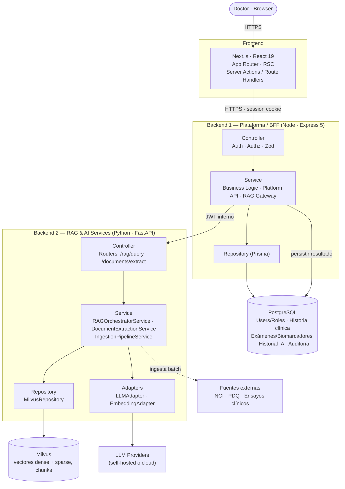
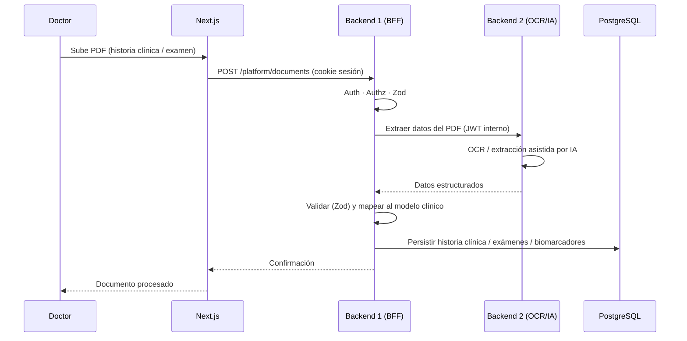
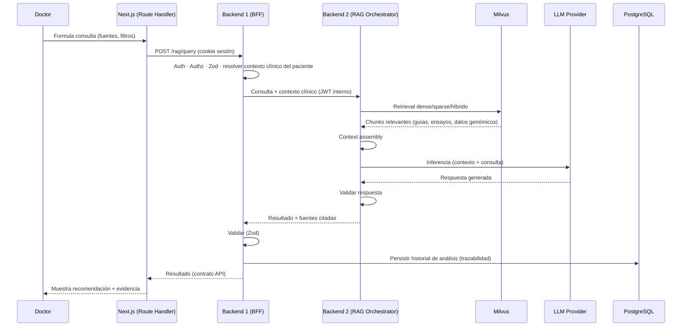
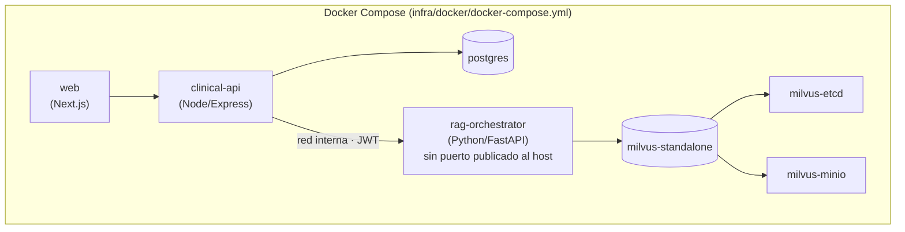
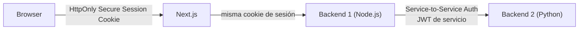
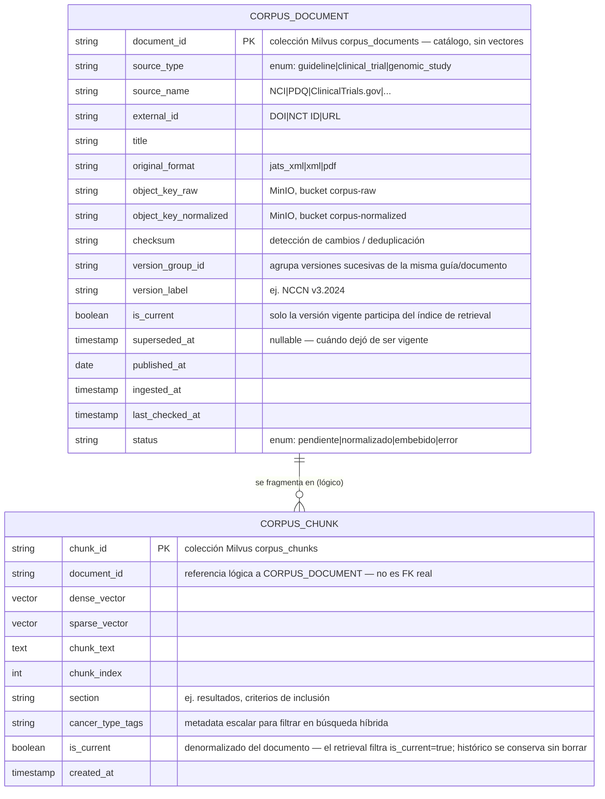

## Índice

0. [Ficha del proyecto](#0-ficha-del-proyecto)
1. [Descripción general del producto](#1-descripción-general-del-producto)
2. [Arquitectura del sistema](#2-arquitectura-del-sistema)
3. [Modelo de datos](#3-modelo-de-datos)
4. [Especificación de la API](#4-especificación-de-la-api)
5. [Historias de usuario](#5-historias-de-usuario)
6. [Tickets de trabajo](#6-tickets-de-trabajo)
7. [Pull requests](#7-pull-requests)

---

## 0. Ficha del Proyecto

### **0.1. Mario Julian Bonilla Contreras**

### **0.2. OncoLens**

### **0.3. Descripción breve del proyecto:**

OncoLens es una plataforma de apoyo a la decisión clínica en oncología que conecta el perfil clínico y molecular de cada paciente con la evidencia científica disponible —guías, ensayos y datos de investigación genómica— mediante búsqueda semántica híbrida contextualizada al paciente. Así, el oncólogo obtiene recomendaciones de tratamiento personalizado, trazables y respaldadas por evidencia, en minutos en lugar de horas de revisión manual.

### **0.4. URL del proyecto:**

Pendiente. Por el momento el proyecto se ejecuta en local (entorno de desarrollo del Máster sobre Docker) y no cuenta con una URL pública desplegada.

### 0.5. URL o archivo comprimido del repositorio
Repo público
https://github.com/hatrickmario/OncoLens-Lab/

---

## 1. Descripción general del producto

> Describe en detalle los siguientes aspectos del producto:

### **1.1. Objetivo:**

> Propósito del producto. Qué valor aporta, qué soluciona, y para quién.

OncoLens ayuda a oncólogos a reducir el tiempo de revisión manual de literatura científica y ensayos clínicos, cruzando automáticamente el perfil clínico y molecular de cada paciente contra evidencia actualizada (guías, ensayos, datos genómicos), para respaldar la elección de un tratamiento personalizado con alta probabilidad de éxito, con trazabilidad hacia la evidencia que sustenta cada recomendación.

### **1.2. Características y funcionalidades principales:**

> Enumera y describe las características y funcionalidades específicas que tiene el producto para satisfacer las necesidades identificadas.

1. **Ingesta de historia clínica, datos personales y exámenes** vía OCR desde PDF.
2. **Pipeline de normalización** del corpus científico externo (guías, ensayos, datos genómicos) previo al *embedding* — los datos del propio paciente **nunca se vectorizan**: viajan como texto estructurado dentro del prompt del orquestador RAG (ver 2.1).
3. **Búsqueda híbrida** (dense + sparse) sobre base de datos vectorial de guías clínicas, ensayos y datos de investigación genómica.
4. **Orquestador RAG**: construcción de consultas, inyección de contexto clínico del paciente, evaluación de la respuesta.
5. **Consulta cruzada** entre base de datos relacional (historia clínica/biomarcadores) y base de datos vectorial para la recomendación de tratamiento.
6. **Interfaz web** para que el doctor interactúe con el sistema.

### **1.3. Diseño y experiencia de usuario:**

> Proporciona imágenes y/o videotutorial mostrando la experiencia del usuario desde que aterriza en la aplicación, pasando por todas las funcionalidades principales.

**Mockups iniciales (borrador de baja fidelidad):** [Panel del doctor y Panel de interacción IA](https://claude.ai/artifact/3ohcMYbh9qkPsfqVGYc1eR)

- **Panel del doctor:** ficha del paciente (datos, diagnóstico, estadio, ECOG), pestañas de resumen clínico y de exámenes/biomarcadores (con estado normal/alto/crítico), acceso al panel de IA.
- **Panel de interacción IA:** parámetros de consulta (fuentes de datos a incluir — guías clínicas, ensayos clínicos, plataformas de investigación genómica —, filtros sobre la información del paciente) y resultado del análisis (tratamientos sugeridos, % de evidencia, fuentes citadas).

📌 Nota: son mockups ilustrativos de alcance funcional, no un diseño final. Se refinarán con Figma más adelante; esta sección se actualizará con esas capturas/prototipo y, eventualmente, con un videotutorial de la UI real.

### **1.4. Instrucciones de instalación:**
> Documenta de manera precisa las instrucciones para instalar y poner en marcha el proyecto en local (librerías, backend, frontend, servidor, base de datos, migraciones y semillas de datos, etc.)

**Estructura (monorepo `apps/` + `packages/`, npm workspaces):** ver detalle completo en 2.3.

**Prerrequisitos:**
- Docker y Docker Compose
- Node.js LTS + npm (con soporte de workspaces)
- Python 3.x + pip

**Pasos:**

1. Clonar el repositorio: `git clone https://github.com/hatrickmario/OncoLens-Lab.git`
2. Configurar variables de entorno (`.env`) por app: conexión a PostgreSQL, conexión a Milvus, credenciales/endpoint del proveedor de LLM (self-hosted o cloud, configurable), secretos de autenticación (JWT), etc.
3. Levantar servicios de infraestructura: `docker compose -f infra/docker/docker-compose.yml up -d` (PostgreSQL y Milvus).
4. **Backend de plataforma** (`apps/clinical-api/`):
   ```
   npm install
   npx prisma migrate dev
   npx prisma db seed
   npm run dev
   ```
5. **Servicio RAG** (`apps/rag-orchestrator/`):
   ```
   pip install -r requirements.txt
   uvicorn app.main:app --reload   # ajustar el módulo de entrada según se defina
   ```
6. **Frontend** (`apps/web/`):
   ```
   npm install
   npm run dev
   ```

🚧 **Pendiente de definir** (se completará en esta sección cuando se decida): motor de OCR para la ingesta de PDF, proveedor de LLM (self-hosted o cloud) y modelo de *embeddings* para la base vectorial.

**Motor de OCR — requiere ADR.** Ubicación ya definida: vive en **Backend 2** (RAG & AI Services), como capacidad compartida entre la carga de historia clínica/exámenes (invocada por Backend 1) y el pipeline de ingesta del corpus externo (ver sección 2). Al tratarse de datos clínicos sensibles (PHI), la decisión debe evaluar no solo precisión sino dónde se procesa el documento. Alternativas más probables a analizar:

*Self-hosted:*
1. **Tesseract OCR** — maduro, gratuito, corre 100% en el propio entorno (sin salida de PHI); precisión menor en layouts complejos/manuscritos, requiere preprocesamiento de imagen.
2. **PaddleOCR** — open source, mejor precisión que Tesseract en documentos con estructura compleja/tablas, soporte multilenguaje activo; mayor costo de cómputo (GPU recomendada).

*Cloud:*
3. **Amazon Textract** (+ posible Comprehend Medical) — buena extracción de formularios/tablas, opción orientada a documentos médicos; implica enviar el documento a un tercero, costo por página.
4. **Google Document AI** — alta precisión general, parsers específicos por tipo de documento; misma consideración de envío de PHI a un tercero, costo por página.

*Sub-decisión técnica adicional (misma ADR):* OCR clásico (Tesseract/PaddleOCR/Textract/Document AI) + LLM que estructura el texto extraído, **vs.** modelo multimodal/vision-LLM que interpreta el PDF/imagen directamente sin OCR clásico previo. No cambia dónde vive el componente (Backend 2), pero sí su diseño interno y sus adapters.

Criterios de evaluación a documentar en el ADR: precisión sobre historias clínicas/exámenes en español, cumplimiento normativo (PHI/HIPAA-equivalente, dónde reside el dato), costo, latencia y facilidad de integración con el pipeline de ingesta. Se formaliza como ADR dentro de la sección 2 (Arquitectura del sistema).

---

## 2. Arquitectura del Sistema

### **2.1. Diagrama de arquitectura:**
> Usa el formato que consideres más adecuado para representar los componentes principales de la aplicación y las tecnologías utilizadas. Explica si sigue algún patrón predefinido, justifica por qué se ha elegido esta arquitectura, y destaca los beneficios principales que aportan al proyecto y justifican su uso, así como sacrificios o déficits que implica.

**Patrón:** BFF (*Backend for Frontend*) + servicio especializado de IA, ambos organizados en capas **Controller → Service → Repository** (en Backend 2, la integración con proveedores externos —LLM y embeddings— se implementa como **Adapters**, dentro de esa misma capa). Son 2 servicios backend con **bounded contexts** explícitos y una regla de ownership estricta:

- **Backend 1** posee el registro clínico (identidad, autorización, historia clínica, exámenes, biomarcadores, historial de análisis, auditoría) — todo lo que toca PostgreSQL.
- **Backend 2** posee el análisis clínico asistido por IA (retrieval, generación, extracción de documentos) — todo lo que toca Milvus y los proveedores de LLM/embeddings. **Nunca tiene acceso de red a PostgreSQL.**

**Por qué esta arquitectura:**
- El frontend nunca habla directo con el servicio de IA — todo pasa por el BFF, que centraliza sesión, autorización sobre datos de pacientes (PHI) y contrato de API hacia el cliente.
- Node/Express es la herramienta correcta para CRUD tipado, auth y API de plataforma; Python/FastAPI es la herramienta correcta para el ecosistema RAG/ML (retrieval híbrido, adapters de LLM/embeddings).
- Aislar el servicio de IA sin credenciales de base de datos relacional reduce el radio de impacto de una vulnerabilidad en esa capa (la más expuesta a proveedores externos de LLM).

**Sacrificios / déficits:**
- Mayor complejidad operativa: 2 runtimes, 2 lenguajes, autenticación servicio-a-servicio, y un salto de red adicional en cada consulta RAG.
- Riesgo de consistencia eventual: Backend 2 calcula el resultado del análisis, pero es Backend 1 quien lo persiste — si esa escritura falla después de que Backend 2 ya respondió, se pierde trazabilidad si no hay reintentos/idempotencia.
- Requiere disciplina de contract testing entre Node y Python para evitar *drift* entre sus specs OpenAPI.



**Flujo 1 — Carga de historia clínica (OCR):**



**Flujo 2 — Consulta RAG:**

> La consulta RAG se implementa con un **Route Handler** de Next.js (`app/api/rag/route.ts`), no con una Server Action: las Server Actions están pensadas para mutaciones simples, no para hacer *pass-through* de una respuesta en streaming. El Route Handler reenvía el stream Backend 1 → Backend 2 → LLM hacia el navegador.



### **2.2. Descripción de componentes principales:**

> Describe los componentes más importantes, incluyendo la tecnología utilizada

| Componente | Tecnología | Responsabilidad |
|---|---|---|
| **Frontend** | React 19, Next.js (App Router, RSC, Server Actions/Route Handlers), TypeScript, Tailwind CSS v4, shadcn/ui | UI del doctor: panel de paciente y panel de interacción IA (ver mockups en 1.3). Route Handlers para llamadas que requieren streaming (consulta RAG); Server Actions para mutaciones simples. |
| **Backend 1 — Plataforma / BFF** | Node.js LTS, Express 5, TypeScript, Zod, Prisma, OpenAPI/Swagger UI | Único punto de entrada autenticado. Auth/Authz, lógica de negocio, API de plataforma (pacientes, historia clínica, exámenes, biomarcadores), gateway hacia Backend 2, carga y persistencia de documentos (delegando la extracción a Backend 2), persistencia del historial de análisis IA. Dueño exclusivo de PostgreSQL. |
| **PostgreSQL** | PostgreSQL | Usuarios/roles/sesiones, historia clínica, exámenes, biomarcadores, historial de análisis IA, auditoría. |
| **Backend 2 — RAG & AI Services** | Python, FastAPI, Pydantic, OpenAPI | Orquestador RAG (retrieval dense/sparse/híbrido, ensamblado de contexto, inferencia LLM, validación de respuesta); servicio de extracción de documentos (OCR asistido por IA) invocado por Backend 1 y reutilizado por su propio pipeline de ingesta; pipeline de ingesta batch del corpus externo (NCI, PDQ, ensayos clínicos) hacia Milvus. Sin acceso de red a PostgreSQL — todo el contexto clínico llega por payload autenticado (JWT interno) desde Backend 1. |
| **Milvus** | Milvus | Vectores dense y sparse, chunks y metadatos de retrieval del corpus de guías clínicas, ensayos y datos de investigación genómica. |
| **LLM Providers** | Configurable: self-hosted o cloud | Modelos de generación y de embedding, abstraídos detrás de LLM Adapters / Embedding Adapters en Backend 2 — el proveedor concreto queda pendiente de ADR (ver 1.4). |

### **2.3. Descripción de alto nivel del proyecto y estructura de ficheros**

> Representa la estructura del proyecto y explica brevemente el propósito de las carpetas principales, así como si obedece a algún patrón o arquitectura específica.

Monorepo tipo `apps/` + `packages/` (npm workspaces — ver 0.5). Dentro de cada app se aplica **Controller → Service → Repository**, agrupado por módulo de dominio en Backend 1 y con nomenclatura Hexagonal/Clean Architecture en Backend 2 (Backend 2 añade una capa **domain** para reglas de negocio puras, y **Adapters** para integraciones externas):

```
OncoLens/
├── apps/
│   ├── web/                              # Frontend — Next.js, React 19, App Router
│   │   ├── app/
│   │   │   ├── (dashboard)/               # Panel del doctor / Panel de interacción IA
│   │   │   └── api/rag/route.ts           # Route Handler — streaming de la consulta RAG
│   │   └── components/                    # shadcn/ui + componentes propios
│   │
│   ├── clinical-api/                      # Backend 1 — Node.js LTS + Express 5 (BFF)
│   │   ├── src/
│   │   │   ├── modules/                   # patients · exams · clinical-history · treatments · ai-analysis · users
│   │   │   │   │                          # cada módulo: *.controller.ts · *.service.ts · *.repository.ts · *.schema.ts (Zod)
│   │   │   ├── middleware/                # auth · authorize · error-handler
│   │   │   ├── infrastructure/            # prisma client, config, rag-orchestrator.client.ts (JWT servicio)
│   │   │   └── routes/                    # agrega los routers de cada módulo
│   │   └── prisma/                        # schema.prisma, migraciones, seed
│   │
│   └── rag-orchestrator/                  # Backend 2 — Python + FastAPI
│       ├── app/
│       │   ├── api/                       # routers: /rag/query, /documents/extract
│       │   ├── application/               # RAGOrchestratorService, DocumentExtractionService,
│       │   │                              # IngestionPipelineService (corpus externo)
│       │   ├── domain/                    # reglas de negocio puras (scoring de evidencia, umbrales clínicos)
│       │   ├── infrastructure/
│       │   │   ├── milvus/                # MilvusRepository
│       │   │   ├── embeddings/            # EmbeddingAdapter
│       │   │   └── llm/                   # LLMAdapter (self-hosted o cloud)
│       │   │                              # (sin infrastructure/postgres/ — Backend 2 no accede a PostgreSQL)
│       │   └── schemas/                   # Pydantic
│       └── requirements.txt
│
├── packages/
│   └── api-contracts/                     # tipos/clientes generados de los OpenAPI de ambos backends
│                                          # (consumidos por web/ y clinical-api/ → resuelve el contract testing de 2.6)
│
├── data/                                   # ⚠️ nunca PHI real — solo corpus externo público y datasets sintéticos
│   ├── raw/                               # NCI, PDQ, ensayos clínicos sin procesar
│   ├── normalized/                        # salida del ingestion pipeline, antes del embedding
│   └── evaluation/                        # datasets para el ADR de evaluación de calidad del RAG (2.6)
│
├── docs/
│   ├── architecture/adr/                  # ADRs pendientes: motor OCR, rate limiting, evaluación RAG
│   ├── api/
│   └── rag/
│
├── specs/                                  # Spec-Driven Development (OpenSpec) — especificaciones previas a la implementación
│
├── infra/docker/                           # docker-compose.yml (ver 2.4)
├── scripts/
├── .github/workflows/                      # CI: build, tests, validación OpenAPI
│
├── CLAUDE.md                               # reglas acordadas: Backend 2 sin Postgres, Doctor session ≠ Service credential, naming de capas
└── package.json                            # workspaces: ["apps/*", "packages/*"] (npm)
```

### **2.4. Infraestructura y despliegue**

> Detalla la infraestructura del proyecto, incluyendo un diagrama en el formato que creas conveniente, y explica el proceso de despliegue que se sigue

Entorno local vía **Docker Compose**. Milvus en modo *standalone* requiere dos dependencias propias (`etcd` para metadatos, `MinIO` para almacenamiento de objetos) — no es un único contenedor:



- `clinical-api` expone su puerto al host (vía `web`); `rag-orchestrator` **no** publica puerto al host — solo es alcanzable dentro de la red interna de Docker Compose, y únicamente por `clinical-api`.
- Despliegue: `docker compose -f infra/docker/docker-compose.yml up -d` levanta toda la infraestructura (ver comandos completos en 1.4). El despliegue a un entorno cloud queda **fuera de alcance por ahora** (proyecto académico, ejecución local) — pendiente de decisión si se requiere una demo desplegada.

### **2.5. Seguridad**

> Enumera y describe las prácticas de seguridad principales que se han implementado en el proyecto, añadiendo ejemplos si procede

**Autenticación — dos mecanismos separados, nunca intercambiables:**



- **Sesión del doctor** (Browser → Next.js → Backend 1): cookie de sesión `HttpOnly` + `Secure` con un **token opaco** (no JWT) — su único valor es ser clave de búsqueda de la tabla `Session` en PostgreSQL. Persistida (no stateless) a propósito: permite revocar una sesión (ej. dispositivo robado, baja de un doctor) sin esperar a que expire. Solo se guarda `token_hash` (hash del token) en base de datos, nunca el token en claro — mismo principio que un password hash.
- **Guard de autenticación**: el `Middleware` (Backend 1) valida el token opaco contra `Session` en cada request autenticado (`token_hash` válido, no revocada, no expirada) *antes* de enrutar al controller correspondiente — ver componente `Middleware` en el C4 Nivel 3.
- **Autorización RBAC + asignación**: `Role`/`Permission` controla qué *acciones* puede hacer un usuario; `PatientAssignment` controla *sobre qué pacientes* — un doctor con permiso `patients:read` igual no puede ver un paciente que no tiene asignado, salvo rol `admin`. Ambas capas se validan en el mismo `Middleware`/Guard.
- **Consentimiento y anonimización**: solo se usa la información de un paciente en una consulta RAG si `Patient.consent_ai_analysis = true`. El contexto clínico que Backend 1 arma para Backend 2 se anonimiza cuando es necesario (sin nombre, sin `PatientContactInfo`, identificado solo por un id interno) — coherente con que Backend 2 nunca debería necesitar PII para generar una recomendación basada en evidencia.
- **Credencial de servicio** (Backend 1 → Backend 2): JWT de servicio (o mecanismo equivalente) — **la sesión del doctor nunca viaja hasta Backend 2**. Regla explícita: *Doctor session ≠ Service credential*. Backend 2 valida el JWT de servicio en cada request y no acepta ni interpreta cookies de sesión.
- **Aislamiento de red**: Backend 2 no tiene acceso de red a PostgreSQL ni se expone fuera de la red interna de Docker Compose (ver 2.4).
- **Separación de schemas en PostgreSQL** (defensa en profundidad): `auth` (`User`, `Session`) vs. `clinical` (`Patient`, `PatientContactInfo`, `Diagnosis`, `ClinicalNote`, `Exam`, `Biomarker`, `Document`, `Treatment`, `AIAnalysisRecord`) vs. `audit` (`AuditLog`, que registra acciones sobre ambos dominios). Mismo Postgres, mismo `clinical-api` como único owner — pero un compromiso en una tabla de un schema no da acceso automático al otro.
- **Cifrado en reposo y en tránsito**: volumen de PostgreSQL y MinIO cifrado en disco; conexión a PostgreSQL con `sslmode=require` (TLS obligatorio). 🚧 Cifrado a nivel de columna (`pgcrypto`) para campos de mayor riesgo — ADR pendiente (ver 3.3), por el trade-off con la capacidad de indexar/buscar sobre esos campos.
- **Validación de entrada** en cada borde: Zod (Backend 1) y Pydantic (Backend 2).
- **Minimización de datos**: Backend 1 solo envía a Backend 2 el contexto clínico estrictamente necesario para resolver la consulta, nunca la historia clínica completa por defecto.
- **Trazabilidad**: cada análisis IA se persiste con las fuentes citadas como **snapshot autocontenido** (no solo una referencia viva a Milvus) para que la auditoría posterior sea reproducible incluso si el corpus se reingiere más adelante (ver 3.1 y ADR #5 en 3.3).
- 🚧 **Pendiente — ADR futuro**: **Rate limiting** en el RAG Gateway de Backend 1 (control de abuso y de costo de llamadas a LLM); estrategia concreta (por usuario, por IP, ventana deslizante, etc.) por definir.

### **2.6. Tests**

> Describe brevemente algunos de los tests realizados

| Servicio | Herramientas | Enfoque |
|---|---|---|
| Backend 1 (Node) | Vitest, Supertest, StrykerJS | Unitarios (services), integración de API (Supertest contra Express), mutation testing con StrykerJS sobre la lógica de auth/autorización por ser la más crítica. |
| Backend 2 (Python) | Pytest, FastAPI TestClient | Unitarios (services/adapters) e integración de los endpoints `/rag/query` y `/documents/extract`. |
| Frontend / E2E | Playwright | Flujos end-to-end del doctor (panel de paciente → panel de IA → resultado) contra el stack completo levantado con Docker Compose. |

**Contract testing (mejorado):** en vez de una herramienta de contratos independiente, se genera un **cliente TypeScript tipado a partir del spec OpenAPI de Backend 2** y se consume desde Backend 1 — un cambio incompatible en el contrato rompe el build antes de llegar a producción. En CI se valida además que ambos specs OpenAPI (Backend 1 y Backend 2) sigan siendo válidos.

🚧 **Pendiente — ADR futuro**: **evaluación de calidad del RAG** (precisión del retrieval, fidelidad de la respuesta generada respecto al contexto recuperado — p. ej. con un framework como `ragas`). Los tests anteriores verifican que el sistema *funciona*, no que sus recomendaciones estén bien fundamentadas en la evidencia — crítico en un contexto clínico, se define en un ADR posterior.

### **2.7. Observabilidad**

> Logs, métricas y monitoreo — cómo se diagnostica el sistema en ejecución, distinto de la trazabilidad *de negocio* ya cubierta en 2.5 (qué evidencia sustentó una recomendación).

- **Logs estructurados (JSON)** en ambos backends, con un **`traceId`/`requestId`** generado en `clinical-api` (o en el Route Handler del frontend) y propagado como header (`X-Trace-Id`) en cada llamada hasta `rag-orchestrator` — permite reconstruir el recorrido completo de una consulta RAG o de una carga de documento a través de los dos servicios. 🚧 Librería concreta pendiente de ADR (candidatas: `pino`/`winston` en Node, `structlog`/`logging`+JSON formatter en Python).
- **Métricas**: cada backend expone un endpoint `/metrics` (formato Prometheus). Métricas clave a instrumentar: latencia por endpoint, tasa de error, duración de retrieval vs. inferencia LLM (desglosada), tokens/costo del LLM, tiempo de procesamiento OCR.
- **Health checks**: endpoint `/health` en ambos backends, usado por Docker Compose (`healthcheck` + `depends_on: condition: service_healthy`) para ordenar el arranque (p. ej. `clinical-api` espera a que `postgres` esté healthy).
- 🚧 **Pendiente — ADR futuro**: **monitoreo/visualización** (Prometheus + Grafana como servicios adicionales en el Docker Compose) y **tracing distribuido** más avanzado (OpenTelemetry) — se evalúan más adelante para no sumar complejidad al entorno local académico desde ahora; por ahora el requisito es solo logs estructurados + `traceId` + métricas expuestas.

---

## 3. Modelo de Datos

### **3.1. Diagrama del modelo de datos:**

> Recomendamos usar mermaid para el modelo de datos, y utilizar todos los parámetros que permite la sintaxis para dar el máximo detalle, por ejemplo las claves primarias y foráneas.

Dos modelos, alineados a la regla de ownership de la sección 2: el **relacional** (PostgreSQL, propiedad exclusiva de Backend 1) y el de **corpus científico/documentos** (Milvus + MinIO, propiedad de Backend 2). No hay un único diagrama porque no son el mismo motor de datos — mezclarlos en un solo ER induciría a pensar que hay FKs reales entre ambos, y no las hay (solo referencias lógicas).

#### PostgreSQL — datos clínicos (Backend 1)

**Schemas** (defensa en profundidad, ver 2.5): `auth` → `User`, `Session` · `clinical` → `Patient`, `PatientContactInfo`, `Diagnosis`, `ClinicalNote`, `Exam`, `Biomarker`, `Document`, `Treatment`, `AIAnalysisRecord` · `audit` → `AuditLog`.

```mermaid
erDiagram
    USER {
        uuid id PK
        string email UK
        string password_hash
        string full_name
        uuid role_id FK
        boolean is_active
        timestamp created_at
        timestamp updated_at
    }

    ROLE {
        uuid id PK
        string name UK "ej. doctor, admin"
        string description
        timestamp created_at
    }

    PERMISSION {
        uuid id PK
        string code UK "ej. patients:read, ai_analysis:create"
        string description
    }

    ROLE_PERMISSION {
        uuid role_id PK "también FK — clave compuesta con permission_id"
        uuid permission_id PK "también FK — clave compuesta con role_id"
    }

    SESSION {
        uuid id PK
        uuid user_id FK
        string token_hash UK "hash del token opaco — nunca el token en claro"
        timestamp expires_at
        timestamp last_seen_at "sliding expiration"
        string ip_address
        string user_agent
        boolean revoked "permite cerrar sesión remota sin borrar el registro"
        timestamp created_at
    }

    PATIENT {
        uuid id PK
        string mrn UK "número de historia clínica"
        string full_name
        date birth_date
        string sex
        boolean consent_ai_analysis "consentimiento para usar sus datos en análisis IA"
        timestamp consent_recorded_at "nullable"
        timestamp created_at
        timestamp updated_at
    }

    PATIENT_ASSIGNMENT {
        uuid id PK
        uuid patient_id FK
        uuid doctor_id FK "también FK a USER — doctor tratante"
        timestamp assigned_at
        timestamp unassigned_at "nullable"
        boolean is_active "solo una asignación activa por paciente a la vez"
    }

    PATIENT_CONTACT_INFO {
        uuid patient_id PK "también FK — 1:1 con PATIENT"
        uuid source_document_id FK "nullable — de qué PDF vino (OCR)"
        string entry_method "enum: ocr|manual_correction"
        string national_id "documento de identidad"
        string phone
        string email
        string address
        string insurance_provider
        string emergency_contact_name
        string emergency_contact_phone
        timestamp updated_at
    }

    DIAGNOSIS {
        uuid id PK
        uuid patient_id FK
        uuid source_document_id FK "nullable — de qué PDF vino (OCR)"
        string entry_method "enum: ocr|manual_correction"
        string cancer_type
        string stage
        int ecog_score
        date diagnosed_at
        boolean is_active "diagnóstico vigente vs. histórico"
        timestamp created_at
    }

    CLINICAL_NOTE {
        uuid id PK
        uuid patient_id FK
        uuid source_document_id FK "nullable — de qué PDF vino (OCR)"
        uuid created_by FK
        string note_type "enum: antecedente|comorbilidad|tratamiento_previo|alergia|antecedente_familiar|nota_libre"
        string entry_method "enum: ocr|manual_correction"
        text content
        date recorded_at "fecha clínica del evento, no de carga"
        boolean is_active "soft-supersede: nunca se borra, se marca obsoleta"
        timestamp created_at
    }

    EXAM {
        uuid id PK
        uuid patient_id FK
        uuid source_document_id FK "nullable"
        string exam_type
        string entry_method "enum: ocr|manual_correction"
        date performed_at
        timestamp created_at
    }

    BIOMARKER {
        uuid id PK
        uuid exam_id FK
        string name
        string value
        string unit "nullable — no aplica a resultados cualitativos"
        string reference_range
        string result_type "enum: cuantitativo|cualitativo"
        string clinical_significance "enum: normal|alterado|relevante|crítico"
        timestamp created_at
    }

    DOCUMENT {
        uuid id PK
        uuid patient_id FK
        string document_type "enum: historia_clinica|examen"
        string object_storage_key "MinIO, bucket clinical-documents"
        string original_filename
        string mime_type
        string ocr_status "enum: pendiente|procesando|completado|error"
        uuid uploaded_by FK
        timestamp uploaded_at
        timestamp extracted_at "nullable"
    }

    TREATMENT {
        uuid id PK
        uuid patient_id FK
        uuid based_on_analysis_id FK "nullable — de qué recomendación IA parte, si aplica"
        uuid decided_by FK
        string description
        string status "enum: activo|completado|suspendido"
        date started_at
        date ended_at "nullable"
        timestamp created_at
    }

    AI_ANALYSIS_RECORD {
        uuid id PK
        uuid patient_id FK
        uuid requested_by FK
        string trace_id "correlación con 2.7 Observabilidad"
        text query_text
        jsonb sources_selected "guías/ensayos/genómica — filtros del panel IA (1.3)"
        jsonb filters_applied "filtros de información del paciente — panel IA (1.3)"
        jsonb recommendations "array anidado: cada item = {treatment, confidence_score, rationale, cited_sources: [{snapshot autocontenido, chunk_id de referencia}]}"
        float top_confidence_score "derivado de recommendations[0], para ordenar/filtrar sin parsear JSONB"
        timestamp created_at
    }

    AUDIT_LOG {
        uuid id PK
        uuid user_id FK "nullable — acciones de sistema"
        string action
        string entity_type
        uuid entity_id
        jsonb metadata
        string ip_address
        timestamp created_at
    }

    ROLE ||--o{ USER : "asignado a"
    ROLE ||--o{ ROLE_PERMISSION : tiene
    PERMISSION ||--o{ ROLE_PERMISSION : otorga
    USER ||--o{ SESSION : tiene
    PATIENT ||--o{ PATIENT_ASSIGNMENT : tiene
    USER ||--o{ PATIENT_ASSIGNMENT : "atiende (doctor tratante)"
    PATIENT ||--o| PATIENT_CONTACT_INFO : tiene
    DOCUMENT |o--o| PATIENT_CONTACT_INFO : "origina (OCR)"
    PATIENT ||--o{ DIAGNOSIS : tiene
    DOCUMENT |o--o{ DIAGNOSIS : "origina (OCR)"
    PATIENT ||--o{ CLINICAL_NOTE : tiene
    PATIENT ||--o{ EXAM : tiene
    EXAM ||--o{ BIOMARKER : reporta
    PATIENT ||--o{ DOCUMENT : sube
    PATIENT ||--o{ TREATMENT : recibe
    PATIENT ||--o{ AI_ANALYSIS_RECORD : "es consultado en"
    AI_ANALYSIS_RECORD |o--o{ TREATMENT : "puede originar"
    USER ||--o{ CLINICAL_NOTE : registra
    USER ||--o{ DOCUMENT : sube
    USER ||--o{ TREATMENT : decide
    USER ||--o{ AI_ANALYSIS_RECORD : solicita
    USER |o--o{ AUDIT_LOG : genera
    DOCUMENT |o--o{ CLINICAL_NOTE : "origina (OCR)"
    DOCUMENT |o--o{ EXAM : "origina (OCR)"
```



#### Corpus científico y documentos fuente — Milvus + MinIO (Backend 2)

> Modelo lógico, no relacional: Milvus no impone claves foráneas reales entre sus colecciones. Se documenta con la misma sintaxis por claridad, dejando explícito qué es "real" (constraint de Milvus) y qué es solo referencia lógica que mantiene la aplicación.



**Aislamiento de MinIO por dominio (ligado a 2.5 Seguridad):** aunque se reutiliza la misma instancia de MinIO, los buckets están separados por credenciales/política de acceso — `clinical-documents` (PHI, solo Backend 1) vs. `corpus-raw`/`corpus-normalized` (dominio público, Backend 2). Backend 2 nunca debe tener credenciales que le permitan leer `clinical-documents`.

### **3.2. Descripción de entidades principales:**

> Recuerda incluir el máximo detalle de cada entidad, como el nombre y tipo de cada atributo, descripción breve si procede, claves primarias y foráneas, relaciones y tipo de relación, restricciones (unique, not null…), etc.

*(Atributos, tipos, PK/FK y restricciones principales ya detallados en los diagramas de 3.1. Aquí el propósito y las decisiones de cada entidad.)*

**PostgreSQL:**
- **User** — cuentas de doctores/administradores, ahora con `role_id` real (no enum) apuntando a **Role**.
- **Role / Permission / RolePermission** — RBAC completo pese a que hoy existan pocos roles: permite agregar permisos granulares (ej. `ai_analysis:create`, `patients:write`) sin migrar el esquema cuando el catálogo de roles crezca. `RolePermission` es la tabla puente (clave compuesta `role_id` + `permission_id`).
- **Session** — sesión persistida (token opaco, no JWT) para poder revocar acceso sin esperar expiración. Solo se guarda `token_hash`; `revoked` permite cerrar sesión remota; `last_seen_at` habilita expiración deslizante. Es lo que valida el `Middleware`/Guard de Backend 1 en cada request (ver C4 Nivel 3 y 2.5).
- **Patient** — identidad clínica mínima (nombre, nacimiento, sexo, `mrn` único) + `consent_ai_analysis`: el paciente debe tener consentimiento registrado antes de que sus datos se usen en una consulta RAG (ver 2.5). Deliberadamente separada de los datos de contacto (ver `PatientContactInfo`) para acotar qué tablas exponen PII de contacto en queries que no la necesitan.
- **PatientAssignment** — asignación explícita de doctor tratante por paciente. `is_active` marca la vigente; el histórico de reasignaciones queda en `unassigned_at`. La autorización de Backend 1 usa esta tabla, no solo el rol: un doctor con rol "doctor" no ve automáticamente a todos los pacientes, solo a los asignados (excepto `admin`).
- **PatientContactInfo** — datos personales de contacto (1:1 con `Patient`, `patient_id` es a la vez PK y FK). Puede no existir aún si el paciente recién se cargó con lo mínimo del OCR — de ahí la relación opcional (`||--o|`).
- **Diagnosis** — permite más de un diagnóstico por paciente en el tiempo (recurrencias); `is_active` marca el vigente sin borrar el histórico.
- **ClinicalNote** — bitácora discreta y tipada (`note_type`) pensada para ser **filtrable eficientemente** al construir el contexto clínico de una consulta RAG: los filtros del panel IA (1.3) se traducen directamente en `WHERE note_type IN (...) AND recorded_at >= ...`. `is_active` permite superar una nota sin perder trazabilidad. `entry_method` distingue si vino de OCR o de una corrección manual del doctor — la carga manual existe, pero queda auditada como tal.
- **Exam / Biomarker** — un examen agrupa N biomarcadores; `entry_method` igual que en `ClinicalNote`. `Biomarker` separa `result_type` (cuantitativo/cualitativo) de `clinical_significance` (normal/alterado/relevante/crítico) — un resultado genómico (ej. mutación EGFR positiva) no es "alto" ni "bajo", es cualitativamente relevante, y forzarlo en una sola escala numérica no representa bien el dato.
- **Document** — metadata del archivo subido; el binario vive en MinIO (`object_storage_key`), nunca en Postgres. `ocr_status` trackea el pipeline de extracción (Flujo 1, 2.1).
- **Treatment** — decisión clínica **real** que registra el doctor; distinta de la recomendación de IA. `based_on_analysis_id` es opcional: el doctor puede decidir algo que no venga de ninguna recomendación del sistema.
- **AIAnalysisRecord** — snapshot inmutable de cada consulta RAG. `recommendations` es un array anidado donde **cada** recomendación lleva su propio `confidence_score` y sus propias `cited_sources` — así se representa lo que ya muestra el mockup de 1.3 (evidencia distinta por cada tratamiento sugerido, no una sola para todo el análisis). Cada cita dentro de `cited_sources` es un **snapshot autocontenido** (título, fuente, texto citado), no una referencia viva a Milvus — sobrevive aunque el corpus se reingiera más adelante. `top_confidence_score` es un campo derivado (del primer/mejor resultado) solo para poder ordenar/filtrar el historial sin parsear JSONB. `trace_id` correlaciona con los logs de 2.7.
- **AuditLog** — bitácora de acciones sobre el sistema, requisito de seguridad (2.5).

**Milvus + MinIO:**
- **CorpusDocument** — catálogo a nivel documento (guías/ensayos/datos genómicos), separado de los vectores para poder versionar/deduplicar sin tocar la colección de chunks. `checksum` detecta si un documento fuente cambió y necesita reprocesarse. **Versionado**: `version_group_id` agrupa las versiones sucesivas de una misma guía (ej. NCCN v3.2024 → v4.2025); al llegar una nueva versión, la anterior se marca `is_current = false` (`superseded_at` registrado) pero **nunca se borra** — queda disponible para que una cita antigua en `AIAnalysisRecord.cited_sources` siga siendo resoluble.
- **CorpusChunk** — unidad de retrieval: texto + vector dense + vector sparse + metadata escalar para la búsqueda híbrida. `is_current` es un espejo denormalizado del documento (Milvus no hace joins, así que el filtro de "solo la versión vigente" tiene que vivir en el propio chunk): el índice de retrieval siempre filtra `is_current = true`, y los chunks históricos permanecen en la colección sin participar en nuevas búsquedas.

### **3.3. ADRs derivados del modelo de datos**

> Decisiones identificadas durante el diseño — cada una resuelta explícitamente, no asumida. Se recomienda formalizarlas como ADRs individuales en `docs/architecture/adr/` (ver 2.3) usando la skill `architecture`.

1. **Granularidad de RBAC** — ✅ Resuelto: **tablas `Role`/`Permission`/`RolePermission` completas**, aunque el catálogo inicial de roles sea pequeño (doctor, admin). Evita una migración de esquema el día que se necesiten permisos más finos. Implementado en 3.1.
2. **Asignación doctor–paciente** — ✅ Resuelto: **asignación explícita** vía `PatientAssignment` (doctor tratante). Un doctor solo ve los pacientes que tiene asignados (excepto `admin`, que ve todos vía permisos). Implementado en 3.1; la regla de autorización correspondiente queda documentada en 2.5.
3. **Multi-tenancy** — ✅ Resuelto: **no aplica**. El proyecto es de alcance de una sola clínica/institución. No se agrega entidad `Organization`; si en el futuro se requiere, es un cambio de alcance del producto, no un ajuste menor del modelo.
4. **Retención y borrado de PHI** — ✅ Resuelto: existe consentimiento del paciente para el uso de su información en análisis (`Patient.consent_ai_analysis`), y **no se usa PII en los análisis de IA** — los datos se anonimizan antes de salir hacia Backend 2 cuando es necesario (ver "Minimización de datos" en 2.5). La política exacta de retención/borrado en PostgreSQL (cuánto tiempo se conserva un registro) queda fuera de este alcance — se puede abrir como ADR aparte si el proyecto lo requiere más adelante.
5. **Versionado del corpus científico** — ✅ Resuelto: **sí hay versionado**. El histórico de guías se conserva (nunca se borra), pero el índice de retrieval se reconstruye para usar solo la versión vigente de cada una (`is_current`). Implementado en 3.1 (`CorpusDocument.version_group_id`/`is_current`, `CorpusChunk.is_current`) — y refuerza la decisión #3 del review anterior: como los chunks históricos no se borran, una cita antigua en `cited_sources` sigue siendo resoluble por `chunk_id`, no solo por su snapshot.
6. **Cifrado a nivel de columna** — ✅ Resuelto: **descartado** para el alcance del proyecto. Se mantiene el cifrado de volumen + TLS ya adoptado (2.5) como nivel de protección suficiente; no se justifica el costo de perder indexación directa sobre campos como `mrn` para este alcance.

---

## 4. Especificación de la API

> Si tu backend se comunica a través de API, describe los endpoints principales (máximo 3) en formato OpenAPI. Opcionalmente puedes añadir un ejemplo de petición y de respuesta para mayor claridad

Hay **dos superficies de API**, coherentes con la regla de ownership de la sección 2: la **pública** (`clinical-api`, consumida por el frontend, cookie de sesión) y la **interna** (`rag-orchestrator`, consumida solo por `clinical-api`, JWT de servicio — nunca expuesta al navegador). Es la misma distinción *Doctor session ≠ Service credential* de 2.5, ahora a nivel de contrato de API.

### **4.1. `clinical-api` (Backend 1) — API pública**

Se documentan los 3 endpoints más representativos: **carga de documento (OCR)**, **consulta RAG** (el corazón del producto, actúa de gateway hacia `rag-orchestrator`) y **lectura de ficha de paciente**.

```yaml
openapi: 3.0.3
info:
  title: OncoLens — Platform API (Backend 1 / clinical-api)
  version: "0.1.0"
  description: >
    API pública consumida por el frontend (Next.js). Autenticación por cookie de
    sesión HttpOnly + Secure (token opaco, ver 2.5). Backend 2 (rag-orchestrator)
    nunca se expone directamente al cliente.

servers:
  - url: https://localhost/api

security:
  - sessionCookie: []

components:
  securitySchemes:
    sessionCookie:
      type: apiKey
      in: cookie
      name: oncolens_session

  schemas:
    Document:
      type: object
      properties:
        id: { type: string, format: uuid }
        patientId: { type: string, format: uuid }
        documentType: { type: string, enum: [historia_clinica, examen] }
        originalFilename: { type: string }
        ocrStatus: { type: string, enum: [pendiente, procesando, completado, error] }
        uploadedAt: { type: string, format: date-time }

    CitedSource:
      type: object
      properties:
        title: { type: string }
        sourceName: { type: string, example: "NCCN Guidelines" }
        externalId: { type: string, example: "NCT02296125" }
        chunkTextSnapshot: { type: string }
        chunkId: { type: string, description: "referencia best-effort a CorpusChunk en Milvus" }

    Recommendation:
      type: object
      properties:
        treatment: { type: string }
        confidenceScore: { type: number, format: float, example: 0.92 }
        rationale: { type: string }
        citedSources:
          type: array
          items: { $ref: "#/components/schemas/CitedSource" }

    AIAnalysisRecord:
      type: object
      properties:
        id: { type: string, format: uuid }
        traceId: { type: string }
        queryText: { type: string }
        recommendations:
          type: array
          items: { $ref: "#/components/schemas/Recommendation" }
        topConfidenceScore: { type: number, format: float }
        createdAt: { type: string, format: date-time }

    Biomarker:
      type: object
      properties:
        name: { type: string, example: "EGFR" }
        value: { type: string, example: "Mutación L858R positiva" }
        resultType: { type: string, enum: [cuantitativo, cualitativo] }
        clinicalSignificance: { type: string, enum: [normal, alterado, relevante, crítico] }

    PatientSummary:
      type: object
      properties:
        id: { type: string, format: uuid }
        mrn: { type: string, example: "HC-2024-00193" }
        fullName: { type: string }
        birthDate: { type: string, format: date }
        diagnosis:
          type: object
          properties:
            cancerType: { type: string, example: "Adenocarcinoma de pulmón" }
            stage: { type: string, example: "IIIB" }
            ecogScore: { type: integer, example: 1 }
        recentBiomarkers:
          type: array
          items: { $ref: "#/components/schemas/Biomarker" }

    Error:
      type: object
      properties:
        error: { type: string }
        message: { type: string }

paths:
  /platform/patients/{patientId}/documents:
    post:
      summary: Carga un documento clínico (PDF) para extracción vía OCR
      description: >
        Dispara el Flujo 1 (2.1): Backend 1 valida sesión/autorización (incluye
        PatientAssignment — 2.5), almacena el binario en MinIO y delega la
        extracción a Backend 2 (JWT interno). Es asíncrono: retorna el Document
        con ocrStatus=pendiente; el estado se consulta por su id.
      parameters:
        - name: patientId
          in: path
          required: true
          schema: { type: string, format: uuid }
      requestBody:
        required: true
        content:
          multipart/form-data:
            schema:
              type: object
              properties:
                file: { type: string, format: binary }
                documentType: { type: string, enum: [historia_clinica, examen] }
      responses:
        "202":
          description: Documento recibido, extracción en curso
          content:
            application/json:
              schema: { $ref: "#/components/schemas/Document" }
        "403":
          description: El doctor no tiene asignado a este paciente (PatientAssignment)
          content:
            application/json:
              schema: { $ref: "#/components/schemas/Error" }

  /rag/query:
    post:
      summary: Ejecuta una consulta RAG sobre un paciente
      description: >
        Flujo 2 (2.1): Backend 1 resuelve el contexto clínico autorizado y
        anonimizado (2.5) y lo reenvía a Backend 2 (JWT interno). Backend 2
        hace retrieval híbrido + inferencia LLM. Backend 1 persiste el
        resultado en AIAnalysisRecord antes de responder. El Route Handler del
        frontend (2.1) puede consumir esta misma respuesta en streaming.
      requestBody:
        required: true
        content:
          application/json:
            schema:
              type: object
              required: [patientId, query, sourcesSelected]
              properties:
                patientId: { type: string, format: uuid }
                query: { type: string }
                sourcesSelected:
                  type: object
                  properties:
                    guias: { type: boolean }
                    ensayos: { type: boolean }
                    genomica: { type: boolean }
                filtersApplied:
                  type: object
                  properties:
                    historiaCompleta: { type: boolean }
                    soloBiomarcadoresRelevantes: { type: boolean }
                    ultimosSeisMeses: { type: boolean }
                    antecedentesFamiliares: { type: boolean }
      responses:
        "200":
          description: Resultado del análisis
          content:
            application/json:
              schema: { $ref: "#/components/schemas/AIAnalysisRecord" }
        "403":
          description: El doctor no tiene asignado a este paciente, o el paciente no dio consentimiento (Patient.consentAiAnalysis)
          content:
            application/json:
              schema: { $ref: "#/components/schemas/Error" }

  /platform/patients/{patientId}:
    get:
      summary: Obtiene la ficha resumen del paciente
      description: >
        Datos que alimentan el "Panel del doctor" (1.3): diagnóstico vigente y
        biomarcadores recientes. Requiere PatientAssignment activo (2.5), salvo
        rol admin.
      parameters:
        - name: patientId
          in: path
          required: true
          schema: { type: string, format: uuid }
      responses:
        "200":
          description: Ficha del paciente
          content:
            application/json:
              schema: { $ref: "#/components/schemas/PatientSummary" }
        "403":
          description: El doctor no tiene asignado a este paciente
          content:
            application/json:
              schema: { $ref: "#/components/schemas/Error" }
        "404":
          description: Paciente no encontrado
```

**Ejemplo — `POST /rag/query`**

Petición:
```json
{
  "patientId": "6f1e2b2a-2a0e-4b8b-9a1a-3a2e6f1e2b2a",
  "query": "¿Qué tratamiento de primera línea tiene mayor evidencia para EGFR L858R positivo en estadio IIIB?",
  "sourcesSelected": { "guias": true, "ensayos": true, "genomica": true },
  "filtersApplied": { "historiaCompleta": true, "soloBiomarcadoresRelevantes": false, "ultimosSeisMeses": true, "antecedentesFamiliares": false }
}
```

Respuesta (`200`):
```json
{
  "id": "b3d9f2a0-1c3e-4f9a-8b1a-9e2f0c3d9f2a",
  "traceId": "req_9a3f2c1b",
  "queryText": "¿Qué tratamiento de primera línea tiene mayor evidencia para EGFR L858R positivo en estadio IIIB?",
  "recommendations": [
    {
      "treatment": "Osimertinib (ITK-EGFR de 3ª generación)",
      "confidenceScore": 0.92,
      "rationale": "Mayor supervivencia libre de progresión frente a ITK de 1ª/2ª generación en EGFR L858R positivo.",
      "citedSources": [
        { "title": "NCCN Guidelines v3.2024", "sourceName": "NCCN", "externalId": "NCCN-NSCLC-2024", "chunkTextSnapshot": "...", "chunkId": "chunk_88231" },
        { "title": "Ensayo FLAURA", "sourceName": "ClinicalTrials.gov", "externalId": "NCT02296125", "chunkTextSnapshot": "...", "chunkId": "chunk_10245" }
      ]
    }
  ],
  "topConfidenceScore": 0.92,
  "createdAt": "2026-09-24T15:04:00Z"
}
```

### **4.2. `rag-orchestrator` (Backend 2) — API interna**

No se expone al navegador (2.4: `rag-orchestrator` no publica puerto al host). Autenticación por **JWT de servicio** (header `Authorization: Bearer <service-jwt>`), nunca cookie de sesión. Los 2 endpoints son exactamente los 2 routers ya definidos en 2.2/2.3 (`RagQueryRouter`, `DocumentExtractionRouter`) — no hay un tercero: la ingesta batch del corpus (`IngestionPipelineService`) reutiliza `DocumentExtractionService` **en proceso** (llamada interna Python, no HTTP — ver C4 Nivel 3), así que no aparece aquí como endpoint.

Nota de diseño relevante: `clinical-api` **no puede** simplemente mandar un `patientId` — `rag-orchestrator` no tiene acceso a PostgreSQL (2.1/2.5), así que el contexto clínico ya resuelto, filtrado y **anonimizado** (sin nombre, sin `PatientContactInfo` — 2.5) viaja completo en el payload. Lo mismo para el PDF a extraer: como `rag-orchestrator` no tiene credenciales sobre el bucket `clinical-documents` (aislamiento de MinIO, 3.1), `clinical-api` genera una **URL prefirmada de corta duración** en vez de mandar una clave de bucket que Backend 2 no podría resolver.

```yaml
openapi: 3.0.3
info:
  title: OncoLens — RAG & AI Services API (Backend 2 / rag-orchestrator)
  version: "0.1.0"
  description: >
    API interna, solo alcanzable dentro de la red de Docker Compose (2.4) y
    solo por clinical-api (JWT de servicio). Nunca recibe PII ni credenciales
    de PostgreSQL/MinIO clinical-documents.

servers:
  - url: http://rag-orchestrator:8000

security:
  - serviceJwt: []

components:
  securitySchemes:
    serviceJwt:
      type: http
      scheme: bearer
      bearerFormat: JWT

  schemas:
    ClinicalContext:
      type: object
      description: Contexto ya resuelto y anonimizado por clinical-api — sin PII.
      properties:
        pseudoPatientId:
          type: string
          description: identificador interno, nunca el mrn ni el nombre
        diagnosis:
          type: object
          properties:
            cancerType: { type: string }
            stage: { type: string }
            ecogScore: { type: integer }
        biomarkers:
          type: array
          items:
            type: object
            properties:
              name: { type: string }
              value: { type: string }
              resultType: { type: string, enum: [cuantitativo, cualitativo] }
              clinicalSignificance: { type: string, enum: [normal, alterado, relevante, crítico] }
        clinicalNotes:
          type: array
          description: ya filtradas según filtersApplied (ver 4.1) antes de llegar aquí
          items:
            type: object
            properties:
              noteType: { type: string }
              content: { type: string }
              recordedAt: { type: string, format: date }

    RagQueryInternalRequest:
      type: object
      required: [traceId, query, sourcesSelected, clinicalContext]
      properties:
        traceId: { type: string, description: "propagado desde clinical-api — ver 2.7" }
        query: { type: string }
        sourcesSelected:
          type: object
          properties:
            guias: { type: boolean }
            ensayos: { type: boolean }
            genomica: { type: boolean }
        clinicalContext: { $ref: "#/components/schemas/ClinicalContext" }

    RagQueryInternalResponse:
      type: object
      properties:
        recommendations:
          type: array
          items:
            type: object
            properties:
              treatment: { type: string }
              confidenceScore: { type: number, format: float }
              rationale: { type: string }
              citedSources:
                type: array
                items:
                  type: object
                  properties:
                    title: { type: string }
                    sourceName: { type: string }
                    externalId: { type: string }
                    chunkTextSnapshot: { type: string }
                    chunkId: { type: string }

    DocumentExtractRequest:
      type: object
      required: [traceId, documentType, presignedUrl]
      properties:
        traceId: { type: string }
        documentType: { type: string, enum: [historia_clinica, examen] }
        presignedUrl:
          type: string
          description: URL de MinIO de corta duración, generada por clinical-api — rag-orchestrator no tiene credenciales propias sobre clinical-documents

    DocumentExtractResponse:
      type: object
      properties:
        extractedData:
          type: object
          description: solo se llenan las secciones que el documento realmente contenía
          properties:
            diagnosis:
              type: object
              properties:
                cancerType: { type: string }
                stage: { type: string }
                ecogScore: { type: integer }
            clinicalNotes:
              type: array
              items:
                type: object
                properties:
                  noteType: { type: string }
                  content: { type: string }
                  recordedAt: { type: string, format: date }
            exam:
              type: object
              properties:
                examType: { type: string }
                performedAt: { type: string, format: date }
            biomarkers:
              type: array
              items:
                type: object
                properties:
                  name: { type: string }
                  value: { type: string }
                  unit: { type: string, nullable: true }
                  referenceRange: { type: string }
                  resultType: { type: string, enum: [cuantitativo, cualitativo] }
                  clinicalSignificance: { type: string, enum: [normal, alterado, relevante, crítico] }

    Error:
      type: object
      properties:
        error: { type: string }
        message: { type: string }

paths:
  /rag/query:
    post:
      summary: Ejecuta retrieval híbrido + inferencia LLM
      description: >
        Invocado únicamente por clinical-api (Flujo 2, 2.1). Retrieval
        dense/sparse sobre Milvus filtrando CorpusChunk.isCurrent=true (3.1/3.3
        — solo la versión vigente del corpus), ensamblado de contexto,
        inferencia vía LLMAdapter, validación de la respuesta.
      requestBody:
        required: true
        content:
          application/json:
            schema: { $ref: "#/components/schemas/RagQueryInternalRequest" }
      responses:
        "200":
          description: Recomendaciones generadas
          content:
            application/json:
              schema: { $ref: "#/components/schemas/RagQueryInternalResponse" }
        "401":
          description: JWT de servicio inválido o ausente
          content:
            application/json:
              schema: { $ref: "#/components/schemas/Error" }

  /documents/extract:
    post:
      summary: Extrae datos estructurados de un documento clínico (OCR asistido por IA)
      description: >
        Invocado únicamente por clinical-api (Flujo 1, 2.1). Motor de
        extracción concreto (OCR clásico + LLM de estructuración, o
        vision-LLM directo) pendiente de ADR (1.4). clinical-api valida
        (Zod) y persiste el resultado — rag-orchestrator no escribe en
        PostgreSQL.
      requestBody:
        required: true
        content:
          application/json:
            schema: { $ref: "#/components/schemas/DocumentExtractRequest" }
      responses:
        "200":
          description: Datos extraídos
          content:
            application/json:
              schema: { $ref: "#/components/schemas/DocumentExtractResponse" }
        "401":
          description: JWT de servicio inválido o ausente
          content:
            application/json:
              schema: { $ref: "#/components/schemas/Error" }
        "422":
          description: El documento no pudo procesarse (ilegible, formato no soportado)
          content:
            application/json:
              schema: { $ref: "#/components/schemas/Error" }
```

**Ejemplo — `POST /rag/query` (interno)**

Petición (nótese: sin `patientId`, sin nombre — solo `pseudoPatientId` y contexto ya resuelto):
```json
{
  "traceId": "req_9a3f2c1b",
  "query": "¿Qué tratamiento de primera línea tiene mayor evidencia para EGFR L858R positivo en estadio IIIB?",
  "sourcesSelected": { "guias": true, "ensayos": true, "genomica": true },
  "clinicalContext": {
    "pseudoPatientId": "pt_6f1e2b2a",
    "diagnosis": { "cancerType": "Adenocarcinoma de pulmón", "stage": "IIIB", "ecogScore": 1 },
    "biomarkers": [
      { "name": "EGFR", "value": "Mutación L858R positiva", "resultType": "cualitativo", "clinicalSignificance": "relevante" },
      { "name": "PD-L1 TPS", "value": "55%", "resultType": "cuantitativo", "clinicalSignificance": "alterado" }
    ],
    "clinicalNotes": []
  }
}
```

Respuesta (`200`) — mismo formato de `recommendations` que recibe el doctor en 4.1, antes de que `clinical-api` lo envuelva en `AIAnalysisRecord` y lo persista.

---

## 5. Historias de Usuario

> Documenta 3 de las historias de usuario principales utilizadas durante el desarrollo, teniendo en cuenta las buenas prácticas de producto al respecto.

### 5.0. Slicing del alcance por sprints (roadmap de producto)

*Walking skeleton* que crece de forma iterativa e incremental: desde el Sprint 1 existe un recorrido **end-to-end real** (no una demo de un componente aislado), y cada sprint siguiente lo engorda. La ingesta de datos (OCR + corpus) corre como **carril paralelo** que nunca bloquea la demostrabilidad del flujo principal — arranca con un seed mínimo cargado a mano en Sprint 1. Los últimos sprints son los de **menor valor de negocio**: si no se ejecutan, el flujo principal (login → ver paciente → preguntar → recibir tratamiento sugerido con evidencia) sigue funcionando intacto.

**Sprint 1 — Walking skeleton: demostrar el objetivo central de punta a punta**

*Objetivo (OKR):* Demostrar que el sistema puede cruzar el perfil clínico de un paciente con evidencia científica para sugerir un tratamiento, de extremo a extremo.
- KR1: 100% de las 5 historias core de este documento (5.1–5.3) pasan sus criterios de aceptación en un ambiente de demo.
- KR2 *(meta propuesta, a calibrar):* `/rag/query` responde en ≤ 15 s (p95) contra el corpus semilla.
- KR3: 100% de las recomendaciones generadas incluyen al menos 1 fuente citada verificable — 0 respuestas sin evidencia.

*Alcance incluido:* auth básica (`Session` persistida, 2.5) · `GET /platform/patients/{id}` mínimo · `/rag/query` con retrieval **solo dense** (sparse llega en Sprint 3) contra un corpus semilla (~10 documentos cargados a mano) · 1 proveedor de LLM concreto conectado para desbloquear (el ADR self-hosted/cloud de 1.4 se resuelve para producción más adelante) · UI: login, panel del doctor mínimo, panel de IA mínimo (1 pregunta → 1 resultado).
*Explícitamente fuera de alcance (se resuelve en sprints posteriores):* `PatientAssignment`/RBAC granular (Sprint 5), múltiples recomendaciones rankeadas (Sprint 4), carga de documentos vía OCR (Sprint 2).

**Sprint 2 — Ingesta real de historia clínica (OCR)**

*Objetivo (OKR):* Eliminar la captura manual de datos clínicos como bloqueante — el doctor alimenta el sistema subiendo el PDF que ya tiene.
- KR1 *(meta propuesta):* ≥ 90% de precisión de extracción sobre un set de prueba de documentos de referencia.
- KR2 *(meta propuesta):* tiempo de procesamiento OCR ≤ 60 s por documento (p95).
- KR3: 100% de los `Document` procesados quedan trazados con `ocrStatus` consultable (pendiente/procesando/completado/error) — 0 cargas "silenciosas" sin estado visible.

*Alcance incluido:* `POST /platform/patients/{id}/documents` + `Document` + MinIO (bucket `clinical-documents`) · `DocumentExtractionService` real en `rag-orchestrator` (motor concreto del ADR de 1.4) · tabla de biomarcadores con semáforo (`clinicalSignificance`, 3.2) poblada dinámicamente.
*Fuera de alcance:* corrección manual de datos extraídos (`entry_method: manual_correction` completo en UI — Sprint 6), ingesta automatizada del corpus científico externo (arranca en este sprint mismo como carril paralelo, pero no es un entregable con criterios de aceptación propios).

**Sprint 3 — Búsqueda híbrida y filtros reales**

*Objetivo (OKR):* La búsqueda de evidencia refleja exactamente lo que el doctor pide, no una respuesta genérica sobre un corpus fijo.
- KR1: retrieval híbrido (dense + sparse) activo en el 100% de las consultas.
- KR2: 100% de los filtros del panel de IA (fuentes de datos, filtros de paciente — 1.3) están conectados a datos reales, no mockeados.
- KR3 *(meta propuesta):* el corpus alcanza ≥ 3 fuentes distintas (NCI, PDQ, ensayos clínicos) con al menos 50 documentos combinados.

**Sprint 4 — Recomendaciones rankeadas y trazabilidad de análisis**

*Objetivo (OKR):* El doctor puede comparar alternativas de tratamiento, no solo ver una respuesta única.
- KR1: 100% de las respuestas devuelven ≥ 2 recomendaciones rankeadas cuando el corpus tiene evidencia suficiente.
- KR2: el doctor puede consultar el historial de análisis previos de un paciente (`AIAnalysisRecord`).
- KR3: 0 pérdidas de trazabilidad — toda cita en `cited_sources` sigue siendo resoluble (snapshot autocontenido, 3.2/3.3).

**Sprint 5 — Autorización real (RBAC + asignación + consentimiento)**

*Objetivo (OKR):* El sistema respeta quién puede ver a quién — listo para múltiples doctores reales, no un demo de un solo usuario.
- KR1: 100% de los endpoints de paciente validan `PatientAssignment` (verificado con tests de autorización).
- KR2: 0 análisis IA ejecutados sobre pacientes sin `consent_ai_analysis = true`.
- KR3: 100% de una muestra de payloads enviados a `rag-orchestrator` auditados como libres de PII.

**Sprint 6 — Observabilidad, seguridad y hardening**

*Objetivo (OKR):* El sistema es observable y auditable como para operar (o evaluarse) con confianza, sin depender de revisar código para diagnosticar un problema.
- KR1: 100% de los servicios exponen `/health` y `/metrics` (2.7).
- KR2: 100% de las requests tienen `traceId` correlacionable entre los 2 backends en los logs.
- KR3 *(meta propuesta):* mutation score de StrykerJS ≥ 70% sobre la lógica de auth/autorización (2.6).

*Nota:* si los Sprints 5–6 no llegan a ejecutarse, el producto sigue siendo demostrable end-to-end con lo entregado en Sprints 1–4 — es deliberado: quedan atrás autorización fina, cumplimiento y observabilidad, no el objetivo central del producto.

### 5.1–5.5. Historias de Usuario (Sprint 1 y 2 — el corazón del producto)

> Se documentan 5 historias (no 3) por decisión explícita, cubriendo el walking skeleton completo de Sprint 1 (autenticación, ver paciente, consulta RAG) y el núcleo de Sprint 2 (carga e ingesta OCR).

---

#### HU-01: Autenticación del doctor

**1. Declaración de la Historia (User Story)**
* **Como** doctor (usuario con rol `doctor` en el sistema, 3.1)
* **Quiero** iniciar sesión con mi correo y contraseña
* **Para** acceder de forma segura al panel de pacientes, sin exponer datos clínicos a personas no autenticadas

**2. Contexto y Alcance (Context & Scope)**
* **Descripción:** primer paso de cualquier interacción con OncoLens. Crea la `Session` persistida (token opaco, 2.5) que el `Middleware`/Guard valida en cada request posterior (C4 Nivel 3).
* **Entidades afectadas:** `User`, `Session`, `Role`.
* **Restricciones:** el password nunca se transmite ni se guarda en claro (`password_hash`); la protección contra fuerza bruta (bloqueo por intentos fallidos) es parte del **rate limiting**, que sigue como ADR pendiente (2.5) — **fuera de alcance de esta historia**.

**3. Criterios de Aceptación (Gherkin Format)**

*Escenario 1: Login exitoso*
* **Dado que** el doctor tiene una cuenta activa (`User.is_active = true`)
* **Cuando** envía su email y contraseña correctos a `POST /platform/auth/login`
* **Entonces** el sistema crea un registro en `Session` y responde con la cookie `oncolens_session` (`HttpOnly`, `Secure`)
* **Y** el frontend redirige al listado de pacientes

*Escenario 2: Credenciales inválidas*
* **Dado que** el doctor ingresa un email registrado con una contraseña incorrecta
* **Cuando** envía el formulario de login
* **Entonces** el sistema responde `401` con un mensaje genérico (sin indicar si el email o el password fue el incorrecto, para no facilitar enumeración de usuarios)
* **Y** no se crea ningún registro en `Session`

**4. Datos de Entrada y Salida (I/O Schema)**
* **Inputs esperados:** `email` (string, formato email, requerido) · `password` (string, requerido)
* **Outputs esperados:** `200` + `Set-Cookie: oncolens_session` (éxito) · `401` + `{ "error": string, "message": string }` (fallo)

---

#### HU-02: Ver ficha resumen del paciente

**1. Declaración de la Historia (User Story)**
* **Como** doctor autenticado
* **Quiero** ver la ficha resumen de un paciente (datos básicos, diagnóstico vigente, biomarcadores recientes)
* **Para** tener el contexto clínico necesario antes de decidir qué preguntarle al asistente de IA

**2. Contexto y Alcance (Context & Scope)**
* **Descripción:** es el "Panel del doctor" del mockup (1.3), en su versión mínima de Sprint 1. Alimenta con contexto la consulta RAG de HU-03.
* **Entidades afectadas:** `Patient`, `Diagnosis`, `Biomarker`, `Exam`.
* **Restricciones:** en este sprint, **cualquier doctor autenticado puede ver cualquier paciente** — la restricción por `PatientAssignment` (doctor tratante) se incorpora recién en Sprint 5 y no bloquea este entregable.

**3. Criterios de Aceptación (Gherkin Format)**

*Escenario 1: Ficha con datos disponibles*
* **Dado que** el doctor está autenticado
* **Y** existe un paciente con `patientId` válido y al menos un `Diagnosis` con `is_active = true`
* **Cuando** el doctor navega a la ficha del paciente
* **Entonces** el sistema muestra nombre, `mrn`, diagnóstico vigente (tipo de cáncer, estadio, ECOG) y biomarcadores recientes con su `clinicalSignificance`

*Escenario 2: Paciente inexistente*
* **Dado que** el doctor está autenticado
* **Cuando** solicita un `patientId` que no existe
* **Entonces** el sistema responde `404`
* **Y** el frontend muestra un estado vacío ("Paciente no encontrado") sin romper la navegación

**4. Datos de Entrada y Salida (I/O Schema)**
* **Inputs esperados:** `patientId` (uuid, path param, requerido)
* **Outputs esperados:** `200` + `PatientSummary` (schema de 4.1: `mrn`, `fullName`, `birthDate`, `diagnosis`, `recentBiomarkers`) · `404` + `{ "error": string, "message": string }`

---

#### HU-03: Realizar consulta RAG y recibir recomendación con evidencia citada

**1. Declaración de la Historia (User Story)**
* **Como** doctor autenticado, viendo la ficha de un paciente
* **Quiero** formular una pregunta clínica en lenguaje natural y recibir una recomendación de tratamiento respaldada por fuentes citadas
* **Para** apoyar mi decisión clínica con evidencia científica actualizada sin revisar manualmente guías y ensayos

**2. Contexto y Alcance (Context & Scope)**
* **Descripción:** el corazón del producto (Flujo 2, 2.1). En Sprint 1, el corpus es un seed manual pequeño y el retrieval es **solo dense** (sparse llega en Sprint 3); la respuesta trae **una sola recomendación** (el array rankeado de varias llega en Sprint 4).
* **Entidades afectadas:** `AIAnalysisRecord`, `CorpusChunk` (Milvus, vía `rag-orchestrator`).
* **Restricciones:** el sistema **nunca debe inventar una recomendación sin fuente citada** — si no hay evidencia suficiente en el corpus semilla, debe decirlo explícitamente en vez de alucinar una respuesta.

**3. Criterios de Aceptación (Gherkin Format)**

*Escenario 1: Recomendación con evidencia*
* **Dado que** el doctor está viendo la ficha de un paciente con al menos un diagnóstico registrado
* **Y** el corpus semilla contiene evidencia relevante para la pregunta
* **Cuando** el doctor escribe su pregunta y presiona "Buscar tratamiento"
* **Entonces** el sistema muestra al menos 1 recomendación con su `confidenceScore`
* **Y** al menos 1 fuente citada con nombre/identificador verificable (`sourceName`, `externalId`)

*Escenario 2: Sin evidencia suficiente*
* **Dado que** el corpus semilla no contiene evidencia relevante para la pregunta formulada
* **Cuando** el doctor ejecuta la consulta
* **Entonces** el sistema responde indicando explícitamente que no encontró evidencia suficiente
* **Y** no genera ninguna recomendación sin fuente respaldándola

**4. Datos de Entrada y Salida (I/O Schema)**
* **Inputs esperados:** `patientId` (uuid) · `query` (string, requerido) · `sourcesSelected` (objeto, schema de 4.1 — en Sprint 1 solo el corpus semilla está disponible como fuente real)
* **Outputs esperados:** `200` + `AIAnalysisRecord` (schema de 4.1, `recommendations` de longitud 1 en este sprint) · respuesta explícita de "sin evidencia" cuando no hay resultados relevantes (sin código de error — es un resultado válido, no una falla)

---

#### HU-04: Cargar documento clínico (PDF) para extracción automática

**1. Declaración de la Historia (User Story)**
* **Como** doctor
* **Quiero** subir el PDF de la historia clínica o de un examen de un paciente
* **Para** que sus datos clínicos y biomarcadores se registren en el sistema sin tener que transcribirlos manualmente

**2. Contexto y Alcance (Context & Scope)**
* **Descripción:** dispara el Flujo 1 (2.1): `clinical-api` almacena el binario en MinIO (bucket `clinical-documents`) y delega la extracción a `rag-orchestrator` vía `POST /documents/extract` (JWT interno + URL prefirmada, 4.2). Proceso **asíncrono**: `Document.ocrStatus` transiciona `pendiente → procesando → completado|error`.
* **Entidades afectadas:** `Document`.
* **Restricciones:** solo se aceptan archivos `application/pdf`; tamaño máximo *(meta propuesta, a calibrar)* 20 MB. En este sprint no hay validación de `PatientAssignment` (ver HU-02).

**3. Criterios de Aceptación (Gherkin Format)**

*Escenario 1: Carga exitosa*
* **Dado que** el doctor está en la ficha del paciente
* **Cuando** sube un PDF válido con `documentType = examen`
* **Entonces** el sistema responde `202` con el `Document` creado en estado `pendiente`
* **Y** en un tiempo acorde al KR2 de Sprint 2, el estado pasa a `completado` con los datos ya reflejados en la ficha (ver HU-05)

*Escenario 2: Archivo con formato no soportado*
* **Dado que** el doctor intenta subir un archivo que no es PDF (ej. `.docx`)
* **Cuando** lo envía
* **Entonces** el sistema rechaza la carga con `422` antes de invocar a `rag-orchestrator`
* **Y** no se crea ningún registro en `Document`

**4. Datos de Entrada y Salida (I/O Schema)**
* **Inputs esperados:** `file` (binary, `multipart/form-data`, solo PDF) · `documentType` (enum: `historia_clinica`\|`examen`)
* **Outputs esperados:** `202` + `Document` (`id`, `ocrStatus: pendiente`, ...) · `422` + `{ "error": string, "message": string }`

---

#### HU-05: Ver biomarcadores extraídos automáticamente en la ficha del paciente

**1. Declaración de la Historia (User Story)**
* **Como** doctor
* **Quiero** ver los biomarcadores y datos clínicos que el sistema extrajo automáticamente de un documento cargado, reflejados en la ficha del paciente con su semáforo de severidad
* **Para** revisar rápidamente el estado del paciente sin abrir el PDF original

**2. Contexto y Alcance (Context & Scope)**
* **Descripción:** consume el resultado de HU-04 una vez `Document.ocrStatus = completado`; puebla `Biomarker` (con `resultType`/`clinicalSignificance`, 3.2) y `ClinicalNote`/`Exam` con `entry_method = ocr`.
* **Entidades afectadas:** `Biomarker`, `Exam`, `ClinicalNote`, `Document`.
* **Restricciones:** todo dato con `entry_method = ocr` se muestra como tal (distinguible de uno editado manualmente); el flujo de edición/corrección en UI (`entry_method: manual_correction`) es Sprint 6 — en este sprint los datos extraídos son de solo lectura.

**3. Criterios de Aceptación (Gherkin Format)**

*Escenario 1: Extracción completada*
* **Dado que** un documento tipo `examen` terminó de procesarse (`ocrStatus = completado`)
* **Cuando** el doctor abre la ficha del paciente
* **Entonces** ve la tabla de biomarcadores actualizada, cada fila con su `clinicalSignificance` como badge de color (normal/alterado/relevante/crítico)
* **Y** puede identificar de qué documento (`Document.id`) proviene cada dato

*Escenario 2: Extracción fallida*
* **Dado que** el procesamiento de un documento falló (`ocrStatus = error`)
* **Cuando** el doctor abre la ficha del paciente
* **Entonces** no se muestra ningún biomarcador nuevo derivado de ese documento
* **Y** el sistema indica claramente que la extracción falló, invitando a reintentar la carga

**4. Datos de Entrada y Salida (I/O Schema)**
* **Inputs esperados:** `patientId` (uuid, mismo endpoint que HU-02: `GET /platform/patients/{patientId}`)
* **Outputs esperados:** `200` + `PatientSummary` con `recentBiomarkers` poblados · indicador de error visible por cada `Document` con `ocrStatus = error`

---

## 6. Tickets de Trabajo

> Documenta 3 de los tickets de trabajo principales del desarrollo, uno de backend, uno de frontend, y uno de bases de datos. Da todo el detalle requerido para desarrollar la tarea de inicio a fin teniendo en cuenta las buenas prácticas al respecto. 

> Se documentan 5 tickets (no 3) por decisión explícita: el **top 5 de mayor impacto de los Sprints 1 y 2** (5.0), cubriendo los tres tipos pedidos — base de datos (OL-01), backend (OL-02, OL-03, OL-05) y frontend (OL-04).

### 6.0. Selección y criterio de impacto

Un ticket tiene más impacto cuanto más (1) desbloquea el flujo central de 5.0 (login → ver paciente → preguntar → recibir tratamiento con evidencia), (2) materializa una regla arquitectónica no negociable de 2.1/2.5 que sería costoso corregir después, y (3) concentra riesgo técnico que conviene descubrir temprano.

| ID | Ticket | Tipo | Sprint | HU | Por qué está en el top 5 |
|---|---|---|---|---|---|
| OL-01 | Esquema PostgreSQL base + migración + seed sintético | BD | 1 | HU-01…05 | Todo lo demás lee/escribe aquí; un error de modelado se paga después con migraciones sobre datos clínicos. |
| OL-02 | `rag-orchestrator`: `POST /rag/query` (retrieval dense + LLM + guard "sin evidencia") + corpus semilla | Backend | 1 | HU-03 | Núcleo del producto y mayor riesgo técnico (calidad y latencia del RAG — KR2 y KR3 de Sprint 1). |
| OL-03 | `clinical-api`: RAG Gateway `POST /rag/query` (contexto anonimizado, JWT de servicio, persistencia de `AIAnalysisRecord`) | Backend | 1 | HU-03 | Hace cumplir en código las reglas más críticas: ownership de datos, *Doctor session ≠ Service credential*, minimización/anonimización. |
| OL-04 | `web`: Panel de interacción IA + Route Handler `app/api/rag/route.ts` | Frontend | 1 | HU-03 | Es lo que el doctor ve y usa desde el Sprint 1 — sin esto el walking skeleton no es demostrable. |
| OL-05 | Carga de PDF + extracción asíncrona (OCR) end-to-end | Backend | 2 | HU-04, HU-05 | Entregable central de Sprint 2: elimina la captura manual de datos clínicos (OKR de Sprint 2). |

*Backlog de Sprint 1–2 no detallado aquí* (necesario, pero de solución estándar o de menor impacto diferencial): autenticación por sesión + Guard (HU-01) — prerrequisito de OL-03/OL-04/OL-05 · `GET /platform/patients/{patientId}` + Panel del doctor mínimo (HU-02) · `docker-compose.yml` base con healthchecks (2.4, 2.7) · generación de `packages/api-contracts` desde los dos OpenAPI (2.6) · UI de carga de documentos y de biomarcadores extraídos con semáforo (HU-04/HU-05, frontend).

**Definition of Done común** (aplica a los 5 tickets, además de sus criterios propios):
- PR revisado y mergeado a `main` con CI en verde: build, tests y validación de specs OpenAPI (`.github/workflows/`, 2.3).
- Si cambia un contrato: spec OpenAPI del servicio actualizado y `packages/api-contracts` regenerado (2.6).
- Ninguna regla de `CLAUDE.md` violada — en especial: `rag-orchestrator` sin acceso a PostgreSQL ni al bucket `clinical-documents`; sesión del doctor ≠ credencial de servicio.
- Logs sin PHI/PII ni secretos (tokens, passwords, URLs prefirmadas completas).
- Todo valor marcado *"propuesta, a calibrar"* vive en configuración (variables de entorno o constantes de `domain/`), no incrustado en la lógica.

---

#### OL-01 · [BD] Esquema PostgreSQL base (Prisma, schemas `auth`/`clinical`) + migración inicial + seed sintético

- **Tipo:** Base de datos · **Sprint:** 1 · **Servicio:** `clinical-api` (`apps/clinical-api/prisma/`) · **HU:** HU-01 a HU-05 · **Prioridad:** Crítica — bloquea OL-03, OL-05 y el backlog de HU-01/HU-02.

**Objetivo.** Materializar en PostgreSQL, vía Prisma, el subconjunto del modelo de 3.1 que usan los Sprints 1 y 2, con separación física de schemas (2.5) y datos semilla sintéticos para que el walking skeleton sea demostrable sin depender del OCR.

**Alcance — incluye:**

| Schema | Tablas | Usada por |
|---|---|---|
| `auth` | `User`, `Role`, `Session` | HU-01 |
| `clinical` | `Patient`, `Diagnosis`, `ClinicalNote`, `Exam`, `Biomarker`, `Document`, `AIAnalysisRecord` | HU-02 a HU-05 |

**Alcance — no incluye** (cada una llega con su propia migración en el sprint que la usa): `Permission`/`RolePermission` y `PatientAssignment` (Sprint 5), `AuditLog` (Sprint 6), `PatientContactInfo` y `Treatment` (ningún sprint de 5.0 los usa todavía — ver pregunta abierta 3). `Document` sí entra en Sprint 1 aunque la carga sea de Sprint 2, porque `Diagnosis`/`ClinicalNote`/`Exam` tienen FK `source_document_id` hacia ella.

**Tareas técnicas:**
1. `schema.prisma`: datasource PostgreSQL con `schemas = ["auth", "clinical"]` y `@@schema(...)` por modelo (confirmar en la versión de Prisma instalada si el soporte multi-schema requiere `previewFeatures`).
2. Nomenclatura: tablas/columnas en `snake_case` en la BD (`@@map`/`@map`) y campos `camelCase` en el cliente — así la BD coincide literalmente con 3.1 y el cliente con los contratos de 4.1.
3. Enums nativos (Prisma `enum`) para todos los enums de 3.1: `document_type`, `ocr_status`, `entry_method`, `note_type`, `result_type`, `clinical_significance`. Los valores con tilde no son identificadores válidos en Prisma → `critico @map("crítico")`.
4. Restricciones de 3.1: `User.email`, `Role.name`, `Session.token_hash` y `Patient.mrn` únicos. FKs del schema `clinical` con `onDelete: Restrict` — el modelo no contempla borrado físico de datos clínicos (usa `is_active`; la política de retención sigue fuera de alcance, ADR #4 de 3.3).
5. `AIAnalysisRecord.recommendations`, `sources_selected` y `filters_applied` como `Json` (→ `jsonb`). Tabla inmutable: sin `updated_at`.
6. Índices derivados de los accesos reales: `Session(expires_at)` · `Diagnosis(patient_id, is_active)` · `ClinicalNote(patient_id, note_type, recorded_at)` (filtros del panel IA, 3.2) · `Exam(patient_id, performed_at)` · `Biomarker(exam_id)` · `Document(patient_id, ocr_status)` · `AIAnalysisRecord(patient_id, created_at)`.
7. Migración inicial con `npx prisma migrate dev --name init_auth_clinical` (1.4); `DATABASE_URL` con `sslmode=require` (2.5).
8. `prisma/seed.ts` idempotente (`upsert`): rol `doctor`; 1 usuario doctor cuyo password se toma de una variable de entorno (nunca en el repositorio); 3 pacientes **sintéticos**: (a) el caso del mockup de 1.3 — adenocarcinoma de pulmón IIIB, ECOG 1, `EGFR` L858R (`cualitativo`/`relevante`) y `PD-L1 TPS` 55 % (`cuantitativo`/`alterado`); (b) un paciente con diagnóstico y sin biomarcadores; (c) un paciente con un diagnóstico inactivo y uno activo (valida `is_active`).

**Criterios de aceptación:**
- Dado un PostgreSQL vacío, cuando se ejecutan `npx prisma migrate dev` y `npx prisma db seed`, entonces existen los schemas `auth` y `clinical` con exactamente las 10 tablas listadas, y el seed puede ejecutarse dos veces sin duplicar registros.
- Insertar un `Patient` con `mrn` repetido falla por constraint único; borrar un `Patient` con `Diagnosis` asociado falla (`Restrict`).
- Un `Biomarker` con significancia crítica se lee como `critico` desde el cliente Prisma y como `crítico` desde SQL.
- La columna `recommendations` acepta el JSON de ejemplo de 4.1 sin transformación.
- Ninguna credencial de esta base existe en el `.env` ni en la definición de servicio de `rag-orchestrator` (regla 1 de `CLAUDE.md`).

**Dependencias:** servicio `postgres` en `infra/docker/docker-compose.yml` (backlog).
**Riesgos:** la imagen local de PostgreSQL no trae TLS habilitado por defecto — `sslmode=require` obliga a configurar certificados en el contenedor desde este ticket, o la conexión falla.

**Preguntas abiertas (confirmar antes de cerrar el ticket):**
1. `AIAnalysisRecord.top_confidence_score` está modelado como no nulo, pero HU-03 (escenario 2) produce un análisis sin recomendaciones. Recomendación: hacerlo `nullable`.
2. `entry_method` solo admite `ocr|manual_correction`, y los datos del seed no son ninguna de las dos. Opciones: (a) agregar el valor `seed`, (b) usar `manual_correction`. Recomendación: (a) — (b) contaminaría la auditoría de correcciones manuales con datos que nadie corrigió.
3. `PatientContactInfo` y `Treatment` no tienen sprint asignado en 5.0: ¿se agregan al roadmap o quedan fuera del MVP?

---

#### OL-02 · [Backend · rag-orchestrator] `POST /rag/query`: retrieval dense sobre Milvus, inferencia LLM y guard "sin evidencia" + carga del corpus semilla

- **Tipo:** Backend (Python/FastAPI) · **Sprint:** 1 · **Servicio:** `apps/rag-orchestrator` · **HU:** HU-03 · **Prioridad:** Crítica — núcleo del producto y mayor riesgo técnico.

**Objetivo.** Implementar el endpoint interno de 4.2 que, dado un contexto clínico ya anonimizado y una pregunta, recupera evidencia del corpus vigente y devuelve recomendaciones en las que **cada** cita corresponde a un chunk realmente recuperado — o una respuesta vacía explícita si no hay evidencia (HU-03; KR3 de Sprint 1: 0 respuestas sin evidencia).

**Alcance — incluye:** router, servicio, adapters y repositorio del flujo `/rag/query`; validación del JWT de servicio; colecciones Milvus `corpus_documents`/`corpus_chunks`; script de carga manual del corpus semilla (~10 documentos, 5.0).
**No incluye:** retrieval sparse/híbrido y filtro por `sourcesSelected` (Sprint 3); varias recomendaciones rankeadas (Sprint 4 — en Sprint 1, máximo 1); `IngestionPipelineService` automatizado (carril paralelo); evaluación de calidad con framework (ADR pendiente, 2.6).

**Bloqueos (decisiones previas, no se asumen aquí):** proveedor de LLM y modelo de embeddings concretos para desbloquear Sprint 1 (5.0 lo exige; el ADR self-hosted vs. cloud de 1.4 sigue abierto para producción). La dimensión de `dense_vector` depende del modelo de embeddings elegido.

**Tareas técnicas (por capa, 2.3):**
1. `api/` — `RagQueryRouter`: `POST /rag/query` con `RagQueryInternalRequest`/`RagQueryInternalResponse` (Pydantic, `schemas/`) exactamente como en 4.2. Dependencia de FastAPI que valida el JWT de servicio (firma, `exp`, `iss = clinical-api`, `aud = rag-orchestrator`) → `401` si falla; ignora cualquier cookie (2.5). El `traceId` del body se agrega a cada log (2.7).
2. `infrastructure/milvus/` — `MilvusRepository` (SDK oficial `pymilvus`): creación de colecciones con el schema de 3.1; búsqueda dense top-k con filtro escalar obligatorio `is_current == true` (ADR #5 de 3.3); lectura de `CorpusDocument` por `document_id` para completar la cita (Milvus no hace joins).
3. `infrastructure/embeddings/` — `EmbeddingAdapter` e `infrastructure/llm/` — `LLMAdapter`: interfaz + implementación del proveedor elegido; timeouts y errores del proveedor se traducen a excepciones propias, nunca se propagan crudos al cliente.
4. `application/` — `RAGOrchestratorService`: embed (pregunta + resumen del contexto clínico) → retrieve → descartar chunks bajo el umbral de relevancia → si no queda ninguno, devolver `recommendations: []` **sin invocar al LLM** → ensamblar contexto → inferencia pidiendo salida JSON estructurada → validar.
5. `domain/` — reglas puras y testeables: umbral mínimo de relevancia *(propuesta, a calibrar con el corpus semilla)*; cálculo de `confidenceScore` (pregunta abierta 1); validación de citas: todo `chunkId` citado por el LLM debe pertenecer al conjunto recuperado **en esta consulta** — si no, la cita se descarta, y una recomendación que se queda sin citas se descarta. `chunkTextSnapshot`, `title`, `sourceName` y `externalId` se copian del chunk/documento recuperado, **nunca** del texto generado por el LLM.
6. Prompt del LLM: instrucciones de sistema separadas del contenido; los chunks y la pregunta del doctor van delimitados y se tratan como datos, no como instrucciones (mitigación de *prompt injection* desde el corpus o desde la consulta).
7. Carga del corpus semilla (`scripts/` o comando del servicio) desde `data/raw`: normalización mínima, chunking, embedding dense e inserción con `is_current = true` y `status = embebido`. Solo documentos públicos cuya licencia permita su uso — nunca PHI en `data/` (2.3).
8. Tests (Pytest + FastAPI TestClient, 2.6), con `LLMAdapter`/`EmbeddingAdapter` falsos: (a) con evidencia; (b) sin evidencia → `recommendations: []` y el LLM no se invoca; (c) el LLM cita un `chunkId` no recuperado → cita descartada; (d) JWT ausente, expirado o con `aud` incorrecto → `401`. Unitarios de `domain/` para umbral y validación de citas.

**Criterios de aceptación:**
- Dado el corpus semilla cargado y una pregunta con evidencia relevante, cuando `clinical-api` invoca `POST /rag/query` con un JWT válido, entonces responde `200` con exactamente 1 recomendación con ≥ 1 elemento en `citedSources`, y todo `chunkId` citado existe en `corpus_chunks` con `is_current = true`.
- Dada una pregunta sin evidencia sobre el umbral, responde `200` con `recommendations: []` y no se registra ninguna llamada al LLM.
- Un request sin JWT, con JWT expirado, o que envía la cookie `oncolens_session` en lugar del JWT, responde `401`.
- El contenedor de `rag-orchestrator` no tiene variables de entorno ni ruta de red hacia PostgreSQL (regla 1 de `CLAUDE.md`).
- La latencia p95 sobre el corpus semilla queda registrada en el PR frente a la meta KR2 de Sprint 1 (≤ 15 s end-to-end, *propuesta, a calibrar*).

**Riesgos:** `sparse_vector` (3.1) se puebla recién en Sprint 3 — confirmar con la versión de Milvus usada si la colección debe declararlo desde ya: modificar el schema de una colección existente puede obligar a recrearla y reingestar.

**Preguntas abiertas:**
1. **Cómo se calcula `confidenceScore`** (el mockup lo muestra como "Evidencia 92 %") — ninguna sección lo define. Opciones: (a) auto-reportado por el LLM, (b) derivado de forma determinista de los scores de retrieval de los chunks citados, (c) combinación. Recomendación: (b) — un puntaje auto-reportado por el LLM no está calibrado, y presentarlo como "% de evidencia" a un oncólogo sería engañoso; (b) es reproducible y testeable en `domain/`.
2. **`sourcesSelected` no es filtrable hoy en Milvus**: `source_type` vive en `CorpusDocument` y `CorpusChunk` no lo tiene (sin joins). Para Sprint 3 habrá que denormalizarlo en el chunk, igual que `is_current`. Si se confirma, conviene crear la colección con ese campo desde este ticket (mismo riesgo de recreación que `sparse_vector`).

---

#### OL-03 · [Backend · clinical-api] RAG Gateway `POST /rag/query`: contexto clínico anonimizado, JWT de servicio y persistencia de `AIAnalysisRecord`

- **Tipo:** Backend (Node/Express) · **Sprint:** 1 · **Servicio:** `apps/clinical-api` (módulo `ai-analysis`) · **HU:** HU-03 · **Prioridad:** Crítica.

**Objetivo.** Implementar el endpoint público de 4.1 que convierte la pregunta del doctor en una llamada segura a `rag-orchestrator` y persiste el resultado antes de responder — el punto donde el ownership de datos y la regla *Doctor session ≠ Service credential* se hacen cumplir en código.

**Alcance — incluye:** `ai-analysis.controller.ts` / `.service.ts` / `.repository.ts` / `.schema.ts`; `infrastructure/rag-orchestrator.client.ts`; emisión del JWT de servicio; generación de `traceId`.
**No incluye:** validación de `PatientAssignment` y de `consent_ai_analysis` (Sprint 5 — el `403` de 4.1 todavía no se emite); aplicación real de `filtersApplied` (Sprint 3 — se valida y se persiste, pero aún no filtra); rate limiting (ADR pendiente, 2.5); streaming token a token (OL-04, pregunta abierta 1).

**Dependencias:** OL-01 (tablas), OL-02 (endpoint interno), autenticación + Guard de HU-01 (backlog — sin sesión válida el Guard responde `401` antes de llegar a este controller).

**Tareas técnicas:**
1. `ai-analysis.schema.ts` (Zod): body de 4.1 — `patientId` uuid, `query` no vacío con longitud máxima *(propuesta, a calibrar)*, `sourcesSelected` requerido, `filtersApplied` opcional → `422` si no valida.
2. `ai-analysis.service.ts`:
   1. Genera el `traceId` y lo propaga como header `X-Trace-Id` y en el body interno (2.7).
   2. Resuelve el contexto desde PostgreSQL (vía repositorio): `Diagnosis` activo + biomarcadores recientes; `clinicalNotes: []` por defecto — minimización, 2.5: "nunca la historia clínica completa por defecto". `404` si el paciente no existe.
   3. Construye `ClinicalContext` (4.2) con una **allowlist explícita** de campos — nunca serializar la entidad `Patient`: sin `full_name`, `mrn`, `birth_date` ni `patientId`. `pseudoPatientId` opaco (pregunta abierta 1).
   4. Llama a `rag-orchestrator` con el cliente tipado de `packages/api-contracts` (2.6) y un timeout *(propuesta: 30 s, a calibrar contra KR2)*.
   5. Valida la respuesta con Zod (defensa en el borde, 2.5), calcula `topConfidenceScore` (máximo de las recomendaciones, `null` si no hay) y persiste `AIAnalysisRecord` (`patient_id`, `requested_by` = usuario de la sesión, `trace_id`, `query_text`, `sources_selected`, `filters_applied`, `recommendations`).
   6. **Responde solo después de persistir**: si la escritura falla, responde `500` y registra el `traceId` — el doctor nunca ve una recomendación que no quedó trazada (mitiga el riesgo de consistencia declarado en 2.1).
3. `infrastructure/`: firma del JWT de servicio con `iss = clinical-api`, `aud = rag-orchestrator` y `exp` corto *(propuesta: ≤ 60 s)*; secreto/clave desde variables de entorno. La cookie de sesión **nunca** se reenvía a `rag-orchestrator`.
4. Mapeo de errores de `rag-orchestrator` hacia el cliente, sin exponer detalles internos: `401` interno → `502` (es un error de configuración entre servicios, no del doctor); timeout → `504`; `5xx` → `502`. Documentar `422`, `502` y `504` en el spec OpenAPI de 4.1.
5. Tests (Vitest + Supertest, 2.6) con `rag-orchestrator` simulado: persistencia correcta del `AIAnalysisRecord`; **test de no-fuga de PII** — el payload enviado no contiene `mrn`, `fullName`, `birthDate` ni el `patientId` del paciente semilla; `recommendations: []` → `200` con `topConfidenceScore: null`; fallo de persistencia → `500` sin recomendaciones en la respuesta; timeout → `504`.

**Criterios de aceptación:**
- Dado un doctor con sesión válida y el paciente semilla (a) de OL-01, cuando envía el ejemplo de petición de 4.1, entonces recibe `200` con un `AIAnalysisRecord` cuyo `id` existe en `clinical.ai_analysis_record` con el mismo `trace_id`.
- El request capturado hacia `rag-orchestrator` coincide en forma con el ejemplo interno de 4.2: lleva `Authorization: Bearer <jwt>`, no lleva cookie, y no contiene ningún campo PII ni el `patientId`.
- Si `rag-orchestrator` no responde dentro del timeout, el doctor recibe `504` y no se persiste ningún registro.
- `rag-orchestrator` se invoca por el hostname interno de Docker Compose, nunca por un puerto publicado al host (2.4).

**Preguntas abiertas:**
1. **Generación de `pseudoPatientId`.** El ejemplo de 4.2 (`pt_6f1e2b2a`) reutiliza el prefijo del `patientId` real del ejemplo de 4.1 — implementado así, filtraría parte del identificador. Opciones: (a) aleatorio por request, (b) HMAC(`patientId`, secreto), (c) prefijo del UUID. Recomendación: (a) — `rag-orchestrator` es stateless y no necesita correlacionar pacientes entre consultas; esa correlación ya vive en `AIAnalysisRecord.patient_id` dentro de `clinical-api`. (c) se descarta.
2. **Algoritmo del JWT de servicio** (2.5 dice "JWT de servicio o mecanismo equivalente", sin fijarlo). Opciones: (a) simétrico (HS256, secreto compartido), (b) asimétrico (RS256/ES256). Recomendación: (b) — `rag-orchestrator` solo guarda la clave pública y no puede emitir tokens (mínimo privilegio); (a) es aceptable para el alcance local si se prioriza simplicidad.

---

#### OL-04 · [Frontend · web] Panel de interacción IA (Atomic Design) + Route Handler `app/api/rag/route.ts`

- **Tipo:** Frontend (Next.js · React 19) · **Sprint:** 1 · **Servicio:** `apps/web` · **HU:** HU-03 · **Prioridad:** Alta — es lo que el doctor ve y usa desde el Sprint 1.

**Objetivo.** Entregar la versión mínima del "Panel de interacción IA" de 1.3 (1 pregunta → 1 resultado, 5.0), conectada al backend real mediante un Route Handler y con todos los estados de la consulta resueltos, incluido "sin evidencia".

**Alcance — incluye:** página del panel IA, Route Handler, componentes organizados con Atomic Design, estados de carga / éxito / sin evidencia / error.
**No incluye:** selectores de fuentes y filtros de paciente del mockup (Sprint 3 — mostrarlos antes de que el backend los aplique haría creer al doctor que filtran; mientras tanto se envía `sourcesSelected` con todas las fuentes en `true`); lista de varias recomendaciones rankeadas (Sprint 4, aunque el componente ya itera `recommendations[]`); historial de análisis (Sprint 4); streaming token a token (pregunta abierta 1).

**Dependencias:** OL-03; login y ficha del paciente (HU-01/HU-02, backlog) para llegar al panel con sesión y `patientId`.

**Tareas técnicas:**
1. **Route Handler** `app/api/rag/route.ts` (2.1 — no Server Action): recibe el body del navegador, reenvía la cookie `oncolens_session` a `clinical-api` `POST /rag/query` usando la URL interna del servicio (variable de entorno solo de servidor, nunca expuesta al cliente) y devuelve status y body sin reinterpretarlos. Nunca llama a `rag-orchestrator` (2.4).
2. **Componentes (Atomic Design, 1.3) sobre shadcn/ui (2.2):**

   | Nivel | Componentes |
   |---|---|
   | Átomos | `Button`, `Textarea`, `Badge`, `Skeleton` (shadcn/ui) |
   | Moléculas | `CitationChip` (`sourceName` + `externalId`), `EvidenceBar` (`confidenceScore` como barra + %) |
   | Organismos | `PatientContextCard` (diagnóstico y biomarcadores de `PatientSummary`), `RagQueryForm`, `RecommendationCard` (tratamiento, `rationale`, evidencia, citas), `AnalysisResult` (gestiona los estados) |
   | Template | `AIPanelTemplate` — layout de dos columnas del mockup (parámetros a la izquierda, resultado a la derecha) |
   | Página | `app/(dashboard)/patients/[patientId]/ai/page.tsx` *(ruta propuesta — 2.3 solo fija `(dashboard)/`)* |

3. Tipos de request/response importados de `packages/api-contracts`, nunca redefinidos a mano en `web`.
4. Estados de `AnalysisResult`:
   - *Cargando:* skeleton + botón deshabilitado (evita doble envío y un `AIAnalysisRecord` duplicado).
   - *Éxito:* una `RecommendationCard` por cada elemento de `recommendations`.
   - *Sin evidencia* (`recommendations: []`): mensaje explícito "No se encontró evidencia suficiente en las fuentes consultadas", sin tarjeta vacía ni texto que parezca una recomendación (HU-03, escenario 2).
   - *Error:* `401` → redirección a login; `422` → mensaje junto al campo; `502`/`504`/fallo de red → mensaje genérico con opción de reintentar, sin detalles internos.
5. Aviso fijo del mockup: *"Recomendación generada por IA — requiere validación clínica del oncólogo tratante antes de decidir el tratamiento."*
6. Accesibilidad: `label` asociado al textarea, resultado dentro de una región `aria-live="polite"`, navegación completa por teclado.
7. Tests E2E (Playwright, 2.6) contra el stack de Compose con el seed: flujo feliz (login → paciente semilla (a) → pregunta → tarjeta con ≥ 1 cita) y flujo sin evidencia.

**Criterios de aceptación:**
- Dado un doctor autenticado en el panel IA del paciente semilla (a), cuando escribe la pregunta del ejemplo de 4.1 y presiona "Buscar tratamiento", entonces ve una `RecommendationCard` con tratamiento, % de evidencia y al menos 1 `CitationChip` con `sourceName`/`externalId`.
- Dada una pregunta sin evidencia en el corpus semilla, se muestra el mensaje de "sin evidencia" y ninguna tarjeta de recomendación.
- En las herramientas de red del navegador solo aparecen requests a `web` (`/api/rag`) — ninguno directo a `clinical-api` ni a `rag-orchestrator`.
- Con la sesión expirada, la consulta redirige a login sin mostrar datos del paciente.

**Preguntas abiertas:**
1. **Streaming vs. contrato de 4.1.** 2.1 justifica el Route Handler por el streaming Backend 1 → Backend 2 → LLM, pero 4.1 define una respuesta JSON única (`AIAnalysisRecord`) que `clinical-api` devuelve *después* de persistir — ambas cosas no pueden cumplirse tal como están escritas. Opciones: (a) Sprint 1 sin streaming (JSON completo, como define 4.1) y diseñar el formato de streaming (p. ej. SSE: tokens + evento final con el `AIAnalysisRecord` ya persistido) en un sprint posterior; (b) definir el streaming desde Sprint 1. Recomendación: (a) — no bloquea el walking skeleton, respeta la persistencia-antes-de-responder de OL-03, y el Route Handler ya queda en su lugar, así que la arquitectura no cambia después.

---

#### OL-05 · [Backend · clinical-api + rag-orchestrator] Carga de PDF clínico + extracción asíncrona (OCR) y persistencia de los datos extraídos

- **Tipo:** Backend (ambos servicios — es un solo corte vertical, el Flujo 1 de 2.1) · **Sprint:** 2 · **HU:** HU-04, HU-05 (parte backend) · **Prioridad:** Crítica para el OKR de Sprint 2.

**Objetivo.** Que el doctor suba el PDF que ya tiene y sus datos clínicos queden en PostgreSQL, trazados al documento de origen y sin captura manual — con un `ocrStatus` siempre consultable (KR3 de Sprint 2: 0 cargas silenciosas).

**Alcance — incluye:** `POST /platform/patients/{patientId}/documents` (4.1); consulta del estado de un documento; bucket `clinical-documents`; `POST /documents/extract` (4.2) con `DocumentExtractionService`; mapeo y persistencia con `entry_method = ocr`.
**No incluye:** corrección manual en UI (Sprint 6); validación de `PatientAssignment` (Sprint 5); UI de carga y de biomarcadores extraídos (ticket de frontend de HU-04/HU-05, backlog); reutilización desde el pipeline de ingesta del corpus (carril paralelo — aunque el servicio se diseña ya reutilizable, 2.2).

**Bloqueo:** el **ADR del motor y la técnica de OCR** (OCR clásico + LLM de estructuración vs. vision-LLM, 1.4) debe estar resuelto para cerrar el ticket. El trabajo puede arrancar antes detrás de una interfaz `ExtractionAdapter` — coherente con 1.4, que anticipa que la decisión cambia "su diseño interno y sus adapters", no la ubicación del componente.

*Nota:* el diagrama del Flujo 1 (2.1) muestra `POST /platform/documents` y una confirmación síncrona; este ticket sigue el contrato de 4.1 (ruta con `patientId`, `202` asíncrono). Pendiente alinear el diagrama.

**Tareas técnicas — `clinical-api`:**
1. Endpoint multipart: sesión validada por el Guard; `documentType` validado contra el enum; archivo validado como PDF por *magic bytes* (`%PDF`), no solo por extensión o `Content-Type` declarado; tamaño máximo *(propuesta: 20 MB, HU-04)* → `422` antes de tocar MinIO o `rag-orchestrator` (HU-04, escenario 2). `404` si el paciente no existe.
2. Subida del binario al bucket `clinical-documents` con una clave generada por el servidor (el nombre original solo se guarda como metadato en `original_filename`) y credenciales exclusivas de `clinical-api` (3.1).
3. Creación de `Document` con `ocr_status = pendiente` y respuesta `202` + `Document` (4.1).
4. Procesamiento en segundo plano (pregunta abierta 1): `procesando` → URL prefirmada de lectura de corta duración *(propuesta: ≤ 5 min)* → `POST /documents/extract` con JWT de servicio y `traceId`. La URL debe firmarse con el hostname **interno** de MinIO resoluble desde `rag-orchestrator` — la firma incluye el host, y una URL firmada para `localhost` no funciona dentro de la red de Compose. La URL completa nunca se escribe en logs.
5. Validación de `DocumentExtractResponse` con Zod y persistencia **en una sola transacción**: `Exam` + `Biomarker[]`, `Diagnosis` y `ClinicalNote[]` según lo que el documento contenía, todos con `source_document_id` y `entry_method = ocr`; luego `ocr_status = completado` + `extracted_at`. Cualquier fallo (`422` de extracción, timeout, validación) → `ocr_status = error` y **ningún** dato parcial persistido (HU-05, escenario 2).
6. Idempotencia: reprocesar un documento nunca duplica datos — si ya existen registros con ese `source_document_id`, no se vuelven a insertar.
7. `GET /platform/patients/{patientId}/documents/{documentId}` para consultar el estado — 4.1 dice que "el estado se consulta por su id" pero no documenta el endpoint (límite de 3 endpoints en la sección); se agrega al spec OpenAPI.

**Tareas técnicas — `rag-orchestrator`:**
8. `DocumentExtractionRouter`: `POST /documents/extract` con los schemas de 4.2 y la misma validación de JWT de OL-02.
9. `DocumentExtractionService`: descarga el PDF **solo** mediante la URL prefirmada recibida (sin credenciales propias sobre `clinical-documents`), extrae vía `ExtractionAdapter` y devuelve únicamente las secciones que el documento realmente contenía; `422` si es ilegible. El PDF no se guarda en disco ni en ningún bucket de `rag-orchestrator`, y su contenido no se loguea (PHI).
10. `ExtractionAdapter` (interfaz) + implementación del motor elegido en el ADR.

**Tests:** Vitest + Supertest (`clinical-api`): archivo no-PDF renombrado a `.pdf` → `422`; transacción revertida si falla la inserción de un biomarcador; reproceso sin duplicados. Pytest (`rag-orchestrator`): extracción con `ExtractionAdapter` falso; documento ilegible → `422`. Precisión de extracción medida sobre un set de documentos **sintéticos** de referencia en `data/evaluation` (KR1 de Sprint 2, *meta propuesta ≥ 90 %*), con el resultado reportado en el PR.

**Criterios de aceptación:**
- Dado un PDF sintético de examen con EGFR y PD-L1, cuando el doctor lo sube, recibe `202` con `ocrStatus: pendiente`; al consultar el estado, este pasa a `completado`, y `GET /platform/patients/{patientId}` devuelve esos biomarcadores con su `clinicalSignificance`, trazables al `Document` de origen vía `Exam.source_document_id`.
- Un `.docx` (o un archivo no-PDF con extensión `.pdf`) recibe `422` y no se crea `Document` ni objeto en MinIO.
- Si la extracción falla, `ocrStatus` queda en `error` y no aparece ningún biomarcador nuevo derivado de ese documento.
- Las credenciales de MinIO de `rag-orchestrator` no pueden listar ni leer `clinical-documents` (test explícito de acceso denegado).
- El tiempo de procesamiento p95 queda registrado en el PR frente a KR2 de Sprint 2 (≤ 60 s, *propuesta*).

**Preguntas abiertas:**
1. **Mecanismo asíncrono.** La arquitectura no define colas ni workers. Opciones: (a) tarea en segundo plano dentro del proceso de `clinical-api`, con recuperación al arrancar (documentos en `procesando` por más de un umbral → `error`, para que ninguno quede colgado); (b) cola de trabajos dedicada (componente nuevo → ADR y cambio en 2.4). Recomendación: (a) para Sprint 2 — cumple KR3 sin sumar infraestructura; (b) se reevalúa si el volumen lo exige.
2. **Diagnóstico extraído vs. diagnóstico activo existente.** Si una historia clínica trae un diagnóstico y el paciente ya tiene uno activo, ¿el extraído lo reemplaza? Recomendación: no cambiar el diagnóstico activo automáticamente — insertar el extraído con `is_active = false` cuando ya exista uno activo y dejar la decisión al doctor (flujo de corrección, Sprint 6). Un error de OCR no debería alterar en silencio el contexto que alimenta al RAG.
3. **Visibilidad en la ficha (HU-05).** HU-05 promete un indicador de error por `Document` y la trazabilidad de cada biomarcador a su documento, pero `PatientSummary` (4.1) no incluye documentos, y `Biomarker` no expone su documento de origen. Opciones: (a) extender `PatientSummary` (`documents[]` con `ocrStatus`, `sourceDocumentId` en cada biomarcador), (b) endpoint separado de listado de documentos. Recomendación: (a) — HU-05 ya declara que usa el mismo endpoint que HU-02.

---

## 7. Pull Requests

> Documenta 3 de las Pull Requests realizadas durante la ejecución del proyecto

**Pull Request 1**

**Pull Request 2**

**Pull Request 3**

