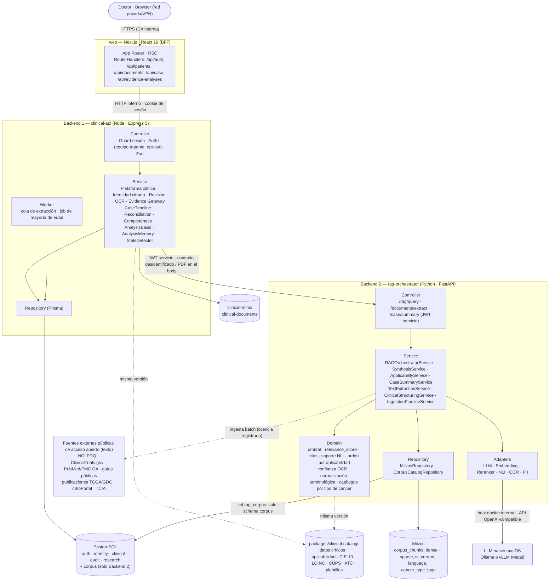
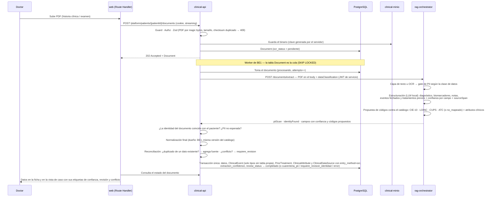
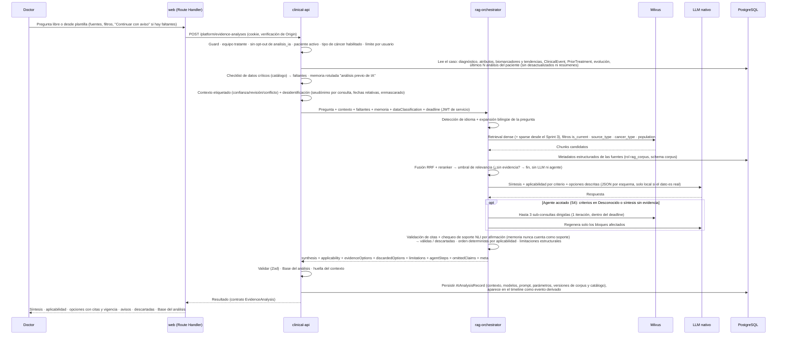
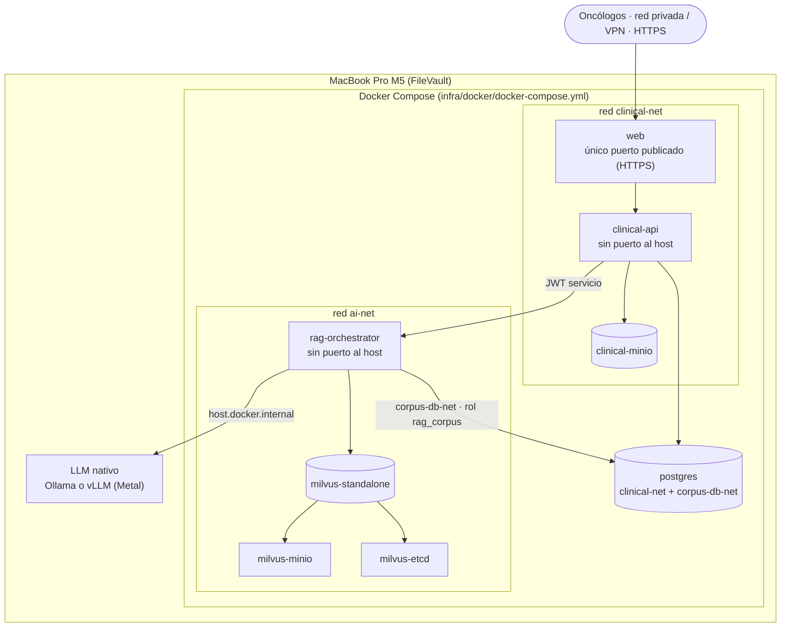
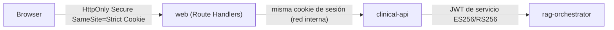
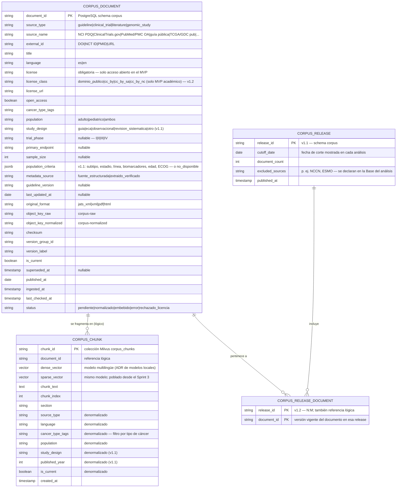

## Índice

0. [Ficha del proyecto](#0-ficha-del-proyecto)
1. [Descripción general del producto](#1-descripción-general-del-producto)
2. [Arquitectura del sistema](#2-arquitectura-del-sistema)
3. [Modelo de datos](#3-modelo-de-datos)
4. [Especificación de la API](#4-especificación-de-la-api)
5. [Historias de usuario](#5-historias-de-usuario)
6. [Tickets de trabajo](#6-tickets-de-trabajo)
7. [Pull requests](#7-pull-requests)

> 📄 Los requisitos de producto (objetivos, requisitos funcionales, reglas de negocio, requisitos no funcionales, riesgos y trazabilidad) están en el **[PRD v1.3](docs/PRD.md)**. El Product Backlog (Features, historias, ADR y decisiones) está en **[`backlog/`](backlog/features/README.md)** y se refleja en Linear.
>
> **v1.3 (2026-10-07):** el roadmap vigente es el *slicing* v2 de PRD §14; la autorización por equipo tratante (FR-15) pasa a Post-MVP (PRD B-03) y el opt-out se gestiona por CLI en el MVP (PRD B-05). Las secciones de este README que citan sprints o el equipo tratante conservan el diseño objetivo; ante discrepancia, prevalece el PRD v1.3.
>
> 🔁 **Proceso del oncólogo:** **[AS-IS](docs/AS-IS.md)** (cómo trabaja hoy, según el Discovery de 4 entrevistas) · **[TO-BE](docs/TO-BE.md)** (solución objetivo por fases: MVP, Post-MVP y Futuro).
>
> 🧭 **v1.1 y v1.2 (2026-10-04):** el producto se reconcilió con el Discovery de AI Producto (decisiones D-01 a D-16) y se resolvieron 31 hallazgos de una revisión de coherencia (R-01 a R-31). Las decisiones y su ubicación están en el [PRD §0](docs/PRD.md#0-registro-de-cambios); los criterios de aceptación del MVP, en el [PRD §18](docs/PRD.md#18-criterios-de-aceptación-del-mvp). **README, PRD y C4 forman un conjunto autocontenido**, pensado como entrada para descomponer el backlog: no dependen de otros documentos.

---

## 0. Ficha del Proyecto

### **0.1. Mario Julian Bonilla Contreras**

### **0.2. OncoLens**

### **0.3. Descripción breve del proyecto:**

OncoLens es un **MVP académico** de apoyo a la decisión clínica en oncología, diseñado para evolucionar hacia una herramienta de apoyo clínico real. **Reconstruye el caso del paciente** a partir de sus documentos (timeline, tratamientos previos y trayectorias de biomarcadores, normalizados con CIE-10, LOINC, CUPS y ATC), **señala los datos críticos que faltan** y contrasta el caso con la evidencia científica pública (guías, ensayos clínicos y publicaciones de investigación oncológica y genómica) mediante búsqueda semántica híbrida y multilingüe (español e inglés). En minutos, y no en horas de revisión manual, el oncólogo obtiene un **análisis de evidencia**: una síntesis con acuerdos y discrepancias, la **aplicabilidad** de cada fuente a su paciente criterio a criterio, y las **opciones terapéuticas descritas en la evidencia**, ordenadas por aplicabilidad, cada una con **citas verificables**. OncoLens **no prescribe**, **no** estima la probabilidad de éxito de un tratamiento y no reemplaza el juicio del oncólogo tratante.

### **0.4. URL del proyecto:**

No hay URL pública. El proyecto se ejecuta en local: Docker Compose más un servidor de LLM nativo, en una MacBook Pro M5 con 32 GB. El piloto con oncólogos se accede **solo por red privada o VPN, con HTTPS**; no se publica en internet.

### 0.5. URL o archivo comprimido del repositorio
Repo público
https://github.com/hatrickmario/OncoLens-Lab/

> ⚠️ Como el repositorio es público, **nunca** contiene datos reales: ni identificados ni anonimizados. En `data/` solo hay datos sintéticos y definiciones de datasets.

---

## 1. Descripción general del producto

> Describe en detalle los siguientes aspectos del producto:

### **1.1. Objetivo:**

> Propósito del producto. Qué valor aporta, qué soluciona, y para quién.

📄 Requisitos de producto completos: **[`docs/PRD.md`](docs/PRD.md)**. Incluye objetivos y métricas, no-objetivos, recorridos, requisitos funcionales FR-01 a FR-20, reglas de negocio, requisitos no funcionales, riesgos, TBD y trazabilidad.

OncoLens ayuda a los oncólogos a **entender el caso**, **saber qué falta**, **encontrar y entender la evidencia aplicable a su paciente** y **decidir con control total**. El Discovery con oncólogos ([AS-IS](docs/AS-IS.md)) mostró que el mayor desperdicio de tiempo ocurre antes y alrededor del razonamiento clínico: reconstruir el caso desde documentos dispersos, reconciliar resultados, detectar faltantes y juzgar si la evidencia aplica. La petición de los médicos fue: *"Ayúdame a entender mejor el caso y a tomar una mejor decisión; no me digas qué hacer"*.

OncoLens reconstruye el caso, cruza el perfil clínico y molecular con la evidencia pública y presenta un **análisis de evidencia** (síntesis, aplicabilidad y opciones descritas), **con trazabilidad hacia la fuente exacta** de cada afirmación y con la incertidumbre declarada.

- **Usuarios:** oncólogos (rol `doctor`) y administradores (rol `admin`). El piloto inicial es un grupo de **10 oncólogos**.
- **Alcance clínico del piloto:** **cáncer de mama y de próstata**. **Leucemia** se agrega como tercer tipo cuando cumpla su criterio de "listo" (§3.3 #22). La captura de datos de **menores** se mantiene desde el MVP.
- **Posicionamiento:** MVP académico con potencial de apoyo clínico real. Toda salida generada lleva el aviso *"Análisis generado por IA — requiere validación clínica del oncólogo tratante"* y la etiqueta *"Uso académico/investigación"*. El lenguaje es **no prescriptivo** (PRD RN-23).
- **Solución objetivo:** ver [TO-BE](docs/TO-BE.md) (capacidades CAP-01 a CAP-19 por fase).

**No-objetivos de esta versión:**
- Estimar la probabilidad de éxito o el pronóstico de un tratamiento.
- Prescribir o tomar decisiones clínicas autónomas.
- Reentrenar modelos (*fine-tuning*): "entrenamiento" en este proyecto significa **calibrar y evaluar**.
- Streaming de tokens del LLM al navegador.
- Despliegue en la nube o multi-institución.
- Puntaje de solidez clínica de la evidencia (ADR futuro): el MVP muestra etiquetas factuales (diseño, endpoint, n, fecha).
- Reporte a la Cuenta de Alto Costo (CAC): el MVP solo normaliza con CIE-10, LOINC, CUPS y ATC.
- Integración con la historia clínica electrónica institucional: la historia del paciente se mantiene dentro de OncoLens.
- **Post-MVP:** exploración de cohortes y outcomes históricos (el MVP guarda un snapshot longitudinal al egresar), paquete para comité de tumores, preguntas sugeridas por IA, conversación de varios turnos y job automático de retención.
- Datos bioinformáticos crudos (TCGA/GDC, cBioPortal, TCIA): solo entran sus publicaciones y resúmenes.

### **1.2. Características y funcionalidades principales:**

> Enumera y describe las características y funcionalidades específicas que tiene el producto para satisfacer las necesidades identificadas.

1. **Registro y ciclo de vida del paciente:** alta con formulario manual o asistido por OCR, con confirmación del doctor; identificación por documento (cédula de ciudadanía, tarjeta de identidad, cédula de extranjería o pasaporte) y nombres, cifrados; episodios de atención con egreso y reactivación; representante legal para menores. **Los consentimientos se firman y custodian en el sistema externo de la entidad médica**: en el MVP se presume el consentimiento para análisis con IA e investigación bajo el convenio, salvo una **marca de opt-out** que registra el administrador (PRD RN-15).
2. **Ingesta de historia clínica y exámenes desde PDF** (uno o varios a la vez), con OCR local. Extrae diagnóstico, biomarcadores, notas, **eventos clínicos fechados** y **tratamientos previos**. Cada dato lleva su **nivel de confianza** (alta, media o baja) y su **estado de revisión** (automático, requiere revisión, verificado, corregido, rechazado). El doctor puede abrir el documento de origen en el lugar exacto del valor.
3. **Reconstrucción del caso (vista de caso):** timeline de eventos, tratamientos previos por línea, series de biomarcadores (PSA siempre como serie) y un **resumen del caso** en el que cada afirmación enlaza a su dato de origen.
4. **Reconciliación y normalización:** el mismo dato repetido en varios documentos se fusiona, los valores en conflicto se marcan para revisión, y los conceptos se normalizan con **CIE-10** (diagnósticos), **LOINC** (laboratorios y biomarcadores), **CUPS** (procedimientos) y **ATC** (medicamentos).
5. **Información faltante:** checklist determinista de datos críticos por tipo de cáncer, visible en el caso y antes de cada análisis. Avisa sin bloquear.
6. **Pipeline de ingesta del corpus científico** con **fuentes públicas de acceso abierto**, licencia registrada por documento y **metadatos estructurados** (diseño, fase, endpoint, n, criterios de población, fecha y versión). Los datos del paciente **nunca se persisten** en la base vectorial ni forman parte del corpus: viajan desidentificados dentro de la consulta.
7. **Búsqueda híbrida multilingüe** (dense + sparse, español e inglés) con expansión bilingüe de la pregunta y reordenamiento (*reranker*).
8. **Análisis de evidencia (orquestador RAG):** contexto clínico desidentificado y etiquetado (con línea de tratamiento, faltantes y memoria de análisis previos rotulada), generación en el idioma de la pregunta de la **síntesis** (acuerdos y discrepancias), la **aplicabilidad** criterio a criterio y las **opciones descritas en la evidencia**, ordenadas por aplicabilidad, más un **agente acotado** que hace hasta 3 búsquedas complementarias cuando un criterio queda sin evidencia (PRD FR-30). Incluye validación de citas, **chequeo de soporte** de cada afirmación, vigencia visible y una **Base del análisis** con supuestos, faltantes, fuentes excluidas y limitaciones. Lo que no tiene soporte se descarta y se muestra aparte, solo para revisión.
9. **Investigación iterativa:** cada análisis, decisión y evolución (respuesta, toxicidad, progresión) queda en la historia del paciente dentro de OncoLens. Los análisis se marcan "desactualizados" cuando cambian sus datos, y se pueden re-ejecutar y comparar.
10. **Interfaz web** para el doctor: listado y búsqueda de pacientes, ficha, vista de caso, panel de análisis de evidencia, revisión de datos extraídos, historial de análisis, registro de la decisión y de la evolución.

### **1.3. Diseño y experiencia de usuario:**

> Proporciona imágenes y/o videotutorial mostrando la experiencia del usuario desde que aterriza en la aplicación, pasando por todas las funcionalidades principales.

**Mockups:** los mockups de baja fidelidad iniciales son anteriores a la v1.1 y no forman parte de esta documentación. El alcance funcional de la UI es el que se describe a continuación.

- **Listado de pacientes:** búsqueda exacta por número de documento y por nombre dentro del equipo tratante; filtros por estado (activo o egresado); distintivo **"SINTÉTICO"** en los pacientes de prueba.
- **Panel del doctor:** ficha del paciente (identificación, diagnóstico con su sistema de estadificación y código CIE-10, estado funcional con su escala), pestañas de resumen clínico y de exámenes y biomarcadores (semáforo normal / alterado / relevante / crítico, con unidad, rango de referencia, **tendencia** y **origen** del dato). Contador de **datos pendientes de revisión** y acceso al documento de origen de cada valor.
- **Vista de caso** *(v1.1)*: timeline de eventos (con una sección "sin fecha confiable"), atributos clínicos (estado menopáusico, histología, grado, sitios metastásicos…), tratamientos previos por línea, series de biomarcadores, **checklist de datos críticos** (presente y verificado / presente sin verificar / faltante / no aplica), botón "Resumen del caso" y registro de la **evolución** (respuesta, toxicidad, progresión).
- **Panel de análisis de evidencia** *(antes "Panel de interacción IA")*: aviso de datos faltantes con "Cargar información" o "Continuar con aviso"; pregunta libre o desde **plantilla**; fuentes y filtros. El resultado tiene cuatro bloques: **Síntesis** (puntos de acuerdo y discrepancias explicadas); **Aplicabilidad** (tabla criterio a criterio por fuente, con conteo y la etiqueta "Población no comparable" cuando aplica); **Opciones descritas en la evidencia** (ordenadas por aplicabilidad, con el criterio visible "Ordenadas por coincidencia con la población estudiada, no por eficacia"; cada opción muestra todas sus fuentes; con citas que muestran fecha y versión, avisos de datos no verificados, en conflicto o faltantes, y la "Relevancia de la evidencia" como metadato secundario); y **Base del análisis** (datos usados, faltantes, supuestos, fuentes y filtros, fuentes no incluidas, corte del corpus, limitaciones, análisis previos usados, búsquedas complementarias y afirmaciones omitidas). Las citas se muestran en su idioma original, con traducción automática opcional y etiquetada. Hay una sección colapsada de **"Descartadas por falta de soporte — solo para revisión"**. El botón es **"Analizar evidencia"**.

📌 Nota: son mockups ilustrativos de alcance funcional, no un diseño final; los mockups iniciales son anteriores a la v1.1 y no muestran la vista de caso ni los bloques nuevos del panel. Se refinarán con Figma más adelante; esta sección se actualizará con esas capturas o el prototipo y, eventualmente, con un videotutorial de la UI real.

### **1.4. Instrucciones de instalación:**
> Documenta de manera precisa las instrucciones para instalar y poner en marcha el proyecto en local (librerías, backend, frontend, servidor, base de datos, migraciones y semillas de datos, etc.)

**Estructura (monorepo `apps/` + `packages/`, npm workspaces):** ver el detalle completo en 2.3.

**Prerrequisitos:**
- macOS en Apple Silicon (entorno de referencia: MacBook Pro M5, 32 GB). FileVault activo si se van a cargar datos reales.
- Docker y Docker Compose.
- Node.js LTS + npm (con soporte de workspaces).
- Python 3.x + pip.
- **Runtime de LLM nativo:** Ollama o vLLM, instalado en macOS **fuera de Docker**, porque Docker en macOS no expone la GPU (Metal) a los contenedores. La elección final se toma en el ADR de evaluación de modelos locales (ver "Decisiones de infraestructura de IA" más abajo).

**Pasos:**

1. Clonar el repositorio: `git clone https://github.com/hatrickmario/OncoLens-Lab.git`
2. Generar secretos y certificados locales (scripts en `scripts/`, nunca se versionan):
   - par de claves ES256 del JWT de servicio (la privada solo para `clinical-api`, la pública para `rag-orchestrator`);
   - claves de cifrado de identidad y de índice ciego (HMAC), solo para `clinical-api` (§2.5);
   - roles de PostgreSQL: el de `clinical-api`, el de solo inserción de `research` y `rag_corpus` (solo el schema `corpus`), más el `pg_hba.conf` que restringe `rag_corpus` a `corpus-db-net`;
   - certificados TLS de PostgreSQL y certificado HTTPS de `web` emitido por una CA interna;
   - credenciales de los dos MinIO: `clinical-minio` (solo `clinical-api`) y el MinIO de Milvus (solo corpus).
3. Configurar variables de entorno (`.env`) por app: conexiones, `LLM_BASE_URL` y `LLM_MODEL` (API compatible con OpenAI del runtime nativo), `LLM_CLOUD_ENABLED=false`, `ENABLED_CANCER_TYPES=mama,prostata`, `REAL_ANONYMIZED_ENABLED=false`, `REAL_IDENTIFIED_ENABLED=false`, plazos de retención, parámetros de sesión (§2.5), `CLINICAL_CATALOG_VERSION` (versión de `packages/clinical-catalogs`), `ANALYSIS_MEMORY_MAX=3` (análisis previos que entran como memoria), `EVIDENCE_STALE_YEARS=5` (antigüedad para "posiblemente desactualizada"), `AGENT_MAX_ITERATIONS=1` y `AGENT_MAX_SUBQUERIES=3` (agente acotado). Los cuatro últimos son *propuestas, a calibrar*. El catálogo clínico se monta como volumen de solo lectura en ambos backends (`CLINICAL_CATALOG_PATH`).
4. Arrancar el LLM nativo (p. ej., `ollama serve`) y descargar los modelos fijados en el ADR de modelos locales (ver "Decisiones de infraestructura de IA"). Los modelos de *embeddings*, *reranker* y NLI se descargan para `rag-orchestrator`, que los ejecuta en CPU.
5. Levantar la infraestructura y las apps: `docker compose -f infra/docker/docker-compose.yml up -d` (PostgreSQL, `clinical-minio`, Milvus con etcd y su MinIO, `clinical-api`, `rag-orchestrator`, `web`).
6. **Backend de plataforma** (`apps/clinical-api/`), para desarrollo fuera de Compose:
   ```
   npm install
   npx prisma migrate dev
   npx prisma db seed        # solo datos sintéticos; se niega a correr en el entorno "piloto"
   npm run dev
   ```
7. **Servicio RAG** (`apps/rag-orchestrator/`):
   ```
   pip install -r requirements.txt
   uvicorn app.main:app --reload   # ajustar el módulo de entrada según se defina
   python -m app.scripts.load_seed_corpus   # corpus semilla (mama y próstata), solo fuentes públicas abiertas, con metadatos estructurados
   ```
8. **Frontend** (`apps/web/`):
   ```
   npm install
   npm run dev
   ```
9. Antes de habilitar datos reales: `oncolens preflight real-data` verifica los prerrequisitos del gate G-piloto (§2.5). `clinical-api` no arranca con una bandera de datos reales en `true` si alguno falla.

**Decisiones de infraestructura de IA:**
- **OCR:** local; los documentos no salen a la nube. Primero se extrae la capa de texto digital del PDF (sin OCR); las páginas escaneadas pasan por OCR (candidatos: Tesseract `spa+eng` o PaddleOCR). La estructuración la hace el mismo LLM local con salida JSON restringida por esquema. Descartado el vision-LLM directo: memoria, latencia sin GPU en Docker y falta de confianza por campo.
- **LLM y *embeddings*:** configurable, **local por defecto**. La nube solo se permite para pruebas con datos **sintéticos**; los datos reales nunca salen a un proveedor externo, regla que aplica el código.
- **Modelos concretos** (LLM, *embeddings* multilingües, *reranker*, NLI, motor de OCR): se eligen en el **ADR de evaluación de modelos locales**, al inicio del Sprint 1, midiendo con el stack completo levantado:
  - **Restricciones duras:** memoria total ≤ 24 GB (dejando ≥ 8 GB para macOS); `/platform/evidence-analyses` con p95 ≤ 15 s (se recalibra en el S4 con síntesis y aplicabilidad); extracción con p95 ≤ 60 s por documento; licencia compatible con uso académico; buen desempeño en español; salida JSON válida ≥ 99%; uso real de la GPU de la M5 (verificar el soporte de vLLM en Apple Silicon).
  - **Candidatos:** runtime Ollama o vLLM; LLM *instruct* de 7–8B multilingüe cuantizado a 4 bits (un modelo de ~14B solo si cumple las restricciones y mejora las métricas de forma medible); *embeddings* BGE-M3 (dense + sparse) o multilingual-e5-large; *reranker* bge-reranker-v2-m3; NLI multilingüe de la familia mDeBERTa-v3 (XNLI); OCR Tesseract o PaddleOCR. Las versiones se fijan en la fecha de ejecución.
  - **Método:** correr la suite de evaluación (OL-06) y el protocolo de latencia y memoria (3 corridas, mediana); descartar los que no cumplen las restricciones; elegir por la métrica principal de cada componente (en empate, el de menor memoria); fijar las versiones en la configuración.

---

## 2. Arquitectura del Sistema

### **2.1. Diagrama de arquitectura:**
> Usa el formato que consideres más adecuado para representar los componentes principales de la aplicación y las tecnologías utilizadas. Explica si sigue algún patrón predefinido, justifica por qué se ha elegido esta arquitectura, y destaca los beneficios principales que aportan al proyecto y justifican su uso, así como sacrificios o déficits que implica.

**Patrón:** BFF (*Backend for Frontend*, los Route Handlers de `web`) + **servicio de plataforma clínica** (Backend 1, que también actúa de gateway de IA) + **servicio especializado de IA** (Backend 2). Los backends se organizan en capas **Controller → Service → Repository**; en Backend 2, las integraciones con modelos (LLM, *embeddings*, *reranker*, NLI, OCR) se implementan como **Adapters**. Hay **bounded contexts** explícitos y una regla de ownership estricta:

- **Backend 1 (`clinical-api`)** posee el registro clínico: identidad (cifrada), autorización, historia clínica, exámenes, biomarcadores, documentos clínicos, **caso longitudinal** (eventos, tratamientos previos, evolución), historial de análisis, **marcas de opt-out**, retención y auditoría. Es dueño exclusivo de **PostgreSQL** y de **`clinical-minio`** (almacén de documentos clínicos). En v1.1 agrega la **lógica determinista** que toca datos del paciente: timeline, reconciliación, **normalización terminológica final** (también para los datos manuales; §3.3 #33), checklist de faltantes, Base del análisis, detección de análisis desactualizados y memoria de análisis.
- **Backend 2 (`rag-orchestrator`)** posee el análisis asistido por IA: recuperación, generación (síntesis, aplicabilidad, opciones descritas y resumen del caso), **agente acotado de búsqueda complementaria**, validación y extracción de documentos (con **propuesta** de códigos terminológicos). Es dueño de **Milvus**, del **catálogo del corpus** (schema `corpus` de PostgreSQL) y de los buckets del corpus. **No tiene acceso a los datos clínicos:** en PostgreSQL usa un rol limitado al schema `corpus` (red dedicada, `pg_hba` restringido, tests de acceso denegado) y no tiene credenciales ni red hacia `clinical-minio`. Procesa documentos clínicos **de forma transitoria, en memoria**, sin persistirlos, y en `/rag/query` recibe solo un contexto desidentificado.
- **LLM nativo** (Ollama o vLLM, fuera de Docker, con GPU Metal): lo consume solo Backend 2, mediante una API compatible con OpenAI.
- **Catálogos clínicos versionados** (`packages/clinical-catalogs`, v1.1): datos críticos, criterios de aplicabilidad, sinónimos y subconjuntos de CIE-10, LOINC, CUPS y ATC por tipo de cáncer, y plantillas de preguntas. Son **datos, no código**: un artefacto JSON versionado que se monta en ambos contenedores; los dos cargan la misma versión (`CLINICAL_CATALOG_VERSION`), Backend 2 rechaza con `409` una versión distinta y cada análisis la registra (§3.3 #38).

**Por qué esta arquitectura:**
- El navegador **solo habla con `web`**. Los Route Handlers centralizan el acceso a `clinical-api`, que no publica puerto al host.
- Node/Express es la herramienta correcta para CRUD tipado, autenticación y la API de plataforma; Python/FastAPI, para el ecosistema RAG/ML.
- Aislar el servicio de IA de las bases clínicas reduce el radio de impacto de una vulnerabilidad en la capa más expuesta a entradas no confiables (documentos, corpus, salida del LLM).

**Sacrificios / déficits:**
- Mayor complejidad operativa: 2 runtimes, 2 lenguajes, autenticación servicio a servicio, un salto de red adicional en cada consulta RAG y un componente fuera de Docker (el LLM nativo).
- Riesgo de consistencia eventual: Backend 2 calcula el resultado del análisis, pero lo persiste Backend 1. Se mitiga respondiendo solo después de persistir (OL-03).
- Requiere disciplina de *contract testing* entre Node y Python para evitar *drift* entre sus specs OpenAPI.
- Hardware limitado (32 GB compartidos): concurrencia de inferencia acotada (1–2 simultáneas) y modelos de 7–8B elegidos por medición (ADR de modelos locales, 1.4).

📐 Diagramas C4 completos (contexto, contenedores, componentes y código): **[`docs/OncoLens-C4.drawio`](docs/OncoLens-C4.drawio)** (se abre con [draw.io](https://app.diagrams.net)).


```mermaid
flowchart TD
    Doctor(["Doctor · Browser (red privada/VPN)"])

    subgraph FE["web — Next.js · React 19 (BFF)"]
        Next["App Router · RSC<br/>Route Handlers: /api/auth, /api/patients, /api/documents, /api/case, /api/evidence-analyses"]
    end

    subgraph BE1["Backend 1 — clinical-api (Node · Express 5)"]
        C1["Controller<br/>Guard sesión · Authz (equipo tratante, opt-out) · Zod"]
        S1["Service<br/>Plataforma clínica · Identidad cifrada · Revisión OCR · Evidence Gateway<br/>CaseTimeline · Reconciliation · Completeness · AnalysisBasis · AnalysisMemory · StaleDetector"]
        W1["Worker<br/>cola de extracción · job de mayoría de edad"]
        R1["Repository (Prisma)"]
        C1 --> S1 --> R1
        W1 --> R1
    end

    PG[("PostgreSQL<br/>auth · identity · clinical · audit · research<br/>+ corpus (solo Backend 2)")]
    CM[("clinical-minio<br/>clinical-documents")]

    subgraph BE2["Backend 2 — rag-orchestrator (Python · FastAPI)"]
        C2["Controller<br/>/rag/query · /documents/extract · /case/summary (JWT servicio)"]
        S2["Service<br/>RAGOrchestratorService · SynthesisService · ApplicabilityService · CaseSummaryService<br/>TextExtractionService · ClinicalStructuringService · IngestionPipelineService"]
        D2["Domain<br/>umbral · relevance_score · citas · soporte NLI · orden por aplicabilidad<br/>confianza OCR · normalización terminológica · catálogos por tipo de cáncer"]
        R2["Repository<br/>MilvusRepository · CorpusCatalogRepository"]
        A2["Adapters<br/>LLM · Embedding · Reranker · NLI · OCR · PII"]
        C2 --> S2
        S2 --> D2
        S2 --> R2
        S2 --> A2
    end

    Milvus[("Milvus<br/>corpus_chunks: dense + sparse, is_current, language, cancer_type_tags")]
    LLM["LLM nativo macOS<br/>Ollama o vLLM (Metal)"]
    CAT[("packages/clinical-catalogs<br/>datos críticos · aplicabilidad · CIE-10 · LOINC · CUPS · ATC · plantillas")]
    Ext["Fuentes externas públicas de acceso abierto (texto)<br/>NCI PDQ · ClinicalTrials.gov · PubMed/PMC OA · guías públicas<br/>publicaciones TCGA/GDC · cBioPortal · TCIA"]

    Doctor -- "HTTPS (CA interna)" --> Next
    Next -- "HTTP interno · cookie de sesión" --> C1
    R1 --> PG
    S1 --> CM
    S1 -- "JWT servicio · contexto desidentificado / PDF en el body" --> C2
    R2 --> Milvus
    R2 -- "rol rag_corpus: solo schema corpus" --> PG
    A2 -- "host.docker.internal · API OpenAI-compatible" --> LLM
    S2 -. "ingesta batch (licencia registrada)" .-> Ext
    S1 -. "misma versión" .-> CAT
    D2 -. "misma versión" .-> CAT
```

> La solución objetivo completa, con las capacidades Post-MVP y Futuro, está en [TO-BE](docs/TO-BE.md). Este diagrama muestra solo el MVP.

**Flujo 1 — Carga de documento clínico (OCR):**


```mermaid
sequenceDiagram
    participant D as Doctor
    participant FE as web (Route Handler)
    participant BE1 as clinical-api
    participant PG as PostgreSQL
    participant CM as clinical-minio
    participant BE2 as rag-orchestrator

    D->>FE: Sube PDF (historia clínica / examen)
    FE->>BE1: POST /platform/patients/{patientId}/documents (cookie, streaming)
    BE1->>BE1: Guard · Authz · Zod (PDF por magic bytes, tamaño, checksum duplicado → 409)
    BE1->>CM: Guarda el binario (clave generada por el servidor)
    BE1->>PG: Document (ocr_status = pendiente)
    BE1-->>FE: 202 Accepted + Document
    Note over BE1,PG: Worker de BE1 — la tabla Document es la cola (SKIP LOCKED)
    BE1->>PG: Toma el documento (procesando, attempts++)
    BE1->>BE2: POST /documents/extract — PDF en el body + dataClassification (JWT de servicio)
    BE2->>BE2: Capa de texto u OCR → gate de PII según la clase de datos
    BE2->>BE2: Estructuración (LLM local): diagnóstico, biomarcadores, notas,<br/>eventos fechados y tratamientos previos + confianza por campo + sourceSpan
    BE2->>BE2: Propuesta de códigos contra el catálogo: CIE-10 · LOINC · CUPS · ATC (o no_mapeado) + atributos clínicos
    BE2-->>BE1: piiScan · identityFound · campos con confianza y códigos propuestos
    BE1->>BE1: ¿La identidad del documento coincide con el paciente? ¿PII no esperada?
    BE1->>BE1: Normalización final (dueño: BE1, misma versión del catálogo)
    BE1->>BE1: Reconciliación: ¿duplicado de un dato existente? → agrega fuente · ¿conflicto? → requiere_revision
    BE1->>PG: Transacción única: datos, ClinicalEvent (solo tipos sin tabla propia), PriorTreatment, ClinicalAttribute y ClinicalDataSource con entry_method=ocr,<br/>extraction_confidence, review_status → completado (o cuarentena_pii / requiere_revision_identidad / error)
    FE->>BE1: Consulta el estado del documento
    FE-->>D: Datos en la ficha y en la vista de caso con sus etiquetas de confianza, revisión y conflicto
```

**Flujo 2 — Análisis de evidencia (RAG):**

> El análisis de evidencia se implementa con un **Route Handler** de Next.js (`app/api/evidence-analyses/route.ts`), no con una Server Action: es un proxy HTTP explícito hacia `clinical-api`, controla los status codes y deja abierta la opción de streaming de progreso. En v1.1 reemplaza a la "consulta RAG" de la v1.0 (`/platform/rag/query`): la salida pasa de "recomendaciones" a un **análisis de evidencia** con síntesis, aplicabilidad, opciones descritas y Base del análisis (PRD D-01).
>
> **Decisión sobre streaming:** **nunca se transmiten al navegador tokens del LLM sin validar.** Backend 2 valida citas y soporte sobre la respuesta completa, y Backend 1 persiste el `AIAnalysisRecord` antes de responder. En el Sprint 1 la respuesta es un JSON completo (contrato de 4.1). 🚧 **Pendiente — ADR tras medir el p95 del Sprint 1 (KR2):** si la latencia afecta la experiencia, se agrega streaming de **eventos de progreso** vía SSE (recuperando evidencia → generando → validando), nunca de contenido.


```mermaid
sequenceDiagram
    participant D as Doctor
    participant FE as web (Route Handler)
    participant BE1 as clinical-api
    participant BE2 as rag-orchestrator
    participant MV as Milvus
    participant LLM as LLM nativo
    participant PG as PostgreSQL

    D->>FE: Pregunta libre o desde plantilla (fuentes, filtros, "Continuar con aviso" si hay faltantes)
    FE->>BE1: POST /platform/evidence-analyses (cookie, verificación de Origin)
    BE1->>BE1: Guard · equipo tratante · sin opt-out de analisis_ia · paciente activo · tipo de cáncer habilitado · límite por usuario
    BE1->>PG: Lee el caso: diagnóstico, atributos, biomarcadores y tendencias, ClinicalEvent, PriorTreatment, evolución,<br/>últimos N análisis del paciente (sin desactualizados ni resúmenes)
    BE1->>BE1: Checklist de datos críticos (catálogo) → faltantes · memoria rotulada "análisis previo de IA"
    BE1->>BE1: Contexto etiquetado (confianza/revisión/conflicto) + desidentificación (seudónimo por consulta, fechas relativas, enmascarado)
    BE1->>BE2: Pregunta + contexto + faltantes + memoria + dataClassification + deadline (JWT de servicio)
    BE2->>BE2: Detección de idioma + expansión bilingüe de la pregunta
    BE2->>MV: Retrieval dense (+ sparse desde el Sprint 3), filtros is_current · source_type · cancer_type · population
    MV-->>BE2: Chunks candidatos
    BE2->>PG: Metadatos estructurados de las fuentes (rol rag_corpus, schema corpus)
    BE2->>BE2: Fusión RRF + reranker → umbral de relevancia (¿sin evidencia? → fin, sin LLM ni agente)
    BE2->>LLM: Síntesis + aplicabilidad por criterio + opciones descritas (JSON por esquema, solo local si el dato es real)
    LLM-->>BE2: Respuesta
    opt Agente acotado (S4): criterios en Desconocido o síntesis sin evidencia
        BE2->>MV: Hasta 3 sub-consultas dirigidas (1 iteración, dentro del deadline)
        BE2->>LLM: Regenera solo los bloques afectados
    end
    BE2->>BE2: Validación de citas + chequeo de soporte NLI por afirmación (memoria nunca cuenta como soporte)<br/>→ válidas / descartadas · orden determinista por aplicabilidad · limitaciones estructurales
    BE2-->>BE1: synthesis + applicability + evidenceOptions + discardedOptions + limitations + agentSteps + omittedClaims + meta
    BE1->>BE1: Validar (Zod) · Base del análisis · huella del contexto
    BE1->>PG: Persistir AIAnalysisRecord (contexto, modelos, prompt, parámetros, versiones de corpus y catálogo),<br/>aparece en el timeline como evento derivado
    BE1-->>FE: Resultado (contrato EvidenceAnalysis)
    FE-->>D: Síntesis · aplicabilidad · opciones con citas y vigencia · avisos · descartadas · Base del análisis
```

### **2.2. Descripción de componentes principales:**

> Describe los componentes más importantes, incluyendo la tecnología utilizada

| Componente | Tecnología | Responsabilidad |
|---|---|---|
| **web** (Frontend + BFF) | React 19, Next.js (App Router, RSC, Route Handlers, Server Actions), TypeScript, Tailwind CSS v4, shadcn/ui | UI del doctor y **único punto de entrada del navegador**: ficha, **vista de caso**, **panel de análisis de evidencia**, revisión, historial y evolución. Route Handlers como proxy de todos los endpoints de `clinical-api` (cookie `SameSite=Strict` + verificación de `Origin`). Sin streaming de tokens sin validar. |
| **Backend 1 — `clinical-api`** | Node.js LTS, Express 5, TypeScript, Zod, Prisma, OpenAPI/Swagger UI | Autenticación y autorización (RBAC + equipo tratante + marcas de opt-out), identidad cifrada con índice ciego, pacientes, episodios, documentos, revisión de datos extraídos, **caso longitudinal** (timeline, tratamientos previos, evolución), **reconciliación y normalización final** (dueño; Backend 2 solo propone códigos), **checklist de faltantes**, módulo único `evidence-analysis`: gateway del análisis de evidencia e historial (**Base del análisis**, **memoria de análisis**, **detección de desactualizados**), persistencia de análisis, retención (política) y auditoría. *Worker* de extracción y *job* de mayoría de edad. Dueño exclusivo de PostgreSQL y `clinical-minio`. |
| **`packages/clinical-catalogs`** *(v1.1)* | Artefacto JSON versionado, montado en ambos contenedores | Catálogos clínicos por tipo de cáncer: matriz "ítem → campo" (PRD RN-29), datos críticos y reglas condicionales, criterios de aplicabilidad (y cuáles son excluyentes), sinónimos, subconjuntos de CIE-10, LOINC, CUPS y ATC, y plantillas de preguntas. Los valida el oncólogo (PRD RN-20). |
| **PostgreSQL** | PostgreSQL | Único motor relacional. Schemas `auth`, `identity`, `clinical`, `audit` y `research` (Backend 1) y `corpus` (catálogo del corpus, Backend 2, con rol propio y sin acceso a los demás schemas) (§3.1). |
| **clinical-minio** | MinIO | Binarios de los documentos clínicos (bucket `clinical-documents`). Instancia separada del MinIO de Milvus; solo `clinical-api` tiene credenciales y ruta de red. |
| **Backend 2 — `rag-orchestrator`** | Python, FastAPI, Pydantic, OpenAPI | Orquestador RAG (expansión bilingüe, recuperación híbrida, *reranker*, generación de **síntesis**, **aplicabilidad** y **opciones descritas**, orden por aplicabilidad, **agente acotado de búsqueda complementaria**, validación de citas, chequeo NLI); **resumen del caso**; extracción de documentos (capa de texto u OCR, gate de PII, estructuración con confianza por campo, eventos, tratamientos previos, atributos y **propuesta de códigos terminológicos**); ingesta del corpus de fuentes abiertas con licencias y **metadatos estructurados**. *Embeddings*, *reranker* y NLI corren en CPU dentro del contenedor. |
| **Milvus** | Milvus standalone (+ etcd + MinIO propio) | Chunks del corpus con vectores dense y sparse y metadatos de filtrado (`is_current`, `source_type`, `language`, `cancer_type_tags`). |
| **LLM nativo** | Ollama o vLLM en macOS (Metal), API compatible con OpenAI | Generación de respuestas, estructuración de documentos y expansión bilingüe. Modelo fijado por el ADR de modelos locales (1.4). La nube solo se usa con datos sintéticos. |

### **2.3. Descripción de alto nivel del proyecto y estructura de ficheros**

> Representa la estructura del proyecto y explica brevemente el propósito de las carpetas principales, así como si obedece a algún patrón o arquitectura específica.

Monorepo tipo `apps/` + `packages/` (npm workspaces). Dentro de cada app se aplica **Controller → Service → Repository**: agrupado por módulo de dominio en Backend 1, y con nomenclatura Hexagonal/Clean Architecture en Backend 2, que añade una capa **domain** para reglas puras y **Adapters** para las integraciones:

```
OncoLens/
├── apps/
│   ├── web/                              # Frontend + BFF — Next.js, React 19, App Router
│   │   ├── app/
│   │   │   ├── (dashboard)/               # Listado, ficha, vista de caso, panel de análisis de evidencia, revisión, historial
│   │   │   └── api/                       # Route Handlers: auth · patients · documents · case · evidence-analyses (proxy hacia clinical-api)
│   │   └── components/                    # shadcn/ui + componentes propios (Atomic Design)
│   │
│   ├── clinical-api/                      # Backend 1 — Node.js LTS + Express 5
│   │   ├── src/
│   │   │   ├── modules/                   # users · patients · identity · episodes · opt-outs · documents
│   │   │   │   │                          # clinical-data (revisión) · treatments · retention · audit
│   │   │   │   │                          # v1.1: case-timeline · clinical-events · clinical-attributes · reconciliation (normalización final) · completeness
│   │   │   │   │                          #       evidence-analysis (módulo único: gateway, historial, analysis-basis, analysis-memory, stale-detector) · feedback
│   │   │   │   │                          # cada módulo: *.controller.ts · *.service.ts · *.repository.ts · *.schema.ts (Zod)
│   │   │   ├── workers/                   # cola de extracción · job de mayoría de edad (job de retención: Post-MVP)
│   │   │   ├── middleware/                # auth · authorize · origin-check · rate-limit · error-handler
│   │   │   ├── infrastructure/            # prisma client, crypto (cifrado + HMAC), minio client, rag-orchestrator.client.ts
│   │   │   └── routes/
│   │   ├── prisma/                        # schema.prisma, migraciones, seed (solo sintético)
│   │   └── openapi.yaml                   # contrato del proveedor: fuente única (contract-first)
│   │
│   └── rag-orchestrator/                  # Backend 2 — Python + FastAPI
│       ├── app/
│       │   ├── api/                       # routers: /rag/query, /documents/extract, /case/summary
│       │   ├── application/               # RAGOrchestratorService (incluye el agente acotado), SynthesisService, ApplicabilityService,
│       │   │                              # CaseSummaryService, TextExtractionService,
│       │   │                              # ClinicalStructuringService, IngestionPipelineService
│       │   ├── domain/                    # reglas puras: umbral, relevance_score, citas, soporte, orden por aplicabilidad,
│       │   │                              # confianza OCR, normalización terminológica, regla de proveedores
│       │   ├── infrastructure/
│       │   │   ├── milvus/                # MilvusRepository
│       │   │   ├── catalog/               # CorpusCatalogRepository (PostgreSQL, schema corpus) + migraciones Alembic
│       │   │   ├── embeddings/ · reranker/ · nli/ · ocr/ · pii/
│       │   │   └── llm/                   # LLMAdapter (local OpenAI-compatible; nube solo con datos sintéticos)
│       │   │                              # (sin acceso a schemas clínicos ni a clinical-minio)
│       │   └── schemas/                   # Pydantic; generated/ se genera desde openapi.yaml (no editar)
│       ├── openapi.yaml                   # contrato del proveedor: fuente única (contract-first)
│       └── requirements.txt
│
├── packages/
│   ├── api-contracts/                     # generado desde los openapi.yaml (no editar): tipos, clientes
│   │                                      # y schemas Zod compartidos por web y clinical-api (src/zod/)
│   └── clinical-catalogs/                 # v1.1 — artefacto JSON versionado, montado en ambos contenedores (datos, no código):
│                                          # datos críticos · criterios de aplicabilidad · sinónimos ·
│                                          # subconjuntos CIE-10 / LOINC / CUPS / ATC · plantillas de preguntas
│
├── data/                                   # ⚠️ repo PÚBLICO: solo datos sintéticos y corpus público
│   ├── raw/ · normalized/                 # corpus externo público (con licencia registrada)
│   └── evaluation/                        # datasets SINTÉTICOS y definiciones; los datos reales anonimizados
│                                          # viven fuera del repo (volumen local cifrado, .gitignore)
│
├── docs/
│   ├── PRD.md                             # Product Requirements Document v1.3 (requisitos, reglas, NFR, trazabilidad)
│   ├── AS-IS.md                           # proceso actual del oncólogo (Discovery)
│   ├── TO-BE.md                           # solución objetivo por fases (MVP · Post-MVP · Futuro)
│   ├── OncoLens-C4.drawio                 # diagramas C4: contexto, contenedores, componentes y código
│   ├── architecture/adr/                  # ADRs pendientes: modelos locales, fuentes y licencias, evaluación RAG,
│   │                                      # scoring de evidencia clínica, streaming de progreso
│   ├── api/
│   └── rag/
│
├── backlog/                                # features e historias (fuente de verdad; Linear OncoLens-1 es el espejo),
│                                           # requisitos, ADRs, trazabilidad y auditoría
├── openspec/                               # Spec-Driven Development (OpenSpec)
│   ├── config.yaml                         # contexto, invariantes y reglas por artefacto
│   ├── specs/                              # contrato verificable del comportamiento actual, por capacidad
│   └── changes/                            # un change por historia (l1d-<nn>-<slug>); archive/ al cierre del sprint
├── .claude/                                # Claude Code: agents/, skills/, commands/opsx/, hooks/, settings.json
├── infra/docker/                           # docker-compose.yml, redes clinical-net / ai-net / corpus-db-net, pg_hba.conf, certs/
├── scripts/                                # claves, certificados, buckets, preflight real-data
├── .github/workflows/                      # CI: build, tests, validación OpenAPI, escaneo de secretos/PII
├── CLAUDE.md                               # reglas: Backend 2 solo el schema corpus (nunca datos clínicos) ni clinical-minio, sesión ≠ credencial de servicio,
│                                           # datos reales nunca a la nube ni al repo, identidad nunca fuera de clinical-api
└── package.json                            # workspaces: ["apps/*", "packages/*"] (npm)
```

### **2.4. Infraestructura y despliegue**

> Detalla la infraestructura del proyecto, incluyendo un diagrama en el formato que creas conveniente, y explica el proceso de despliegue que se sigue

Entorno local: **Docker Compose** en una MacBook Pro M5 (32 GB) y **un componente nativo** fuera de Compose, el LLM, para aprovechar la GPU. Milvus *standalone* requiere sus dependencias propias (`etcd` y `MinIO`). Los documentos clínicos viven en un **MinIO separado** (`clinical-minio`).


```mermaid
flowchart TD
    VPN(["Oncólogos · red privada / VPN · HTTPS"])
    subgraph Host["MacBook Pro M5 (FileVault)"]
        LLM["LLM nativo<br/>Ollama o vLLM (Metal)"]
        subgraph Compose["Docker Compose (infra/docker/docker-compose.yml)"]
            subgraph CN["red clinical-net"]
                FE["web<br/>único puerto publicado (HTTPS)"]
                BE1["clinical-api<br/>sin puerto al host"]
                CM[("clinical-minio")]
            end
            PG[("postgres<br/>clinical-net + corpus-db-net")]
            subgraph AN["red ai-net"]
                BE2["rag-orchestrator<br/>sin puerto al host"]
                MV[("milvus-standalone")]
                ETCD["milvus-etcd"]
                MMINIO["milvus-minio"]
            end
        end
    end
    VPN --> FE
    FE --> BE1
    BE1 --> PG
    BE1 --> CM
    BE1 -- "JWT servicio" --> BE2
    BE2 -- "corpus-db-net · rol rag_corpus" --> PG
    BE2 --> MV
    MV --> ETCD
    MV --> MMINIO
    BE2 -- "host.docker.internal" --> LLM
```

- **Puertos:** solo `web` publica un puerto, y solo en la interfaz de la red privada o VPN. `clinical-api` y `rag-orchestrator` no publican puertos al host.
- **Redes:** `clinical-net` (web, `clinical-api`, PostgreSQL, `clinical-minio`), `ai-net` (`clinical-api`, `rag-orchestrator`, Milvus) y `corpus-db-net` (solo `rag-orchestrator` y PostgreSQL). `rag-orchestrator` no tiene ruta hacia `clinical-minio`. En PostgreSQL, `pg_hba.conf` solo acepta al rol `rag_corpus` desde `corpus-db-net` (TLS + SCRAM), y ese rol no tiene permisos fuera del schema `corpus`.
- **Entornos:** `local` (desarrollo, solo datos sintéticos) y `piloto` (10 oncólogos; datos reales solo después del gate G-piloto, §2.5). No hay entorno cloud en esta versión.
- **Operación del piloto:** FileVault activo, *backups* cifrados fuera del equipo (rotación corta, coherente con la retención), prueba de restauración por sprint y apagado y arranque documentados.
- **Despliegue:** arrancar el LLM nativo y luego `docker compose -f infra/docker/docker-compose.yml up -d` (ver 1.4).

### **2.5. Seguridad**

> Enumera y describe las prácticas de seguridad principales que se han implementado en el proyecto, añadiendo ejemplos si procede

**Autenticación — dos mecanismos separados, nunca intercambiables:**


```mermaid
flowchart LR
    B["Browser"] -- "HttpOnly Secure SameSite=Strict Cookie" --> N["web (Route Handlers)"]
    N -- "misma cookie de sesión (red interna)" --> BE1["clinical-api"]
    BE1 -- "JWT de servicio ES256/RS256" --> BE2["rag-orchestrator"]
```

- **Sesión del doctor:** cookie `oncolens_session` `HttpOnly` + `Secure` + `SameSite=Strict` con un **token opaco** (no JWT), guardado solo como `token_hash` en `Session`.
  - Se rota al iniciar sesión.
  - Expira a las **8 h**, con cierre por **30 min** de inactividad.
  - **Bloqueo de 15 min tras 5 intentos fallidos**, por cuenta y por IP.
  - **Logout** con revocación.
  - Contraseñas con **Argon2id**.
  - Todos los valores son configurables.
  - Alta y baja de usuarios por un script de administración (CLI).
- **CSRF:** `SameSite=Strict` más verificación de la cabecera `Origin` en todos los Route Handlers que mutan.
- **Guard** en `clinical-api`: valida la sesión en cada request antes de enrutar.
- **Autorización:** RBAC (`Role`/`Permission`) para las *acciones*. **Equipo tratante** (`CareTeamMember`: varios doctores activos por paciente, uno principal) para decidir *sobre qué pacientes*. El rol `admin` ve todos.
- **Clases de datos:**
  - `sintetico`: identificación aleatoria y distintivo visible.
  - `real_anonimizado`: calibración y pruebas.
  - `real_identificado`: pacientes del piloto con documento y nombres, amparados en el contrato marco.
- **Identidad cifrada:**
  - Documento y nombres viven en el schema `identity`, cifrados en la aplicación con AES-256-GCM.
  - Un **índice ciego HMAC-SHA256** permite buscar el documento de forma exacta.
  - Las claves solo están en `clinical-api`.
  - La identidad **nunca** sale de `clinical-api` hacia el LLM, el histórico, los *logs* ni la auditoría. Solo la ve el doctor autorizado, y cada vista queda auditada.
  - Ver §3.3 #6.
- **Desidentificación hacia la IA:**
  - El contexto que va a Backend 2 lleva un `pseudoPatientId` **aleatorio por consulta** (nunca en el prompt) y fechas relativas.
  - El **texto libre** (pregunta y notas) se enmascara con un detector de PII, cuyos formatos son configurables sin asumir un país.
  - Aplica también al contexto ampliado de v1.1: eventos, tratamientos previos, faltantes y la **memoria de análisis previos** (pregunta enmascarada, sin identidad, fechas relativas).
  - Esto aplica **siempre**, no "cuando sea necesario".
- **Memoria de análisis no citable** (v1.1, PRD RN-24): los últimos N análisis **del paciente** (todo el equipo tratante; sin desactualizados ni resúmenes) entran al contexto rotulados como "análisis previo de IA" y delimitados como datos. Nunca son citables ni cuentan como soporte en el chequeo NLI, para que la IA no se retroalimente con sus propias salidas. Hay un test que lo verifica.
- **Gate de PII en documentos:**
  - En `sintetico` y `real_anonimizado`, cualquier PII lleva a `cuarentena_pii`.
  - En `real_identificado` se esperan la identidad del propio paciente (usada para verificar que el documento corresponde) y cualquier otra PII se enmascara.
- **Regla de proveedores:** Backend 1 envía `dataClassification` y Backend 2 **solo** usa modelos locales para datos reales, sin *fallback* a la nube. Hay un test que lo verifica.
- **Credencial de servicio** (Backend 1 → Backend 2): JWT con **firma asimétrica (ES256 o RS256)**.
  - Solo `clinical-api` tiene la clave privada.
  - Claims `iss = clinical-api`, `aud = rag-orchestrator` y `exp` corto, con el algoritmo fijado.
  - La sesión del doctor **nunca** viaja hasta Backend 2.
- **Aislamiento de Backend 2:** sin credenciales ni red hacia `clinical-minio`. En PostgreSQL solo usa el rol `rag_corpus`:
  - `USAGE` y DML solo sobre el schema `corpus`;
  - `REVOKE ALL` sobre `auth`, `identity`, `clinical`, `audit` y `research`, más `ALTER DEFAULT PRIVILEGES` para las tablas futuras;
  - `pg_hba` restringido a `corpus-db-net` con TLS;
  - `CONNECTION LIMIT` y *timeouts*;
  - tests de CI que verifican *permission denied* sobre todos los schemas clínicos.

  **Riesgo residual aceptado:** Backend 2 comparte servidor con los datos clínicos, así que un escalamiento de privilegios en PostgreSQL podría exponerlos. Se mitiga con los tests, el `preflight` y PostgreSQL actualizado. El PDF viaja en el cuerpo del request y Backend 2 no lo persiste ni lo registra en *logs*.
- **Schemas separados** en PostgreSQL: `auth`, `identity`, `clinical`, `audit`, `research` (rol de solo inserción) y `corpus` (rol `rag_corpus`, sin datos de pacientes).
- **Cifrado:** FileVault y volúmenes cifrados; TLS hacia PostgreSQL (`sslmode=require`); HTTPS con una CA interna hacia el navegador.
- **Validación de entrada** en cada borde: Zod en Backend 1, Pydantic en Backend 2. PDFs validados por *magic bytes* y duplicados por checksum.
- **Consentimientos externos con opt-out** (v1.2, PRD FR-16, RN-15):
  - Los consentimientos (`analisis_ia`, `investigacion`) se **firman y custodian en el sistema externo** de la entidad médica; OncoLens no los almacena.
  - En el MVP se **presume** el consentimiento para los pacientes con referencia de convenio registrada, salvo una **marca de opt-out** (`PatientOptOut`) que solo registra el administrador, con la referencia al documento externo.
  - Opt-out de `analisis_ia` → `403` en toda generación con IA (análisis, resumen del caso, re-ejecución, agente). Opt-out de `investigacion` → se borra el histórico y no se escribe el snapshot al egresar.
  - En menores se registra el **representante legal** (su firma reposa en el sistema externo). Al cumplir la mayoría de edad, el job marca "requiere ratificación" para que se gestione en el sistema externo.
- **Paciente egresado:** no admite ningún registro (análisis, resúmenes, cargas ni evolución) hasta su reactivación (PRD RN-17).
- **Retención:**
  - Hasta 10 años desde la aceptación del contrato o la primera cita, renovación automática hasta 20.
  - Al vencer o con la **baja total** se borran la identidad, los representantes, el histórico y los PDFs, y el resto queda seudonimizado.
  - El **opt-out de investigación** borra solo el histórico.
  - No aplica a los datos anonimizados.
  - **MVP (v1.1, D-15):** la política y los campos `retention_*` se registran desde el alta. Como ningún dato vence durante el piloto, el **job automático** con aviso a 90 días pasa a Post-MVP, sujeto a validación legal (PRD TBD-16). Las bajas sí están en el MVP.
- **Gate G-piloto:** ningún dato real entra a la aplicación antes del Sprint 5. `REAL_ANONYMIZED_ENABLED` y `REAL_IDENTIFIED_ENABLED` exigen:
  - autorización por equipo tratante (**Post-MVP desde v1.3**: la autorización por paciente la gestiona un sistema externo y el `preflight` solo la declara como informativa; PRD B-03);
  - auditoría;
  - gate de PII;
  - regla de proveedores;
  - `clinical-minio` separado;
  - acceso por VPN con HTTPS;
  - *backups* cifrados;
  - convenio registrado y procedimiento documentado de registro de opt-out con la entidad médica (PRD TBD-21);
  - política de retención registrada (campos `retention_*` poblados; el job es Post-MVP);
  - para datos identificados, además: identidad cifrada y reglas para menores.

  `oncolens preflight real-data` lo verifica.
- **Trazabilidad:** cada análisis se persiste con las citas como **snapshot autocontenido**, el contexto enviado, los faltantes, los análisis previos usados, la Base del análisis, los modelos, la versión del prompt, los parámetros y las versiones del corpus y del catálogo (§3.2).
- **Catálogos en el repo público:** `packages/clinical-catalogs` solo contiene los subconjuntos de CIE-10, LOINC, CUPS y ATC que permiten los términos de uso de cada estándar (PRD TBD-17).
- **Rate limiting:** 6 generaciones con IA por minuto y 1 en curso por usuario y paciente en Backend 1, para **análisis, resumen del caso y re-ejecución** (PRD RN-30); semáforo de inferencia compartido en Backend 2 (`429` con `Retry-After`). Todos los valores son configurables.
- **Repositorio público:** nunca contiene datos reales ni secretos; CI escanea secretos y PII.

### **2.6. Tests**

> Describe brevemente algunos de los tests realizados

| Servicio | Herramientas | Enfoque |
|---|---|---|
| Backend 1 (Node) | Vitest, Supertest, StrykerJS | Unitarios (services), integración de API, *mutation testing* sobre auth y autorización. Unitarios v1.1: checklist de faltantes (determinismo y reglas condicionales), reconciliación (duplicado, conflicto, nunca fusión incorrecta), timeline (fecha incierta), Base del análisis, detector de desactualizados y selección de la memoria. Unitarios v1.2: matriz ítem → campo, normalización final de datos manuales, dos marcas de desactualizado y cascada. Tests de seguridad: no-fuga de PII (incluida PII sembrada en texto libre, en eventos, atributos y en la memoria de análisis), cifrado e índice ciego, CSRF y `Origin`, gate G-piloto, **`403` por opt-out en toda generación con IA**, **`422` en cualquier registro sobre un paciente egresado**, bajas, clases de datos. |
| Backend 2 (Python) | Pytest, FastAPI TestClient | Unitarios de `domain/` (umbral, `relevance_score`, citas, soporte, orden determinista por aplicabilidad, normalización terminológica, confianza OCR, regla de proveedores) e integración de `/rag/query`, `/documents/extract` y `/case/summary`, con adapters falsos. Test de que un análisis previo nunca cuenta como soporte (RN-24). v1.2: agregación de aplicabilidad por opción, verbalización de datos para el NLI, límites del agente (iteraciones, sub-consultas, deadline) y `409` por versión de catálogo distinta. |
| Frontend / E2E | Playwright | Flujos del doctor contra el stack de Compose con datos sintéticos: login → listado → ficha → vista de caso → faltantes → análisis → síntesis, aplicabilidad y opción con cita; sin evidencia; carga → estado → datos etiquetados → documento de origen; registro de evolución → análisis desactualizado → re-ejecutar y comparar. |
| Lenguaje | Lista de términos prohibidos | Ninguna salida del set de evaluación ni texto de UI contiene formulaciones prescriptivas (PRD RN-23). |

**Contract testing:** se genera un cliente TypeScript tipado a partir del spec OpenAPI de Backend 2 y lo consume Backend 1; un cambio incompatible rompe el build. En CI se validan ambos specs.

**Evaluación de calidad de la IA y del valor clínico (OL-06):** es un entregable desde el Sprint 1 (baseline) y es **obligatoria en cada PR que cambie un modelo, un prompt, un umbral, un catálogo o el corpus**.
- **Datasets:** preguntas en español e inglés por tipo de cáncer, preguntas sin evidencia, documentos de OCR de referencia y PII sembrada. En v1.1 se agregan: casos con eventos y tratamientos previos conocidos, duplicados y conflictos sembrados, términos para mapear, **faltantes sembrados**, **discrepancias sembradas** y fuentes con **aplicabilidad conocida**. En el repo solo hay datos sintéticos; los reales anonimizados se usan fuera del repo desde el Sprint 1–2.
- **Métricas iniciales:** recall@10 ≥ 0,80 (≥ 0,70 de español a inglés), MRR ≥ 0,60, fidelidad ≥ 0,90, precisión de citas ≥ 0,90, exactitud de "sin evidencia" ≥ 0,90, OCR por campo crítico ≥ 0,95 y sensibilidad de PII ≥ 0,95. En v1.1 se agregan: eventos correctos ≥ 0,95, faltantes (sensibilidad ≥ 0,95, especificidad ≥ 0,90), mapeo terminológico ≥ 0,95, discrepancias reportadas ≥ 0,80, salidas prescriptivas = 0. Se ajustan con el baseline.
- **Métricas de valor (PRD §2.2):** baseline manual de VM-1 (tiempo para reconstruir el caso) y VM-2 (tiempo hasta evidencia aplicable) antes de cerrar el S1; VM-3 a VM-6 en la demo y el piloto. El protocolo queda por definir (PRD TBD-11).
- **Validación clínica:** un oncólogo revisa una muestra; los reportes distinguen lo validado clínicamente de lo que no.

### **2.7. Observabilidad**

> Logs, métricas y monitoreo — cómo se diagnostica el sistema en ejecución, distinto de la trazabilidad *de negocio* ya cubierta en 2.5.

- **Logs estructurados (JSON)** en ambos backends, con un `traceId` propagado (`X-Trace-Id`). **Nunca** registran identidad, PHI, secretos ni URLs o contenidos de documentos; los pacientes se referencian por su UUID.
- **Métricas** (`/metrics`, formato Prometheus), desde el Sprint 1 para las de IA:
  - latencia por endpoint y tasa de error;
  - duración de expansión, recuperación, *rerank*, generación (síntesis, aplicabilidad, resumen del caso) y chequeo NLI;
  - afirmaciones descartadas y omitidas por análisis, análisis con faltantes críticos y términos `no_mapeado`;
  - sub-consultas del agente por análisis, criterios resueltos por la búsqueda complementaria (G-16) y análisis en los que el agente se cortó por *deadline*;
  - tokens por consulta y longitud de la cola de inferencia;
  - tiempo de OCR;
  - documentos en cuarentena y pendientes de revisión.
- **Health checks:** `/health` en ambos backends, usado por Docker Compose. `rag-orchestrator` además verifica el LLM nativo y responde `503 LOCAL_LLM_UNAVAILABLE` si no está.
- 🚧 **Pendiente — ADR futuro:** Prometheus + Grafana y *tracing* distribuido (OpenTelemetry).

---

## 3. Modelo de Datos

### **3.1. Diagrama del modelo de datos:**

> Recomendamos usar mermaid para el modelo de datos, y utilizar todos los parámetros que permite la sintaxis para dar el máximo detalle, por ejemplo las claves primarias y foráneas.

Hay dos modelos, alineados con la regla de ownership de la sección 2:
- el **relacional** (PostgreSQL + `clinical-minio`, propiedad exclusiva de Backend 1);
- el del **corpus científico** (Milvus + catálogo en el schema `corpus` de PostgreSQL + MinIO de Milvus, propiedad de Backend 2).

El proyecto usa **solo dos motores de base de datos: PostgreSQL y Milvus**.

No hay FKs reales entre ambos, solo referencias lógicas.

#### PostgreSQL — datos clínicos (Backend 1)

**Schemas:**
- `auth` → `User`, `Role`, `Permission`, `RolePermission`, `Session`
- `identity` → `PatientIdentity`, `LegalRepresentative` (cifrados)
- `clinical` → `Patient`, `CareEpisode`, `CareTeamMember`, `PatientOptOut` (v1.2, reemplaza a `PatientConsent`), `IntakeDraft`, `Diagnosis`, `ClinicalNote`, `Exam`, `Biomarker`, `Document`, `Treatment`, `AIAnalysisRecord`, `ResearchSubjectMap` y, desde v1.1, **`ClinicalEvent`**, **`PriorTreatment`**, **`ClinicalAttribute`** (v1.2), **`ClinicalDataSource`** y **`AnalysisFeedback`**
- `audit` → `AuditLog`
- `research` → `EpisodeSnapshot`
- `corpus` → `CorpusDocument`, `CorpusRelease`, `CorpusReleaseDocument` y estado de ingesta: **propiedad de Backend 2**, que lo migra y accede con el rol `rag_corpus`. Prisma lo excluye. Ver el modelo del corpus más abajo.


```mermaid
erDiagram
    USER {
        uuid id PK
        string email UK
        string password_hash "Argon2id"
        string full_name
        uuid role_id FK
        boolean is_active
        int failed_login_count
        timestamp locked_until "nullable"
        timestamp created_at
        timestamp updated_at
    }
    ROLE {
        uuid id PK
        string name UK "doctor, admin"
        string description
    }
    PERMISSION {
        uuid id PK
        string code UK "patients:read, ai_analysis:create, ..."
        string description
    }
    ROLE_PERMISSION {
        uuid role_id PK "también FK"
        uuid permission_id PK "también FK"
    }
    SESSION {
        uuid id PK
        uuid user_id FK
        string token_hash UK
        timestamp expires_at "absoluto (8 h, configurable)"
        timestamp last_seen_at "inactividad (30 min, configurable)"
        string ip_address
        string user_agent
        boolean revoked
        timestamp created_at
    }
    PATIENT {
        uuid id PK "identificador interno usado por FKs y API"
        string data_origin "sintetico|real_anonimizado|real_identificado"
        string source_dataset
        string agreement_reference "convenio o contrato marco"
        int birth_year
        string sex
        string population "adulto|pediatrico (derivado)"
        string lifecycle_status "activo|egresado (derivado)"
        date retention_start "aceptación del contrato o primera cita"
        date retention_until "inicio + 10 años"
        date retention_max "inicio + 20 años"
        boolean requires_ratification "cumplió la mayoría de edad"
        timestamp created_at
    }
    PATIENT_IDENTITY {
        uuid patient_id PK "también FK — schema identity"
        string id_type "cedula_ciudadania|tarjeta_identidad|cedula_extranjeria|pasaporte|seudonimo|sintetico"
        string issuing_country "nullable"
        bytes national_id_ciphertext "AES-256-GCM"
        string national_id_hmac "índice ciego; UK con id_type+país"
        bytes full_name_ciphertext
        int key_version
    }
    LEGAL_REPRESENTATIVE {
        uuid id PK "schema identity"
        uuid patient_id FK
        string relationship "madre|padre|tutor_legal"
        string id_type
        bytes national_id_ciphertext
        string national_id_hmac
        bytes full_name_ciphertext
        timestamp registered_at "la firma reposa en el sistema externo (v1.2)"
        date valid_from
        date valid_until "nullable"
    }
    CARE_EPISODE {
        uuid id PK
        uuid patient_id FK
        timestamp opened_at
        timestamp closed_at "nullable — un solo episodio abierto"
        string closure_reason "catálogo validado con el oncólogo"
        uuid opened_by FK
        uuid closed_by FK "tratante principal o admin"
    }
    CARE_TEAM_MEMBER {
        uuid id PK
        uuid patient_id FK
        uuid doctor_id FK
        string care_role "oncologo|cirujano|radiooncologo|otro"
        boolean is_primary "uno por paciente"
        boolean is_active
        timestamp assigned_at
        timestamp unassigned_at "nullable"
    }
    PATIENT_OPT_OUT {
        uuid id PK "v1.2 — reemplaza a PATIENT_CONSENT"
        uuid patient_id FK
        string opt_out_type "analisis_ia|investigacion"
        string action "registrado|revocado"
        string external_reference "documento en el sistema externo de consentimientos"
        string reason_code "catálogo (TBD-21)"
        uuid recorded_by FK "solo admin"
        timestamp recorded_at
    }
    INTAKE_DRAFT {
        uuid id PK
        uuid document_id FK
        jsonb suggested_fields "con confianza por campo"
        string status "pendiente|confirmado|descartado|expirado"
        uuid created_by FK
        timestamp expires_at
    }
    DIAGNOSIS {
        uuid id PK
        uuid patient_id FK
        uuid episode_id FK
        uuid source_document_id FK "nullable"
        string entry_method "ocr|manual|manual_correction|seed"
        string cancer_type "catálogo, incluye subtipo"
        string icd10_code "CIE-10, nullable si no_mapeado"
        string mapping_status "mapeado|no_mapeado"
        string histology "v1.2 — tipo histológico (catálogo)"
        string histology_code "nullable — código del catálogo"
        string grade "v1.2 — nullable; Gleason/grupo ISUP en próstata (v1.3)"
        string staging_system "TNM_8|riesgo_LLA|..."
        string stage_value
        string performance_scale "ECOG|Karnofsky|Lansky"
        int performance_value
        date diagnosed_at
        boolean is_active "vigente vs. histórico"
        float extraction_score "nullable"
        string extraction_confidence "alta|media|baja|n_a"
        string review_status "auto_aceptado|requiere_revision|verificado|corregido|rechazado|reemplazado"
        uuid conflicts_with_id "nullable"
        uuid reviewed_by "nullable"
        timestamp reviewed_at "nullable"
        timestamp created_at
    }
    CLINICAL_NOTE {
        uuid id PK
        uuid patient_id FK
        uuid episode_id FK
        uuid source_document_id FK "nullable"
        uuid created_by FK
        string note_type "antecedente|comorbilidad|alergia|antecedente_familiar|nota_libre (tratamientos previos → PRIOR_TREATMENT)"
        string entry_method
        text content
        date recorded_at
        boolean is_active
        string extraction_confidence
        string review_status
        timestamp created_at
    }
    EXAM {
        uuid id PK
        uuid patient_id FK
        uuid episode_id FK
        uuid source_document_id FK "nullable"
        string exam_type
        string source_lab "nullable"
        string entry_method
        date performed_at
        timestamp created_at
    }
    BIOMARKER {
        uuid id PK
        uuid exam_id FK
        string name "término canónico del catálogo"
        string original_name "texto tal como aparece en el documento"
        string loinc_code "LOINC, nullable si no_mapeado"
        string mapping_status "mapeado|no_mapeado"
        string value
        string unit "nullable"
        string normalized_unit "nullable — para detectar duplicados"
        string reference_range "del propio documento"
        string result_type "cuantitativo|cualitativo"
        string clinical_significance "normal|alterado|relevante|crítico"
        string significance_source "documento|regla|inferido_ia"
        float extraction_score "nullable"
        string extraction_confidence
        string review_status
        uuid conflicts_with_id "nullable"
        jsonb source_span "página, bbox, offset"
        uuid reviewed_by "nullable"
        timestamp reviewed_at "nullable"
        timestamp created_at
    }
    DOCUMENT {
        uuid id PK
        uuid patient_id FK "nullable mientras es IntakeDraft"
        uuid episode_id FK "nullable"
        string document_type "historia_clinica|examen"
        string object_storage_key "clinical-minio"
        string checksum "SHA-256; único por paciente"
        string original_filename
        string mime_type
        string ocr_status "pendiente|procesando|completado|error|cuarentena_pii|requiere_revision_identidad"
        string pii_finding_types "nullable — sin valores"
        int attempts
        timestamp processing_started_at "nullable"
        uuid uploaded_by FK
        timestamp uploaded_at
        timestamp extracted_at "nullable"
    }
    TREATMENT {
        uuid id PK
        uuid patient_id FK
        uuid episode_id FK
        uuid based_on_analysis_id FK "nullable"
        uuid decided_by FK
        string description
        string atc_codes "ATC, lista; nullable si no_mapeado"
        string mapping_status "mapeado|no_mapeado (v1.2)"
        string status "activo|completado|suspendido"
        date started_at
        date ended_at "nullable"
        timestamp created_at
    }
    PRIOR_TREATMENT {
        uuid id PK "v1.1 — línea recibida antes o fuera de OncoLens"
        uuid patient_id FK
        uuid episode_id FK
        uuid source_document_id FK "nullable"
        int line_number "nullable"
        string setting "neoadyuvante|adyuvante|primera_linea_metastasica|...|desconocido"
        string regimen_name
        string atc_codes "ATC, lista"
        string cups_code "CUPS — radioterapia/cirugía, nullable"
        string mapping_status "mapeado|no_mapeado (v1.2)"
        date started_at "nullable"
        date ended_at "nullable"
        boolean ongoing
        string end_reason "progresion|toxicidad|completado|otro|desconocido"
        string best_response "nullable"
        string entry_method "ocr|manual|manual_correction|seed"
        string extraction_confidence
        string review_status
        jsonb source_span "nullable"
        timestamp created_at
    }
    CLINICAL_EVENT {
        uuid id PK "v1.1 — solo tipos sin tabla propia (v1.2, ADR #32)"
        uuid patient_id FK
        uuid episode_id FK
        uuid source_document_id FK "nullable"
        string event_type "cirugia|procedimiento|respuesta|progresion|toxicidad|recaida|evolucion"
        date event_date "nullable"
        string date_precision "dia|mes|anio|incierta"
        string description "texto corto, enmascarable"
        string icd10_code "nullable"
        string cups_code "nullable — procedimientos"
        string mapping_status "mapeado|no_mapeado|n_a (v1.2)"
        string toxicity_grade "nullable"
        uuid prior_treatment_id FK "nullable"
        uuid treatment_id FK "nullable"
        uuid analysis_id FK "nullable"
        string entry_method
        string extraction_confidence
        string review_status
        jsonb source_span "nullable"
        uuid recorded_by FK "nullable — sistema"
        timestamp created_at
    }
    CLINICAL_ATTRIBUTE {
        uuid id PK "v1.2 — atributos del catálogo sin tabla propia (ADR #32, RN-29)"
        uuid patient_id FK
        uuid episode_id FK
        uuid source_document_id FK "nullable"
        string attribute_key "clave del catálogo: estado_menopausico|estado_castracion|sitios_metastasicos|..."
        string value "valor o lista codificada según el catálogo"
        date observed_at "nullable"
        string date_precision "dia|mes|anio|incierta"
        string entry_method
        string extraction_confidence
        string review_status
        jsonb source_span "nullable"
        timestamp created_at
    }
    CLINICAL_DATA_SOURCE {
        uuid id PK "v1.1 — un dato con varias fuentes (duplicados fusionados)"
        string data_type "biomarker|diagnosis|clinical_event|prior_treatment|clinical_attribute"
        uuid data_id
        uuid document_id FK
        jsonb source_span
        timestamp created_at
    }
    AI_ANALYSIS_RECORD {
        uuid id PK
        uuid patient_id FK
        uuid episode_id FK
        uuid requested_by FK
        string analysis_type "analisis_evidencia|resumen_caso"
        string trace_id
        text query_text "enmascarado si tenía PII; null en resumen_caso"
        string question_template_id "nullable"
        string query_language
        string response_language
        jsonb sources_selected
        jsonb filters_applied
        jsonb synthesis "agreements[], discrepancies[] con causa y citas"
        jsonb applicability "por fuente: criterios, estados, conteo, poblacion_no_comparable"
        jsonb evidence_options "option, applicability_summary, relevance_score, rationale, warnings, cited_sources[snapshot]"
        jsonb discarded_options "discard_reason, afirmaciones sin soporte"
        jsonb case_summary "nullable — solo resumen_caso; afirmaciones con enlaces"
        jsonb analysis_basis "Base del análisis (PRD FR-27)"
        jsonb agent_steps "v1.2 — sub-consultas del agente acotado (FR-30)"
        int omitted_claims "v1.2 — afirmaciones omitidas por falta de soporte"
        jsonb missing_critical_data
        boolean continued_with_warning
        uuid_array prior_analyses_used "memoria (no citable)"
        float top_relevance_score "nullable — null si no hubo evidencia"
        string status "con_evidencia|sin_evidencia|tipo_no_habilitado"
        jsonb clinical_context_snapshot "desidentificado, con etiquetas"
        string context_fingerprint "hash de los datos usados — detecta 'Desactualizado: datos del paciente' (y la cascada por memoria)"
        uuid rerun_of_analysis_id FK "nullable"
        string data_classification
        string llm_provider
        string llm_model
        string embedding_model
        string reranker_model
        string nli_model
        string prompt_version
        string corpus_release "fecha de corte y versión"
        string catalog_version
        jsonb retrieval_params
        timestamp created_at
    }
    ANALYSIS_FEEDBACK {
        uuid id PK "v1.1 — VM-4 / VM-5"
        uuid analysis_id FK
        uuid user_id FK
        int usefulness_rating "1–5"
        boolean missing_data_warning_correct "nullable — VM-5 (v1.2)"
        boolean missing_data_warning_useful "nullable — VM-5"
        timestamp created_at
    }
    RESEARCH_SUBJECT_MAP {
        uuid patient_id PK "también FK"
        uuid research_subject_id UK "aleatorio"
    }
    EPISODE_SNAPSHOT {
        uuid id PK "schema research — solo inserción"
        uuid research_subject_id
        int episode_seq
        int snapshot_schema_version "v2 = longitudinal (v1.1)"
        jsonb snapshot "longitudinal: líneas, respuestas, progresiones, decisiones; códigos normalizados; sin identidad, sin texto libre, fechas relativas"
        timestamp created_at
    }
    AUDIT_LOG {
        uuid id PK
        uuid user_id FK "nullable — acciones de sistema"
        string action
        string entity_type
        uuid entity_id "UUID, nunca identidad"
        jsonb metadata "sin PHI"
        string ip_address
        timestamp created_at
    }

    ROLE ||--o{ USER : "asignado a"
    ROLE ||--o{ ROLE_PERMISSION : tiene
    PERMISSION ||--o{ ROLE_PERMISSION : otorga
    USER ||--o{ SESSION : tiene
    PATIENT ||--|| PATIENT_IDENTITY : "identidad cifrada"
    PATIENT ||--o{ LEGAL_REPRESENTATIVE : "representado por (menor)"
    PATIENT ||--o{ CARE_EPISODE : tiene
    PATIENT ||--o{ CARE_TEAM_MEMBER : "atendido por"
    USER ||--o{ CARE_TEAM_MEMBER : "integra equipo"
    PATIENT ||--o{ PATIENT_OPT_OUT : "marcas de opt-out"
    PATIENT ||--o| RESEARCH_SUBJECT_MAP : "seudónimo de investigación"
    DOCUMENT ||--o| INTAKE_DRAFT : "origina (registro asistido)"
    PATIENT ||--o{ DIAGNOSIS : tiene
    PATIENT ||--o{ CLINICAL_NOTE : tiene
    PATIENT ||--o{ EXAM : tiene
    EXAM ||--o{ BIOMARKER : reporta
    PATIENT ||--o{ DOCUMENT : sube
    DOCUMENT |o--o{ DIAGNOSIS : "origina (OCR)"
    DOCUMENT |o--o{ CLINICAL_NOTE : "origina (OCR)"
    DOCUMENT |o--o{ EXAM : "origina (OCR)"
    CARE_EPISODE ||--o{ AI_ANALYSIS_RECORD : contiene
    CARE_EPISODE ||--o{ DOCUMENT : contiene
    PATIENT ||--o{ TREATMENT : recibe
    AI_ANALYSIS_RECORD |o--o{ TREATMENT : "puede originar"
    USER ||--o{ AI_ANALYSIS_RECORD : solicita
    USER |o--o{ AUDIT_LOG : genera
    PATIENT ||--o{ PRIOR_TREATMENT : "recibió (antes de OncoLens)"
    PATIENT ||--o{ CLINICAL_EVENT : "timeline"
    DOCUMENT |o--o{ PRIOR_TREATMENT : "origina (OCR)"
    DOCUMENT |o--o{ CLINICAL_EVENT : "origina (OCR)"
    PATIENT ||--o{ CLINICAL_ATTRIBUTE : "atributos"
    DOCUMENT |o--o{ CLINICAL_ATTRIBUTE : "origina (OCR)"
    PRIOR_TREATMENT |o--o{ CLINICAL_EVENT : "evoluciona en"
    TREATMENT |o--o{ CLINICAL_EVENT : "decisión y evolución"
    AI_ANALYSIS_RECORD |o--o{ CLINICAL_EVENT : "origina evolución (el análisis se deriva en el timeline)"
    AI_ANALYSIS_RECORD |o--o{ AI_ANALYSIS_RECORD : "re-ejecución de"
    DOCUMENT ||--o{ CLINICAL_DATA_SOURCE : "fuente adicional"
    AI_ANALYSIS_RECORD ||--o{ ANALYSIS_FEEDBACK : "calificado en"
```

**Índices y restricciones clave:**
- `identity.patient_identity (id_type, issuing_country, national_id_hmac)`: único.
- `care_team_member (patient_id, doctor_id) WHERE is_active`: único; `(patient_id) WHERE is_active AND is_primary`: único.
- `care_episode (patient_id) WHERE closed_at IS NULL`: único.
- `document (patient_id, checksum)`: único; `document (ocr_status, uploaded_at)`.
- `diagnosis (patient_id, is_active)`; `clinical_note (patient_id, note_type, recorded_at)`; `exam (patient_id, performed_at)`.
- Índices por `review_status` para el contador de pendientes.
- `patient_opt_out (patient_id, opt_out_type, recorded_at DESC)`; `ai_analysis_record (patient_id, created_at)`; `patient (retention_until)`.
- v1.1: `clinical_event (patient_id, event_date)`; `prior_treatment (patient_id, line_number)`; `clinical_data_source (data_type, data_id)`; `biomarker (exam_id, loinc_code)`; índices por `mapping_status` para la revisión de términos no mapeados; `clinical_attribute (patient_id, attribute_key, observed_at)`; `ai_analysis_record (patient_id, analysis_type, created_at)`.
- FKs del schema `clinical` con `onDelete: Restrict`. El borrado solo lo ejecuta el proceso de retención o de baja total, que borra la identidad y seudonimiza.

#### Corpus científico — Milvus + schema `corpus` de PostgreSQL + MinIO de Milvus (Backend 2)

> Modelo lógico: Milvus no impone FKs. `CorpusDocument` vive en el schema `corpus` de PostgreSQL (catálogo con transacciones), migrado y accedido solo por Backend 2 con el rol `rag_corpus`; Milvus guarda solo los chunks.


```mermaid
erDiagram
    CORPUS_DOCUMENT {
        string document_id PK "PostgreSQL schema corpus"
        string source_type "guideline|clinical_trial|literature|genomic_study"
        string source_name "NCI PDQ|ClinicalTrials.gov|PubMed/PMC OA|guía pública|TCGA/GDC pub|..."
        string external_id "DOI|NCT ID|PMID|URL"
        string title
        string language "es|en"
        string license "obligatoria — solo acceso abierto en el MVP"
        string license_class "dominio_publico|cc_by|cc_by_sa|cc_by_nc (solo MVP académico) — v1.2"
        string license_url
        boolean open_access
        string cancer_type_tags
        string population "adulto|pediatrico|ambos"
        string study_design "guia|eca|observacional|revision_sistematica|otro (v1.1)"
        string trial_phase "nullable — I|II|III|IV"
        string primary_endpoint "nullable"
        int sample_size "nullable"
        jsonb population_criteria "v1.1: subtipo, estadio, línea, biomarcadores, edad, ECOG — o no_disponible"
        string metadata_source "fuente_estructurada|extraido_verificado"
        string guideline_version "nullable"
        date last_updated_at "nullable"
        string original_format "jats_xml|xml|pdf|html"
        string object_key_raw "corpus-raw"
        string object_key_normalized "corpus-normalized"
        string checksum
        string version_group_id
        string version_label
        boolean is_current
        timestamp superseded_at "nullable"
        date published_at
        timestamp ingested_at
        timestamp last_checked_at
        string status "pendiente|normalizado|embebido|error|rechazado_licencia"
    }
    CORPUS_CHUNK {
        string chunk_id PK "colección Milvus corpus_chunks"
        string document_id "referencia lógica"
        vector dense_vector "modelo multilingüe (ADR de modelos locales)"
        vector sparse_vector "mismo modelo; poblado desde el Sprint 3"
        text chunk_text
        int chunk_index
        string section
        string source_type "denormalizado"
        string language "denormalizado"
        string cancer_type_tags "denormalizado — filtro por tipo de cáncer"
        string population "denormalizado"
        string study_design "denormalizado (v1.1)"
        int published_year "denormalizado (v1.1)"
        boolean is_current "denormalizado"
        timestamp created_at
    }
    CORPUS_RELEASE {
        string release_id PK "v1.1 — schema corpus"
        date cutoff_date "fecha de corte mostrada en cada análisis"
        int document_count
        string excluded_sources "p. ej. NCCN, ESMO — se declaran en la Base del análisis"
        timestamp published_at
    }
    CORPUS_RELEASE_DOCUMENT {
        string release_id PK "v1.2 — N:M; también referencia lógica"
        string document_id PK "versión vigente del documento en esa release"
    }
    CORPUS_DOCUMENT ||--o{ CORPUS_CHUNK : "se fragmenta en (lógico)"
    CORPUS_RELEASE ||--o{ CORPUS_RELEASE_DOCUMENT : incluye
    CORPUS_DOCUMENT ||--o{ CORPUS_RELEASE_DOCUMENT : "pertenece a"
```

**Aislamiento de almacenamiento:** `clinical-minio` (bucket `clinical-documents`) es una **instancia separada**, propiedad de Backend 1. El MinIO de Milvus guarda solo datos de Milvus y los buckets `corpus-raw` y `corpus-normalized`. Backend 2 no tiene credenciales ni red hacia `clinical-minio`.

### **3.2. Descripción de entidades principales:**

> Recuerda incluir el máximo detalle de cada entidad, como el nombre y tipo de cada atributo, descripción breve si procede, claves primarias y foráneas, relaciones y tipo de relación, restricciones (unique, not null…), etc.

*(Atributos, tipos, PK/FK y restricciones principales ya detallados en 3.1. Aquí se describen el propósito y las decisiones de cada entidad.)*

**PostgreSQL:**
- **User / Role / Permission / RolePermission:** RBAC completo. `User` guarda el hash Argon2id y el estado de bloqueo por intentos fallidos.
- **Session:** sesión persistida con token opaco (solo `token_hash`), revocable, con expiración absoluta y por inactividad.
- **Patient:** entidad clínica **sin datos personales**. Su `id` (UUID) es lo que usan las FKs, la API y los *logs*. Campos principales:
  - `data_origin`: clase de datos.
  - `source_dataset` y `agreement_reference`: origen y convenio.
  - `retention_*`: plazos.
  - `requires_ratification`: marca la mayoría de edad.
- **PatientIdentity (schema `identity`):** tipo y número de documento más nombres, **cifrados en la aplicación**, con un índice ciego HMAC para la búsqueda exacta. Los pacientes sintéticos usan el tipo `sintetico` y los anonimizados el tipo `seudonimo`, para que nunca colisionen con documentos reales.
- **LegalRepresentative (schema `identity`):** representante legal de un paciente menor, con los mismos datos cifrados. Es obligatorio registrarlo para un paciente con tarjeta de identidad (se mantiene, D-14). Su **firma del consentimiento reposa en el sistema externo** (v1.2); OncoLens guarda `registered_at` y la vigencia.
- **CareEpisode:** episodios de atención. El **egreso** cierra el episodio (lo ejecuta el tratante principal o un administrador) y la **reactivación** abre uno nuevo, conservando la historia.
- **CareTeamMember:** equipo tratante con varios doctores activos y uno principal. Es la base de la autorización por paciente.
- **PatientOptOut** *(v1.2, reemplaza a `PatientConsent`)*: los consentimientos se firman y custodian en el **sistema externo** de la entidad médica. En el MVP se **presume** el consentimiento bajo el convenio (PRD RN-15) y OncoLens solo guarda las **marcas de opt-out** (`analisis_ia`, `investigacion`) que registra el administrador, con la referencia al documento externo. La vigente es la última de cada tipo. Opt-out de `analisis_ia` bloquea toda generación con IA; opt-out de `investigacion` borra el histórico de investigación.
- **IntakeDraft:** borrador del registro asistido por OCR, con sugerencias y su confianza. El OCR nunca crea pacientes: el doctor confirma.
- **Diagnosis:** modelo **genérico por tipo de cáncer**. Desde v1.2 incluye `histology` (con código del catálogo) y `grade`, porque son datos críticos del checklist (RN-29). `staging_system` y `stage_value` cubren TNM (mama y próstata) y grupos de riesgo (leucemia); en próstata, **Gleason/grupo ISUP va en `grade`** (v1.3, PRD B-08); `performance_scale` y `performance_value` cubren ECOG, Karnofsky y Lansky.
  - **Regla de vigencia por fecha:** un diagnóstico extraído con fecha anterior al vigente se guarda como histórico. Uno con fecha posterior, o sin fecha confiable, queda `requiere_revision` en conflicto con el vigente. El oncólogo lo confirma o lo descarta.
  - Un dato de OCR nunca reemplaza en silencio a uno verificado.
- **ClinicalNote / Exam / Biomarker:** datos clínicos con su procedencia.
  - `entry_method`: `ocr`, `manual`, `manual_correction` o `seed`.
  - **Dos etiquetas independientes:** `extraction_confidence` (alta, media o baja; se calcula con señales deterministas, nunca con la confianza que reporta el LLM) y `review_status`.
  - `Biomarker.significance_source` indica si el semáforo viene del documento, de una regla del catálogo o de una inferencia de IA. Una inferencia de IA tiene un tope de confianza `media` y siempre queda para revisión.
  - `source_span` permite abrir el PDF en el valor exacto.
  - Los datos `rechazado` o `reemplazado` no entran al RAG ni a la ficha.
- **Document:** metadatos del archivo. El binario está en `clinical-minio`. La tabla funciona como **cola de extracción** (`SKIP LOCKED`, `attempts`, `processing_started_at`). `checksum` detecta duplicados, y los estados `cuarentena_pii` y `requiere_revision_identidad` bloquean la persistencia de datos clínicos.
- **Treatment:** decisión clínica real, con un vínculo opcional al análisis que la originó (Sprint 4) y fármacos normalizados con ATC. No puede vincularse a una opción descartada. Al registrarse crea un `ClinicalEvent` de tipo `decision_oncolens`.
- **PriorTreatment** *(v1.1)*: línea terapéutica recibida antes o fuera de OncoLens (esquema con ATC, procedimiento con CUPS, entorno, fechas, motivo de fin). Se extrae por OCR o se registra a mano, con la misma confianza, revisión y `source_span` que un biomarcador. Reemplaza el uso de `ClinicalNote.note_type = tratamiento_previo`.
- **ClinicalEvent** *(v1.1; alcance ajustado en v1.2, §3.3 #32)*: guarda **solo** los eventos sin tabla propia: cirugía, procedimiento, respuesta, progresión, toxicidad (con grado), recaída y otra evolución que registra el oncólogo. El timeline **deriva** en la vista los eventos de diagnóstico (`Diagnosis`), examen (`Exam`), inicio y fin de tratamiento previo (`PriorTreatment`), decisión (`Treatment`) y análisis o resumen (`AIAnalysisRecord`), para no tener dos fuentes de verdad. `date_precision = incierta` lo envía a la sección "sin fecha confiable". El registro de evolución exige un paciente activo.
- **ClinicalAttribute** *(v1.2)*: atributos clínicos del catálogo que no tienen tabla propia (estado menopáusico, estado de castración, sitios metastásicos…), con clave del catálogo, valor, fecha y procedencia. Garantiza que todo ítem del checklist y de los criterios de aplicabilidad tenga un campo de destino (PRD RN-29).
- **ClinicalDataSource** *(v1.1)*: permite que un dato fusionado por reconciliación tenga **varias fuentes**; cada una abre su documento en el fragmento correspondiente.
- **Normalización terminológica** *(v1.1; ownership en v1.2, §3.3 #33)*: `Diagnosis.icd10_code` (CIE-10), `Biomarker.loinc_code` (LOINC), `ClinicalEvent.cups_code` / `PriorTreatment.cups_code` (CUPS) y `atc_codes` (ATC), con `mapping_status` en **toda** entidad con códigos. Backend 2 **propone** el código durante la extracción; **Backend 1 decide** la normalización final y la aplica también a los datos manuales. Siempre se conservan el término canónico y el texto original. `no_mapeado` deja el dato pendiente de revisión, sin inventar un código (PRD RN-27). No se genera el reporte CAC.
- **AIAnalysisRecord:** snapshot inmutable de cada análisis, de tipo `analisis_evidencia` o `resumen_caso`.
  - `synthesis`, `applicability` y `evidence_options` forman el análisis de evidencia. Cada opción lleva su resumen de aplicabilidad (conteo por estado), su `relevance_score` como **metadato secundario** (relevancia de la evidencia recuperada; no mide solidez clínica ni probabilidad de éxito), sus citas como snapshot y sus avisos.
  - `discarded_options` conserva lo descartado por falta de soporte, solo para revisión.
  - `analysis_basis`, `missing_critical_data`, `continued_with_warning`, `prior_analyses_used`, `agent_steps` y `omitted_claims` registran la **incertidumbre declarada**, la **memoria** usada, la **búsqueda complementaria** y lo **omitido** por falta de soporte.
  - `top_relevance_score` es `null` cuando no hubo evidencia.
  - `clinical_context_snapshot`, los modelos, la versión del prompt, `retrieval_params`, `corpus_release` y `catalog_version` hacen el análisis **reproducible**; `context_fingerprint` permite marcarlo **desactualizado** cuando cambian los datos que usó.
- **AnalysisFeedback** *(v1.1)*: calificación de utilidad (1–5) y, para VM-5, si el aviso de faltantes fue **correcto** y si fue **útil** (dos campos, v1.2). Sin texto libre, para no capturar PHI.
- **ResearchSubjectMap / EpisodeSnapshot:** histórico **mínimo** del MVP. Al egresar, y solo si no hay opt-out de investigación, se inserta un snapshot JSON versionado con un seudónimo propio, sin identidad, sin texto libre y con fechas relativas. Desde v1.1 el snapshot es **longitudinal** (líneas, respuestas, progresiones y decisiones con códigos normalizados), para preparar la exploración de cohortes Post-MVP. El modelo normalizado, los desenlaces de cohorte y el análisis de grafos son alcance futuro.
- **AuditLog:** accesos y acciones sobre datos clínicos e identidad (lectura de la ficha y de la vista de caso, análisis de evidencia, resumen, re-ejecución, búsqueda complementaria, carga, apertura del documento de origen, revisión, evolución, **marcas de opt-out**, bajas, renovaciones y borrados de retención), siempre sin PHI.

**Corpus:**
- **CorpusDocument (PostgreSQL, schema `corpus`):** catálogo con licencia obligatoria (solo fuentes públicas de acceso abierto en el MVP), idioma, tipo de cáncer, población y versionado. Desde v1.1 incluye **metadatos estructurados** (diseño, fase, endpoint, n, criterios de población, versión de guía y fecha de actualización), que alimentan la síntesis, la aplicabilidad y la vigencia. Se copian de la fuente cuando la publica estructurada (por ejemplo, ClinicalTrials.gov) o se extraen al ingerir como `extraido_verificado`: extracción con el LLM + NLI de cada metadato contra el texto + revisión humana de una muestra (propuesta 10% por lote; PRD TBD-20). Lo ausente o lo que no pasa el NLI queda `no_disponible`. `license_class` registra la clase de licencia aceptada (PRD RN-21).
- **CorpusRelease** *(v1.1)*: fecha de corte y versión del corpus vigente, más las fuentes excluidas (por ejemplo, NCCN y ESMO mientras su licencia no se gestione). Se muestra en cada análisis. El versionado es **reanudable**: se inserta la versión nueva, se verifica y se cambia la vigencia en una transacción; un comando de reconciliación corrige Milvus si el proceso se corta. La relación con los documentos es N:M (`CorpusReleaseDocument`, v1.2): una versión vigente de un documento pertenece a varias releases.
- **CorpusChunk (Milvus):** unidad de recuperación con vectores dense y sparse del mismo modelo multilingüe y metadatos denormalizados para filtrar por vigencia, fuente, idioma, tipo de cáncer y población. La colección se crea con su **esquema final** desde el Sprint 1.

### **3.3. ADRs derivados del modelo de datos**

> Decisiones identificadas durante el diseño, cada una resuelta explícitamente. Se formalizan como ADRs individuales en `docs/architecture/adr/`.

1. **Granularidad de RBAC:** ✅ tablas `Role`, `Permission` y `RolePermission` completas.
2. **Asignación doctor–paciente:** ✅ **equipo tratante** con varios doctores activos y uno principal (`CareTeamMember`).
3. **Multi-tenancy:** ✅ no aplica (una institución).
4. **Retención y borrado:** ✅ **resuelto.**
   - Hasta 10 años desde la aceptación del contrato o la primera cita, renovación automática hasta 20.
   - Al vencer o con la baja total se borran la identidad, los representantes, el histórico y los PDFs, y el resto se seudonimiza.
   - El opt-out de investigación (v1.2) borra solo el histórico.
   - No aplica a los datos anonimizados.
   - Plazos configurables. El job diario auditado pasa a Post-MVP (D-15); en el MVP se registran la política y los campos.
5. **Versionado del corpus:** ✅ se conserva el histórico, y la recuperación usa solo `is_current`. El catálogo vive en el schema `corpus` de PostgreSQL para tener transacciones (ver #17).
6. **Cifrado a nivel de columna:** ✅ como el piloto usa documento y nombres reales, la identidad se cifra **en la aplicación** (AES-256-GCM) en el schema `identity`, con un índice ciego HMAC para la búsqueda exacta. El resto de los datos clínicos se protege con cifrado de volumen y TLS.
   - **Descartados:** columnas en claro; `pgcrypto`, porque la clave viaja en las consultas; y solo cifrado de disco, porque no protege contra *dumps* ni *logs*.
7. **Scoring de evidencia clínica:** 🚧 **pendiente de ADR.** Mientras tanto, `relevance_score` mide la relevancia de la recuperación (ver #8), y un campo `clinical_evidence_score` queda reservado.
8. **Puntaje de relevancia:** ✅ `relevance_score` = puntaje del *reranker* multilingüe normalizado a [0,1] y versionado. Es `null` sin evidencia.
   - **Descartados:** similitud coseno bruta, puntaje RRF y puntaje autorreportado por el LLM.
9. **Origen de los datos semilla:** ✅ `entry_method = seed`, solo fuera del entorno piloto.
10. **Filtro por fuente, tipo de cáncer e idioma en Milvus:** ✅ metadatos denormalizados en `CorpusChunk`.
11. **Mecanismo asíncrono de extracción:** ✅ `Document` como cola.
12. **Diagnóstico extraído frente al vigente:** ✅ nunca se reemplaza automáticamente, con la regla de vigencia por fecha. El conflicto usa `review_status` y `conflicts_with_id`; `is_active` se reserva para distinguir vigente de histórico. Reglas a validar con el oncólogo.
13. **Alcance de `Treatment` y de los datos personales:** ✅ `Treatment` entra en el Sprint 4. No se modelan datos de contacto del paciente: la identidad se limita a documento y nombres.
14. **Clases de datos:** ✅ `sintetico`, `real_anonimizado` y `real_identificado`, con reglas distintas de PII, proveedores y retención.
15. **Confianza y revisión de datos de OCR:** ✅ dos ejes independientes. Todo dato entra al RAG etiquetado; los `rechazado` nunca entran.
16. **Almacén de documentos clínicos:** ✅ `clinical-minio` separado del MinIO de Milvus, con el binario enviado en el cuerpo del request a Backend 2.
    - **Descartados:** buckets compartidos con políticas, porque Milvus tiene credenciales administrativas; y URL prefirmada, porque exige una ruta de red desde Backend 2.
17. **Catálogo del corpus:** ✅ **schema `corpus` del PostgreSQL existente** (solo PostgreSQL y Milvus como motores), con el rol `rag_corpus` limitado a ese schema, red `corpus-db-net`, `pg_hba` restringido y tests de acceso denegado. Backend 2 no tiene acceso a los datos clínicos.
    - **Descartados:** SQLite, porque agrega otro motor; una colección de Milvus sin vectores, porque no tiene transacciones; un contenedor PostgreSQL extra, por su memoria y operación. Una *base de datos* separada en la misma instancia queda como endurecimiento opcional.
18. **Consentimientos:** ✅ *(revisado en v1.2, R-11)* los consentimientos se firman y custodian en el **sistema externo**; en el MVP se **presume** el consentimiento bajo el convenio y OncoLens solo guarda **marcas de opt-out** (`PatientOptOut`) que registra el administrador. El representante legal de un menor se registra; su firma reposa en el sistema externo. La mayoría de edad marca "requiere ratificación" para gestionarla en el sistema externo.
    - **Descartados:** capturar consentimientos firmados en OncoLens (duplica el sistema de la entidad); no gestionar opt-out en el MVP (riesgo legal con datos reales).
19. **Histórico de investigación:** ✅ mínimo en el MVP (`EpisodeSnapshot`); el completo es futuro.
20. **Episodios y egreso:** ✅ `CareEpisode`. El egreso lo ejecutan el tratante principal o un administrador, y la reactivación conserva la historia.
21. **Modelo de diagnóstico genérico:** ✅ `staging_system`, `stage_value`, `performance_scale` y `performance_value`, con catálogos por tipo de cáncer como datos versionados.
22. **Alcance por tipo de cáncer:** ✅ `ENABLED_CANCER_TYPES`: primero mama y próstata, y leucemia como tercer tipo. Criterio de "listo" para habilitar un tipo:
    - catálogo revisado por el oncólogo;
    - corpus con licencia;
    - dataset de evaluación que cumpla las metas;
    - documentos de laboratorio típicos cubiertos por la extracción.

**ADRs agregados en v1.1 (reconciliación con el Discovery):**

23. **Normalización terminológica:** ✅ **CIE-10** (diagnósticos), **LOINC** (laboratorios y biomarcadores), **CUPS** (procedimientos, Colombia) y **ATC** (medicamentos), en `packages/clinical-catalogs` como subconjuntos versionados por tipo de cáncer. Se guardan código, término canónico y texto original; sin mapeo → `no_mapeado` para revisión. **Sin reporte CAC en el MVP.** *(Ownership en #33.)*
    - **Descartados:** catálogo propio sin estándares (no interoperable); CUM de INVIMA para medicamentos (requiere identificar el producto comercial, que los documentos no siempre traen); alinear el modelo a las variables de la CAC (alcance futuro).
24. **Caso longitudinal:** ✅ `ClinicalEvent` (timeline e historia del paciente) y `PriorTreatment` (líneas previas) como entidades propias, creadas en la **migración inicial** (OL-01) para no migrar datos clínicos después. *(Alcance de `ClinicalEvent` ajustado en #32.)*
    - **Descartados:** seguir usando `ClinicalNote` de tipo `tratamiento_previo` (no estructurado, sin fechas ni línea); derivar el timeline al vuelo desde las tablas existentes (pierde los eventos que no son biomarcadores ni diagnósticos).
25. **Duplicados entre documentos:** ✅ un solo dato con varias fuentes (`ClinicalDataSource`). Un conflicto (misma fecha, valor distinto) nunca se fusiona: ambos quedan en `requiere_revision`.
26. **Contrato del análisis de evidencia:** ✅ `EvidenceAnalysis` (síntesis, aplicabilidad, `evidenceOptions`, `discardedOptions`, `analysisBasis`) reemplaza a `recommendations[]` desde el Sprint 1. En los Sprints 1–3 la síntesis y la aplicabilidad pueden venir vacías, pero el contrato ya es el final. Endpoint `POST /platform/evidence-analyses`.
    - **Descartado:** conservar `recommendations[]` y agregar campos después (obliga a migrar `AIAnalysisRecord` y a cambiar UI y tests).
27. **Aplicabilidad sin puntaje:** ✅ estados por criterio (Coincide / Parcial / No coincide / Desconocido), conteo por fuente y orden determinista de las opciones (PRD RN-28). El campo `clinical_evidence_score` sigue reservado para el ADR de #7.
    - **Descartados:** un puntaje numérico de aplicabilidad (parece una probabilidad); ordenar por `relevance_score` (mide relevancia documental, no aplicabilidad).
28. **Memoria de análisis:** ✅ los últimos N análisis de evidencia **del paciente** (propuesta 3) y la evolución registrada entran al contexto; los análisis previos van rotulados y **nunca son citables** (PRD RN-24). *(Alcance detallado en #35.)*
    - **Descartados:** reinyectar los análisis completos (más tokens, más riesgo de autorrefuerzo); no usar memoria (contradice D-11).
29. **Catálogos clínicos como datos versionados compartidos:** ✅ `packages/clinical-catalogs`, cargados por ambos backends con la misma versión, registrada en cada análisis. El checklist de faltantes se ejecuta en Backend 1 (determinista, con datos del paciente). La normalización la **propone** Backend 2 y la **decide** Backend 1 (#33). *(Distribución y verificación de versión en #38.)*
30. **Fuentes del corpus:** ✅ solo **fuentes públicas de acceso abierto** con licencia registrada; NCCN y ESMO **no bloquean** el MVP y se declaran como "no incluidas" (`CorpusRelease.excluded_sources`). El ADR de fuentes se hace en el S1.

**ADRs agregados en v1.2 (revisión de coherencia, hallazgos R-01 a R-31 del PRD §0):**

31. **Aplicabilidad de una opción:** ✅ la opción hereda el resumen de su **fuente más aplicable** (orden de RN-28), muestra **todas** sus fuentes con su resumen (`perSource`) y queda "población no comparable" **solo si todas** sus fuentes lo están. *(R-01)*
    - **Descartados:** peor caso (penaliza opciones con evidencia fuerte por una fuente débil); promedio (crea un puntaje implícito, contradice RN-28).
32. **Fuente de verdad del timeline:** ✅ eventos de entidades con tabla propia (diagnóstico, examen, tratamiento previo, decisión, análisis) **derivados** en la vista; `ClinicalEvent` guarda solo cirugía, procedimiento, respuesta, progresión, toxicidad, recaída y evolución; `ClinicalAttribute` guarda los atributos del catálogo sin tabla propia. *(R-02, R-03)*
    - **Descartados:** duplicar todo como evento (dos fuentes de verdad); derivar todo al vuelo (pierde los eventos sin tabla).
33. **Ownership de la normalización:** ✅ Backend 2 **propone** códigos con confianza durante la extracción; Backend 1 **decide** la normalización final y la aplica a todos los datos, incluidos los manuales, con la misma versión del catálogo. *(R-04)*
    - **Descartados:** normalizar solo en Backend 2 (los datos manuales quedarían sin código); solo en Backend 1 (pierde el contexto del documento que tiene la extracción).
34. **Verificación de afirmaciones sobre datos del paciente:** ✅ (a) afirmaciones fácticas → el dato referenciado se verbaliza con una plantilla determinista y la afirmación se verifica con NLI contra ese texto; (b) valores del paciente en la aplicabilidad → se copian del contexto, nunca se generan; el estado se calcula de forma determinista cuando ambos valores son estructurados; (c) supuestos → se aceptan si **no son contradichos** por el contexto y están **anclados a un faltante**; se rotulan "supuesto". *(R-05)*
    - **Descartado:** NLI estricto para supuestos (descartaría todo supuesto legítimo).
35. **Alcance de la memoria:** ✅ por **paciente** (sobrevive a la reactivación), análisis de **todo el equipo tratante**, **excluye** desactualizados y resúmenes, **cascada** de "desactualizado" a quien lo usó como memoria. *(R-09)*
36. **Licencias del corpus:** ✅ aceptadas: dominio público, CC BY, CC BY-SA; CC BY-NC solo en el MVP académico, marcada; excluidas: ND y "libre lectura" sin licencia. Ingesta de resúmenes de PubMed sin licencia explícita: pendiente (PRD TBD-04). *(R-12)*
37. **Agente acotado:** ✅ el MVP incluye un agente mínimo: después del primer borrador, si quedan criterios en "Desconocido: no reportado por la fuente" o puntos de síntesis sin evidencia, planifica hasta **3 sub-consultas** en **1 iteración** (propuestas, TBD-18) usando solo la recuperación sobre el corpus, y regenera solo los bloques afectados. Respeta el *deadline* y la validación; queda registrado en `agent_steps`. *(R-13)*
    - **Descartados:** renombrar sin agente (decisión de los equipos: se quiere validar un comportamiento agéntico); agente abierto con más herramientas (latencia y riesgo).
38. **Distribución de catálogos:** ✅ artefacto JSON versionado (`packages/clinical-catalogs`), montado como volumen de solo lectura en ambos contenedores; Backend 1 envía `catalogVersion` y Backend 2 responde `409 CATALOG_VERSION_MISMATCH` si difiere de la suya. *(R-20)*


---

## 4. Especificación de la API

> Si tu backend se comunica a través de API, describe los endpoints principales (máximo 3) en formato OpenAPI. Opcionalmente puedes añadir un ejemplo de petición y de respuesta para mayor claridad

Hay **dos superficies de API**, coherentes con la regla de ownership de la sección 2:
- la **pública** (`clinical-api`, cookie de sesión), que el navegador consume **siempre a través de los Route Handlers de `web`**;
- la **interna** (`rag-orchestrator`, JWT de servicio), consumida solo por `clinical-api`.

### **4.1. `clinical-api` (Backend 1) — API pública**

Se documentan los 3 endpoints más representativos: **carga de documento (OCR)**, **análisis de evidencia** (v1.1, reemplaza a la consulta RAG) y **ficha del paciente**. El esquema `CaseView` de la vista de caso se incluye porque lo usan el análisis y la tabla de endpoints adicionales.

```yaml
openapi: 3.0.3
info:
  title: OncoLens — Platform API (Backend 1 / clinical-api)
  version: "0.3.0"
  description: >
    API pública, accesible solo a través de los Route Handlers de web (clinical-api
    no publica puerto al host). Autenticación por cookie de sesión HttpOnly + Secure +
    SameSite=Strict (token opaco). Backend 2 nunca se expone al cliente.

servers:
  - url: http://clinical-api:3000   # red interna de Compose; el navegador usa https://<web>/api/*

security:
  - sessionCookie: []

components:
  securitySchemes:
    sessionCookie:
      type: apiKey
      in: cookie
      name: oncolens_session

  schemas:
    Document:
      type: object
      properties:
        id: { type: string, format: uuid }
        patientId: { type: string, format: uuid }
        documentType: { type: string, enum: [historia_clinica, examen] }
        originalFilename: { type: string }
        ocrStatus:
          type: string
          enum: [pendiente, procesando, completado, error, cuarentena_pii, requiere_revision_identidad]
        uploadedAt: { type: string, format: date-time }

    CitedSource:
      type: object
      description: Todos los campos se copian del corpus, nunca del texto generado (PRD RN-04, RN-25).
      properties:
        title: { type: string }
        sourceName: { type: string, example: "NCI PDQ" }
        externalId: { type: string, example: "NCT02296125" }
        language: { type: string, enum: [es, en] }
        sourceType: { type: string, enum: [guideline, clinical_trial, literature, genomic_study] }
        studyDesign: { type: string, nullable: true, example: "eca" }
        trialPhase: { type: string, nullable: true, example: "III" }
        primaryEndpoint: { type: string, nullable: true }
        sampleSize: { type: integer, nullable: true }
        publishedAt: { type: string, format: date, nullable: true }
        lastUpdatedAt: { type: string, format: date, nullable: true }
        guidelineVersion: { type: string, nullable: true }
        possiblyOutdated: { type: boolean, description: "más de EVIDENCE_STALE_YEARS desde su última actualización" }
        newerVersionAvailable: { type: boolean, description: "solo en el historial" }
        chunkTextSnapshot: { type: string, description: "texto original de la fuente, sin traducir" }
        chunkId: { type: string, description: "referencia best-effort a CorpusChunk en Milvus" }

    SupportedClaim:
      type: object
      description: Afirmación generada que pasó el chequeo de soporte (PRD RN-01).
      properties:
        text: { type: string, description: "en el idioma de la pregunta" }
        citedSources:
          type: array
          items: { $ref: "#/components/schemas/CitedSource" }

    Synthesis:
      type: object
      properties:
        agreements:
          type: array
          items: { $ref: "#/components/schemas/SupportedClaim" }
        discrepancies:
          type: array
          items:
            type: object
            properties:
              claim: { $ref: "#/components/schemas/SupportedClaim" }
              explainedBy:
                type: string
                enum: [poblacion, endpoint, fecha, diseno, no_identificada]
              explanation: { type: string, nullable: true }

    ApplicabilityCriterion:
      type: object
      properties:
        criterion: { type: string, example: "estado_her2", description: "del catálogo del tipo de cáncer" }
        patientValue: { type: string, nullable: true }
        studyPopulationValue: { type: string, nullable: true }
        status: { type: string, enum: [coincide, parcial, no_coincide, desconocido] }
        unknownReason:
          type: string
          nullable: true
          enum: [falta_en_paciente, no_reportado_por_fuente]
        isExclusionary: { type: boolean }
        patientDataWarning:
          type: string
          nullable: true
          enum: [sin_verificar, en_conflicto, faltante]
        citedSources:
          type: array
          items: { $ref: "#/components/schemas/CitedSource" }

    SourceApplicability:
      type: object
      properties:
        externalId: { type: string }
        criteria:
          type: array
          items: { $ref: "#/components/schemas/ApplicabilityCriterion" }
        summary: { $ref: "#/components/schemas/ApplicabilitySummary" }
        populationNotComparable: { type: boolean, description: "un criterio excluyente en no_coincide" }

    ApplicabilitySummary:
      type: object
      description: Conteo por estado. Nunca un puntaje o porcentaje clínico (PRD RN-28).
      properties:
        coincide: { type: integer }
        parcial: { type: integer }
        noCoincide: { type: integer }
        desconocido: { type: integer }

    EvidenceOption:
      type: object
      description: Opción terapéutica DESCRITA en la evidencia, nunca una indicación para el paciente (PRD RN-23).
      properties:
        option: { type: string }
        rationale: { type: string, description: "en el idioma de la pregunta" }
        applicabilitySummary: { $ref: "#/components/schemas/ApplicabilitySummary" }
        populationNotComparable: { type: boolean, description: "true solo si TODAS sus fuentes lo son (§3.3 #31)" }
        perSource:
          type: array
          description: aplicabilidad de cada fuente que sustenta la opción; applicabilitySummary es la de la más aplicable (§3.3 #31)
          items:
            type: object
            properties:
              externalId: { type: string }
              summary: { $ref: "#/components/schemas/ApplicabilitySummary" }
              populationNotComparable: { type: boolean }
        relevanceScore:
          type: number
          format: float
          example: 0.87
          description: >
            Metadato secundario: relevancia de la evidencia recuperada (puntaje del reranker,
            normalizado a [0,1]). No ordena las opciones, no mide la solidez clínica ni la
            probabilidad de éxito (PRD RN-03; §3.3 #7, #8 y #27).
        warnings:
          type: array
          items: { type: string, enum: [datos_sin_verificar, datos_en_conflicto, datos_faltantes, poblacion_no_comparable] }
        citedSources:
          type: array
          items: { $ref: "#/components/schemas/CitedSource" }

    DiscardedOption:
      type: object
      description: Solo para revisión del oncólogo; no es una opción.
      properties:
        option: { type: string }
        rationale: { type: string }
        discardReason: { type: string, enum: [cita_invalida, afirmacion_sin_soporte, sin_citas, solo_soportada_por_analisis_previo] }
        unsupportedClaims: { type: array, items: { type: string } }

    AnalysisBasis:
      type: object
      description: Base del análisis (PRD FR-27). Siempre presente, también con sin_evidencia.
      properties:
        patientDataUsed:
          type: array
          items:
            type: object
            properties:
              label: { type: string, example: "HER2 3+ (IHQ)" }
              reviewStatus: { type: string }
              conflict: { type: boolean }
        missingCriticalData: { type: array, items: { type: string } }
        continuedWithWarning: { type: boolean }
        assumptions:
          type: array
          items:
            type: object
            properties:
              text: { type: string }
              origin: { type: string, enum: [regla_catalogo, llm_verificado] }
        sourcesConsulted:
          type: object
          properties:
            selected: { type: array, items: { type: string } }
            filters: { type: object }
            retrieved: { type: integer }
            aboveThreshold: { type: integer }
        sourcesNotIncluded: { type: array, items: { type: string }, example: ["NCCN", "ESMO"] }
        corpusCutoffDate: { type: string, format: date }
        limitations:
          type: array
          items:
            type: object
            properties:
              text: { type: string }
              origin: { type: string, enum: [estructural, llm_verificado] }
        omittedClaims: { type: integer, description: "afirmaciones omitidas por falta de soporte (PRD R-21)" }
        agentSteps:
          type: array
          description: búsqueda complementaria del agente acotado (PRD FR-30, desde el S4)
          items:
            type: object
            properties:
              subQuery: { type: string }
              target: { type: string, description: "criterio de aplicabilidad o punto de síntesis" }
              foundEvidence: { type: boolean }
        priorAnalysesUsed:
          type: array
          description: Memoria usada como contexto; nunca evidencia (PRD RN-24).
          items:
            type: object
            properties:
              analysisId: { type: string, format: uuid }
              createdAt: { type: string, format: date-time }

    EvidenceAnalysis:
      type: object
      properties:
        id: { type: string, format: uuid }
        traceId: { type: string }
        queryText: { type: string }
        questionTemplateId: { type: string, nullable: true }
        queryLanguage: { type: string, enum: [es, en] }
        status: { type: string, enum: [con_evidencia, sin_evidencia, tipo_no_habilitado] }
        synthesis: { $ref: "#/components/schemas/Synthesis" }
        applicability:
          type: array
          items: { $ref: "#/components/schemas/SourceApplicability" }
        evidenceOptions:
          type: array
          description: ≤ 1 en los Sprints 1–3, ≤ 3 desde el Sprint 4; orden determinista por aplicabilidad (PRD RN-28)
          items: { $ref: "#/components/schemas/EvidenceOption" }
        discardedOptions:
          type: array
          items: { $ref: "#/components/schemas/DiscardedOption" }
        analysisBasis: { $ref: "#/components/schemas/AnalysisBasis" }
        topRelevanceScore:
          type: number
          format: float
          nullable: true
          description: "null cuando no se encontró evidencia"
        staleness:
          type: object
          description: solo en el historial (PRD FR-12, R-10)
          properties:
            patientData: { type: boolean, description: "cambiaron datos que el análisis usó (o un análisis usado como memoria quedó desactualizado)" }
            changedData: { type: array, items: { type: string } }
            newerEvidenceOrCatalog: { type: boolean, description: "hay una CorpusRelease o versión de catálogo más reciente" }
        rerunOfAnalysisId: { type: string, format: uuid, nullable: true }
        disclaimer: { type: string, example: "Análisis generado por IA — requiere validación clínica del oncólogo tratante" }
        createdAt: { type: string, format: date-time }

    Provenance:
      type: object
      properties:
        entryMethod: { type: string, enum: [ocr, manual, manual_correction, seed] }
        extractionConfidence: { type: string, enum: [alta, media, baja, n_a] }
        reviewStatus: { type: string, enum: [auto_aceptado, requiere_revision, verificado, corregido] }
        conflict: { type: boolean }
        sourceDocumentId: { type: string, format: uuid, nullable: true }
        additionalSourceDocumentIds: { type: array, items: { type: string, format: uuid }, description: "duplicados fusionados" }

    CaseView:
      type: object
      description: Vista de caso (PRD FR-21, FR-23). GET /platform/patients/{patientId}/case
      properties:
        timeline:
          type: array
          items:
            type: object
            properties:
              id: { type: string, format: uuid }
              eventType: { type: string, example: "progresion" }
              derived: { type: boolean, description: "true si se deriva de Diagnosis, Exam, PriorTreatment, Treatment o AIAnalysisRecord (§3.3 #32)" }
              eventDate: { type: string, format: date, nullable: true }
              datePrecision: { type: string, enum: [dia, mes, anio, incierta] }
              description: { type: string }
              codes: { type: object, properties: { icd10: { type: string }, cups: { type: string } } }
              provenance: { $ref: "#/components/schemas/Provenance" }
        priorTreatments:
          type: array
          items:
            type: object
            properties:
              lineNumber: { type: integer, nullable: true }
              setting: { type: string }
              regimenName: { type: string }
              atcCodes: { type: array, items: { type: string } }
              startedAt: { type: string, format: date, nullable: true }
              endedAt: { type: string, format: date, nullable: true }
              ongoing: { type: boolean }
              endReason: { type: string }
              provenance: { $ref: "#/components/schemas/Provenance" }
        attributes:
          type: array
          description: ClinicalAttribute (estado menopáusico, estado de castración, sitios metastásicos…)
          items:
            type: object
            properties:
              key: { type: string, example: "estado_menopausico" }
              value: { type: string }
              observedAt: { type: string, format: date, nullable: true }
              provenance: { $ref: "#/components/schemas/Provenance" }
        biomarkerSeries:
          type: array
          items:
            type: object
            properties:
              name: { type: string, example: "PSA" }
              loincCode: { type: string }
              points:
                type: array
                items: { type: object, properties: { value: { type: string }, unit: { type: string }, performedAt: { type: string, format: date }, provenance: { $ref: "#/components/schemas/Provenance" } } }
        completeness:
          type: array
          items:
            type: object
            properties:
              item: { type: string, example: "her2" }
              status: { type: string, enum: [presente_verificado, presente_sin_verificar, faltante, no_aplica] }
        catalogVersion: { type: string }

    Biomarker:
      type: object
      properties:
        id: { type: string, format: uuid }
        name: { type: string, example: "HER2" }
        loincCode: { type: string, nullable: true }
        mappingStatus: { type: string, enum: [mapeado, no_mapeado] }
        trend: { type: string, nullable: true, enum: [sube, baja, estable], description: "respecto del valor anterior" }
        value: { type: string, example: "3+ (IHQ)" }
        unit: { type: string, nullable: true }
        referenceRange: { type: string, nullable: true }
        resultType: { type: string, enum: [cuantitativo, cualitativo] }
        clinicalSignificance: { type: string, enum: [normal, alterado, relevante, crítico] }
        significanceSource: { type: string, enum: [documento, regla, inferido_ia] }
        examType: { type: string }
        performedAt: { type: string, format: date }
        provenance: { $ref: "#/components/schemas/Provenance" }

    PatientSummary:
      type: object
      properties:
        id: { type: string, format: uuid }
        identification:
          type: object
          description: Solo para el doctor autorizado; cada lectura se audita.
          properties:
            idType: { type: string, example: "cedula_ciudadania" }
            nationalId: { type: string }
            fullName: { type: string }
        dataOrigin: { type: string, enum: [sintetico, real_anonimizado, real_identificado] }
        lifecycleStatus: { type: string, enum: [activo, egresado] }
        birthYear: { type: integer }
        requiresRatification: { type: boolean }
        cancerTypeEnabled: { type: boolean, description: "false → fuera del alcance del piloto" }
        diagnosis:
          type: object
          nullable: true
          properties:
            cancerType: { type: string, example: "mama" }
            icd10Code: { type: string, nullable: true, example: "C50.9" }
            stagingSystem: { type: string, example: "TNM_8" }
            stageValue: { type: string, example: "IIA" }
            performanceScale: { type: string, example: "ECOG" }
            performanceValue: { type: integer, example: 1 }
            diagnosedAt: { type: string, format: date }
            provenance: { $ref: "#/components/schemas/Provenance" }
        recentBiomarkers:
          type: array
          description: último valor por biomarcador (serie completa en GET …/biomarkers?name=)
          items: { $ref: "#/components/schemas/Biomarker" }
        pendingReviewCount: { type: integer }
        missingCriticalCount: { type: integer, description: "datos críticos faltantes (FR-23)" }

    Error:
      type: object
      properties:
        error: { type: string }
        message: { type: string }

paths:
  /platform/patients/{patientId}/documents:
    post:
      summary: Carga un documento clínico (PDF) para extracción
      description: >
        Flujo 1 (2.1). Valida la sesión, la pertenencia al equipo tratante (Sprint 5+), el PDF
        por magic bytes, el tamaño y los duplicados por checksum. Guarda el binario en
        clinical-minio y encola la extracción. Es asíncrono: retorna el Document con
        ocrStatus=pendiente. Para varios archivos en una acción se usa
        POST /platform/patients/{patientId}/documents/batch (207, un resultado por archivo).
      parameters:
        - name: patientId
          in: path
          required: true
          schema: { type: string, format: uuid }
      requestBody:
        required: true
        content:
          multipart/form-data:
            schema:
              type: object
              properties:
                file: { type: string, format: binary }
                documentType: { type: string, enum: [historia_clinica, examen] }
      responses:
        "202":
          description: Documento recibido, extracción en curso
          content:
            application/json:
              schema: { $ref: "#/components/schemas/Document" }
        "401": { description: Sesión ausente o expirada }
        "403":
          description: El doctor no pertenece al equipo tratante del paciente
          content:
            application/json:
              schema: { $ref: "#/components/schemas/Error" }
        "404": { description: Paciente no encontrado }
        "409":
          description: El mismo archivo ya fue cargado para este paciente (checksum)
          content:
            application/json:
              schema: { $ref: "#/components/schemas/Error" }
        "422":
          description: No es PDF (magic bytes), excede el tamaño máximo, documentType inválido, o el paciente está egresado
          content:
            application/json:
              schema: { $ref: "#/components/schemas/Error" }

  /platform/evidence-analyses:
    post:
      summary: Ejecuta un análisis de evidencia sobre un paciente (reemplaza a /platform/rag/query)
      description: >
        Flujo 2 (2.1). Construye el contexto del caso (timeline, línea de tratamiento,
        trayectorias, faltantes y memoria de análisis previos rotulada), etiquetado y
        desidentificado, y lo reenvía a Backend 2. Agrega la Base del análisis, persiste
        AIAnalysisRecord y el evento analisis_ia antes de responder (JSON completo, nunca
        tokens sin validar). Sin evidencia suficiente responde 200 con status sin_evidencia,
        evidenceOptions vacío, topRelevanceScore null y la Base del análisis. Para un tipo de
        cáncer no habilitado responde 200 con status tipo_no_habilitado, sin invocar al LLM.
        Los datos faltantes no bloquean (continueWithWarning).
      requestBody:
        required: true
        content:
          application/json:
            schema:
              type: object
              required: [patientId, query, sourcesSelected]
              properties:
                patientId: { type: string, format: uuid }
                query: { type: string, maxLength: 2000 }
                questionTemplateId: { type: string, nullable: true, description: "plantilla de origen (FR-28)" }
                continueWithWarning:
                  type: boolean
                  default: false
                  description: "true si el oncólogo eligió continuar con datos críticos faltantes; solo se registra, no bloquea"
                sourcesSelected:
                  type: object
                  description: al menos una en true
                  properties:
                    guias: { type: boolean }
                    ensayos: { type: boolean }
                    publicaciones: { type: boolean }
                filtersApplied:
                  type: object
                  properties:
                    historiaCompleta: { type: boolean }
                    soloBiomarcadoresRelevantes: { type: boolean }
                    ultimosSeisMeses: { type: boolean }
                    antecedentesFamiliares: { type: boolean }
      parameters:
        - name: Idempotency-Key
          in: header
          required: false
          schema: { type: string }
      responses:
        "200":
          description: Resultado del análisis
          content:
            application/json:
              schema: { $ref: "#/components/schemas/EvidenceAnalysis" }
        "401": { description: Sesión ausente o expirada }
        "403":
          description: Sin pertenencia al equipo tratante, o paciente con opt-out de analisis_ia registrado (PRD RN-15)
          content:
            application/json:
              schema: { $ref: "#/components/schemas/Error" }
        "404": { description: Paciente no encontrado }
        "422":
          description: Body inválido (Zod), o paciente egresado (PRD RN-17)
          content:
            application/json:
              schema: { $ref: "#/components/schemas/Error" }
        "429":
          description: Límite de consultas por usuario, o cola de inferencia llena (Retry-After)
        "502":
          description: Error de comunicación con rag-orchestrator (sin detalles internos)
        "503":
          description: LLM local no disponible (los datos reales nunca se envían a la nube)
        "504":
          description: rag-orchestrator no respondió dentro del deadline

  /platform/patients/{patientId}:
    get:
      summary: Obtiene la ficha resumen del paciente
      description: >
        Alimenta el Panel del doctor (1.3). Requiere pertenecer al equipo tratante
        (Sprint 5+), salvo el rol admin. La identificación se descifra solo para esta
        respuesta y la lectura queda auditada.
      parameters:
        - name: patientId
          in: path
          required: true
          schema: { type: string, format: uuid }
      responses:
        "200":
          description: Ficha del paciente
          content:
            application/json:
              schema: { $ref: "#/components/schemas/PatientSummary" }
        "401": { description: Sesión ausente o expirada }
        "403":
          description: El doctor no pertenece al equipo tratante
          content:
            application/json:
              schema: { $ref: "#/components/schemas/Error" }
        "404": { description: Paciente no encontrado }
```

**Endpoints adicionales** (forman parte del spec completo en `docs/api/`, a generar desde el código):

| Método y ruta | Propósito | Sprint |
|---|---|---|
| `POST /platform/auth/login` · `POST /platform/auth/logout` | Sesión (HU-01) | 1 |
| `GET /platform/patients?status=&dataOrigin=&idType=&nationalId=&name=&page=` | Listado; búsqueda exacta por documento (índice ciego) y por nombre dentro del equipo tratante (HU-06) | 1 |
| `POST /platform/patients` | Registro manual o confirmado desde un borrador; `409` si la identificación existe; exige representante legal en menores (HU-07) | 1 / 2 |
| `POST /platform/intake-drafts` · `GET /platform/intake-drafts/{id}` | Registro asistido por OCR (HU-08) | 2 |
| `GET /platform/patients/{id}/documents` · `…/documents/{docId}` | Listado paginado y estado de los documentos | 2 |
| `GET /platform/patients/{id}/documents/{docId}/file` | Visor del documento de origen (*streaming*, auditado) | 2 |
| `GET /platform/patients/{id}/biomarkers?name=` · `…/clinical-notes` | Serie de un biomarcador y notas clínicas | 2 |
| `POST /platform/patients/{id}/documents/batch` | Carga de varios PDF en una acción; un `Document` por archivo; respuesta `207` con el resultado de cada archivo (FR-05) | 2 |
| **`GET /platform/patients/{id}/case`** | Vista de caso: timeline, tratamientos previos, series y checklist (`CaseView`, HU-15, HU-18) | 2 / 3 |
| **`POST /platform/patients/{id}/case-summary`** | Genera y persiste el resumen del caso verificable (`analysis_type = resumen_caso`, HU-16) | 2 |
| **`GET /platform/patients/{id}/completeness`** | Checklist de datos críticos (determinista, HU-18) | 3 |
| **`POST/GET /platform/patients/{id}/clinical-events`** | Registrar y listar eventos sin tabla propia y evolución: respuesta, toxicidad, progresión (HU-23); `422` si el paciente está egresado | 2 / 4 |
| **`POST/GET /platform/patients/{id}/clinical-attributes`** | Atributos clínicos del catálogo (estado menopáusico, estado de castración, sitios metastásicos…) | 2 |
| **`POST/GET /platform/patients/{id}/prior-treatments`** | Tratamientos previos registrados a mano (HU-15) | 2 |
| `PATCH /platform/patients/{id}/clinical-data/{type}/{itemId}/review` | Verificar, corregir o rechazar un dato extraído; resolver conflictos y mapear términos `no_mapeado` (HU-09, HU-17) | 4 |
| **`POST /platform/patients/{id}/biomarkers`** | Registro manual de un biomarcador desde un faltante: `{ name, value, unit?, resultType, performedAt }` → `201 Biomarker`; crea un `Exam` `manual` (`exam_type = registro_manual`). Normalización final en Backend 1 (§3.3 #33). v1.3, PRD B-09 | 4 |
| **`POST /platform/patients/{id}/diagnoses`** | Completar o corregir el diagnóstico: `{ cancerType?, histology?, grade?, stagingSystem?, stageValue?, performanceScale?, performanceValue?, diagnosedAt? }` → `201 Diagnosis`. Con diagnóstico vigente es una corrección explícita (el anterior queda `reemplazado`, nunca en silencio: RN-08); sin vigente crea uno `manual`. v1.3, PRD B-09 | 4 |
| **`GET /platform/question-templates?cancerType=`** | Plantillas de preguntas por tipo de cáncer y escenario (HU-19) | 3 |
| `GET /platform/patients/{id}/analyses` · `…/analyses/{analysisId}` | Historial de análisis, con la marca `stale` (HU-11, HU-24) | 4 |
| **`POST /platform/evidence-analyses/{id}/rerun`** · **`GET …/{id}/compare?with={otherId}`** | Re-ejecutar con datos actuales y comparar (HU-24) | 4 |
| **`POST /platform/evidence-analyses/{id}/feedback`** | Calificación de utilidad 1–5 (VM-4) y aviso de faltantes correcto / útil (VM-5), sin texto libre; valida los catálogos (PRD B-04; HU-25) | 5 |
| `POST/GET /platform/patients/{id}/treatments` | Decisión de tratamiento (HU-12) | 4 |
| `POST /platform/patients/{id}/episodes/current/close` · `POST …/episodes` | Egreso y reactivación (HU-13) | 4 |
| **`POST/DELETE /platform/patients/{id}/opt-outs`** · `POST …/withdrawals` | Marcas de opt-out (`analisis_ia`, `investigacion`), solo `admin`, con referencia al sistema externo (v1.2); baja total. En el MVP las marcas se registran por CLI (`oncolens opt-outs register\|revoke\|list`, S6; PRD B-05) | Post-MVP |
| `POST/DELETE /platform/patients/{id}/care-team` | Equipo tratante (HU-14) | Post-MVP (PRD B-03) |

**Ejemplo — `POST /platform/evidence-analyses`** (paciente sintético, forma del Sprint 4)

Petición:
```json
{
  "patientId": "6f1e2b2a-2a0e-4b8b-9a1a-3a2e6f1e2b2a",
  "query": "¿Qué opciones adyuvantes describe la evidencia para cáncer de mama HER2 positivo en estadio IIA?",
  "questionTemplateId": "mama.adyuvancia.her2",
  "continueWithWarning": true,
  "sourcesSelected": { "guias": true, "ensayos": true, "publicaciones": true },
  "filtersApplied": { "historiaCompleta": false, "soloBiomarcadoresRelevantes": true, "ultimosSeisMeses": true, "antecedentesFamiliares": false }
}
```

Respuesta (`200`, abreviada):
```json
{
  "id": "b3d9f2a0-1c3e-4f9a-8b1a-9e2f0c3d9f2a",
  "traceId": "req_9a3f2c1b",
  "queryLanguage": "es",
  "status": "con_evidencia",
  "synthesis": {
    "agreements": [
      { "text": "Las fuentes recuperadas describen la adición de terapia anti-HER2 a la quimioterapia adyuvante en tumores HER2 positivos.",
        "citedSources": [ { "sourceName": "NCI PDQ", "externalId": "CDR0000062787", "sourceType": "guideline", "lastUpdatedAt": "2026-05-01", "possiblyOutdated": false } ] }
    ],
    "discrepancies": []
  },
  "applicability": [
    { "externalId": "CDR0000062787",
      "criteria": [
        { "criterion": "estado_her2", "patientValue": "3+ (IHQ)", "studyPopulationValue": "HER2 positivo", "status": "coincide", "isExclusionary": true },
        { "criterion": "estadio", "patientValue": "IIA", "studyPopulationValue": "I–III", "status": "coincide", "isExclusionary": false },
        { "criterion": "estado_menopausico", "patientValue": null, "studyPopulationValue": "ambos", "status": "desconocido", "unknownReason": "falta_en_paciente", "isExclusionary": false }
      ],
      "summary": { "coincide": 2, "parcial": 0, "noCoincide": 0, "desconocido": 1 },
      "populationNotComparable": false }
  ],
  "evidenceOptions": [
    { "option": "Quimioterapia combinada con terapia dirigida anti-HER2",
      "rationale": "La evidencia recuperada describe el beneficio de agregar terapia anti-HER2 a la quimioterapia adyuvante en tumores HER2 positivos.",
      "applicabilitySummary": { "coincide": 2, "parcial": 0, "noCoincide": 0, "desconocido": 1 },
      "populationNotComparable": false,
      "perSource": [ { "externalId": "CDR0000062787", "summary": { "coincide": 2, "parcial": 0, "noCoincide": 0, "desconocido": 1 }, "populationNotComparable": false } ],
      "relevanceScore": 0.87,
      "warnings": ["datos_faltantes"],
      "citedSources": [ { "title": "Breast Cancer Treatment (PDQ®)–Health Professional Version", "sourceName": "NCI PDQ", "externalId": "CDR0000062787", "language": "en", "chunkTextSnapshot": "...", "chunkId": "chunk_88231" } ] }
  ],
  "discardedOptions": [],
  "analysisBasis": {
    "patientDataUsed": [ { "label": "HER2 3+ (IHQ)", "reviewStatus": "auto_aceptado", "conflict": false }, { "label": "Estadio IIA (TNM_8)", "reviewStatus": "verificado", "conflict": false } ],
    "missingCriticalData": ["estado_menopausico", "ki67"],
    "continuedWithWarning": true,
    "assumptions": [ { "text": "Se asume enfermedad no metastásica: no hay estudios de extensión registrados.", "origin": "regla_catalogo" } ],
    "sourcesConsulted": { "selected": ["guias", "ensayos", "publicaciones"], "retrieved": 40, "aboveThreshold": 1 },
    "sourcesNotIncluded": ["NCCN", "ESMO"],
    "corpusCutoffDate": "2026-09-30",
    "limitations": [ { "text": "Síntesis basada en una sola fuente.", "origin": "estructural" } ],
    "omittedClaims": 0,
    "agentSteps": [ { "subQuery": "breast cancer HER2 positive adjuvant menopausal status subgroup", "target": "estado_menopausico", "foundEvidence": false } ],
    "priorAnalysesUsed": []
  },
  "topRelevanceScore": 0.87,
  "disclaimer": "Análisis generado por IA — requiere validación clínica del oncólogo tratante",
  "createdAt": "2026-09-24T15:04:00Z"
}
```

> El ejemplo es ilustrativo: el texto, las fechas y los identificadores muestran el formato, no contenido clínico validado. Los ejemplos no usan NCCN ni ESMO porque no están en el corpus del MVP (fuentes públicas de acceso abierto, D-09). En los Sprints 1–3, `synthesis` y `applicability` pueden venir vacíos, pero el contrato es el mismo.

### **4.2. `rag-orchestrator` (Backend 2) — API interna**

No se expone al navegador ni al host. Autenticación por **JWT de servicio** (`Authorization: Bearer <service-jwt>`). Tiene 3 endpoints (`/rag/query`, `/documents/extract` y, desde v1.1, `/case/summary`); la ingesta del corpus reutiliza `TextExtractionService` en proceso y no aparece como endpoint.

Notas de diseño:
- `clinical-api` envía el contexto ya resuelto, filtrado, **etiquetado** (procedencia, confianza, revisión) y **desidentificado**, porque Backend 2 no accede a PostgreSQL.
- Para extraer, `clinical-api` envía el **PDF en el cuerpo** del request, porque Backend 2 no tiene credenciales ni red hacia `clinical-minio`.
- `dataClassification` le indica a Backend 2 que los datos reales **solo** se procesan con modelos locales.
- v1.1: el contexto incluye la línea de tratamiento, los tratamientos previos, los eventos relevantes, los **faltantes** (como "desconocido") y la **memoria** de análisis previos, rotulada `source: analisis_previo_ia` y `citable: false`. Backend 2 nunca la usa como soporte (PRD RN-24).

```yaml
openapi: 3.0.3
info:
  title: OncoLens — RAG & AI Services API (Backend 2 / rag-orchestrator)
  version: "0.3.0"
  description: >
    API interna, alcanzable solo desde la red ai-net y solo por clinical-api (JWT de
    servicio). No persiste PHI. Procesa documentos clínicos de forma transitoria.
    En /rag/query recibe solo contexto desidentificado.

servers:
  - url: http://rag-orchestrator:8000

security:
  - serviceJwt: []

components:
  securitySchemes:
    serviceJwt:
      type: http
      scheme: bearer
      bearerFormat: JWT

  schemas:
    Provenance:
      type: object
      properties:
        entryMethod: { type: string }
        extractionConfidence: { type: string, enum: [alta, media, baja, n_a] }
        reviewStatus: { type: string, enum: [auto_aceptado, requiere_revision, verificado, corregido] }
        conflict: { type: boolean }

    ClinicalContext:
      type: object
      description: Desidentificado por clinical-api — sin identidad; fechas relativas; texto libre enmascarado.
      properties:
        pseudoPatientId: { type: string, description: "aleatorio por consulta; nunca en el prompt" }
        population: { type: string, enum: [adulto, pediatrico] }
        diagnosis:
          type: object
          properties:
            cancerType: { type: string }
            histology: { type: string, nullable: true }
            grade: { type: string, nullable: true }
            stagingSystem: { type: string }
            stageValue: { type: string }
            performanceScale: { type: string }
            performanceValue: { type: integer }
            monthsSinceDiagnosis: { type: integer }
            provenance: { $ref: "#/components/schemas/Provenance" }
        biomarkers:
          type: array
          items:
            type: object
            properties:
              name: { type: string }
              value: { type: string }
              resultType: { type: string }
              clinicalSignificance: { type: string }
              monthsAgo: { type: integer }
              provenance: { $ref: "#/components/schemas/Provenance" }
        clinicalNotes:
          type: array
          description: filtradas según filtersApplied y enmascaradas
          items:
            type: object
            properties:
              noteType: { type: string }
              content: { type: string }
              monthsAgo: { type: integer }
              provenance: { $ref: "#/components/schemas/Provenance" }
        currentLine: { type: integer, nullable: true, description: "línea de tratamiento actual (v1.1)" }
        attributes:
          type: array
          description: ClinicalAttribute (v1.2)
          items: { type: object, properties: { key: { type: string }, value: { type: string }, monthsAgo: { type: integer, nullable: true }, provenance: { $ref: "#/components/schemas/Provenance" } } }
        priorTreatments:
          type: array
          items:
            type: object
            properties:
              lineNumber: { type: integer, nullable: true }
              setting: { type: string }
              regimenName: { type: string }
              atcCodes: { type: array, items: { type: string } }
              monthsSinceStart: { type: integer, nullable: true }
              monthsSinceEnd: { type: integer, nullable: true }
              endReason: { type: string }
              provenance: { $ref: "#/components/schemas/Provenance" }
        events:
          type: array
          description: eventos relevantes del timeline, con fechas relativas (v1.1)
          items:
            type: object
            properties:
              eventType: { type: string }
              monthsAgo: { type: integer, nullable: true }
              description: { type: string, description: "enmascarada" }
              provenance: { $ref: "#/components/schemas/Provenance" }
        biomarkerTrends:
          type: array
          items: { type: object, properties: { name: { type: string }, trend: { type: string, enum: [sube, baja, estable] }, points: { type: integer } } }
        missingCriticalData:
          type: array
          description: faltantes del checklist; se tratan como "desconocido" (v1.1)
          items: { type: string }
        priorAnalyses:
          type: array
          description: memoria (v1.1). Contexto, NUNCA evidencia; no citable ni válido como soporte NLI.
          items:
            type: object
            properties:
              source: { type: string, enum: [analisis_previo_ia] }
              citable: { type: boolean, enum: [false] }
              monthsAgo: { type: integer }
              question: { type: string, description: "enmascarada" }
              synthesisSummary: { type: string }
              optionsDescribed: { type: array, items: { type: string } }
              linkedDecision: { type: string, nullable: true }
              outcomesSince:
                type: array
                description: evolución registrada por el oncólogo después del análisis (dato clínico)
                items: { type: object, properties: { eventType: { type: string }, monthsAgo: { type: integer }, description: { type: string } } }

    RagQueryInternalRequest:
      type: object
      required: [traceId, query, sourcesSelected, clinicalContext, dataClassification]
      properties:
        traceId: { type: string }
        query: { type: string, description: "ya enmascarada" }
        sourcesSelected:
          type: object
          properties:
            guias: { type: boolean }
            ensayos: { type: boolean }
            publicaciones: { type: boolean }
        dataClassification: { type: string, enum: [sintetico, real_anonimizado, real_identificado] }
        catalogVersion: { type: string }
        maxOptions: { type: integer, description: "1 en los Sprints 1–3, 3 desde el Sprint 4" }
        agentLimits:
          type: object
          description: agente acotado (PRD FR-30); ausente o maxIterations=0 antes del S4
          properties:
            maxIterations: { type: integer, example: 1 }
            maxSubQueries: { type: integer, example: 3 }
        clinicalContext: { $ref: "#/components/schemas/ClinicalContext" }

    RagQueryInternalResponse:
      type: object
      description: >
        Mismos esquemas que 4.1 (Synthesis, SourceApplicability, EvidenceOption, DiscardedOption),
        compartidos vía packages/api-contracts. clinical-api agrega la Base del análisis y persiste.
      properties:
        status: { type: string, enum: [con_evidencia, sin_evidencia] }
        synthesis: { type: object, description: "Synthesis (4.1)" }
        applicability: { type: array, items: { type: object, description: "SourceApplicability (4.1)" } }
        evidenceOptions:
          type: array
          description: ya ordenadas de forma determinista por aplicabilidad (PRD RN-28)
          items: { type: object, description: "EvidenceOption (4.1)" }
        discardedOptions: { type: array, items: { type: object, description: "DiscardedOption (4.1)" } }
        limitations:
          type: array
          items: { type: object, properties: { text: { type: string }, origin: { type: string, enum: [estructural, llm_verificado] } } }
        assumptions:
          type: array
          description: solo las propuestas por el LLM y verificadas; las de regla las agrega clinical-api
          items: { type: object, properties: { text: { type: string } } }
        retrievalStats: { type: object, properties: { retrieved: { type: integer }, aboveThreshold: { type: integer } } }
        omittedClaims: { type: integer }
        agentSteps:
          type: array
          items: { type: object, properties: { subQuery: { type: string }, target: { type: string }, foundEvidence: { type: boolean } } }
        meta:
          type: object
          properties:
            queryLanguage: { type: string }
            responseLanguage: { type: string }
            llmProvider: { type: string }
            llmModel: { type: string }
            embeddingModel: { type: string }
            rerankerModel: { type: string }
            nliModel: { type: string }
            promptVersion: { type: string }
            corpusRelease: { type: string }
            corpusCutoffDate: { type: string, format: date }
            excludedSources: { type: array, items: { type: string } }
            retrievalParams: { type: object }

    CaseSummaryInternalResponse:
      type: object
      description: Resumen del caso (v1.1). Cada afirmación referencia ids de datos del contexto; las que no pasan el soporte se omiten.
      properties:
        claims:
          type: array
          items:
            type: object
            properties:
              text: { type: string }
              supportingDataRefs: { type: array, items: { type: string }, description: "referencias opacas a datos del contexto" }
        omittedClaims: { type: integer }
        meta: { type: object }

    ExtractedField:
      type: object
      properties:
        value: { type: string }
        extractionScore: { type: number, format: float }
        extractionConfidence: { type: string, enum: [alta, media, baja] }
        sourceSpan:
          type: object
          properties:
            page: { type: integer }
            bbox: { type: array, items: { type: number }, nullable: true }
            textOffset: { type: integer }

    DocumentExtractResponse:
      type: object
      properties:
        piiScan:
          type: object
          properties:
            clean: { type: boolean }
            findingTypes: { type: array, items: { type: string }, description: "tipos, nunca valores" }
        identityFound:
          type: object
          nullable: true
          description: solo para verificar que el documento pertenece al paciente
          properties:
            idType: { type: string }
            nationalId: { type: string }
        sourceLab: { type: string, nullable: true }
        extractedData:
          type: object
          description: solo las secciones que el documento contenía; cada campo es un ExtractedField
          properties:
            diagnosis: { type: object }
            clinicalNotes: { type: array, items: { type: object } }
            exam: { type: object }
            biomarkers:
              type: array
              items:
                type: object
                properties:
                  name: { $ref: "#/components/schemas/ExtractedField" }
                  originalName: { type: string }
                  loincCode: { type: string, nullable: true, description: "PROPUESTO; clinical-api decide la normalización final (§3.3 #33)" }
                  mappingStatus: { type: string, enum: [mapeado, no_mapeado] }
                  value: { $ref: "#/components/schemas/ExtractedField" }
                  unit: { $ref: "#/components/schemas/ExtractedField" }
                  normalizedUnit: { type: string, nullable: true }
                  referenceRange: { $ref: "#/components/schemas/ExtractedField" }
                  resultType: { type: string }
                  clinicalSignificance: { type: string }
                  significanceSource: { type: string, enum: [documento, regla, inferido_ia] }
            events:
              type: array
              description: v1.1 — eventos fechados (diagnóstico, cirugía, respuesta, progresión, toxicidad, recaída…)
              items:
                type: object
                properties:
                  eventType: { type: string }
                  eventDate: { $ref: "#/components/schemas/ExtractedField" }
                  datePrecision: { type: string, enum: [dia, mes, anio, incierta] }
                  description: { $ref: "#/components/schemas/ExtractedField" }
                  icd10Code: { type: string, nullable: true }
                  cupsCode: { type: string, nullable: true }
            attributes:
              type: array
              description: v1.2 — atributos del catálogo (estado menopáusico, histología, grado, sitios metastásicos…)
              items:
                type: object
                properties:
                  key: { type: string }
                  value: { $ref: "#/components/schemas/ExtractedField" }
            priorTreatments:
              type: array
              description: v1.1 — líneas de tratamiento previas
              items:
                type: object
                properties:
                  regimenName: { $ref: "#/components/schemas/ExtractedField" }
                  atcCodes: { type: array, items: { type: string } }
                  setting: { type: string }
                  lineNumber: { type: integer, nullable: true }
                  startedAt: { $ref: "#/components/schemas/ExtractedField" }
                  endedAt: { $ref: "#/components/schemas/ExtractedField" }
                  endReason: { type: string }
        catalogVersion: { type: string }

    Error:
      type: object
      properties:
        error: { type: string }
        message: { type: string }

paths:
  /rag/query:
    post:
      summary: Recuperación híbrida multilingüe + generación + validación
      description: >
        Invocado solo por clinical-api (Flujo 2). Expansión bilingüe, recuperación
        (dense; + sparse desde el Sprint 3) con filtros is_current, source_type y
        cancer_type; reranker; umbral de relevancia (sin evidencia → sin invocar al LLM);
        generación en el idioma de la pregunta; validación de citas y chequeo de soporte
        NLI (los análisis previos de la memoria nunca cuentan como soporte). Desde el Sprint 4
        genera síntesis y aplicabilidad, ejecuta el agente acotado (agentLimits) y ordena las
        opciones por aplicabilidad (§3.3 #31). Lo que no
        tiene soporte se devuelve en discardedOptions.
        Si dataClassification es real, solo usa modelos locales.
      parameters:
        - name: X-Request-Deadline
          in: header
          required: false
          schema: { type: string, format: date-time }
      requestBody:
        required: true
        content:
          application/json:
            schema: { $ref: "#/components/schemas/RagQueryInternalRequest" }
      responses:
        "200":
          description: Resultado
          content:
            application/json:
              schema: { $ref: "#/components/schemas/RagQueryInternalResponse" }
        "401": { description: JWT de servicio inválido o ausente }
        "409": { description: "CATALOG_VERSION_MISMATCH — catalogVersion distinto del cargado (§3.3 #38)" }
        "422": { description: "Body inválido (Pydantic), o TIPO_NO_HABILITADO — cancerType fuera de ENABLED_CANCER_TYPES; responde sin invocar al LLM (defensa en profundidad, v1.3, PRD B-10)" }
        "429": { description: Cola de inferencia llena (Retry-After) }
        "503": { description: "LOCAL_LLM_UNAVAILABLE — nunca hay fallback a la nube con datos reales" }
        "504": { description: Deadline vencido; la generación se aborta }

  /documents/extract:
    post:
      summary: Extrae datos estructurados de un documento clínico
      description: >
        Invocado solo por clinical-api (Flujo 1). Primero la capa de texto; OCR solo en las
        páginas escaneadas; gate de PII según dataClassification; estructuración con el LLM
        local y confianza por campo (anclaje textual, dominio, consistencia). El PDF no se
        persiste ni se registra en logs. clinical-api valida y persiste.
      requestBody:
        required: true
        content:
          multipart/form-data:
            schema:
              type: object
              required: [file, traceId, documentType, dataClassification, mode]
              properties:
                file: { type: string, format: binary }
                traceId: { type: string }
                documentType: { type: string, enum: [historia_clinica, examen] }
                dataClassification: { type: string, enum: [sintetico, real_anonimizado, real_identificado] }
                mode: { type: string, enum: [registro, carga] }
      responses:
        "200":
          description: Datos extraídos (o piiScan.clean=false sin datos clínicos)
          content:
            application/json:
              schema: { $ref: "#/components/schemas/DocumentExtractResponse" }
        "401": { description: JWT de servicio inválido o ausente }
        "422": { description: Documento ilegible o formato no soportado }
        "503": { description: LLM local no disponible }

  /case/summary:
    post:
      summary: Genera el resumen verificable del caso (v1.1)
      description: >
        Invocado solo por clinical-api (PRD FR-21). Recibe el ClinicalContext desidentificado,
        con referencias opacas por dato, y devuelve afirmaciones que referencian esos datos.
        Cada afirmación pasa el chequeo de soporte contra los datos referenciados; las que no,
        se omiten. Si dataClassification es real, solo usa modelos locales.
      requestBody:
        required: true
        content:
          application/json:
            schema:
              type: object
              required: [traceId, dataClassification, clinicalContext]
              properties:
                traceId: { type: string }
                dataClassification: { type: string, enum: [sintetico, real_anonimizado, real_identificado] }
                clinicalContext: { $ref: "#/components/schemas/ClinicalContext" }
      responses:
        "200":
          description: Resumen
          content:
            application/json:
              schema: { $ref: "#/components/schemas/CaseSummaryInternalResponse" }
        "401": { description: JWT de servicio inválido o ausente }
        "429": { description: Cola de inferencia llena (Retry-After) }
        "503": { description: LLM local no disponible }
```

**Ejemplo — `POST /rag/query` (interno)**

Petición (sin `patientId` ni identidad; fechas relativas; datos etiquetados):
```json
{
  "traceId": "req_9a3f2c1b",
  "query": "¿Qué opciones adyuvantes describe la evidencia para cáncer de mama HER2 positivo en estadio IIA?",
  "sourcesSelected": { "guias": true, "ensayos": true, "publicaciones": true },
  "dataClassification": "sintetico",
  "clinicalContext": {
    "pseudoPatientId": "psd_Qx7mR2vK9aLw",
    "population": "adulto",
    "diagnosis": { "cancerType": "mama", "stagingSystem": "TNM_8", "stageValue": "IIA", "performanceScale": "ECOG", "performanceValue": 1, "monthsSinceDiagnosis": 1,
                   "provenance": { "entryMethod": "seed", "extractionConfidence": "n_a", "reviewStatus": "verificado", "conflict": false } },
    "biomarkers": [
      { "name": "HER2", "value": "3+ (IHQ)", "resultType": "cualitativo", "clinicalSignificance": "relevante", "monthsAgo": 1,
        "provenance": { "entryMethod": "ocr", "extractionConfidence": "alta", "reviewStatus": "auto_aceptado", "conflict": false } },
      { "name": "Receptor de estrógeno", "value": "Positivo (80%)", "resultType": "cualitativo", "clinicalSignificance": "relevante", "monthsAgo": 1,
        "provenance": { "entryMethod": "ocr", "extractionConfidence": "media", "reviewStatus": "requiere_revision", "conflict": false } }
    ],
    "clinicalNotes": [],
    "currentLine": null,
    "priorTreatments": [],
    "events": [ { "eventType": "diagnostico", "monthsAgo": 1, "description": "Carcinoma ductal infiltrante de mama", "provenance": { "entryMethod": "seed", "extractionConfidence": "n_a", "reviewStatus": "verificado", "conflict": false } } ],
    "biomarkerTrends": [],
    "attributes": [],
    "missingCriticalData": ["estado_menopausico", "ki67"],
    "priorAnalyses": []
  },
  "catalogVersion": "2026.10.0",
  "maxOptions": 3,
  "agentLimits": { "maxIterations": 1, "maxSubQueries": 3 }
}
```

Respuesta (`200`): los mismos `synthesis`, `applicability`, `evidenceOptions` y `discardedOptions` que recibe el doctor en 4.1, más `limitations`, `assumptions`, `retrievalStats`, `omittedClaims`, `agentSteps` y el bloque `meta`, antes de que `clinical-api` agregue la Base del análisis, lo envuelva en `AIAnalysisRecord` y lo persista.

---

## 5. Historias de Usuario

> Documenta 3 de las historias de usuario principales utilizadas durante el desarrollo, teniendo en cuenta las buenas prácticas de producto al respecto.

### 5.0. Slicing del alcance por sprints (roadmap de producto)

> **Superado en v1.3.** El roadmap vigente es el *slicing* v2 de **PRD §14** (G-Demo al cierre del S5; G-Piloto, piloto mixto y G-Éxito en el S6; tramo "si hay capacidad"), con el detalle por historia en [`backlog/features/README.md`](backlog/features/README.md). Este apartado se conserva como referencia del diseño original.

El proyecto crece como un *walking skeleton* iterativo e incremental: desde el Sprint 1 existe un recorrido **end-to-end real**, y cada sprint siguiente lo amplía. La v1.1 resecuencia el alcance para incorporar las capacidades del Discovery sin cambiar los 6 sprints ([TO-BE](docs/TO-BE.md), PRD §14).
- **Sprints 1–4:** operan **solo con datos sintéticos**.
- **Datos reales:** la calibración con datos reales anonimizados empieza desde el Sprint 1–2, siempre **fuera** de la aplicación y del repo. Los datos reales entran a la aplicación **solo después del Sprint 5 y del gate G-piloto**.
- **Alcance clínico:** mama y próstata; leucemia es el tercer tipo. La captura de menores se mantiene.
- **Antes del Sprint 1 (decisiones):** contrato `EvidenceAnalysis` (§3.3 #26), esquema con caso longitudinal y metadatos del corpus (§3.3 #24), protocolo de métricas de valor (PRD TBD-11) y ADR de fuentes, no bloqueante (§3.3 #30).

**Sprint 1 — Walking skeleton: demostrar el objetivo central de punta a punta**

*Objetivo (OKR):* demostrar que el sistema puede cruzar el perfil clínico de un paciente con la evidencia científica y presentar un análisis de evidencia citado, de extremo a extremo.
- KR1: 100% de las historias del sprint (HU-01, HU-02, HU-03, HU-06, HU-07) pasan sus criterios de aceptación en demo.
- KR2 *(meta propuesta, a calibrar):* `/platform/evidence-analyses` responde en ≤ 15 s (p95) con el corpus semilla. El valor medido decide el ADR de streaming de progreso.
- KR3: 100% de las opciones mostradas incluyen al menos una cita de un chunk recuperado **y** superan el chequeo de soporte. Las descartadas nunca se muestran como opción. 0 salidas con términos prescriptivos.
- KR4: baseline de evaluación registrado (OL-06), con métricas de recuperación, generación y "sin evidencia" en español e inglés, **más el baseline manual de VM-1 y VM-2**.

*Alcance incluido:*
- ADR de evaluación de modelos locales al inicio (1.4): runtime y LLM nativo, *embeddings* multilingües, *reranker*, NLI y presupuesto de memoria. ADR de fuentes (no bloqueante).
- Autenticación completa: login, logout, TTL, bloqueo y Argon2id.
- Listado y registro manual de pacientes sintéticos, con identidad cifrada e índice ciego desde el inicio.
- Ficha mínima y análisis de evidencia *dense* multilingüe con *reranker*, chequeo NLI y sección de descartadas, con el **contrato final `EvidenceAnalysis`** (1 opción; síntesis y aplicabilidad aún vacías) y la etiqueta "Opciones descritas en la evidencia".
- Corpus semilla de mama y próstata con fuentes abiertas, licencias registradas y **esquema de metadatos estructurados**.
- Modelo de diagnóstico genérico y `packages/clinical-catalogs` (primera versión).
- BFF con CSRF.
- Migración inicial con el esquema completo de §3.1, **incluidas las entidades v1.1 y v1.2** (`ClinicalEvent`, `PriorTreatment`, `ClinicalAttribute`, `ClinicalDataSource`, `AnalysisFeedback`, `PatientOptOut`, códigos terminológicos con `mapping_status`, `Diagnosis.histology` y `grade`), para evitar migraciones de datos después.

*Fuera de alcance:* carga de documentos (Sprint 2), búsqueda *sparse* (Sprint 3), síntesis, aplicabilidad y hasta 3 opciones (Sprint 4), autorización por equipo tratante (Sprint 5).

**Sprint 2 — Ingesta de documentos (OCR), registro asistido y caso reconstruido**

*Objetivo (OKR):* eliminar la captura manual y pasar de documentos a un caso centrado en el paciente.
- KR1: exactitud por campo crítico ≥ 95% y por campo no crítico ≥ 90% sobre el set de referencia (*metas propuestas*).
- KR2: tiempo de procesamiento de OCR ≤ 60 s por documento (p95).
- KR3: 100% de los documentos con `ocrStatus` consultable y 100% de los datos extraídos con su confianza y estado de revisión visibles.
- KR4: eventos del set de referencia extraídos correctamente ≥ 95% y mapeo terminológico ≥ 95% (*metas propuestas*); 100% de los eventos con origen resoluble.

*Alcance incluido:*
- Carga (HU-04, también múltiple), ficha con datos etiquetados y tendencia, y visor del documento de origen (HU-05), registro asistido por OCR (HU-08).
- **Vista de caso** (HU-15): timeline, tratamientos previos, series; **resumen del caso** (HU-16).
- **Normalización** CIE-10, LOINC, CUPS y ATC, y **duplicados** entre documentos (HU-17, parte 1).
- Gate de PII, `clinical-minio` separado con el binario enviado en el cuerpo del request, checksum de duplicados y verificación de identidad del documento.
- Auditoría de accesos (adelantada) y regla de proveedores solo locales.

**Sprint 3 — Búsqueda híbrida, revisión, faltantes y transparencia**

*Objetivo (OKR):* la búsqueda refleja lo que el doctor pide, los datos se pueden corregir y el sistema declara lo que falta y lo que no sabe.
- KR1: recuperación híbrida multilingüe (dense + sparse + expansión bilingüe) en el 100% de las consultas, sin retroceso en las métricas del baseline.
- KR2: 100% de los filtros del panel conectados a datos reales, según su tabla de verdad.
- KR3: corpus de mama y próstata con ≥ 3 fuentes abiertas y ≥ 20 documentos por tipo, todos con licencia registrada y metadatos estructurados.
- KR4: faltantes sembrados detectados (sensibilidad ≥ 0,95, especificidad ≥ 0,90); 100% de los análisis con Base del análisis y fecha de corte visible.

*Alcance incluido:* revisión de datos extraídos (HU-09), incluidos **conflictos y términos no mapeados** (HU-17, parte 2); **checklist de faltantes** (HU-18); **plantillas de preguntas** (HU-19); **Base del análisis y vigencia** (HU-20); enmascaramiento de las notas enviadas al LLM; ingesta del corpus como entregable.

**Sprint 4 — Síntesis, aplicabilidad, investigación iterativa y ciclo de vida**

*Objetivo (OKR):* el doctor entiende qué dice la evidencia y qué tan aplicable es a su paciente, compara, decide, documenta la evolución y gestiona el ciclo de vida.
- KR1: hasta 3 opciones por análisis, cada una sobre el umbral y con soporte, **ordenadas por aplicabilidad**; síntesis con acuerdos y discrepancias (discrepancias sembradas reportadas ≥ 80%).
- KR2: historial de análisis consultable, con 0 citas no resolubles y 100% de los análisis afectados marcados como desactualizados.
- KR3: egreso, reactivación y bajas funcionando, con el **snapshot longitudinal** de investigación sujeto al opt-out.
- KR4: 0 afirmaciones cuyo único soporte sea un análisis previo (RN-24); búsqueda complementaria medida (G-16) y G-5 recalibrado con el agente.

*Alcance incluido:* HU-10 (hasta 3 opciones), HU-11 (historial), HU-12 (tratamiento), HU-13 (egreso, reactivación y baja total), HU-14 parcial (UI de opt-out para el administrador), **HU-21 (síntesis)**, **HU-22 (aplicabilidad)**, **HU-23 (evolución)**, **HU-24 (iteración y memoria)**, **HU-25 (calificación de utilidad)**, **HU-26 (agente acotado)**.

**Sprint 5 — Autorización real y gate del piloto**

*Objetivo (OKR):* el sistema está listo para 10 oncólogos y datos reales.
- KR1: 100% de los endpoints de paciente validan la pertenencia al equipo tratante (tests de autorización).
- KR2: 0 generaciones con IA sobre pacientes con opt-out de `analisis_ia` registrado.
- KR3: `oncolens preflight real-data` en verde. Recién entonces se habilitan los datos reales.
- KR4: catálogos de datos críticos, criterios de aplicabilidad, mapeos, matriz ítem → campo y plantillas firmados por el oncólogo; procedimiento de opt-out acordado con la entidad médica.

*Alcance incluido:*
- HU-14: equipo tratante.
- Bloqueo por opt-out en todos los endpoints de IA y `422` para cualquier registro sobre pacientes egresados.
- Job de mayoría de edad (se mantiene, D-14). El job de retención pasa a Post-MVP (D-15); la política y los campos ya están desde el S1.
- Acceso por VPN con HTTPS de CA interna, *backups* cifrados y prueba de restauración.

**Sprint 6 — Observabilidad, hardening y medición de valor**

*Objetivo (OKR):* operable y auditable sin revisar el código, y con evidencia de su valor clínico.
- KR1: `/health` y `/metrics` en todos los servicios.
- KR2: 100% de las requests con `traceId` correlacionable.
- KR3: *mutation score* de StrykerJS ≥ 70% sobre auth, autorización y cifrado.
- KR4: VM-1 a VM-6 medidas en el piloto (PRD §2.2).

**Después del piloto inicial:** leucemia se agrega como tercer tipo cuando cumpla su criterio de "listo" (§3.3 #22), con el flujo de menores que ya existe. **Post-MVP:** exploración de cohortes y outcomes de cohorte, paquete para comité de tumores, preguntas sugeridas por IA, conversación de varios turnos y job automático de retención. **Futuro:** puntaje de solidez clínica, integración con HCE y reporte CAC.

*Nota:* si el Sprint 6 no llega a ejecutarse, el piloto sigue siendo posible, porque los controles necesarios para datos reales están en los Sprints 2 y 5. Sin el Sprint 5, en cambio, el producto solo es demostrable con datos sintéticos.

*Capacidad:* la v1.1 y la v1.2 agregan alcance a los Sprints 1–4 (incluido el agente acotado) y solo liberan el job de retención y la captura de consentimientos. Ingeniería entrega la estimación antes del S1 (PRD TBD-19); si no alcanza, el orden de recorte acordado es: síntesis (HU-21) a Post-MVP, luego los conflictos de HU-17 (PRD §14).

### 5.1–5.7. Historias de Usuario (el corazón del producto)

> Se documentan 7 historias (no 3) por decisión explícita: el walking skeleton de Sprint 1 (autenticación, ver paciente, análisis de evidencia), el núcleo de Sprint 2 (carga e ingesta OCR) y, desde v1.1, las dos capacidades que el Discovery identificó como más críticas: **reconstrucción del caso** (HU-15) y **aplicabilidad** (HU-22). Las demás historias se resumen en 5.6.

---

#### HU-01: Autenticación del doctor

**1. Declaración de la Historia (User Story)**
* **Como** doctor (usuario con rol `doctor` en el sistema, 3.1)
* **Quiero** iniciar y cerrar sesión con mi correo y contraseña
* **Para** acceder de forma segura al panel de pacientes, sin exponer datos clínicos a personas no autenticadas

**2. Contexto y Alcance (Context & Scope)**
* **Descripción:** primer paso de cualquier interacción con OncoLens. Crea la `Session` persistida (token opaco, 2.5) que el `Middleware`/Guard valida en cada request posterior (C4 Nivel 3, `docs/OncoLens-C4.drawio`).
* **Entidades afectadas:** `User`, `Session`, `Role`.
* **Parámetros (configurables):** sesión de 8 h, cierre por 30 min de inactividad, bloqueo de 15 min tras 5 intentos fallidos, contraseñas con Argon2id, rotación del token al iniciar sesión.
* **Restricciones:** el password nunca se guarda en claro (`password_hash`, Argon2id). El **bloqueo por intentos fallidos entra en esta historia**. El login pasa por el Route Handler de `web` (`/api/auth/login`), nunca directo a `clinical-api`.

**3. Criterios de Aceptación (Gherkin Format)**

*Escenario 1: Login exitoso*
* **Dado que** el doctor tiene una cuenta activa (`User.is_active = true`)
* **Cuando** envía su email y contraseña correctos a `POST /platform/auth/login`
* **Entonces** el sistema crea un registro en `Session` y responde con la cookie `oncolens_session` (`HttpOnly`, `Secure`, `SameSite=Strict`)
* **Y** el frontend redirige al listado de pacientes (HU-06)

*Escenario 2: Credenciales inválidas*
* **Dado que** el doctor ingresa un email registrado con una contraseña incorrecta
* **Cuando** envía el formulario de login
* **Entonces** el sistema responde `401` con un mensaje genérico (sin indicar si el email o el password fue el incorrecto, para no facilitar enumeración de usuarios)
* **Y** no se crea ningún registro en `Session`

*Escenario 3: Bloqueo por intentos fallidos*
* **Dado que** una cuenta acumuló 5 intentos fallidos
* **Cuando** se intenta un nuevo login, aun con la contraseña correcta, dentro de los 15 minutos siguientes
* **Entonces** el sistema responde con el mismo mensaje genérico, sin revelar el bloqueo, y no crea la `Session`

*Escenario 4: Cierre de sesión*
* **Dado que** el doctor tiene una sesión activa
* **Cuando** presiona "Cerrar sesión" (`POST /platform/auth/logout`)
* **Entonces** la `Session` queda `revoked = true` y cualquier request posterior con esa cookie responde `401`

**4. Datos de Entrada y Salida (I/O Schema)**
* **Inputs esperados:** `email` (string, formato email, requerido) · `password` (string, requerido)
* **Outputs esperados:** `200` + `Set-Cookie: oncolens_session` (éxito) · `401` + `{ "error": string, "message": string }` (fallo)

---

#### HU-02: Ver ficha resumen del paciente

**1. Declaración de la Historia (User Story)**
* **Como** doctor autenticado
* **Quiero** ver la ficha resumen de un paciente (datos básicos, diagnóstico vigente, biomarcadores recientes)
* **Para** tener el contexto clínico necesario antes de decidir qué preguntarle al asistente de IA

**2. Contexto y Alcance (Context & Scope)**
* **Descripción:** es el "Panel del doctor" del mockup (1.3), en su versión mínima de Sprint 1. Alimenta con contexto la consulta RAG de HU-03.
* **Entidades afectadas:** `Patient`, `PatientIdentity` (descifrada solo para esta respuesta), `Diagnosis`, `Biomarker`, `Exam`, `AuditLog`.
* **Restricciones:** en este sprint, **cualquier doctor autenticado puede ver cualquier paciente**. Es aceptable solo porque en los Sprints 1–4 hay únicamente datos sintéticos. La restricción por equipo tratante (`CareTeamMember`) se incorpora en el Sprint 5, antes de cualquier dato real. Cada lectura de la ficha queda auditada.

**3. Criterios de Aceptación (Gherkin Format)**

*Escenario 1: Ficha con datos disponibles*
* **Dado que** el doctor está autenticado
* **Y** existe un paciente con `patientId` válido y al menos un `Diagnosis` con `is_active = true`
* **Cuando** el doctor navega a la ficha del paciente
* **Entonces** el sistema muestra el tipo y número de documento y el nombre, el diagnóstico vigente (tipo de cáncer, sistema de estadificación y valor, escala funcional y valor) y los biomarcadores recientes (último valor por biomarcador) con su `clinicalSignificance`, unidad, rango y origen
* **Y** si el paciente es sintético, muestra el distintivo "SINTÉTICO"

*Escenario 2: Paciente inexistente*
* **Dado que** el doctor está autenticado
* **Cuando** solicita un `patientId` que no existe
* **Entonces** el sistema responde `404`
* **Y** el frontend muestra un estado vacío ("Paciente no encontrado") sin romper la navegación

**4. Datos de Entrada y Salida (I/O Schema)**
* **Inputs esperados:** `patientId` (uuid, path param, requerido)
* **Outputs esperados:** `200` + `PatientSummary` (schema de 4.1: `identification`, `dataOrigin`, `diagnosis`, `recentBiomarkers`, `pendingReviewCount`) · `404` + `{ "error": string, "message": string }`

---

#### HU-03: Realizar un análisis de evidencia y recibir opciones descritas con evidencia citada

**1. Declaración de la Historia (User Story)**
* **Como** doctor autenticado, viendo la ficha o la vista de caso de un paciente
* **Quiero** formular una pregunta clínica en lenguaje natural y recibir un análisis de la evidencia publicada, con las opciones terapéuticas que esa evidencia describe y sus fuentes citadas
* **Para** entender qué dice la evidencia sobre mi paciente y decidir yo, sin revisar manualmente guías y ensayos

**2. Contexto y Alcance (Context & Scope)**
* **Descripción:** el corazón del producto (Flujo 2, 2.1). En el Sprint 1 el corpus es un seed manual de mama y próstata con fuentes públicas abiertas, y la recuperación es **dense multilingüe con *reranker*** (sparse llega en el Sprint 3). El contrato ya es el final (`EvidenceAnalysis`, §3.3 #26): en este sprint trae **una sola opción**, y la síntesis y la aplicabilidad llegan en el Sprint 4 (HU-21, HU-22). La respuesta sale en el idioma de la pregunta.
* **Entidades afectadas:** `AIAnalysisRecord` (aparece como evento derivado en el timeline), `CorpusChunk` (Milvus, vía `rag-orchestrator`), `AuditLog`.
* **Restricciones:** el sistema **nunca muestra como opción algo sin fuente citada o sin soporte en la evidencia**. Si no hay evidencia suficiente, lo dice explícitamente. Lo que no supera el chequeo de soporte se muestra solo en la sección de descartadas. El lenguaje es **no prescriptivo** (PRD RN-23): el encabezado es "Opciones descritas en la evidencia" y el botón, "Analizar evidencia".

**3. Criterios de Aceptación (Gherkin Format)**

*Escenario 1: Opción descrita con evidencia*
* **Dado que** el doctor está viendo la ficha de un paciente con al menos un diagnóstico registrado
* **Y** el corpus semilla contiene evidencia relevante para la pregunta
* **Cuando** el doctor escribe su pregunta y presiona "Analizar evidencia"
* **Entonces** el sistema muestra al menos 1 opción bajo el encabezado "Opciones descritas en la evidencia", con al menos 1 fuente citada con nombre e identificador verificables (`sourceName`, `externalId`), en su idioma original
* **Y** la "Relevancia de la evidencia" aparece como metadato secundario, rotulado así (§3.3 #8)
* **Y** la salida lleva el aviso "Análisis generado por IA — requiere validación clínica del oncólogo tratante"

*Escenario 2: Sin evidencia suficiente*
* **Dado que** el corpus semilla no contiene evidencia relevante para la pregunta formulada
* **Cuando** el doctor ejecuta el análisis
* **Entonces** el sistema responde indicando explícitamente que no encontró evidencia suficiente
* **Y** no genera ninguna opción sin fuente que la respalde

*Escenario 3: Opción descartada por falta de soporte*
* **Dado que** el LLM genera una opción cuya justificación contiene una afirmación clínica no respaldada por los chunks citados
* **Cuando** el doctor ejecuta el análisis
* **Entonces** esa opción no aparece entre las opciones
* **Y** aparece en la sección colapsada "Descartadas por falta de soporte — solo para revisión", con la afirmación sin soporte resaltada

*Escenario 4: Lenguaje no prescriptivo*
* **Dado** el set de preguntas de evaluación del Sprint 1
* **Cuando** se ejecutan todos los análisis
* **Entonces** ninguna salida contiene términos de la lista de formulaciones prescriptivas prohibidas

**4. Datos de Entrada y Salida (I/O Schema)**
* **Inputs esperados:** `patientId` (uuid) · `query` (string, requerido, máx. 2000) · `sourcesSelected` (objeto, schema de 4.1; en el Sprint 1 solo el corpus semilla está disponible) · `questionTemplateId` y `continueWithWarning` (opcionales; se usan desde el Sprint 3)
* **Outputs esperados:** `200` + `EvidenceAnalysis` (schema de 4.1; `evidenceOptions` de longitud ≤ 1 en este sprint; `discardedOptions`; `synthesis` y `applicability` vacíos hasta el Sprint 4) · "sin evidencia": `200` con `status: sin_evidencia`, `evidenceOptions: []` y `topRelevanceScore: null` (sin código de error: es un resultado válido, no una falla)

---

#### HU-04: Cargar documento clínico (PDF) para extracción automática

**1. Declaración de la Historia (User Story)**
* **Como** doctor
* **Quiero** subir el PDF de la historia clínica o de un examen de un paciente
* **Para** que sus datos clínicos y biomarcadores se registren en el sistema sin tener que transcribirlos manualmente

**2. Contexto y Alcance (Context & Scope)**
* **Descripción:** dispara el Flujo 1 (2.1). `clinical-api` almacena el binario en `clinical-minio` (bucket `clinical-documents`) y delega la extracción a `rag-orchestrator` vía `POST /documents/extract`, con JWT interno y **el PDF en el cuerpo** del request (4.2). Proceso **asíncrono**: `Document.ocrStatus` transiciona `pendiente → procesando → completado | error | cuarentena_pii | requiere_revision_identidad`.
* **Entidades afectadas:** `Document`.
* **Restricciones:** solo se aceptan archivos PDF, verificados por contenido (*magic bytes*), no solo por extensión; tamaño máximo *(meta propuesta, a calibrar)* 20 MB. Un archivo idéntico (checksum) ya cargado para el paciente → `409`. En este sprint no hay validación de equipo tratante (ver HU-02; solo datos sintéticos).

**3. Criterios de Aceptación (Gherkin Format)**

*Escenario 1: Carga exitosa*
* **Dado que** el doctor está en la ficha del paciente
* **Cuando** sube un PDF válido con `documentType = examen`
* **Entonces** el sistema responde `202` con el `Document` creado en estado `pendiente`
* **Y** en un tiempo acorde al KR2 de Sprint 2, el estado pasa a `completado` con los datos ya reflejados en la ficha (ver HU-05)

*Escenario 2: Archivo con formato no soportado*
* **Dado que** el doctor intenta subir un archivo que no es PDF (ej. `.docx`)
* **Cuando** lo envía
* **Entonces** el sistema rechaza la carga con `422` antes de invocar a `rag-orchestrator`
* **Y** no se crea ningún registro en `Document`

*Escenario 3: PII inesperada en un documento sintético o anonimizado*
* **Dado que** un documento de un paciente `sintetico` o `real_anonimizado` contiene PII (p. ej., un número de documento)
* **Cuando** termina la extracción
* **Entonces** el documento queda en `cuarentena_pii`, con el tipo de hallazgo y sin el valor
* **Y** no se persiste ningún dato clínico derivado de él

**4. Datos de Entrada y Salida (I/O Schema)**
* **Inputs esperados:** `file` (binary, `multipart/form-data`, solo PDF) · `documentType` (enum: `historia_clinica`\|`examen`)
* **Outputs esperados:** `202` + `Document` (`id`, `ocrStatus: pendiente`, ...) · `409` (duplicado) · `422` + `{ "error": string, "message": string }`

---

#### HU-05: Ver biomarcadores extraídos automáticamente en la ficha del paciente

**1. Declaración de la Historia (User Story)**
* **Como** doctor
* **Quiero** ver los biomarcadores y datos clínicos que el sistema extrajo automáticamente de un documento cargado, reflejados en la ficha del paciente con su semáforo de severidad
* **Para** revisar rápidamente el estado del paciente sin abrir el PDF original

**2. Contexto y Alcance (Context & Scope)**
* **Descripción:** consume el resultado de HU-04 una vez `Document.ocrStatus = completado`. Puebla `Biomarker` (con `resultType`, `clinicalSignificance` y `significanceSource`, 3.2) y `ClinicalNote`/`Exam` con `entry_method = ocr`, cada dato con su **confianza de extracción** y su **estado de revisión**.
* **Entidades afectadas:** `Biomarker`, `Exam`, `ClinicalNote`, `Document`.
* **Restricciones:** todo dato con `entry_method = ocr` se muestra como tal, con su confianza (alta, media o baja) y su estado de revisión. Los datos entran al RAG **etiquetados**. La corrección en UI (HU-09) llega en el **Sprint 3**; en este sprint los datos extraídos son de solo lectura.

**3. Criterios de Aceptación (Gherkin Format)**

*Escenario 1: Extracción completada*
* **Dado que** un documento tipo `examen` terminó de procesarse (`ocrStatus = completado`)
* **Cuando** el doctor abre la ficha del paciente
* **Entonces** ve la tabla de biomarcadores actualizada, cada fila con su `clinicalSignificance` como badge de color (normal/alterado/relevante/crítico)
* **Y** cada fila muestra su confianza de extracción y su estado de revisión
* **Y** desde cada biomarcador puede abrir el PDF de origen en la página del valor, con el fragmento resaltado

*Escenario 3: Dato de baja confianza*
* **Dado que** un valor se extrajo con confianza `baja`, o su semáforo lo infirió la IA
* **Cuando** el doctor abre la ficha
* **Entonces** el dato aparece como "Pendiente de revisión" y suma al contador de pendientes
* **Y** si el doctor ejecuta un análisis de evidencia, la opción o el criterio de aplicabilidad que dependa de ese dato muestra el aviso correspondiente

*Escenario 2: Extracción fallida*
* **Dado que** el procesamiento de un documento falló (`ocrStatus = error`)
* **Cuando** el doctor abre la ficha del paciente
* **Entonces** no se muestra ningún biomarcador nuevo derivado de ese documento
* **Y** el sistema indica claramente que la extracción falló, invitando a reintentar la carga

**4. Datos de Entrada y Salida (I/O Schema)**
* **Inputs esperados:** `patientId` (uuid, path param) — la ficha hace **dos llamadas**: `GET /platform/patients/{patientId}` (mismo endpoint que HU-02) y `GET /platform/patients/{patientId}/documents` (listado paginado, 4.1 — endpoints adicionales)
* **Outputs esperados:** `200` + `PatientSummary` con `recentBiomarkers`, cada uno con `provenance` (`entryMethod`, `extractionConfidence`, `reviewStatus`, `sourceDocumentId`) · `200` + listado de documentos con su `ocrStatus` · visor: `GET …/documents/{docId}/file`

---

#### HU-15: Ver el caso reconstruido del paciente (timeline, tratamientos previos y series)

**1. Declaración de la Historia (User Story)**
* **Como** oncólogo que recibe un caso complejo
* **Quiero** ver una representación cronológica y verificable del paciente, construida a partir de sus documentos
* **Para** entender rápidamente qué está pasando sin reconstruir el caso a mano (Discovery P1 y P10; JTBD 1 y 7)

**2. Contexto y Alcance (Context & Scope)**
* **Descripción:** vista de caso (PRD FR-21, CAP-02). Consume lo que extrae HU-04 (eventos, tratamientos previos, biomarcadores) más lo que el oncólogo registra a mano. La vista es determinista (`CaseTimelineService`, Backend 1); el resumen del caso es una historia aparte (HU-16).
* **Entidades afectadas:** `ClinicalEvent`, `PriorTreatment`, `ClinicalAttribute`, `Biomarker`, `Exam`, `Diagnosis`, `Treatment`, `AIAnalysisRecord`, `ClinicalDataSource`, `AuditLog`. Los eventos de diagnóstico, examen, tratamiento previo, decisión y análisis se **derivan** de sus tablas (§3.3 #32).
* **Restricciones:** los datos `rechazado` o `reemplazado` no aparecen. Cada evento y cada valor muestran su origen, confianza y revisión. En próstata, el PSA siempre se muestra como serie.

**3. Criterios de Aceptación (Gherkin Format)**

*Escenario 1: Timeline del paciente*
* **Dado que** el paciente tiene al menos un documento `completado` o datos manuales
* **Cuando** el oncólogo abre la vista de caso
* **Entonces** ve los eventos ordenados por fecha, cada uno con tipo, fecha, origen, confianza y estado de revisión
* **Y** desde cada evento puede abrir el documento de origen en el fragmento resaltado

*Escenario 2: Fecha incierta*
* **Dado que** un evento extraído tiene `date_precision = incierta`
* **Cuando** se arma el timeline
* **Entonces** el evento aparece en la sección "Sin fecha confiable" y no se ubica en la línea temporal
* **Y** suma al contador de pendientes de revisión

*Escenario 3: Tratamientos previos por línea*
* **Dado que** se extrajeron o registraron tratamientos previos
* **Cuando** el oncólogo abre la vista de caso
* **Entonces** los ve agrupados por línea, con esquema (y sus códigos ATC), fecha de inicio, fecha de fin o "en curso", y motivo de fin si está documentado
* **Y** se distinguen visualmente de las decisiones registradas en OncoLens

*Escenario 4: Serie de PSA*
* **Dado** un paciente de próstata con tres valores de PSA en documentos distintos
* **Cuando** el oncólogo abre la vista de caso
* **Entonces** ve los tres valores en orden cronológico, en gráfico y en tabla, con unidad, origen y estado de revisión de cada uno
* **Y** la ficha muestra el último valor junto con su tendencia respecto del anterior

*Escenario 5: Dato rechazado*
* **Dado que** el oncólogo rechazó un evento extraído
* **Cuando** vuelve a abrir la vista de caso
* **Entonces** el evento ya no aparece ni entra al contexto de los análisis

**4. Datos de Entrada y Salida (I/O Schema)**
* **Inputs esperados:** `patientId` (uuid, path param)
* **Outputs esperados:** `200` + `CaseView` (schema de 4.1: `timeline` con la marca `derived`, `priorTreatments`, `attributes`, `biomarkerSeries`, `completeness`, `catalogVersion`) · `404` si el paciente no existe · `403` sin pertenencia al equipo tratante (Sprint 5)

---

#### HU-22: Ver la aplicabilidad de cada fuente a mi paciente

**1. Declaración de la Historia (User Story)**
* **Como** oncólogo que encontró evidencia para su pregunta
* **Quiero** ver, criterio a criterio, qué tan comparable es la población de cada estudio con mi paciente
* **Para** juzgar si la evidencia realmente aplica antes de considerarla (Discovery P6; JTBD 4)

**2. Contexto y Alcance (Context & Scope)**
* **Descripción:** bloque de aplicabilidad del análisis de evidencia (PRD FR-25, CAP-08). Lo genera `ApplicabilityService` (Backend 2) con los criterios del catálogo del tipo de cáncer y los metadatos estructurados de población del corpus. Las opciones se ordenan por aplicabilidad (PRD RN-28).
* **Entidades afectadas:** `AIAnalysisRecord.applicability`, `AIAnalysisRecord.evidence_options`, `CorpusDocument.population_criteria`.
* **Restricciones:** sin puntaje numérico ni porcentaje clínico; solo estados por criterio y un conteo. Lo que se afirma sobre la población del estudio se cita y pasa el chequeo de soporte, y nunca se infiere.

**3. Criterios de Aceptación (Gherkin Format)**

*Escenario 1: Tabla de aplicabilidad*
* **Dado que** una fuente forma parte del análisis
* **Cuando** el oncólogo abre su detalle
* **Entonces** ve los criterios del tipo de cáncer, con el valor del paciente, el de la población del estudio y el estado Coincide / Parcial / No coincide / Desconocido
* **Y** el resumen de la fuente es un conteo por estado, nunca un número o porcentaje

*Escenario 2: Desconocido con causa*
* **Dado que** al paciente le falta el estado menopáusico
* **Cuando** se evalúa ese criterio
* **Entonces** el estado es "Desconocido: falta en el paciente", con acceso directo al checklist de faltantes (HU-18)

*Escenario 3: Afirmación sobre la población sin soporte*
* **Dado que** el LLM afirma un rango de estadio de la población del estudio que no está en los chunks citados ni en los metadatos
* **Cuando** se ejecuta el chequeo de soporte
* **Entonces** el criterio queda en "Desconocido: no reportado por la fuente"

*Escenario 4: Población no comparable*
* **Dado que** el criterio excluyente "estado HER2" queda en No coincide para una fuente
* **Cuando** el oncólogo ve el análisis
* **Entonces** la fuente y las opciones que se basan en ella muestran la etiqueta "Población no comparable"
* **Y** esas opciones quedan después de las que no tienen criterios excluyentes en No coincide

*Escenario 5: Dato del paciente sin verificar*
* **Dado que** el valor de HER2 del paciente está en `requiere_revision`
* **Cuando** se evalúa el criterio
* **Entonces** el criterio muestra el aviso de dato sin verificar

*Escenario 6: Opción con varias fuentes*
* **Dado que** una opción se sustenta en un ECA con HER2 en Coincide y en una guía con HER2 en No coincide
* **Cuando** el oncólogo ve la opción
* **Entonces** el resumen de la opción es el del ECA (su fuente más aplicable) y la opción muestra ambas fuentes con su propio resumen
* **Y** la opción no queda marcada "Población no comparable", porque no todas sus fuentes lo están (§3.3 #31)

*Escenario 7: Criterio de orden visible*
* **Cuando** el oncólogo ve las opciones
* **Entonces** encima de ellas se lee "Ordenadas por coincidencia con la población estudiada, no por eficacia"

**4. Datos de Entrada y Salida (I/O Schema)**
* **Inputs esperados:** los de HU-03.
* **Outputs esperados:** `EvidenceAnalysis.applicability[]` (`SourceApplicability`: `criteria[]`, `summary`, `populationNotComparable`) y `evidenceOptions[]` ordenadas por aplicabilidad, con `perSource[]` (schema de 4.1).

### 5.6. Historias HU-06 a HU-26 (resumen)

> Los criterios de aceptación de cada capacidad (Gherkin `AC-xx.y` y medibles `M-xx.y`) están en el [PRD §18](docs/PRD.md#18-criterios-de-aceptación-del-mvp). Los criterios completos por historia, con el mismo formato que HU-01 a HU-05, se escriben al iniciar cada sprint a partir de esos AC.
>
> **Mapa HU → capacidad → criterios (entrada para descomponer el backlog):**
>
> | HU | Capacidad | Criterios (PRD §18) | Requisitos (PRD) |
> |---|---|---|---|
> | HU-01, HU-06, HU-07 | Plataforma · T-4 | AC-T4.x | FR-01, FR-02, FR-03 |
> | HU-02 | CAP-02 (ficha) | AC-02.4 | FR-04 |
> | HU-03 | CAP-06 · CAP-10 | AC-06.x, AC-10.x | FR-09, FR-10 |
> | HU-04, HU-05, HU-08 | CAP-01 | AC-01.x | FR-03, FR-05, FR-06, FR-07 |
> | HU-09, HU-17 | CAP-03 | AC-03.x | FR-08, FR-22 |
> | HU-10 | CAP-10 | AC-10.1 | FR-09 |
> | HU-11, HU-12, HU-23, HU-24 | CAP-11 | AC-11.x | FR-12, FR-13, FR-29 |
> | HU-13, HU-14 | T-4 | AC-T4.5, AC-T4.6, AC-P.1 | FR-14, FR-15, FR-16 |
> | HU-15, HU-16 | CAP-02 | AC-02.x | FR-21 |
> | HU-18 | CAP-04 | AC-04.x | FR-23 |
> | HU-19 | CAP-05 | AC-05.x | FR-28 |
> | HU-20 | CAP-09 · T-2 | AC-09.x, AC-T2.x | FR-26, FR-27 |
> | HU-21 | CAP-07 | AC-07.x | FR-24 |
> | HU-22, HU-26 | CAP-08 | AC-08.x | FR-25, FR-30 |
> | HU-25 | T-5 | AC-T5.x | FR-20 |

| HU | Sprint | Historia | Criterios clave | API |
|---|---|---|---|---|
| HU-06 | 1 | Como doctor, quiero **buscar y listar pacientes** para llegar a su ficha. | Búsqueda exacta por tipo y número de documento (índice ciego); búsqueda por nombre dentro del equipo tratante; filtros activo/egresado; distintivo "SINTÉTICO". | `GET /platform/patients` |
| HU-07 | 1 | Como doctor, quiero **registrar un paciente** con un formulario mínimo. | Documento y nombres cifrados; `409` si la identificación existe; **referencia del convenio** obligatoria para pacientes reales (habilita el consentimiento presunto, RN-15); sin captura de consentimientos (reposan en el sistema externo); **representante legal obligatorio** para la tarjeta de identidad. | `POST /platform/patients` |
| HU-08 | 2 | Como doctor, quiero **registrar un paciente a partir de su PDF** con los datos sugeridos por el OCR. | El OCR nunca crea pacientes solo; campos con confianza media o baja resaltados; el doctor confirma. | `POST /platform/intake-drafts`, `POST /platform/patients` |
| HU-09 | 3 | Como doctor, quiero **verificar, corregir o rechazar** los datos extraídos. | La corrección crea una fila `manual_correction` y la original pasa a `reemplazado`; los rechazados no entran al RAG; diagnóstico en conflicto: confirmar o descartar (regla de fechas). | `PATCH …/clinical-data/{type}/{itemId}/review` |
| HU-10 | 4 | Como doctor, quiero **comparar hasta 3 opciones descritas en la evidencia**, ordenadas por aplicabilidad. | Cada una sobre el umbral y con soporte; orden determinista (RN-28); descartadas aparte. | `POST /platform/evidence-analyses` |
| HU-11 | 4 | Como doctor, quiero **ver el historial de análisis** del paciente. | Citas desde el snapshot, con su versión; contexto, faltantes, modelos y versiones de corpus y catálogo visibles. | `GET …/analyses` |
| HU-12 | 4 | Como doctor, quiero **registrar el tratamiento decidido**. | Vínculo opcional a un análisis (nunca a una opción descartada); fármacos con ATC; crea el evento `decision_oncolens` en el timeline. | `POST/GET …/treatments` |
| HU-13 | 4 | Como tratante principal, quiero **egresar o reactivar** a un paciente y registrar su **baja total**. | El egreso escribe el snapshot **longitudinal** si no hay opt-out de investigación; mientras está egresado no admite registros; la reactivación conserva la historia; baja total con confirmación explícita. | `…/episodes/current/close`, `…/episodes`, `…/withdrawals` |
| HU-14 | 4–5 | Como administrador, quiero **gestionar el equipo tratante y las marcas de opt-out** de cada paciente. | Varios doctores activos y uno principal; la autorización se valida en todos los endpoints de paciente. Opt-out (`analisis_ia`, `investigacion`) con referencia al sistema externo; opt-out de IA → `403` en toda generación con IA; opt-out de investigación → borra el histórico. | `POST/DELETE …/care-team`, `POST/DELETE …/opt-outs` |
| HU-15 | 2 | Como oncólogo, quiero **ver el caso reconstruido** (timeline, tratamientos previos, series). | Ver 5.1–5.7 (Gherkin completo). | `GET …/case` |
| HU-16 | 2 | Como oncólogo, quiero **un resumen del caso verificable**. | Cada afirmación enlaza a un dato, evento o documento y pasa el soporte; lo que no, no se muestra; rotulado "Generado por IA"; se persiste como `resumen_caso`. | `POST …/case-summary` |
| HU-17 | 2–3 | Como oncólogo, quiero que **los datos repetidos se fusionen, los conflictos se marquen y los términos se normalicen**. | Duplicado → un dato con varias fuentes; conflicto → ambos en revisión con aviso; CIE-10, LOINC, CUPS y ATC; `no_mapeado` para revisión; 0 fusiones incorrectas. | `PATCH …/review` |
| HU-18 | 3 | Como oncólogo, quiero **saber qué datos críticos faltan** antes de analizar. | Checklist determinista por tipo de cáncer (4 estados); aviso antes del análisis con "Cargar información" o "Continuar con aviso", sin bloquear; los faltantes viajan como "desconocido". | `GET …/completeness` |
| HU-19 | 3 | Como oncólogo, quiero **partir de plantillas de preguntas** por escenario. | Prellenadas con el caso, editables, validadas por el oncólogo (≥ 5 por tipo, propuesta). | `GET /platform/question-templates` |
| HU-20 | 3 | Como oncólogo, quiero **ver la Base del análisis y la vigencia de cada fuente**. | Base del análisis siempre presente (PRD FR-27); cada cita con fecha, versión y tipo; fecha de corte del corpus; "posiblemente desactualizada" > N años; fuentes no incluidas declaradas. | `POST /platform/evidence-analyses` |
| HU-21 | 4 | Como oncólogo, quiero **una síntesis que muestre acuerdos y discrepancias** entre fuentes. | Cada afirmación citada y con soporte; discrepancia explicada por población, endpoint, fecha o diseño (o "no identificada"); etiquetas factuales copiadas del catálogo; sin puntaje de solidez. | `POST /platform/evidence-analyses` |
| HU-22 | 4 | Como oncólogo, quiero **ver la aplicabilidad de cada fuente a mi paciente**. | Ver 5.1–5.7 (Gherkin completo). | `POST /platform/evidence-analyses` |
| HU-23 | 4 | Como oncólogo, quiero **registrar la evolución del paciente** (respuesta, toxicidad, progresión). | Cada registro es un `ClinicalEvent` vinculado al tratamiento y, si aplica, al análisis; aparece en el timeline y en el contexto de los análisis siguientes; marca como desactualizados los análisis afectados; `422` si el paciente está egresado. | `POST/GET …/clinical-events` |
| HU-24 | 4 | Como oncólogo, quiero **investigar de forma iterativa**: ver análisis desactualizados, re-ejecutarlos, compararlos y que la IA tenga en cuenta lo ya analizado. | Dos marcas: "Desactualizado: datos del paciente" (con la lista de cambios y en cascada) y "Evidencia o catálogo más reciente"; memoria por paciente, de todo el equipo, sin desactualizados ni resúmenes; re-ejecución crea un análisis nuevo; comparación de opciones y criterios; memoria de los últimos N análisis rotulada y **no citable** (RN-24), declarada en la Base del análisis. | `…/rerun`, `…/compare`, `POST /platform/evidence-analyses` |
| HU-25 | 4 | Como oncólogo, quiero **calificar la utilidad de un análisis** en un clic. | Escala 1–5; si el aviso de faltantes fue correcto y si fue útil (dos campos); opcional; sin texto libre (VM-4, VM-5). | `POST …/feedback` |
| HU-26 | 4 | Como oncólogo, quiero que, si un criterio de aplicabilidad queda sin evidencia, **el sistema haga una búsqueda complementaria acotada** antes de mostrarme el análisis. | Máximo 1 iteración y 3 sub-consultas (propuestas), solo sobre el corpus, dentro del *deadline*; lo nuevo pasa por la validación; las sub-consultas aparecen en la Base del análisis; nunca se ejecuta si no hubo evidencia (FR-30). | `POST /platform/evidence-analyses` |

---

## 6. Tickets de Trabajo

> Documenta 3 de los tickets de trabajo principales del desarrollo, uno de backend, uno de frontend, y uno de bases de datos. Da todo el detalle requerido para desarrollar la tarea de inicio a fin teniendo en cuenta las buenas prácticas al respecto. 

> Se documentan 6 tickets (no 3) por decisión explícita: el **top 6 de mayor impacto de los Sprints 1 y 2** (5.0), cubriendo los tres tipos pedidos (base de datos: OL-01; backend: OL-02, OL-03, OL-05 y OL-06; frontend: OL-04).

### 6.0. Selección y criterio de impacto

Un ticket tiene más impacto cuanto más (1) desbloquea el flujo central de 5.0 (login → ver paciente → caso → preguntar → recibir un análisis de evidencia citado), (2) materializa una regla arquitectónica no negociable de 2.1/2.5 que sería costoso corregir después, y (3) concentra riesgo técnico que conviene descubrir temprano.

| ID | Ticket | Tipo | Sprint | HU | Por qué está en el top 5 |
|---|---|---|---|---|---|
| OL-01 | Esquema PostgreSQL completo (incluidas las entidades v1.1 del caso longitudinal y los códigos terminológicos) + migración + seed sintético | BD | 1 | HU-01…25 | Todo lo demás lee/escribe aquí; un error de modelado se paga después con migraciones sobre datos clínicos. |
| OL-02 | `rag-orchestrator`: `POST /rag/query` con contrato `EvidenceAnalysis` (dense multilingüe + *reranker* + LLM local + guard "sin evidencia" + chequeo NLI) + corpus semilla abierto con metadatos | Backend | 1 | HU-03 | Núcleo del producto y mayor riesgo técnico (calidad y latencia del RAG — KR2 y KR3 de Sprint 1). |
| OL-03 | `clinical-api`: Evidence Gateway `POST /platform/evidence-analyses` (contexto etiquetado y desidentificado, JWT de servicio, persistencia de `AIAnalysisRecord`) | Backend | 1 | HU-03 | Hace cumplir en código las reglas más críticas: ownership de datos, *Doctor session ≠ Service credential*, minimización/anonimización. |
| OL-04 | `web`: Panel de análisis de evidencia + Route Handler `app/api/evidence-analyses/route.ts` | Frontend | 1 | HU-03 | Es lo que el doctor ve y usa desde el Sprint 1 — sin esto el walking skeleton no es demostrable. |
| OL-05 | Carga de PDF + extracción asíncrona (OCR) end-to-end, con confianza por campo, gate de PII, eventos, tratamientos previos y normalización | Backend | 2 | HU-04, HU-05, HU-15, HU-17 | Entregable central del Sprint 2: elimina la captura manual de datos clínicos (OKR del Sprint 2). |
| OL-06 | Baseline de evaluación de calidad de la IA y de valor clínico + suite de regresión | Backend / datos | 1 | HU-03 | Sin medición no se puede afirmar que el producto cumple su objetivo, ni proteger los cambios de modelo que decide el ADR de modelos locales. |

*Backlog v1.1 no detallado aquí (Sprints 2–4):* vista de caso y resumen (HU-15, HU-16) · reconciliación y revisión de mapeos (HU-17) · checklist de faltantes (HU-18) · plantillas (HU-19) · Base del análisis y vigencia (HU-20) · síntesis y aplicabilidad (HU-21, HU-22) · evolución, iteración y memoria (HU-23, HU-24) · feedback (HU-25) · primera versión de `packages/clinical-catalogs` (S1) y su validación por el oncólogo (S3–S5).

*Backlog de Sprint 1–2 no detallado aquí* (necesario, pero de solución estándar o de menor impacto diferencial): autenticación completa + Guard (HU-01), prerrequisito de OL-03, OL-04 y OL-05 · listado y registro manual de pacientes con identidad cifrada (HU-06, HU-07) · `GET /platform/patients/{patientId}` + Panel del doctor mínimo (HU-02) · Route Handlers de `web` para todos los endpoints + CSRF · registro asistido por OCR (HU-08) · ADR de modelos locales · `docker-compose.yml` base con healthchecks (2.4, 2.7) · generación de `packages/api-contracts` desde los dos OpenAPI (2.6) · UI de carga de documentos y de biomarcadores extraídos con semáforo (HU-04/HU-05, frontend).

**Definition of Done común** (aplica a los 6 tickets, además de sus criterios propios):
- PR revisado y mergeado a `main` con CI en verde: build, tests y validación de specs OpenAPI (`.github/workflows/`, 2.3).
- Si cambia un contrato: spec OpenAPI del servicio actualizado y `packages/api-contracts` regenerado (2.6).
- Ninguna regla de `CLAUDE.md` violada, en especial: `rag-orchestrator` sin acceso a los schemas clínicos de PostgreSQL (solo `corpus`) ni a `clinical-minio`; sesión del doctor ≠ credencial de servicio; la identidad nunca sale de `clinical-api`; los datos reales nunca van a la nube ni al repo.
- Si el PR cambia un modelo, un prompt, un umbral, un catálogo o el corpus: suite de evaluación (OL-06) ejecutada y resultados en el PR.
- Ningún texto de UI ni salida generada usa formulaciones prescriptivas (PRD RN-23).
- Logs sin PHI, PII, identidad ni secretos (tokens, passwords, claves, contenido de documentos).
- Todo valor marcado *"propuesta, a calibrar"* vive en configuración (variables de entorno o constantes de `domain/`), no incrustado en la lógica.

### 6.1. Decisiones de diseño de los tickets

Decisiones tomadas al detallar los tickets, cada una con sus alternativas descartadas. Las de alta incertidumbre quedan como ADR. Todas están incorporadas en las secciones indicadas.

| # | Tema (ticket) | Decisión | Descartado | Estado | Reflejado en |
|---|---|---|---|---|---|
| 1 | `top_relevance_score` sin evidencia (OL-01) | Nullable (`null` = sin evidencia) | `0.0` (ambiguo); no persistir (pierde trazabilidad) | ✅ | 3.1, 3.3 #8, 4.1 |
| 2 | `entry_method` de los datos semilla (OL-01) | Valor `seed`, solo fuera del entorno piloto | `manual_correction` (contamina la auditoría); nulo; seed vía OCR | ✅ | 3.1, 3.2, 3.3 #9 |
| 3 | Alcance de `Treatment` y datos personales (OL-01) | `Treatment` en el Sprint 4; identidad limitada a documento y nombres, sin datos de contacto | Tratamiento fuera del MVP (sin cierre de trazabilidad); datos de contacto (PII sin valor para el objetivo) | ✅ | 3.2, 3.3 #13, 5.0 |
| 4 | Cálculo de `relevanceScore` (OL-02) | Puntaje del *reranker* normalizado a [0,1], rotulado "Relevancia de la evidencia" | Autorreportado por el LLM (no calibrado); similitud coseno bruta; puntaje RRF | ✅ + 🚧 **ADR** scoring de evidencia clínica | 1.3, 3.2, 3.3 #7 y #8, 4.1 |
| 5 | Filtros de recuperación en Milvus (OL-02) | Metadatos denormalizados en `CorpusChunk` (`source_type`, `cancer_type_tags`, `language`, `population`, `is_current`); colección con esquema final desde el Sprint 1 | Colección por fuente; búsqueda en dos pasos; particiones (prematuro) | ✅ | 3.1, 3.2, 3.3 #10 |
| 6 | Generación de `pseudoPatientId` (OL-03) | Aleatorio por consulta; nunca en el prompt del LLM | HMAC estable (vinculable); prefijo del UUID (filtra el id) | ✅ | 2.5, 4.2 |
| 7 | Algoritmo del JWT de servicio (OL-03) | Asimétrico (ES256/RS256), algoritmo fijado en el validador | HS256 compartido; mTLS (pesado en local); API key estática | ✅ | 2.5 |
| 8 | Streaming frente al contrato de 4.1 (OL-04) | JSON completo; **nunca tokens sin validar** | Streaming de tokens (muestra contenido que luego se descarta); polling | ✅ + 🚧 **ADR** streaming de progreso tras medir KR2 | 2.1, 2.2, 4.1, 5.0 |
| 9 | Mecanismo asíncrono de extracción (OL-05) | `Document` como cola (`SKIP LOCKED`, `attempts`, `processing_started_at`) | Tarea en memoria (se pierde al reiniciar); broker dedicado; síncrono | ✅ | 2.1 Flujo 1, 3.1, 3.2, 3.3 #11 |
| 10 | Diagnóstico extraído frente al vigente (OL-05) | Nunca se reemplaza automáticamente; la fecha decide si es histórico o pendiente de revisión (`review_status`, `conflicts_with_id`); el oncólogo confirma o descarta | Reemplazo automático; varios diagnósticos activos; marcarlo como inactivo (se confunde con histórico) | ✅ ⚠️ validar con el oncólogo | 3.2, 3.3 #12, HU-09 |
| 11 | Visibilidad de los datos extraídos en la ficha (OL-05) | `provenance` y `sourceDocumentId` por biomarcador + `GET …/documents` paginado | `documents[]` dentro de `PatientSummary` (crece sin límite) | ✅ | 4.1, 5.0, HU-05 |
| 12 | Contrato de la salida (OL-02, OL-03, OL-04) | `EvidenceAnalysis` (síntesis, aplicabilidad, `evidenceOptions`, `discardedOptions`, `analysisBasis`) desde el Sprint 1; endpoint `/platform/evidence-analyses` | Conservar `recommendations[]` y migrar después | ✅ v1.1 (D-01) | 3.3 #26, 4.1 |
| 13 | Caso longitudinal (OL-01, OL-05) | `ClinicalEvent` + `PriorTreatment` en la migración inicial | `ClinicalNote` de tipo `tratamiento_previo`; timeline derivado al vuelo | ✅ v1.1 (D-02) | 3.1, 3.3 #24 |
| 14 | Normalización (OL-05) | CIE-10, LOINC, CUPS, ATC en catálogo versionado; `no_mapeado` para revisión; sin reporte CAC | Catálogo propio; CUM; variables CAC | ✅ v1.1 (D-10) | 3.3 #23 |
| 15 | Orden de las opciones (OL-02) | Por aplicabilidad, determinista; relevancia como desempate y metadato secundario | Orden por `relevanceScore`; puntaje de aplicabilidad | ✅ v1.1 (D-03) | 3.3 #27 |
| 16 | Memoria de análisis (OL-03) | Últimos N análisis rotulados, no citables; evolución como dato clínico | Análisis completos; sin memoria | ✅ v1.1 (D-11) | 3.3 #28, 2.5 |
| 17 | Fuentes del corpus (OL-02) | Solo públicas abiertas con licencia registrada; NCCN/ESMO no bloquean | Bloquear el MVP hasta tener NCCN/ESMO | ✅ v1.1 (D-09) | 3.3 #30 |
| 18 | Aplicabilidad de una opción (OL-02) | Hereda la de su fuente más aplicable; `perSource` | Peor caso; promedio | ✅ v1.2 (R-01) | 3.3 #31 |
| 19 | Timeline (OL-01, OL-05) | Eventos derivados de tablas propias; `ClinicalEvent` solo sin tabla; `ClinicalAttribute` | Duplicar todo; derivar todo | ✅ v1.2 (R-02, R-03) | 3.3 #32 |
| 20 | Normalización (OL-05) | B2 propone, B1 decide (también datos manuales) | Solo B2; solo B1 | ✅ v1.2 (R-04) | 3.3 #33 |
| 21 | Verificación sobre datos estructurados (OL-02) | Verbalización determinista + NLI; supuestos por consistencia y anclaje | NLI estricto para supuestos | ✅ v1.2 (R-05) | 3.3 #34 |
| 22 | Consentimientos (OL-01, OL-03) | Externos; opt-out presunto; marcas registradas por el admin | Capturar consentimientos en OncoLens | ✅ v1.2 (R-11) | 3.3 #18 |
| 23 | Agente acotado (OL-02, S4) | 1 iteración, 3 sub-consultas, solo recuperación | Sin agente; agente abierto | ✅ v1.2 (R-13) | 3.3 #37 |
| 24 | Catálogos (OL-02, OL-03) | Artefacto montado; `409` por versión distinta | Paquete npm consumido por Python | ✅ v1.2 (R-20) | 3.3 #38 |
| 25 | Módulo de IA en Node (OL-03) | Un solo módulo `evidence-analysis` (gateway + historial) | `ai-analysis` + `evidence-analysis` | ✅ v1.2 (R-08) | 2.3 |
| — | Modelos locales (bloqueo de OL-02) | ADR de modelos locales al inicio del Sprint 1 (runtime, LLM, *embeddings* multilingües, *reranker*, NLI, OCR), priorizando los *embeddings* (cambiarlos obliga a reindexar) | — | 🚧 **ADR** (1.4) | 1.4, 5.0 |

---

#### OL-01 · [BD] Esquema PostgreSQL completo (Prisma, schemas `auth`/`identity`/`clinical`/`audit`/`research`) + migración inicial + seed sintético

- **Tipo:** Base de datos · **Sprint:** 1 · **Servicio:** `clinical-api` (`apps/clinical-api/prisma/`) · **HU:** HU-01 a HU-14 · **Prioridad:** Crítica: bloquea OL-03, OL-05 y todo el backlog.

**Objetivo.** Materializar en PostgreSQL, vía Prisma, **el esquema completo de 3.1** con separación física de schemas (2.5), más datos semilla **sintéticos**, para que el *walking skeleton* sea demostrable sin OCR. Crear todo el esquema desde el inicio, aunque algunas tablas se usen en sprints posteriores, evita migraciones sobre datos clínicos más adelante. Es la misma lógica que el esquema final de la colección de Milvus.

**Alcance — incluye:**

| Schema | Tablas | Usada desde |
|---|---|---|
| `auth` | `User`, `Role`, `Permission`, `RolePermission`, `Session` | Sprint 1 |
| `identity` | `PatientIdentity`, `LegalRepresentative` | Sprint 1 (cifrado desde el inicio) |
| `clinical` | `Patient`, `CareEpisode`, `CareTeamMember`, `IntakeDraft`, `Diagnosis`, `ClinicalNote`, `Exam`, `Biomarker`, `Document`, `Treatment`, `AIAnalysisRecord`, `ResearchSubjectMap` | Sprints 1–5 |
| `clinical` (v1.1 y v1.2) | `ClinicalEvent` (solo tipos sin tabla propia), `PriorTreatment`, `ClinicalAttribute`, `ClinicalDataSource`, `AnalysisFeedback`, `PatientOptOut`; columnas de códigos (`icd10_code`, `loinc_code`, `cups_code`, `atc_codes`) con `mapping_status` en toda entidad con códigos; `Diagnosis.histology`, `histology_code` y `grade` | Sprints 1–4 |
| `audit` | `AuditLog` | Sprint 2 |
| `research` | `EpisodeSnapshot` | Sprint 4 |

**Alcance — no incluye:** datos de contacto del paciente (§3.3 #13), ni las tablas del schema `corpus`, que migra Backend 2 (OL-02); este ticket sí crea el schema vacío, el rol `rag_corpus`, sus `REVOKE` y `ALTER DEFAULT PRIVILEGES`, y la regla de `pg_hba.conf`.

**Tareas técnicas:**
1. `schema.prisma`: datasource PostgreSQL con `schemas = ["auth", "identity", "clinical", "audit", "research"]` y `@@schema(...)` por modelo. Confirmar si la versión de Prisma requiere `previewFeatures` para el multi-schema.
2. Nomenclatura: `snake_case` en la BD (`@@map`/`@map`) y `camelCase` en el cliente.
3. Enums nativos para todos los enums de 3.1. Los valores con tilde se mapean (`critico @map("crítico")`). `entry_method` incluye `seed` y `manual`; `ocr_status` incluye `cuarentena_pii` y `requiere_revision_identidad`; `review_status` y `extraction_confidence` según §3.2.
4. Restricciones e índices de 3.1: índice ciego único en `identity.patient_identity`, índices parciales del equipo tratante y de episodios, `document (patient_id, checksum)` y demás. FKs del schema `clinical` con `onDelete: Restrict`.
5. `AIAnalysisRecord`: `analysis_type`; `synthesis`, `applicability`, `evidence_options`, `discarded_options`, `case_summary`, `analysis_basis`, `missing_critical_data`, `clinical_context_snapshot`, `retrieval_params`, `sources_selected` y `filters_applied` como `jsonb`; `prior_analyses_used` (uuid[]); `context_fingerprint`, `corpus_release` y `catalog_version`; `top_relevance_score` **nullable**; tabla inmutable (sin `updated_at`).
5b. Entidades v1.1 y v1.2 (§3.1): `ClinicalEvent` (con `date_precision`; enum solo con tipos sin tabla propia), `PriorTreatment`, `ClinicalAttribute`, `ClinicalDataSource`, `AnalysisFeedback` (dos campos de VM-5), `PatientOptOut` (reemplaza a `PatientConsent`), y las columnas de códigos terminológicos con `mapping_status`. `AIAnalysisRecord` agrega `agent_steps` y `omitted_claims`. `EpisodeSnapshot.snapshot_schema_version = 2` (longitudinal).
6. Roles de base de datos: el rol de `clinical-api` para los schemas operativos y un rol de **solo inserción** para `research`.
7. Migración inicial `npx prisma migrate dev --name init_full_schema`; `DATABASE_URL` con `sslmode=require` y certificados generados por el script de §1.4.
8. `prisma/seed.ts` idempotente, que se niega a correr en el entorno `piloto`:
   - todos los pacientes con `data_origin = sintetico`, `id_type = sintetico` y número aleatorio, con la identidad **cifrada con la misma librería de la aplicación**;
   - datos clínicos con `entry_method = seed` y `review_status = verificado`;
   - rol `doctor` y un usuario doctor, cuyo password se toma de una variable de entorno.
   - **Pacientes sintéticos:**
     - (a) mama HER2+ estadio IIA (`TNM_8`), ECOG 1, HER2 3+ y receptor de estrógeno positivo;
     - (b) próstata, grupo de grado ISUP 3, con **tres valores de PSA** fechados (serie), un tratamiento previo (ADT) y un evento de progresión;
     - (c) paciente con un diagnóstico inactivo y uno activo (valida `is_active`);
     - (d) paciente con **opt-out de `analisis_ia`** registrado (para el `403` del Sprint 5);
     - (e) mama sin `ClinicalAttribute` de estado menopáusico ni Ki-67 (valida el checklist de faltantes y "Desconocido: falta en el paciente"); el paciente (a) sí tiene estado menopáusico, histología y grado.
   - Códigos terminológicos poblados desde `packages/clinical-catalogs` (CIE-10, LOINC, ATC).
   - Todos con referencia de convenio (consentimiento presunto, RN-15) y un episodio abierto.

**Criterios de aceptación:**
- Dado un PostgreSQL vacío, al ejecutar `migrate` y `db seed` existen los 5 schemas con todas las tablas de 3.1, y el seed puede ejecutarse dos veces sin duplicar registros.
- Insertar una identidad con el mismo `id_type` + número falla por el índice ciego único. Borrar un `Patient` con `Diagnosis` asociado falla (`Restrict`).
- Ninguna columna de `identity` contiene el documento ni el nombre en claro (test que lee la tabla con SQL crudo).
- Un `AIAnalysisRecord` con `evidence_options = []` se guarda con `top_relevance_score = null`.
- Existen `clinical_event`, `prior_treatment`, `clinical_attribute`, `clinical_data_source`, `analysis_feedback` y `patient_opt_out`; no existe `patient_consent`, y el paciente semilla (b) tiene su serie de PSA, su tratamiento previo y su evento de progresión.
- Ejecutar el seed en el entorno `piloto` aborta sin escribir datos.
- El rol de `research` no puede leer ni actualizar, solo insertar.
- Las credenciales de `clinical-api` no existen en la definición de servicio de `rag-orchestrator`, que solo tiene las de `rag_corpus` (regla 1 de `CLAUDE.md`). Con `rag_corpus`, `SELECT` sobre `auth`, `identity`, `clinical`, `audit` y `research` → *permission denied*.

**Dependencias:** servicio `postgres` en `infra/docker/docker-compose.yml` y los scripts de claves y certificados (1.4).
**Riesgos:** `sslmode=require` obliga a configurar certificados en el contenedor desde este ticket. La gestión de las claves de cifrado de identidad (generación y respaldo) debe quedar documentada: si se pierde la clave, se pierde la identidad.

**Decisiones aplicadas:** 6.1 #1–#3, #9, #13, #14, #19 y #22; además, identidad cifrada, equipo tratante, histórico mínimo, consentimiento presunto con opt-out, diagnóstico genérico, trazabilidad del análisis y `relevance_score` (§3.3).

---

#### OL-02 · [Backend · rag-orchestrator] `POST /rag/query` (contrato `EvidenceAnalysis`): retrieval dense multilingüe + *reranker*, LLM local, guard "sin evidencia" y chequeo de soporte + carga del corpus semilla

- **Tipo:** Backend (Python/FastAPI) · **Sprint:** 1 · **Servicio:** `apps/rag-orchestrator` · **HU:** HU-03 · **Prioridad:** Crítica — núcleo del producto y mayor riesgo técnico.

**Objetivo.** Implementar el endpoint interno de 4.2 que, dado un contexto clínico ya anonimizado y una pregunta, recupera evidencia del corpus vigente y devuelve un `EvidenceAnalysis` cuyas opciones descritas tienen **cada** cita correspondiente a un chunk realmente recuperado, o una respuesta vacía explícita si no hay evidencia (HU-03; KR3 de Sprint 1: 0 opciones sin evidencia). El contrato es el final desde este ticket (§3.3 #26): `synthesis` y `applicability` se devuelven vacíos hasta el Sprint 4 (HU-21, HU-22).

**Alcance — incluye:** router, servicio, adapters y repositorio del flujo `/rag/query`; validación del JWT de servicio; colección Milvus `corpus_chunks` y tablas del schema `corpus` (`CorpusDocument` con el **esquema final de metadatos estructurados**, `CorpusRelease`); script de carga manual del corpus semilla (~10 documentos de mama y próstata de **fuentes públicas abiertas**, 5.0), con metadatos de población, diseño y fecha cuando la fuente los publica.
**No incluye:** poblar `sparse_vector`, retrieval híbrido y aplicar el filtro por `sourcesSelected` (Sprint 3 — aunque la colección ya se crea preparada para ambos); síntesis, aplicabilidad, agente acotado y hasta 3 opciones ordenadas por aplicabilidad (Sprint 4 — en Sprint 1, máximo 1); `IngestionPipelineService` automatizado (Sprint 3); la suite de evaluación (OL-06); scoring de solidez clínica de la evidencia (ADR, 3.3 #7).

**Bloqueos (decisiones previas, no se asumen aquí):** el ADR de modelos locales al inicio del sprint (6.1, última fila; 1.4), que elige **primero el modelo de *embeddings***, porque cambiarlo después cambia la dimensión de `dense_vector` y obliga a reindexar todo el corpus. El LLM es local y queda detrás de `LLMAdapter`, así que cambiarlo es barato.

**Tareas técnicas (por capa, 2.3):**
1. `api/` — `RagQueryRouter`: `POST /rag/query` con `RagQueryInternalRequest`/`RagQueryInternalResponse` (Pydantic, `schemas/`) exactamente como en 4.2. Dependencia de FastAPI que valida el JWT de servicio con la **clave pública** de `clinical-api` y el algoritmo fijado (ES256/RS256 — 6.1 #7): firma, `exp`, `iss = clinical-api`, `aud = rag-orchestrator` → `401` si falla; ignora cualquier cookie (2.5). El `traceId` del body se agrega a cada log (2.7).
2. `infrastructure/milvus/` — `MilvusRepository` (SDK oficial `pymilvus`): creación de colecciones con el **esquema final** de 3.1 — incluidos `sparse_vector` y `source_type` aunque se usen desde el Sprint 3 (6.1 #5), para no recrear la colección ni reingestar; búsqueda dense top-k con filtro escalar obligatorio `is_current == true` (ADR #5 de 3.3); lectura de `CorpusDocument` (schema `corpus`) por `document_id` para completar la cita, ya que Milvus no hace joins.
3. `infrastructure/embeddings/` — `EmbeddingAdapter` e `infrastructure/llm/` — `LLMAdapter`: interfaz + implementación del proveedor elegido; timeouts y errores del proveedor se traducen a excepciones propias, nunca se propagan crudos al cliente.
4. `application/` — `RAGOrchestratorService`: embed (pregunta + resumen del contexto clínico) → retrieve → descartar chunks bajo el umbral de relevancia → si no queda ninguno, devolver `evidenceOptions: []` **sin invocar al LLM** → ensamblar contexto (los análisis previos, si llegan, delimitados y rotulados como no citables) → inferencia pidiendo salida JSON estructurada → validar.
5. `domain/` — reglas puras y testeables: umbral mínimo de relevancia *(propuesta, a calibrar con el corpus semilla)*; cálculo de `relevanceScore` (puntaje del *reranker* normalizado a [0,1], §3.3 #8) como **relevancia de la evidencia recuperada**, determinista a partir del *reranker* sobre los chunks citados (6.1 #4 — no mide solidez clínica; eso es el ADR 3.3 #7, y el cálculo queda aislado en `domain/` para poder reemplazarlo sin tocar el resto); validación de citas: todo `chunkId` citado por el LLM debe pertenecer al conjunto recuperado **en esta consulta** — si no, la cita se descarta, y una opción que se queda sin citas se descarta (un análisis previo nunca es citable, RN-24). `chunkTextSnapshot`, `title`, `sourceName` y `externalId` se copian del chunk/documento recuperado, **nunca** del texto generado por el LLM.
6. Prompt del LLM: instrucciones de sistema separadas del contenido; los chunks, la pregunta del doctor y la memoria de análisis van delimitados y se tratan como datos, no como instrucciones (mitigación de *prompt injection* desde el corpus o desde la consulta). El prompt pide redactar opciones **descritas en la evidencia**, nunca indicaciones para el paciente (RN-23).
7. Carga del corpus semilla (`scripts/` o comando del servicio) desde `data/raw`: normalización mínima, chunking, embedding dense e inserción con `is_current = true`, `status = embebido` y `source_type` copiado del documento en cada chunk. Solo documentos públicos cuya licencia permita su uso — nunca PHI en `data/` (2.3).
8. Tests (Pytest + FastAPI TestClient, 2.6), con `LLMAdapter`/`EmbeddingAdapter` falsos: (a) con evidencia; (b) sin evidencia → `evidenceOptions: []` y el LLM no se invoca; (c) el LLM cita un `chunkId` no recuperado → cita descartada; (d) JWT ausente, expirado, con `aud` incorrecto, firmado con un algoritmo distinto al fijado o con `alg: none` → `401`. Unitarios de `domain/` para umbral, cálculo de `relevanceScore` (mismo input → mismo score) y validación de citas.

**Criterios de aceptación:**
- Dado el corpus semilla cargado y una pregunta con evidencia relevante, cuando `clinical-api` invoca `POST /rag/query` con un JWT válido, entonces responde `200` con exactamente 1 elemento en `evidenceOptions` con ≥ 1 elemento en `citedSources`, y todo `chunkId` citado existe en `corpus_chunks` con `is_current = true`.
- Dada una pregunta sin evidencia sobre el umbral, responde `200` con `evidenceOptions: []` y no se registra ninguna llamada al LLM.
- La respuesta valida contra el esquema final `RagQueryInternalResponse` (incluye `synthesis`, `applicability`, `limitations`, `agentSteps`, `omittedClaims` y `meta.corpusCutoffDate`, aunque vengan vacíos).
- Un request con `catalogVersion` distinto del cargado responde `409 CATALOG_VERSION_MISMATCH`.
- Ninguna salida del set de evaluación contiene términos prescriptivos prohibidos.
- Un request sin JWT, con JWT expirado, o que envía la cookie `oncolens_session` en lugar del JWT, responde `401`.
- `rag-orchestrator` solo tiene las credenciales del rol `rag_corpus`, y con ellas cualquier `SELECT` sobre los schemas clínicos devuelve *permission denied* (regla 1 de `CLAUDE.md`).
- La latencia p95 sobre el corpus semilla queda registrada en el PR frente a la meta KR2 de Sprint 1 (≤ 15 s end-to-end, *propuesta, a calibrar*).

**Alcance complementario:**
- **Modelos:** los fija el ADR de evaluación de modelos locales (1.4). El LLM corre nativo (Ollama o vLLM) y se consume vía `LLMAdapter` contra la API compatible con OpenAI. *Embeddings*, *reranker* y NLI corren en CPU dentro del contenedor.
- **Pipeline:** detección de idioma → *embedding* multilingüe de la pregunta y los términos clínicos verificados → búsqueda dense con filtros `is_current`, `cancer_type_tags` y `population` → *reranker* → umbral → generación en el idioma de la pregunta → validación de citas → **chequeo de soporte NLI**. Las opciones sin soporte van a `discardedOptions`.
- **Regla de proveedores:** si `dataClassification` es real, solo se usan modelos locales; si el local no está disponible, `503`. Hay un test que verifica que no hay llamada a la nube.
- **Semáforo de inferencia** (`429`), *deadline* (`X-Request-Deadline`) y bloque `meta` en la respuesta.
- **Catálogo** `CorpusDocument` en el schema `corpus` de PostgreSQL (rol `rag_corpus`, migraciones con Alembic), con licencia obligatoria y metadatos estructurados. Corpus semilla de **mama y próstata** solo con fuentes públicas abiertas; NCCN y ESMO no bloquean y se registran en `CorpusRelease.excluded_sources`.
- **Tests adicionales:** chequeo NLI (afirmación sin soporte → descartada); regla de proveedores; tipo de cáncer no habilitado.

**Riesgos:** confirmar con la versión de Milvus usada que una colección admite declarar `sparse_vector` y dejarlo sin poblar hasta el Sprint 3; si no lo admite, se puebla desde este ticket (la decisión de esquema final no cambia).

**Decisiones aplicadas** (detalle y alternativas descartadas en 6.1): #4 `relevanceScore` = relevancia de la recuperación, metadato secundario (🚧 ADR de scoring de evidencia clínica) · #5 `source_type` denormalizado y colección con esquema final · #12 contrato `EvidenceAnalysis` · #15 orden por aplicabilidad (activo desde el S4) · #17 fuentes abiertas · modelos definidos por el ADR de modelos locales, priorizando los *embeddings*.

---

#### OL-03 · [Backend · clinical-api] Evidence Gateway `POST /platform/evidence-analyses`: contexto clínico anonimizado, JWT de servicio y persistencia de `AIAnalysisRecord`

- **Tipo:** Backend (Node/Express) · **Sprint:** 1 · **Servicio:** `apps/clinical-api` (módulo único `evidence-analysis`) · **HU:** HU-03 · **Prioridad:** Crítica.

**Objetivo.** Implementar el endpoint público de 4.1 que convierte la pregunta del doctor en una llamada segura a `rag-orchestrator` y persiste el resultado antes de responder — el punto donde el ownership de datos y la regla *Doctor session ≠ Service credential* se hacen cumplir en código.

**Alcance — incluye:** `evidence-analysis.controller.ts` / `.service.ts` / `.repository.ts` / `.schema.ts`; `infrastructure/rag-orchestrator.client.ts`; emisión del JWT de servicio; generación de `traceId`; Base del análisis con los incisos del S1: (a) datos usados, (d) fuentes consultadas, (e) fuentes no incluidas, (f) fecha de corte y afirmaciones omitidas (PRD FR-27). El análisis aparece en el timeline como evento derivado (no se escribe un `ClinicalEvent`).
**No incluye:** validación de equipo tratante y del opt-out de `analisis_ia` (Sprint 5; el `403` de 4.1 todavía no se emite, lo que es aceptable porque solo hay datos sintéticos); faltantes y supuestos en la Base del análisis (Sprint 3, HU-18/HU-20); memoria de análisis, desactualizado y re-ejecución (Sprint 4, HU-24); aplicación real de `filtersApplied` (Sprint 3 — se valida y se persiste, pero aún no filtra); rate limiting (ADR pendiente, 2.5); streaming (descartado para tokens; el de progreso queda como ADR — 6.1 #8).

**Dependencias:** OL-01 (tablas), OL-02 (endpoint interno), autenticación + Guard de HU-01 (backlog — sin sesión válida el Guard responde `401` antes de llegar a este controller).

**Tareas técnicas:**
1. `evidence-analysis.schema.ts` (Zod): body de 4.1 — `patientId` uuid, `query` no vacío con longitud máxima *(propuesta, a calibrar)*, `sourcesSelected` requerido, `filtersApplied`, `questionTemplateId` y `continueWithWarning` opcionales → `422` si no valida.
2. `evidence-analysis.service.ts`:
   1. Genera el `traceId` y lo propaga como header `X-Trace-Id` y en el body interno (2.7).
   2. Resuelve el contexto desde PostgreSQL (vía repositorio): `Diagnosis` activo + biomarcadores recientes con su tendencia + `PriorTreatment` y eventos relevantes (`ClinicalEvent`) cuando existan; `clinicalNotes: []` por defecto — minimización, 2.5: "nunca la historia clínica completa por defecto". `404` si el paciente no existe.
   3. Construye `ClinicalContext` (4.2) con una **allowlist explícita** de campos. Nunca serializa `Patient` ni `PatientIdentity`: sin documento, nombre, `birth_year` ni `patientId`. Agrega `provenance` (confianza y revisión) a cada dato, convierte las fechas a relativas y excluye los datos `rechazado` o `reemplazado`. `pseudoPatientId` **aleatorio por consulta** generado con un generador criptográfico (6.1 #6) — nunca derivado del `patientId` ni del `mrn`, y no se guarda (la correlación paciente↔análisis ya vive en `AIAnalysisRecord.patient_id`).
   4. Llama a `rag-orchestrator` con el cliente tipado de `packages/api-contracts` (2.6) y un timeout *(propuesta: 30 s, a calibrar contra KR2)*.
   5. Valida la respuesta con Zod (defensa en el borde, 2.5), calcula `topRelevanceScore` (máximo de las opciones, `null` si no hay), construye la Base del análisis y persiste `AIAnalysisRecord` (`analysis_type = analisis_evidencia`, `patient_id`, `requested_by` = usuario de la sesión, `trace_id`, `query_text`, `sources_selected`, `filters_applied`, `evidence_options`, `analysis_basis`, `context_fingerprint`, `corpus_release`, `catalog_version`) en una sola transacción.
   6. **Responde solo después de persistir**: si la escritura falla, responde `500` y registra el `traceId` — el doctor nunca ve un análisis que no quedó trazado (mitiga el riesgo de consistencia declarado en 2.1).
3. `infrastructure/`: firma del JWT de servicio con **clave privada asimétrica (ES256/RS256 — 6.1 #7)**, `iss = clinical-api`, `aud = rag-orchestrator` y `exp` corto *(propuesta: ≤ 60 s)*. La clave privada solo existe en `clinical-api` (variable de entorno o archivo montado, nunca en el repositorio); `rag-orchestrator` recibe únicamente la clave pública. La cookie de sesión **nunca** se reenvía a `rag-orchestrator`.
4. Mapeo de errores de `rag-orchestrator` hacia el cliente, sin exponer detalles internos: `401` interno → `502` (es un error de configuración entre servicios, no del doctor); timeout → `504`; `5xx` → `502`. Documentar `422`, `502` y `504` en el spec OpenAPI de 4.1.
5. Tests (Vitest + Supertest, 2.6) con `rag-orchestrator` simulado: persistencia correcta del `AIAnalysisRecord`; **test de no-fuga de PII** — el payload enviado no contiene el número de documento, el nombre, `birthYear` ni el `patientId` del paciente semilla, y dos consultas seguidas sobre el mismo paciente envían `pseudoPatientId` distintos; `evidenceOptions: []` → `200` con `topRelevanceScore: null` y Base del análisis presente; fallo de persistencia → `500` sin opciones en la respuesta; timeout → `504`.

**Criterios de aceptación:**
- Dado un doctor con sesión válida y el paciente semilla (a) de OL-01, cuando envía el ejemplo de petición de 4.1, entonces recibe `200` con un `EvidenceAnalysis` cuyo `id` existe en `clinical.ai_analysis_record` con el mismo `trace_id`, con `analysisBasis` poblado en los incisos del S1, y el análisis aparece como evento derivado en el timeline del paciente.
- El request capturado hacia `rag-orchestrator` coincide en forma con el ejemplo interno de 4.2: lleva `Authorization: Bearer <jwt>`, no lleva cookie, y no contiene ningún campo PII ni el `patientId`.
- Si `rag-orchestrator` no responde dentro del timeout, el doctor recibe `504` y no se persiste ningún registro.
- `rag-orchestrator` se invoca por el hostname interno de Docker Compose, nunca por un puerto publicado al host (2.4).

**Alcance complementario:**
- Ruta pública `/platform/evidence-analyses`, accedida vía el Route Handler de `web`.
- Enmascaramiento de PII en `query` antes de enviarla.
- `dataClassification` en el request interno.
- Tipo de cáncer no habilitado → `status: tipo_no_habilitado`, sin llamar a Backend 2.
- Límite de 6 consultas por minuto y 1 en curso por usuario y paciente (`429`).
- `Idempotency-Key` opcional.
- Persistencia de `discarded_options`, `clinical_context_snapshot`, modelos, `prompt_version` y `retrieval_params`, y mapeo de `503` y `429` desde Backend 2.
- **Test de no-fuga ampliado:** ni el documento ni el nombre, **ni siquiera si el doctor los escribe en la pregunta**, aparecen en el payload interno.

**Decisiones aplicadas** (detalle y alternativas descartadas en 6.1): #6 `pseudoPatientId` aleatorio por consulta · #7 JWT de servicio asimétrico con algoritmo fijado · #8 respuesta JSON completa, sin streaming de tokens · #12 contrato `EvidenceAnalysis` · #16 memoria de análisis (se implementa en el S4 sobre este gateway).

---

#### OL-04 · [Frontend · web] Panel de análisis de evidencia (Atomic Design) + Route Handler `app/api/evidence-analyses/route.ts`

- **Tipo:** Frontend (Next.js · React 19) · **Sprint:** 1 · **Servicio:** `apps/web` · **HU:** HU-03 · **Prioridad:** Alta — es lo que el doctor ve y usa desde el Sprint 1.

**Objetivo.** Entregar la versión mínima del "Panel de análisis de evidencia" de 1.3 (1 pregunta → 1 análisis, 5.0), conectada al backend real mediante un Route Handler, con todos los estados resueltos, incluido "sin evidencia", y con lenguaje no prescriptivo desde el primer sprint.

**Alcance — incluye:** página del panel, Route Handler, componentes organizados con Atomic Design, estados de carga / éxito / sin evidencia / error, bloque mínimo de Base del análisis.
**No incluye:** selectores de fuentes y filtros de paciente del mockup (Sprint 3 — mostrarlos antes de que el backend los aplique haría creer al doctor que filtran; mientras tanto se envía `sourcesSelected` con todas las fuentes en `true`); bloques de síntesis y aplicabilidad y varias opciones (Sprint 4, aunque el componente ya itera `evidenceOptions[]` y reserva los bloques); aviso de faltantes y plantillas (Sprint 3); historial, re-ejecución y comparación (Sprint 4); cualquier streaming (de tokens: descartado; de progreso: ADR tras medir KR2 — 6.1 #8).

**Dependencias:** OL-03; login y ficha del paciente (HU-01/HU-02, backlog) para llegar al panel con sesión y `patientId`.

**Tareas técnicas:**
1. **Route Handler** `app/api/evidence-analyses/route.ts` (2.1 — no Server Action): recibe el body del navegador, reenvía la cookie `oncolens_session` a `clinical-api` `POST /platform/evidence-analyses` usando la URL interna del servicio (variable de entorno solo de servidor, nunca expuesta al cliente) y devuelve status y body sin reinterpretarlos (JSON completo — nunca tokens del LLM sin validar, 6.1 #8). Nunca llama a `rag-orchestrator` (2.4).
2. **Componentes (Atomic Design, 1.3) sobre shadcn/ui (2.2):**

   | Nivel | Componentes |
   |---|---|
   | Átomos | `Button`, `Textarea`, `Badge`, `Skeleton` (shadcn/ui) |
   | Moléculas | `CitationChip` (`sourceName` + `externalId` + fecha/versión), `RelevanceMeta` (`relevanceScore` como metadato secundario, rotulado **"Relevancia de la evidencia"** — 6.1 #4 y #15), `ApplicabilityCount` (conteo por estado; reservado para el S4) |
   | Organismos | `PatientContextCard` (diagnóstico y biomarcadores de `PatientSummary`), `EvidenceQueryForm`, `EvidenceOptionCard` (opción, `rationale`, citas, avisos), `AnalysisBasisPanel` (Base del análisis), `AnalysisResult` (gestiona los estados) |
   | Template | `EvidencePanelTemplate` — layout de dos columnas del mockup (parámetros a la izquierda, resultado a la derecha) |
   | Página | `app/(dashboard)/patients/[patientId]/evidence/page.tsx` *(ruta propuesta — 2.3 solo fija `(dashboard)/`)* |

3. Tipos de request/response importados de `packages/api-contracts`, nunca redefinidos a mano en `web`.
4. Estados de `AnalysisResult`:
   - *Cargando:* skeleton + botón deshabilitado (evita doble envío y un `AIAnalysisRecord` duplicado).
   - *Éxito:* encabezado "Opciones descritas en la evidencia", el criterio de orden visible ("Ordenadas por coincidencia con la población estudiada, no por eficacia", RN-28) y una `EvidenceOptionCard` por cada elemento de `evidenceOptions`, más el `AnalysisBasisPanel`.
   - *Sin evidencia* (`evidenceOptions: []`): mensaje explícito "No se encontró evidencia suficiente en las fuentes consultadas", sin tarjeta vacía ni texto que parezca una opción (HU-03, escenario 2), y la Base del análisis con lo que se buscó.
   - *Error:* `401` → redirección a login; `422` → mensaje junto al campo; `502`/`504`/fallo de red → mensaje genérico con opción de reintentar, sin detalles internos.
5. Aviso fijo: *"Análisis generado por IA — requiere validación clínica del oncólogo tratante."* Ningún texto de UI usa formulaciones prescriptivas (RN-23); el botón es **"Analizar evidencia"**.
6. Accesibilidad: `label` asociado al textarea, resultado dentro de una región `aria-live="polite"`, navegación completa por teclado.
7. Tests E2E (Playwright, 2.6) contra el stack de Compose con el seed: flujo feliz (login → paciente semilla (a) → pregunta → tarjeta con ≥ 1 cita) y flujo sin evidencia.

**Criterios de aceptación:**
- Dado un doctor autenticado en el panel del paciente semilla (a), cuando escribe la pregunta del ejemplo de 4.1 y presiona "Analizar evidencia", entonces ve, bajo "Opciones descritas en la evidencia", una `EvidenceOptionCard` con la opción, la relevancia de la evidencia como metadato secundario (nunca rotulada como "Evidencia" a secas) y al menos 1 `CitationChip` con `sourceName`/`externalId`, más la Base del análisis.
- Dada una pregunta sin evidencia en el corpus semilla, se muestra el mensaje de "sin evidencia", ninguna tarjeta de opción y la Base del análisis.
- En las herramientas de red del navegador solo aparecen requests a `web` (`/api/evidence-analyses`) — ninguno directo a `clinical-api` ni a `rag-orchestrator`.
- Ningún texto de la página contiene términos de la lista de formulaciones prescriptivas.
- Con la sesión expirada, la consulta redirige a login sin mostrar datos del paciente.

**Alcance complementario:**
- Organismo `DiscardedOptions`: sección colapsada "Descartadas por falta de soporte — solo para revisión".
- Avisos por tarjeta según `warnings` (datos sin verificar, en conflicto, faltantes, población no comparable).
- Citas con idioma y traducción automática opcional etiquetada.
- Etiqueta permanente "Uso académico/investigación".
- Estados `tipo_no_habilitado` y `429`.
- `sourcesSelected` con las fuentes `guias`, `ensayos` y `publicaciones`.

**Decisiones aplicadas** (detalle y alternativas descartadas en 6.1): #4 rótulo "Relevancia de la evidencia" · #12 contrato `EvidenceAnalysis` · #15 relevancia como metadato secundario · #8 JSON completo, nunca tokens del LLM sin validar; el estado *Cargando* cubre la espera (≤ 15 s p95, *propuesta*) y, si la medición del KR2 lo justifica, el ADR de streaming de progreso lo reemplazará por pasos visibles (recuperando evidencia → generando → validando).

---

#### OL-05 · [Backend · clinical-api + rag-orchestrator] Carga de PDF clínico + extracción asíncrona (OCR) con confianza por campo, gate de PII, eventos, tratamientos previos, normalización y persistencia de los datos extraídos

- **Tipo:** Backend (ambos servicios — es un solo corte vertical, el Flujo 1 de 2.1) · **Sprint:** 2 · **HU:** HU-04, HU-05 (parte backend), HU-15 y HU-17 (parte de extracción) · **Prioridad:** Crítica para el OKR de Sprint 2.

**Objetivo.** Que el doctor suba el PDF que ya tiene y sus datos clínicos queden en PostgreSQL, trazados al documento de origen y sin captura manual — con un `ocrStatus` siempre consultable (KR3 de Sprint 2: 0 cargas silenciosas).

**Alcance — incluye:** `POST /platform/patients/{patientId}/documents` (4.1); worker asíncrono con `Document` como cola; consulta del estado de un documento y listado paginado de documentos (4.1, endpoints adicionales); `provenance` y `sourceDocumentId` en los biomarcadores de `PatientSummary`; `clinical-minio` (bucket `clinical-documents`); `POST /documents/extract` (4.2) con `TextExtractionService` y `ClinicalStructuringService`; mapeo y persistencia con `entry_method = ocr`; **v1.1 y v1.2:** extracción de `ClinicalEvent` (solo tipos sin tabla propia), `PriorTreatment` y `ClinicalAttribute`; Backend 2 **propone** los códigos CIE-10/LOINC/CUPS/ATC y `clinical-api` **decide** la normalización final (§3.3 #33); fusión de duplicados entre documentos (`ClinicalDataSource`).
**No incluye:** resolución de conflictos y de términos `no_mapeado` en UI (HU-17, Sprint 3); vista de caso en `web` (HU-15, ticket de frontend); corrección manual en UI (HU-09, Sprint 3); validación de equipo tratante (Sprint 5); UI de carga y de biomarcadores extraídos (ticket de frontend de HU-04/HU-05, backlog); reutilización de `TextExtractionService` desde la ingesta del corpus (Sprint 3; el servicio ya se diseña reutilizable, 2.2).

**Bloqueo:** la técnica ya está decidida: capa de texto + OCR local en las páginas escaneadas + estructuración con el LLM local (1.4). El motor concreto lo fija el ADR de modelos locales (1.4), que debe estar resuelto para cerrar el ticket. El trabajo puede arrancar antes detrás de las interfaces `OcrAdapter` y `LLMAdapter`: la elección del motor cambia los adapters, no la ubicación del componente.

**Tareas técnicas — `clinical-api`:**
1. Endpoint multipart: sesión validada por el Guard; `documentType` validado contra el enum; archivo validado como PDF por *magic bytes* (`%PDF`), no solo por extensión o `Content-Type` declarado; tamaño máximo *(propuesta: 20 MB, HU-04)* → `422` antes de tocar MinIO o `rag-orchestrator` (HU-04, escenario 2). `404` si el paciente no existe.
2. Checksum SHA-256: si el mismo archivo ya existe para el paciente, `409`. Subida del binario a `clinical-minio` (bucket `clinical-documents`), con una clave generada por el servidor y credenciales exclusivas de `clinical-api` (3.1).
3. Creación de `Document` con `ocr_status = pendiente` y respuesta `202` + `Document` (4.1).
4. **Worker de extracción con `Document` como cola** (6.1 #9): un proceso de sondeo dentro de `clinical-api` toma el siguiente documento `pendiente` con `SELECT … FOR UPDATE SKIP LOCKED` (vía `$queryRaw` de Prisma), lo marca `procesando` con `processing_started_at = now()` e incrementa `attempts` en la misma transacción — dos instancias del worker nunca toman el mismo documento. Al arrancar, los documentos en `procesando` con `processing_started_at` más viejo que un umbral *(propuesta, a calibrar)* vuelven a `pendiente` si `attempts` < máximo *(propuesta: 3)*, o pasan a `error` si lo alcanzaron.
5. Por cada documento tomado: se lee el binario de `clinical-minio` y se envía **en el cuerpo** de `POST /documents/extract` (`multipart/form-data`), con JWT de servicio, `traceId` y `dataClassification`. Se descarta la URL prefirmada, porque exigiría una ruta de red de Backend 2 hacia el almacén clínico.
6. Validación de `DocumentExtractResponse` con Zod. Si `piiScan.clean = false` en `sintetico` o `real_anonimizado` → `cuarentena_pii`, sin persistir datos. Si la identidad del documento no coincide con la del paciente → `requiere_revision_identidad`. Si no, persistencia **en una sola transacción**: `Exam` + `Biomarker[]`, `Diagnosis`, `ClinicalNote[]`, `ClinicalEvent[]` y `PriorTreatment[]` (con sus códigos y `mapping_status`), aplicando la reconciliación (§3.3 #25: duplicado → nueva fila en `ClinicalDataSource`; misma fecha y valor distinto → ambos en `requiere_revision` con `conflicts_with_id`), con `source_document_id`, `entry_method = ocr`, `extraction_score`, `extraction_confidence`, `review_status` (`auto_aceptado` solo con confianza alta, sin conflicto y sin significancia inferida por IA; si no, `requiere_revision`), `significance_source` y `source_span`; luego `ocr_status = completado` + `extracted_at`. Un `422` de extracción (documento ilegible) → `error` directo, sin reintento; un timeout o `5xx` → vuelve a `pendiente` hasta agotar `attempts`. En ningún caso se persiste un dato parcial (HU-05, escenario 2).
7. **Regla de diagnóstico extraído** (§3.2 → `Diagnosis`): igual al vigente (`cancer_type` + `staging_system` + `stage_value`) → no se inserta; fecha **anterior** al vigente → se guarda como histórico; fecha **posterior**, sin vigente o sin fecha confiable → `requiere_revision` con `conflicts_with_id`, para que el oncólogo lo confirme o lo descarte (HU-09, Sprint 3).
8. Idempotencia: reprocesar un documento nunca duplica datos — si ya existen registros con ese `source_document_id`, no se vuelven a insertar.
9. Endpoints de lectura (6.1 #11; se agregan al spec OpenAPI, ver 4.1 → endpoints adicionales): `GET /platform/patients/{patientId}/documents/{documentId}` (estado de un documento) y `GET /platform/patients/{patientId}/documents` (listado **paginado**, ordenado por `uploaded_at` descendente, con `ocrStatus`). `PatientSummary` expone `sourceDocumentId` en cada biomarcador (vía `Exam.source_document_id`).

**Tareas técnicas — `rag-orchestrator`:**
10. `DocumentExtractionRouter`: `POST /documents/extract` con los schemas de 4.2 y la misma validación de JWT de OL-02.
11. `TextExtractionService` + `ClinicalStructuringService`: reciben el PDF en el cuerpo del request; extraen la capa de texto (OCR solo en las páginas escaneadas); pasan el **gate de PII** según `dataClassification`; estructuran con el LLM local (JSON por esquema); calculan la confianza por campo (anclaje textual, dominio, consistencia) y **proponen** la normalización contra el catálogo del tipo de cáncer (término canónico + código CIE-10, LOINC, CUPS o ATC, o `no_mapeado`, nunca un código inventado); extraen los atributos del catálogo; extraen eventos con `date_precision` y tratamientos previos; devuelven `identityFound`, `sourceSpan` y `catalogVersion`. `422` si el documento es ilegible. El PDF no se guarda en disco y su contenido no se registra en *logs*.
12. `OcrAdapter`, `PiiAdapter` y `LLMAdapter` (interfaces) + implementación de los motores elegidos en el ADR de modelos locales (1.4).

**Tests:** Vitest + Supertest (`clinical-api`): archivo no-PDF renombrado a `.pdf` → `422`; transacción revertida si falla la inserción de un biomarcador; reproceso sin duplicados; dos workers concurrentes no toman el mismo documento; un documento "colgado" en `procesando` se recupera al reiniciar; paginación del listado de documentos. Pytest (`rag-orchestrator`): extracción con `OcrAdapter` y `LLMAdapter` falsos; documento ilegible → `422`. Exactitud por campo medida sobre el set de referencia: sintético en `data/evaluation` y real anonimizado **fuera del repo**. KR1 del Sprint 2: ≥ 95% en campos críticos y ≥ 90% en no críticos (*metas propuestas*), con el resultado en el PR. Tests adicionales: cuarentena por PII, identidad que no coincide, duplicado → `409`, las tres ramas de la regla de fechas; v1.1: mismo biomarcador en dos documentos → un dato con dos fuentes; misma fecha y valor distinto → conflicto; término desconocido → `no_mapeado`; evento sin fecha → `incierta`; exactitud de eventos y de mapeo sobre el set de referencia (≥ 95%, *propuesta*).

**Criterios de aceptación:**
- Dado un PDF sintético de examen de mama con HER2 y receptores hormonales, cuando el doctor lo sube, recibe `202` con `ocrStatus: pendiente`; al consultar el estado, este pasa a `completado`, y `GET /platform/patients/{patientId}` devuelve esos biomarcadores con su `clinicalSignificance` su `sourceDocumentId` apuntando al documento subido y su confianza y estado de revisión.
- Si `clinical-api` se reinicia mientras un documento está en `procesando`, al volver a arrancar el documento se reprocesa o termina en `error` — nunca queda indefinidamente en `procesando` (KR3 de Sprint 2).
- Dado un paciente con un diagnóstico activo, subir una historia clínica con un diagnóstico distinto no cambia el diagnóstico activo ni el contexto que recibe el RAG.
- Un `.docx` (o un archivo no-PDF con extensión `.pdf`) recibe `422` y no se crea `Document` ni objeto en MinIO.
- Si la extracción falla, `ocrStatus` queda en `error` y no aparece ningún biomarcador nuevo derivado de ese documento.
- Las credenciales de MinIO de `rag-orchestrator` no pueden listar ni leer `clinical-documents` (test explícito de acceso denegado).
- El tiempo de procesamiento p95 queda registrado en el PR frente a KR2 de Sprint 2 (≤ 60 s, *propuesta*).
- Dado el PDF sintético de próstata con un tratamiento previo (ADT) y una progresión, al completarse quedan un `PriorTreatment` con código ATC y un `ClinicalEvent` de tipo `progresion`, ambos con `source_span`.
- Subir dos documentos con el mismo PSA (fecha y valor) deja un solo `Biomarker` con dos filas en `ClinicalDataSource`.

**Decisiones aplicadas** (detalle y alternativas descartadas en 6.1): #9 `Document` como cola de extracción · #13 caso longitudinal · #14 normalización terminológica · #10 el diagnóstico extraído nunca reemplaza al activo automáticamente (⚠️ validar con un oncólogo) · #11 `sourceDocumentId` en `Biomarker` + listado paginado de documentos. El diagrama del Flujo 1 (2.1) ya refleja la ruta con `patientId`, el `202` y el worker asíncrono.

---

#### OL-06 · [Backend / datos] Baseline de evaluación de calidad de la IA + suite de regresión

- **Tipo:** Backend (Python) y datos · **Sprint:** 1 (baseline) y continuo · **HU:** HU-03 (y HU-04/HU-05 para OCR) · **Prioridad:** Crítica: es el mecanismo de aceptación del producto.

**Objetivo.** Medir si las respuestas están **respaldadas por la evidencia**, si la extracción y el caso reconstruido son **exactos** y si el producto **aporta valor clínico** (métricas VM, PRD §2.2), con una suite reproducible que proteja los cambios de modelo, prompt, umbral, catálogo y corpus.

**Alcance — incluye:**
- **Datasets** (`data/evaluation/`, solo sintéticos en el repo): preguntas en español e inglés por tipo de cáncer (mama y próstata), con los documentos esperados y los puntos clave de la respuesta; preguntas sin evidencia; documentos OCR de referencia; PII sembrada. **v1.1:** casos con eventos y tratamientos previos conocidos; duplicados y conflictos sembrados; términos para mapear; faltantes sembrados; discrepancias sembradas; fuentes con aplicabilidad conocida; lista de términos prescriptivos prohibidos.
- **Baseline manual de valor:** protocolo de VM-1 y VM-2 (PRD TBD-11) con casos sintéticos estandarizados (*propuesta: ≥ 6, 3 de mama y 3 de próstata*), medido con los oncólogos asesores antes de cerrar el S1.
- **Datos reales anonimizados:** fuera del repo, en un volumen local cifrado, desde el Sprint 1–2.
- **Métricas:** recall@10, MRR, recall de español a inglés, fidelidad, precisión de citas, exactitud de "sin evidencia", exactitud de OCR por campo, calibración de `auto_aceptado`, sensibilidad de PII y p95. **v1.1:** exactitud de eventos, exactitud de mapeo terminológico, duplicados fusionados y conflictos detectados, sensibilidad y especificidad de faltantes, discrepancias reportadas, concordancia de aplicabilidad (cuando hay revisión del oncólogo) y salidas prescriptivas. **v1.2:** criterios resueltos por la búsqueda complementaria (G-16), latencia con el agente y exactitud de los metadatos del corpus sobre la muestra revisada.
- Un comando `evaluate` que guarda los resultados versionados con su configuración (métricas agregadas en el repo; nunca datos reales).

**No incluye:** *fine-tuning* ni el ADR de scoring de evidencia clínica.

**Tareas técnicas:**
1. Esquemas de los datasets y generador de datos sintéticos.
2. *Runner* de evaluación que invoca `RAGOrchestratorService` y los servicios de extracción en proceso, con los adapters reales configurados.
3. Métricas de recuperación y generación. Para la fidelidad, un LLM juez local fuera de línea más NLI. El framework (p. ej., `ragas`) se decide en el ADR de evaluación.
4. Reporte que marca qué métricas se basan en datos revisados por el oncólogo.
5. Integración con la Definition of Done: los PRs que cambian un modelo, un prompt, un umbral o el corpus adjuntan el reporte.

**Criterios de aceptación:**
- El baseline del Sprint 1 queda registrado para mama y próstata, en español e inglés, junto con el baseline manual de VM-1 y VM-2.
- El oncólogo revisa una muestra del dataset (15–20 preguntas) y el diccionario de significancia de biomarcadores.
- Ejecutar `evaluate` dos veces con la misma configuración produce las mismas métricas deterministas.
- Ningún archivo de datos reales queda versionado (chequeo de CI).

**Decisiones aplicadas:** evaluación como entregable desde el Sprint 1, validación clínica parcial, chequeo de soporte estricto, "entrenamiento" = calibrar y evaluar, y calibración con datos reales anonimizados fuera del repo.

---

## 7. Pull Requests

> Documenta 3 de las Pull Requests realizadas durante la ejecución del proyecto

**Pull Request 1**

**Pull Request 2**

**Pull Request 3**

